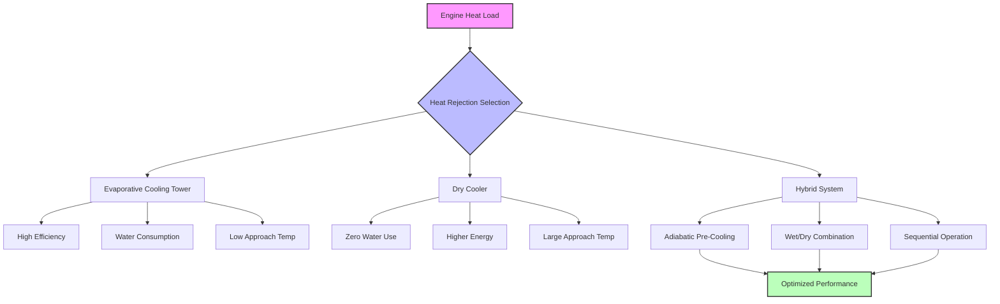

Испытательные ячейки двигателей генерируют значительные тепловые нагрузки, требующие эффективного отвода тепла для поддержания температуры охлаждающей воды в приемлемых диапазонах. Выбор оборудования для отвода тепла напрямую влияет на потребление воды, энергоэффективность, эксплуатационные расходы и соответствие экологическим нормам.

## Выбор и расчет градирни

Испарительные градирни обеспечивают наиболее энергоэффективный отвод тепла при больших постоянных нагрузках, типичных для испытательных ячеек двигателей. Градирня должна отводить как тепло двигателя, так и тепло сжатия при работе динамометра.

**Расчет емкости градирни:**

$$Q_{tower} = \dot{m} \cdot c_p \cdot (T_{in} - T_{out})$$

где $Q_{tower}$ — емкость отвода тепла (кДж/ч), $\dot{m}$ — расход воды (кг/ч), $c_p$ — удельная теплоемкость воды (4,187 кДж/кг·°C), $T_{in}$ — температура воды на входе (°C), и $T_{out}$ — температура воды на выходе (°C).

**Скорость испарения:**

$$\dot{m}_{evap} = \frac{Q_{tower}}{h_{fg}}$$

где $\dot{m}_{evap}$ — скорость испарения (кг/ч) и $h_{fg}$ — скрытая теплота испарения (~2 257 кДж/кг при типичных условиях).

Выбор градирни учитывает:

- **Диапазон**: Разница температур между поступающей и отводящей водой (обычно 5,6-11,1°C для испытательных ячеек)
- **Подход**: Разница температур между отводящей водой и температурой мокрого термометра окружающей среды (минимум 2,8-5,6°C)
- **Тепловая нагрузка**: Полный отвод тепла с коэффициентом безопасности (множитель 1,15-1,25)
- **Расход**: На основе диапазона и тепловой нагрузки
- **Температура мокрого термометра**: Условия проектирования обычно 1% или 2,5% годового превышения

Для высокопроизводительных установок несколько ячеек с вентиляторами переменной скорости оптимизируют энергопотребление при изменяющихся нагрузках и условиях окружающей среды.

## Применение воздушных охладителей

Воздушные охладители (воздухоохлаждаемые теплообменники) исключают потребление воды, но требуют больших температурных перепадов и повышенной энергии вентилятора. Применение включает:

- **Районы с дефицитом воды**: Где испарительное охлаждение запрещено или стоимость воды высока
- **Защита от замерзания**: Районы, требующие зимней работы без добавления гликоля
- **Небольшие ячейки**: Где сложность обработки воды превышает штрафы по энергии
- **Резервные системы**: Избыточность для критических операций

Емкость воздушного охладителя следует:

$$Q_{dc} = U \cdot A \cdot \Delta T_{lm}$$

где $Q_{dc}$ — отвод тепла (кДж/ч), $U$ — общий коэффициент теплопередачи (кДж/ч·м²·°C), $A$ — площадь теплопередачи (м²), и $\Delta T_{lm}$ — логарифмическая средняя разница температур.

Воздушные охладители обычно требуют подход 8,3-13,9°C к температуре сухого термометра окружающей среды, в сравнении с 2,8-5,6°C подхода к мокрому термометру для градирень. Это приводит к более высоким температурам подачи охлаждающей воды или увеличенной площади теплообменника.

## Гибридные системы охлаждения

Гибридные системы объединяют испарительное и воздушное охлаждение, оптимизируя между экономией воды и энергоэффективностью.

**Адиабатическое предварительное охлаждение**: Воздушный охладитель с испарительным предварительным охлаждением входящего воздуха при пиковой нагрузке или высоких условиях окружающей среды. Потребление воды происходит только при необходимости, обычно <30% от полного использования испарительной градирни.

**Влажные/сухие башни**: Параллельные влажные и сухие секции в единственном оборудовании. Сухая секция обрабатывает базовую нагрузку; испарительная секция включается при пиковом спросе.

**Последовательная операция**: Отдельные воздушные охладители и градирни с регулированием, переключающимся между режимами на основе условий окружающей среды и требований нагрузки.

## Рассмотрение температуры подхода

Температура подхода определяет температуру подачи охлаждающей воды и влияет на:

- **Производительность динамометра**: Более низкая температура воды увеличивает емкость поглощения мощности
- **Точность испытания двигателя**: Стабильная температура входа улучшает повторяемость
- **Размер теплообменника**: Более узкий подход требует больше башни, но меньше вторичных теплообменников
- **Потребление энергии**: Более жесткий подход увеличивает энергию вентилятора и насоса

Экономическая оптимизация уравновешивает первоначальную стоимость башни, энергию вентилятора и энергию насоса. Для испытательных ячеек, требующих точного контроля температуры, типичен подход 2,8-3,9°C несмотря на более высокие капитальные и эксплуатационные расходы.

## Потребление воды и экономия

Потребление воды градирней включает:

**Испарение**: Основной механизм потерь, примерно 1% от расхода циркуляции на каждые 5,6°C диапазона.

**Продувка**: Сброс для контроля концентрации растворенных твердых веществ, рассчитываемый как:

$$\dot{m}_{bd} = \frac{\dot{m}_{evap}}{(CoC - 1)}$$

где $\dot{m}_{bd}$ — расход продувки и $CoC$ — циклы концентрирования (обычно 3-6).

**Уносимые капли**: Захваченные капли воды, выходящие из башни (<0,001% с современными уловителями капель).

Стратегии экономии включают:

- Высокоэффективные уловители капель, минимизирующие потери
- Электропроводность управляемая продувка, максимизирующая циклы концентрирования
- Сбор дождевой воды для подпиточной воды
- Боковая фильтрация, снижающая требования к очистке
- Рекуперация тепла из продувки для отопления ячейки

## Вариации сезонной работы

Зимняя работа вводит сложности:

- **Риск замерзания**: Подогреватели бассейна, электрические обогреватели и минимальные требования по расходу
- **Подавление видимого пара**: Видимый пар может требовать смягчение в населенных пунктах
- **Снижение емкости**: Вентиляторы VFD и изоляция ячеек поддерживают стабильную работу при сниженных нагрузках
- **Обработка воды**: Скорректированные химические программы для работы при более низкой температуре

Летние пиковые условия требуют:

- **Проверка проектирования**: Обеспечение емкости при максимальной температуре мокрого термометра
- **Наличие воды**: Подтверждение поставки подпиточной воды при пиковом спросе
- **Электрический спрос**: Пиковая энергия вентилятора совпадает с максимальной нагрузкой ячейки
- **Резервные положения**: Избыточность для критических графиков испытаний

## Сравнение методов отвода тепла

| Параметр | Испарительная градирня | Воздушный охладитель | Гибридная система |
|-----------|----------------------|---------------------|-------------------|
| **Температура подхода** | 2,8-5,6°C (мок.) | 8,3-13,9°C (сух.) | 4,4-8,3°C |
| **Потребление воды** | 100% | 0% | 20-40% |
| **Относительная первоначальная стоимость** | 1,0x | 2,5-3,5x | 1,8-2,5x |
| **Энергия вентилятора** | Низкая | Высокая | Средняя |
| **Площадь занимаемого пространства** | Малая | Большая | Средняя |
| **Техническое обслуживание** | Обработка воды | Минимальная | Умеренная |
| **Защита от замерзания** | Требуется | Простая | Умеренная |
| **Уровень шума** | Умеренный | Высокий | Умеренный |

## Рекомендации по проектированию

Выбирайте оборудование для отвода тепла на основе:

1. **Профиль нагрузки**: Постоянные высокие нагрузки благоприятствуют испарительным градирням; прерывистая работа может оправдать воздушное охлаждение
2. **Наличие воды**: Местные нормативы и структуры стоимости
3. **Требования по температуре**: Прецизионное испытание требует жестких температур подхода
4. **Климат**: Соотношение мокрого/сухого термометра влияет на сравнительную производительность
5. **Экологические проблемы**: Ограничения видимого пара, шума и сброса воды
6. **Избыточность**: Критические ячейки требуют емкости N+1 или 2N
7. **Будущее расширение**: Модульные конструкции приспосабливаются к росту ячейки

Надлежащим образом рассчитанные и выбранные системы отвода тепла обеспечивают надежную работу испытательных ячеек двигателей при одновременной минимизации потребления воды, энергетических затрат и воздействия на окружающую среду
