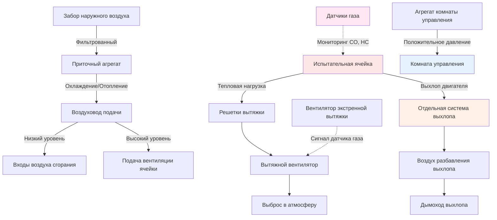

Испытательные ячейки динамометра требуют специализированных систем HVAC для управления экстремальными тепловыми нагрузками, подачи воздуха для сгорания, поддержания условий испытаний и обеспечения безопасности оператора во время испытания двигателя.

## Требования к вентиляции испытательной ячейки

Вентиляция испытательной ячейки выполняет несколько критических функций: подача воздуха для сгорания, удаление тепла, разбавление утечек выхлопных газов и безопасное вентилирование.

**Критерии проектирования вентиляции:**

- Кратность воздухообмена: минимум 30-60 ACH для удаления тепла
- Подача воздуха для сгорания: 150-200% стехиометрического требования
- Компенсационный воздух для систем выхлопа: соответствие расходу выхлопных газов
- Экстренная вентиляция: минимум 100 ACH для срабатывания датчика газа
- Ограничение роста температуры: максимум 5.6-8.3°C выше окружающей температуры

Общий расход вентиляции объединяет воздух для сгорания, охлаждающий воздух и компенсационный воздух:

$$Q_{total} = Q_{combustion} + Q_{cooling} + Q_{makeup}$$

где каждый компонент рассчитывается на основе конкретных требований испытаний.

Для удаления тепла требуемый расход воздуха:

$$Q_{cooling} = \frac{q_{sensible}}{1.08 \times \Delta T}$$

где $q_{sensible}$ — явная тепловая нагрузка в кДж/ч, а $\Delta T$ — допустимый рост температуры в °C.

## Расчет тепловых нагрузок

Испытательные ячейки испытывают массивные тепловые нагрузки от двигателей, динамометров и вспомогательного оборудования.

**Основные источники тепла:**

- Лучистое и конвективное тепло двигателя: 30-40% энергии топлива
- Потери динамометра: 2-5% поглощаемой мощности
- Отвод тепла системой охлаждения: 25-35% энергии топлива
- Излучение системы выхлопа: зависит от изоляции
- Оборудование управления и освещение: обычно 10-20 кВт

Расчет общей явной тепловой нагрузки:

$$q_{total} = q_{engine} + q_{dyno} + q_{equipment} + q_{radiation}$$

Для двигателя мощностью 373 кВт при полной нагрузке:

$$q_{engine} = 373 \text{ кВт} \times 3.6 \frac{\text{МДж/ч}}{\text{кВт}} \times 0.35 = 469 \text{ МДж/ч}$$

Тепловыделение динамометра (при условии потерь 3% при поглощении 298 кВт):

$$q_{dyno} = 298 \text{ кВт} \times 3.6 \frac{\text{МДж/ч}}{\text{кВт}} \times 0.03 = 32.2 \text{ МДж/ч}$$

## Подача воздуха и балансировка выхлопа

Надлежащая балансировка воздуха предотвращает попадание выхлопных газов и поддерживает контролируемые условия испытаний.

**Стратегия создания разницы давлений:**

1. Испытательная ячейка: небольшое отрицательное давление (-9.5 до -23.9 Па)
2. Комната управления: положительное давление (+23.9 до +47.9 Па)
3. Соседние помещения: нейтральное или небольшое положительное

Разница давления поддерживается следующим образом:

$$\Delta P = \frac{(Q_{exhaust} - Q_{supply})^2 \times \rho}{2 \times C \times A^2}$$

**Распределение приточного воздуха:**

- Входы воздуха сгорания на низком уровне возле впуска двигателя
- Охлаждающий воздух на высоком уровне для вентиляции верхней части ячейки
- Стратифицированная схема потока для направления тепла вверх
- Скорость воздуха: 2.5-4.1 м/с в точках подачи

**Сбор вытяжного воздуха:**

- Решетки вытяжки высокого уровня для захвата поднимающегося тепла
- Отдельная система удаления выхлопа двигателя
- Отдельная вытяжка для зон испарения топлива
- Мощность экстренной вытяжки для быстрого вентилирования

## Управление температурой для условий испытаний

Многие испытания требуют точного управления температурой для поддержания повторяемых условий.

**Методы управления температурой:**

- Кондиционированный воздух сгорания: типичное управление ±1.1°C
- Контроль окружающей среды ячейки: ±2.8°C для стабильности динамометра
- Сезонная компенсация для коррекции высоты
- Требования периода стабилизации перед испытанием

Расчет температуры приточного воздуха для достижения требуемой температуры в ячейке:

$$T_{supply} = T_{cell} - \frac{q_{total}}{1.08 \times Q_{supply}}$$

Для прецизионных испытаний выделенные приточные агрегаты обеспечивают:

- Мощность охлаждения: 140-211 кВт типично для ячейки 373 кВт
- Мощность отопления: 59-118 кВт для испытания холодного пуска
- Осушение для контроля влажности
- Фильтрация воздуха для защиты впускной системы двигателя

## Вентиляция безопасности и обнаружение газа

Системы безопасности защищают персонал от монооксида углерода, несгоревших углеводородов и кислородного голодания.

**Требования к обнаружению газа:**

- Монооксид углерода: сигнал тревоги 35 ppm, отключение 100 ppm
- Горючий газ (НПО): тревога 10%, отключение 25%
- Уровень кислорода: <19.5% тревога
- Расположение датчиков: на уровне дыхания и на потолке

Последовательность аварийного срабатывания:

1. Срабатывание датчика газа
2. Запуск вентиляторов экстренной вытяжки (минимум 100 ACH)
3. Увеличение подачи воздуха для поддержания отрицательного давления
4. Отключение двигателя при превышении порога
5. Блокировка перезапуска до очистки

**Требования к переключателям вентиляции:**

- Проверка вентиляции перед пуском двигателя
- Поддержание минимального расхода воздуха во время работы
- Цикл вентилирования после испытания (минимум 5-10 минут)
- Срабатывание экстренной остановки для эвакуации

## Требования к окружающей среде комнаты управления

Комнаты управления требуют удобной, тихой среды, изолированной от условий испытательной ячейки.

**Критерии проектирования комнаты управления:**

- Температура: 22°C ± 1.1°C круглогодично
- Влажность: 40-60% ОВ для электроники
- Избыточное давление: +23.9 до +47.9 Па
- Воздухообмены: минимум 6-10 ACH
- Уровень шума: NC-35 до NC-40 максимум

Расчет подачи воздуха для комнаты управления:

$$Q_{control} = Q_{cooling} + Q_{pressurization} + Q_{occupancy}$$

Типичная комната управления площадью 18.6 м² требует:

- Охлаждение: 5.3-7.0 кВт для оборудования и людей
- Избыточное давление: 70-141 CFM (2.0-4.0 м³/ч) для преодоления инфильтрации через двери
- Вентиляция: 28 CFM (0.79 м³/ч) на человека минимум

**Изоляция комнаты управления:**

- Отдельная система HVAC от испытательной ячейки
- HEPA-фильтрация для защиты электроники
- Акустическая обработка в воздуховодах подачи/возврата
- Герметизированные пробивки кабелей/трубопроводов
- Окно наблюдения с терморазрывом

## Требования к вентиляции по типам ячеек

Различные приложения динамометра требуют разных подходов к вентиляции.

| Тип ячейки | Кратность воздухообмена | Воздух сгорания | CFM охлаждения на кВт | Давление | Специальные требования |
|-----------|-------------------------|-----------------|----------------------|----------|----------------------|
| Стационарный динамометр двигателя | 30-40 ACH | 200% стехиом. | 0.35-0.47 | -9.5 до -23.9 Па | Контроль температуры ±2.8°C |
| Переходный режим динамометра двигателя | 40-60 ACH | 250% стехиом. | 0.47-0.70 | -23.9 Па | Быстрое удаление тепла |
| Шасси-динамометр (2WD) | 60-80 ACH | 150% стехиом. | 0.59-0.88 | -9.5 Па | Захват выхлопа транспортного средства |
| Шасси-динамометр (4WD/AWD) | 80-100 ACH | 200% стехиом. | 0.88-1.17 | -23.9 Па | Улучшенное охлаждение |
| Высокопроизводительный спорткар | 100+ ACH | 300% стехиом. | 1.17-1.76 | -47.9 Па | Экстремальные тепловые нагрузки |
| Динамометр электродвигателя | 20-30 ACH | н/п | 0.24-0.35 | -9.5 Па | Прецизионная температура |
| Испытание выбросов | 40-50 ACH | 175% стехиом. | 0.47-0.59 | -23.9 Па | Кондиционированный воздух ±1.1°C |

**Соображения по конкретным приложениям:**

Переходные испытания генерируют пиковые нагрузки в 2-3 раза выше стационарных значений, требуя увеличенной мощности охлаждения с быстрым откликом. Испытания выбросов требуют точного контроля температуры, влажности и давления поступающего воздуха для обеспечения повторяемости результатов и соответствия нормативным требованиям. Высокопроизводительные приложения могут достигать мгновенных тепловыделений, превышающих 1,055 МДж/ч.

Надлежащее проектирование HVAC обеспечивает точность результатов испытаний, защиту оборудования и безопасность оператора в этих требовательных условиях.
