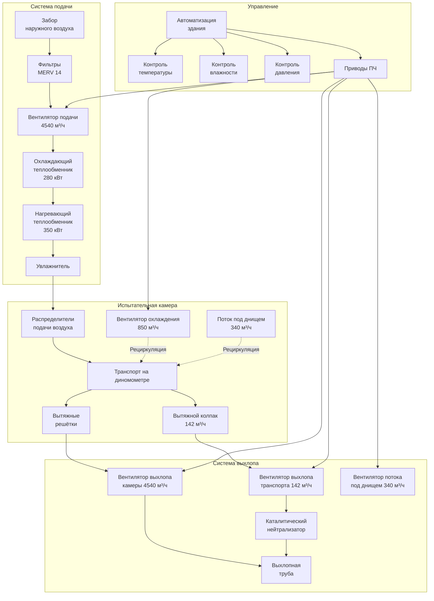

Испытательные стенды шасси имитируют реальные условия вождения при измерении производительности, выбросов и расхода топлива транспортного средства. Системы HVAC должны управлять значительными тепловыми нагрузками от работы транспорта, обеспечивать точный контроль окружающей среды для повторяемых испытаний и безопасно удалять продукты сгорания при имитации дорожных условий.

## Требования к вентиляции больших объёмов

Испытательные камеры стенда шасси обычно имеют объём от 425 до 1130 м³. Вентиляция должна решить несколько одновременных задач: удаление выхлопных газов, отвод тепла и подача свежего воздуха для сгорания топлива в двигателе.

Минимальный расход вентиляции определяется по формуле:

$$Q_{min} = \frac{HP \times 2545 \times 3.41}{(\rho \times c_p \times \Delta T)} + Q_{combustion}$$

Где:
- $Q_{min}$ = минимальный расход вентиляции (CFM)
- $HP$ = максимальная мощность тестируемого транспорта
- $2545$ = кДж/ч на лошадиную силу
- $3.41$ = преобразование кДж/ч на ватт
- $\rho$ = плотность воздуха (1,2 кг/м³)
- $c_p$ = удельная теплоёмкость воздуха (1,006 кДж/кг·°C)
- $\Delta T$ = допустимый рост температуры (обычно 5,6-8,3°C)
- $Q_{combustion}$ = требование воздуха для сгорания (1,7-2,5 м³/ч на кВт мощности)

Для испытания транспорта мощностью 373 кВт с ростом температуры 8,3°C:

$$Q_{min} = \frac{500 \times 2545 \times 3.41}{(0.075 \times 0.24 \times 15)} + (500 \times 1.2) = 151,810 + 600 \approx 257,800 \text{ м³/ч}$$

Кратность воздухообмена обычно составляет от 60 до 120 воздухообменов в час при активном тестировании.

## Системы захвата выхлопа транспорта

Эффективный захват выхлопа предотвращает проникновение продуктов сгорания в атмосферу испытательной камеры. Существуют два основных подхода:

**Прямое подсоединение выхлопа**

Жёсткие трубопроводы подсоединены к выхлопной трубе транспорта с использованием гибких стальных воздуховодов (обычно диаметром 102-152 мм) с быстроразъёмными муфтами. Эта система поддерживает разрежение 12,4-24,8 Па в точке подсоединения. Вентиляторы выхлопа должны работать с температурами до 649°C и коррозионно-активными конденсатами.

**Подвесные вытяжные колпаки**

Применяются, когда прямое подсоединение к выхлопной трубе невозможно. Колпаки в виде зонтика, расположенные на расстоянии 305-457 мм выше и позади транспорта, требуют скорости захвата 1,0-1,5 м/с по площади лобового сечения колпака. Расход воздуха через выход колпака обычно составляет 1,42-2,36 м³/ч на одно транспортное средство, отдельно от общей вентиляции.

## Системы имитации вентилятора охлаждения

Охлаждение радиатора имитирует поток воздуха на дороге, проходящий через теплообменники транспорта. Система вентилятора охлаждения подаёт контролируемый поток воздуха в область передней решётки радиатора транспорта.

**Параметры проектирования системы вентилятора:**

- Диаметр вентилятора: 914-1524 мм (размер соответствует площади радиатора)
- Производительность по воздуху: 425-850 м³/ч
- Диапазон скоростей: эквивалент 8-129 км/ч
- Управление скоростью: Преобразователь частоты с разрешением 0,16 км/ч
- Расположение: 457-610 мм от передней части транспорта, регулируемая по высоте установка

Требуемая мощность вентилятора:

$$P_{fan} = \frac{Q \times SP}{6356 \times \eta_{fan} \times \eta_{motor}}$$

Где:
- $P_{fan}$ = мощность электродвигателя вентилятора (кВт)
- $Q$ = расход воздуха (м³/ч)
- $SP$ = статическое давление (Па, обычно 12-25 Па)
- $\eta_{fan}$ = коэффициент полезного действия вентилятора (0,75-0,85)
- $\eta_{motor}$ = коэффициент полезного действия электродвигателя (0,90-0,95)

## Воздушные системы имитации дорожной нагрузки

Точная имитация аэродинамического сопротивления требует контролируемого потока воздуха со всех сторон транспорта:

**Системы воздушного потока под днищем**

Циркуляционные воздушные системы под валиками динамометра имитируют вызванную дорогой турбулентность и охлаждение компонентов днища. Типичные расходы: 227-425 м³/ч через плену под транспортом с регулируемыми жалюзи.

**Боковая вентиляция**

Боковой поток воздуха (28-57 м³/ч с каждой стороны) предотвращает накопление тепла вокруг колёсных ниш и тормозных узлов. Этот поток воздуха работает независимо от основной системы вентиляции.

## Контроль температуры и влажности

Точный контроль окружающей среды обеспечивает повторяемость результатов испытаний и соответствие стандартам тестирования.

**Требования к контролю температуры:**

- Диапазон эксплуатации: 20-30°C согласно SAE J1263
- Стабильность: ±1,1°C во время цикла испытаний
- Время восстановления: возврат к установленному значению в течение 10 минут после испытания
- Холодопроизводительность: 176-352 кВт для типичных установок
- Теплопроизводительность: 58,5-117 кВт

**Требования к контролю влажности:**

- Диапазон: 30-70% ОВ
- Стабильность: ±5% ОВ во время испытаний
- Контроль температуры точки росы: ±1,7°C для тестирования выбросов
- Осушение: 94,5-189 л/день производительность
- Увлажнение: паровой впрыск или испарительное увлажнение (18-36 кг/ч)

Расчёт явной холодопроизводительности:

$$Q_s = 1.1 \times CFM \times \Delta T + Q_{vehicle} + Q_{dyno} + Q_{lighting} + Q_{solar}$$

Где $Q_{vehicle}$ представляет теплоотвод от двигателя, коробки передач и тормозов (обычно 60-80% номинальной мощности в виде тепла).

## Требования к окружающей среде при тестировании выбросов

Нормативное тестирование выбросов (стандарты EPA, CARB, Euro) требует строгих условий окружающей среды.

**Требования Федеральной процедуры испытаний EPA (FTP-75):**

- Температура: 20-30°C
- Влажность: 5,4-9,4 г H₂O на кг сухого воздуха
- Атмосферное давление: скорректировано по стандартным условиям
- Фоновый CO: <50 ppm
- Фоновый HC: <5 ppm
- Фоновый NOₓ: <2 ppm

**Проектирование системы HVAC для соответствия требованиям выбросов:**

- 100% наружный воздух при тестировании выбросов (без рециркуляции)
- Фильтрация MERV 14 минимум для воздуха подачи
- Отдельная система отбора фонового воздуха (изолирована от испытательной камеры)
- Контроль давления: ±4,98 Па относительно атмосферного давления
- Быстрое продувание: полная смена воздуха в камере за 3-5 минут

## Компоновка испытательного стенда шасси

## Требования к вентиляции по типам транспорта

| Тип транспорта | Объём камеры (м³) | Воздух подачи (м³/ч) | Захват выхлопа (м³/ч) | Вентилятор охлаждения (м³/ч) | Типичная мощность (кВ) | Воздухообмены/ч |
|---|---|---|---|---|---|---|
| Легковой седан | 510 | 2400 | 113 | 510 | 112-224 | 280 |
| Легкий грузовик/SUV | 623 | 3110 | 142 | 623 | 186-298 | 300 |
| Полноразмерный пикап | 736 | 3960 | 170 | 736 | 261-373 | 320 |
| Среднетоннажный коммерческий | 850 | 5100 | 227 | 850 | 298-448 | 360 |
| Спортивный/гоночный | 566 | 4530 | 170 | 708 | 373-596 | 480 |
| Электромобиль | 510 | 1700 | — | 510 | 149-298 (эк.) | 200 |
| Гибридный автомобиль | 510 | 2125 | 85 | 510 | 112-186 | 250 |

**Примечания:**
- Расход воздуха подачи включает воздух сгорания и отвод тепла
- Кратность воздухообмена рассчитана при максимальной мощности испытания
- Электромобили требуют значительно меньше вентиляции (только отвод тепла)
- Добавить запас прочности 20-30% при выборе размеров системы

## Интеграция управления

Современные системы HVAC испытательного стенда шасси интегрируются с системой управления динамометром для координации условий окружающей среды с протоколами испытаний:

- **Координация цикла испытаний:** Расходы вентиляции корректируются в зависимости от нагрузки на диномометр
- **Предварительная подготовка:** Автоматическая стабилизация температуры транспорта и камеры
- **Периоды выдержки:** Пониженная вентиляция во время выдержки температуры транспорта
- **Аварийное отключение:** Полный выхлоп при обнаружении превышения CO или HC
- **Регистрация данных:** Параметры окружающей среды записываются с данными испытаний

Интеграция обеспечивает повторяемость испытаний, безопасность оператора и соответствие нормативным требованиям при одновременной оптимизации энергопотребления в периоды без испытаний.
