## Обзор

Системы HVAC испытательных камер двигателей должны одновременно обеспечивать достаточное количество воздуха для горения, поддерживать безопасные условия окружающей среды, контролировать температуру и влажность, удалять тепло и продукты выхлопа, а также интегрироваться с критическими системами безопасности. Проектирование должно учитывать экстремальные тепловые нагрузки от двигателей, работающих на полной мощности, при одновременном поддержании точного контроля параметров окружающей среды для получения точных данных испытаний.

## Классификация камер по типу двигателя

Испытательные камеры классифицируются по типу двигателя и выходной мощности, что напрямую влияет на размеры и конфигурацию системы HVAC.

**Малые испытательные камеры (0–112 кВт)**
- Двигатели легковых автомобилей с бензиновым питанием
- Малые дизельные двигатели
- Силовые установки мотоциклов и квадроциклов
- Типовой объем камеры: 57–113 м³
- Отвод тепла: 14,6–58,6 кВт

**Средние испытательные камеры (112–447 кВт)**
- Двигатели легковых и легких грузовых автомобилей
- Промышленные энергетические установки
- Судовые двигатели
- Типовой объем камеры: 113–227 м³
- Отвод тепла: 58,6–234 кВт

**Большие испытательные камеры (447+ кВт)**
- Дизельные двигатели большой мощности
- Судовые пропульсивные двигатели
- Локомотивные силовые установки
- Типовой объем камеры: 227–566+ м³
- Отвод тепла: 234–877+ кВт

**Специальные камеры**
- Камеры моделирования высокого давления
- Климатические испытательные камеры (−40°C до 60°C)
- Камеры для сертификации выбросов
- Камеры для испытания на долговечность

## Расходы вентиляции для подачи воздуха для горения и охлаждения

Испытательные камеры двигателей требуют двухцелевой вентиляции для подачи воздуха для горения и удаления тепла. Расход вентиляции должен быть больше из требуемого количества воздуха для горения или требуемого количества для охлаждения.

### Требования к воздуху для горения

Стехиометрическое требование воздуха для горения составляет приблизительно 14,7 кг воздуха на 1 кг топлива для бензиновых двигателей и 14,5 кг/кг для дизельных. С учетом избытка воздуха и коэффициентов безопасности:

$$Q_{combustion} = \frac{HP \times BSFC \times A/F \times SF}{60 \times \rho_{air}}$$

Где:
- $Q_{combustion}$ = расход воздуха для горения (CFM)
- $HP$ = максимальная мощность двигателя
- $BSFC$ = удельный расход топлива на тормозную мощность (кг/кВт·ч), обычно 0,092–0,102
- $A/F$ = соотношение воздуха к топливу (15–18 при фактической работе)
- $SF$ = коэффициент безопасности (1,25–1,50)
- $\rho_{air}$ = плотность воздуха (1,2 кг/м³ при стандартных условиях)

### Требования к вентиляции для охлаждения

Расход вентиляции для удаления тепла рассчитывается на основе общего отвода тепла от двигателя, динамометра и вспомогательного оборудования:

$$Q_{cooling} = \frac{Q_{total}}{1.08 \times \Delta T}$$

Где:
- $Q_{cooling}$ = расход вентиляции (CFM)
- $Q_{total}$ = общий отвод тепла (кДж/ч)
- $\Delta T$ = допустимое повышение температуры (обычно 11–17°C)
- 1.08 = константа для явного тепла (кДж/м³·°C·ч)

Общий отвод тепла включает:
- Излучение и конвекция двигателя: 15–25% входящей энергии топлива
- Тепло динамометра: 100% тормозной мощности (2,545 кДж/кВт·ч)
- Электрическое оборудование: по данным производителя
- Освещение и солнечные прибыли

### Метод количества замен воздуха

Для предварительного расчета размеров минимальные расходы вентиляции часто выражаются как количество замен воздуха в час:

$$ACH = \frac{Q_{ventilation} \times 60}{V_{cell}}$$

Типовые минимальные количества замен воздуха:
- Малые испытательные камеры: 40–60 ACH
- Средние испытательные камеры: 30–50 ACH
- Большие испытательные камеры: 20–40 ACH
- Без работы (режим ожидания): 6–10 ACH

```mermaid
graph TD
    A[Планировка испытательной камеры двигателя] --> B[Система подачи воздуха]
    A --> C[Испытываемый двигатель]
    A --> D[Удаление выхлопа]
    A --> E[Системы безопасности]

    B --> B1[Воздуховод для горения<br/>Низкоуровневое воздухозаборное отверстие]
    B --> B2[Диффузоры охлаждающего воздуха<br/>Высокоуровневое распределение]
    B --> B3[Блок подготовки воздуха<br/>Фильтр, обогрев, охлаждение]

    C --> C1[Динамометр]
    C --> C2[Крепление двигателя]
    C --> C3[Топливная система]
    C --> C4[Охлаждающая вода]

    D --> D1[Захват выхлопной трубы<br/>Прямое соединение]
    D --> D2[Общий выхлоп<br/>Потолочный/стеновой выхлоп]
    D --> D3[Вентилятор выхлопа<br/>Переменная скорость]

    E --> E1[Интеграция пожаротушения<br/>]
    E --> E2[Аварийное отключение<br/>Блокировка HVAC]
    E --> E3[Обнаружение газа<br/>CO, пары топлива]
    E --> E4[Сброс давления<br/>Взрывной выпуск]

    style A fill:#f9f,stroke:#333,stroke-width:4px
    style C fill:#bbf,stroke:#333,stroke-width:2px
    style E fill:#fbb,stroke:#333,stroke-width:2px
```

## Интеграция системы пожаротушения

Системы HVAC должны быть полностью интегрированы с системами пожаротушения для предотвращения распространения пожара и обеспечения эффективности пожаротушения.

### Действия перед подавлением пожара

При обнаружении пожара или срабатывании системы пожаротушения:
1. **Немедленное отключение двигателя** - отсечка топлива и отключение зажигания
2. **Отключение подачи воздуха HVAC** - закрытие моторизованных заслонок в течение 5 секунд
3. **Работа системы выхлопа** - может продолжаться или остановиться в зависимости от проектирования системы
4. **Обработка горючего воздуха** - остановка любой рециркуляции

### Совместимость с огнетушащими средствами

**Системы на водной основе**
- Системы затопления или спринклеры
- HVAC продолжает работу для очистки дыма
- Дренажные устройства для отвода воды
- Защита электрооборудования

**Газовые системы пожаротушения (CO₂, FM-200, Novec 1230)**
- Требуется полное отключение HVAC
- Герметичные заслонки для поддержания концентрации огнетушащего средства
- Минимальное время удержания: 10–20 минут
- Предварительные сигналы тревоги с задержкой 30–60 секунд
- Цикл продувки системы выхлопа после пожаротушения

**Сухие химические системы**
- В основном для пожаров в топливной системе
- Остановка HVAC для предотвращения распыления порошка
- Требуются специальные процедуры очистки

### Противопожарные заслонки в ломок воздуховодов

Все проходы воздуховодов HVAC через противопожарные границы камер требуют:
- Противопожарные заслонки, соответствующие UL 555
- Тепловой замыкатель или электрический привод срабатывания
- Доступ для проверки и испытания
- Минимум 1,5-часовой противопожарный рейтинг для стен камеры

## Требования к вентиляции топливной системы

Необходимо предусмотреть специальную вентиляцию в местах, где могут накапливаться пары топлива.

### Помещения хранения и перекачки топлива

- Минимум 1 CFM на м² площади пола
- Непрерывная работа во время присутствия людей в учреждении
- Низкоуровневые вытяжные отверстия (пары бензина тяжелее воздуха)
- Высокоуровневые вытяжные отверстия для природного газа или газов легче воздуха
- Выпуск вытяжки на 3 м выше уровня кровли, в стороне от воздухозаборников

### Помещения дневных резервуаров

- Минимум 12 замен воздуха в час
- Выделенная система выхлопа (без рециркуляции)
- Выхлоп с блокировкой от работы насоса перекачки топлива
- Электрооборудование класса I, группа 2
- Взрывозащищенные вентиляторы выхлопа

### Маршрутизация топливопроводов

Топливные линии подачи в испытательной камере требуют:
- Датчики обнаружения утечек в нижних точках
- Локальная вытяжка в местах топливного насоса и фильтра
- Минимум 47 CFM (0,8 м³/мин) скорость захвата в возможных местах утечки
- Автоматическое отключение топлива при обнаружении паров

### Обнаружение горючих газов

Непрерывный мониторинг паров топлива:
- Датчики нижнего предела взрываемости (LEL)
- Тревога при 25% LEL
- Увеличение вентиляции при 25% LEL
- Отключение топлива и двигателя при 50% LEL
- Расположение датчиков: потолок (легкие газы), пол (тяжелые пары), топливное оборудование

## Контроль давления в камере

Точный контроль давления имеет решающее значение для согласованности воздуха для горения, точности измерения выбросов и безопасности.

### Работа при отрицательном давлении

Большинство испытательных камер работают при −0,05 до −0,25 кПа относительно соседних помещений для предотвращения миграции паров топлива или выхлопных газов.

**Стратегия контроля:**
- Расход выхлопа CFM = Расход подачи CFM + Дифференциал (283–1133 CFM)
- Барометрическая заслонка на подаче или выхлопе
- Преобразователь давления с управлением DDC
- Возможность переопределения для чрезвычайных условий

**Уравнение контроля давления:**

$$P_{cell} = P_{atm} - \left(\frac{Q_{exhaust} - Q_{supply}}{C_d \times A_{leak}}\right)^2 \times \frac{\rho}{2}$$

Где перепад давления зависит от дисбаланса потока и характеристик утечки камеры.

### Сценарии с положительным давлением

Определенные условия испытаний могут требовать положительного давления:
- Моделирование высокого давления (пониженное давление в камере)
- Изоляция загрязнений во время периодов без испытаний
- Нагнетание для затопления инертным газом

### Сброс давления

Положения для сброса избыточного давления или вакуума:
- Панели взрывного сброса: 0,09 м² на 1,4–2,8 м³ объема камеры
- Давление срабатывания панели сброса: 2,4–9,6 кПа
- Выпуск в безопасное место
- Автоматическое закрытие после события сброса

## Интеграция аварийного отключения с HVAC

Система аварийного отключения испытательной камеры (ESS) должна интегрироваться с HVAC для комплексной безопасности.

### Триггеры аварийного отключения

HVAC реагирует на эти условия чрезвычайной ситуации:
- Ручное аварийное отключение (активация кнопки E-stop)
- Обнаружение пожара или активация пожаротушения
- Обнаружение горючего газа >50% LEL
- Монооксид углерода >100 ppm
- Избыточное давление или вакуум в камере
- Потеря функциональности системы выхлопа
- Отказ охлаждающей воды
- Потеря электроэнергии

### Последовательность реагирования HVAC при аварийном отключении

**Немедленные действия (0–5 секунд):**
1. Закрыть электромагнитные клапаны подачи топлива
2. Отключить зажигание двигателя и топливные насосы
3. Продолжить вентиляцию выхлопа на высокой скорости
4. Продолжить подачу воздуха для горения (предотвращение обратного удара)

**Вторичные действия (5–30 секунд):**
1. Снизить скорость подачи воздуха для горения
2. Закрыть заслонки подачи воздуха при обнаружении пожара
3. Активировать режим эвакуации дыма при необходимости
4. Инициировать последовательность предварительного срабатывания пожаротушения

**Поставарийные действия (30+ секунд):**
1. Поддерживать минимальную вентиляцию продувки
2. Контролировать условия атмосферы
3. Предотвращать перезапуск до ручного сброса
4. Регистрировать данные события для анализа

### Принципы отказоустойчивого проектирования

- Заслонки переходят в безопасное положение (закрыто для подачи, открыто для выхлопа)
- Вентиляторы выхлопа остаются в рабочем состоянии при потере нормального электроснабжения
- Аварийное электроснабжение для критической вентиляции выхлопа и управления
- Резервные датчики безопасности с логикой голосования
- Ручное переопределение для аварийного персонала

## Параметры проектирования испытательной камеры

| Параметр | Малые камеры | Средние камеры | Большие камеры | Единицы |
|-----------|-------------|--------------|-------------|-------|
| **Диапазон мощности двигателя** | 0–112 | 112–447 | 447+ | кВт |
| **Объем камеры** | 57–113 | 113–227 | 227–566 | м³ |
| **Расход вентиляции** | 45–136 | 68–227 | 91–454 | м³/мин |
| **Количество замен воздуха в час** | 40–60 | 30–50 | 20–40 | ACH |
| **Скорость воздуха подачи** | 7,6–12,7 | 10,2–15,2 | 12,7–20,3 | м/с |
| **Статическое давление камеры** | −0,05 до −0,12 | −0,12 до −0,20 | −0,20 до −0,25 | кПа |
| **Повышение температуры** | 11–14 | 14–17 | 17–22 | °C |
| **Емкость системы выхлопа** | 110% | 115% | 120% | % подачи |
| **Скорость аварийной продувки** | 60 | 50 | 40 | ACH |
| **Противопожарный рейтинг** | 2-час | 2-час | 3-час | рейтинг |
| **Площадь взрывного сброса** | 3,7–7,4 | 7,4–14,9 | 14,9–37 | м² |
| **Уровень шума (при работе)** | 85–95 | 90–100 | 95–105 | дБА |
| **Температура подпиточного воздуха** | 16–21 | 18–24 | 20–25 | °C |
| **Диапазон относительной влажности** | 30–60 | 30–60 | 30–60 | % |

## Оперативные соображения

**Контрольный список перед испытанием:**
- Проверить работу системы вентиляции и расходы воздуха
- Подтвердить давление в камере в соответствии со спецификацией
- Проверить статус системы пожаротушения
- Протестировать блокировки аварийного отключения
- Проверить калибровку датчика обнаружения газа

**Во время тестирования:**
- Контролировать температуру в камере и регулировать вентиляцию по мере необходимости
- Поддерживать перепад давления в диапазоне управления
- Проверять захват системы выхлопа на выхлопной трубе
- Непрерывно контролировать уровни горючего газа и CO

**Процедуры после испытания:**
- Продолжить вентиляцию минимум на 15 минут продувки
- Разрешить период охлаждения двигателя и динамометра
- Проверить на наличие утечек топлива или охлаждающей жидкости
- Сбросить системы безопасности для следующего испытания

Интеграция систем HVAC с испытаниями двигателей в испытательных камерах требует тщательной координации подачи воздуха для горения, удаления тепла, контроля давления и интеграции системы безопасности для обеспечения точных результатов испытаний и безопасности персонала.
