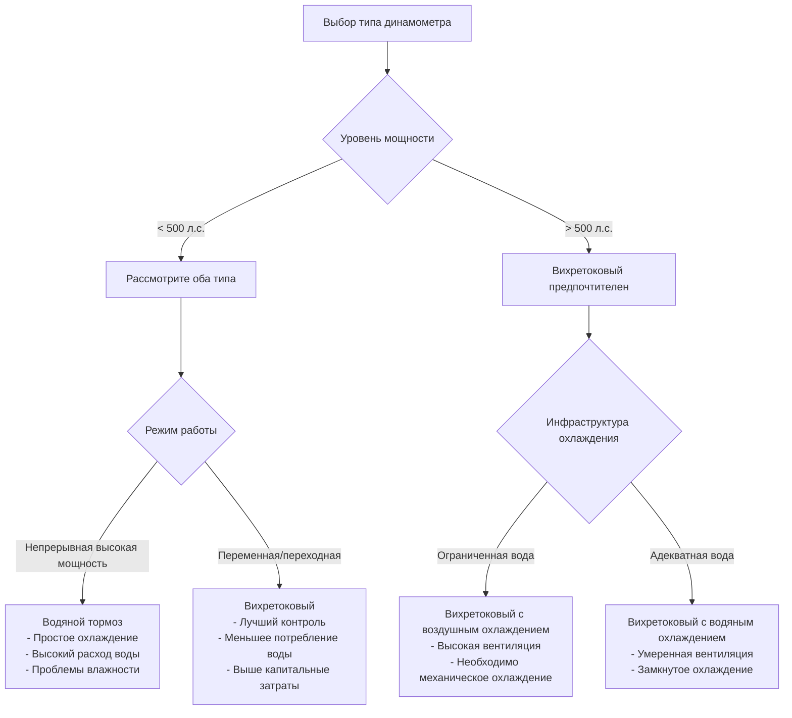

## Обзор

Водяной тормоз и вихретоковые динамометры представляют два наиболее распространённых типа абсорбционных динамометров на объектах испытания двигателей. Каждый генерирует значительное количество тепла во время поглощения мощности, требуя специализированного подхода к проектированию HVAC. Динамометры с водяным тормозом рассеивают энергию непосредственно в охлаждающую воду через трение жидкости, в то время как вихретоковые динамометры преобразуют механическую энергию в электрическую энергию, которая рассеивается в виде тепла в электромагнитах и узлах ротора.

## Характеристики генерации тепла

### Динамометры с водяным тормозом

Динамометры с водяным тормозом поглощают мощность посредством вязкого сдвига воды между вращающимися и неподвижными элементами. Вся поглощённая мощность преобразуется непосредственно в тепло в охлаждающей воде:

$$Q_{water} = P_{absorbed} = T \times \omega$$

где $Q_{water}$ — генерация тепла (Вт), $T$ — крутящий момент (Н·м) и $\omega$ — угловая скорость (рад/с).

Для динамометра мощностью 500 л.с. (373 кВт) при полной нагрузке, по существу вся поглощённая мощность проявляется в виде тепла в охлаждающей воде, требуя немедленного отвода во избежание кипения. Повышение температуры воды через динамометр следует:

$$\Delta T = \frac{Q_{water}}{\dot{m} \times c_p}$$

где $\dot{m}$ — расход воды (кг/с) и $c_p$ — удельная теплоёмкость (4,18 кДж/кг·К).

Типичные пределы проектирования ограничивают повышение температуры на 5,6–8,3°C во избежание локального кипения и поддержания последовательных характеристик поглощения.

### Вихретоковые динамометры

Вихретоковые динамометры генерируют тепло в двух основных местах: узле ротора (обычно 60–70% поглощённой мощности) и обмотках электромагнита (30–40% поглощённой мощности). Тепло ротора передаётся охлаждающей воде, в то время как тепло электромагнита требует отдельного охлаждения или прямого охлаждения катушек водой.

Общий отвод тепла объединяет оба компонента:

$$Q_{total} = Q_{rotor} + Q_{coil} = P_{absorbed} \times (0.65 + 0.35)$$

Конструкции с воздушным охлаждением электромагнита отводят тепло катушек непосредственно в испытательную камеру, значительно увеличивая требования по охлаждению помещения.

## Сравнение требований охлаждающей воды

| Параметр | Водяной тормоз | Вихретоковый |
|-----------|-------------|--------------|
| Расход воды (на 100 л.с.) | 227–303 л/мин | 114–152 л/мин |
| Температура на входе | 15,6–26,7°C | 15,6–32,2°C |
| Повышение температуры | 5,6–8,3°C | 8,3–13,9°C |
| Требование давления | 276–414 кПа | 207–345 кПа |
| Качество воды | Среднее | Критическое |
| Место отвода тепла | 100% в воду | 60–70% в воду |
| Рециркуляция возможна | С градирней | С теплообменником |

Системы с водяным тормозом требуют более высоких расходов из-за прямого поглощения мощности в воде. Системы вихретокового типа допускают большие температурные дифференциалы и требуют превосходного качества воды во избежание образования накипи в каналах охлаждения электромагнита.

## Вентиляция помещения для отвода тепла

### Испытательные камеры с водяным тормозом

Вентиляция помещения устраняет три источника тепла:

1. **Излучаемое тепло от корпуса динамометра**: 2–5% поглощённой мощности
2. **Тепло выхлопа двигателя**: Захватывается выделенной системой выхлопа
3. **Тепло вспомогательного оборудования**: Электродвигатели, системы управления, приборы

Расчёт количества воздуха вентиляции:

$$\dot{V}_{air} = \frac{Q_{room}}{1.08 \times \Delta T}$$

где $\dot{V}_{air}$ — воздушный поток (CFM), $Q_{room}$ — прирост тепла помещения (кДж/ч) и $\Delta T$ — допустимое повышение температуры (°C).

Для камеры с водяным тормозом мощностью 500 л.с., приблизительно 9,440–14,160 м³/ч вентиляции поддерживает температуру помещения в пределах 5,6°C от температуры наружного воздуха во время испытания.

### Испытательные камеры с вихретоковым динамометром

Вихретоковые динамометры с воздушным охлаждением и воздушным охлаждением электромагнитов отводят 30–40% поглощённой мощности непосредственно в испытательную камеру. Для той же мощности 500 л.с.:

- Излучаемое тепло ротора: 29,3–43,9 ГДж/ч
- Тепло электромагнита (воздушное охлаждение): 175,9–219,9 ГДж/ч
- Общее тепло помещения: 205,1–263,2 ГДж/ч

Это требует 23,6–33,1 м³/ч вентиляции или механического охлаждения для поддержания приемлемых температур. Конструкции с водяным охлаждением электромагнита снижают тепло помещения на 60–70%, позволяя только вентиляционное охлаждение во многих климатических условиях.

## Влажность от испарения водяного тормоза

Динамометры с водяным тормозом генерируют влажность двумя механизмами:

**Операционное испарение**: Повышение температуры воды увеличивает давление пара, вызывая потери испарением 1–2% скорости циркуляции. Для системы 303 л/мин, 2,3–4,5 л/мин испаряется, добавляя приблизительно 36–73 кг/ч влаги в атмосферу испытательной камеры.

**Охлаждение после испытания**: Горячие поверхности динамометра продолжают испаряться воду после остановки, особенно проблематично в замкнутых системах без непрерывной вентиляции.

Стратегии контроля влажности включают:

- Непрерывная вентиляция во время и 30 минут после испытания
- Осушение для испытательных камер, требующих последовательных условий
- Дренаж водяного тормоза после продолжительных периодов остановки
- Пароизоляция на корпусах динамометра

Поддерживайте относительную влажность испытательной камеры ниже 60% во избежание конденсации на холодных поверхностях и электронном оборудовании.

## Охлаждение электрического помещения для вихретокового динамометра

Системы управления вихретоковым динамометром генерируют 8,8–23,4 ГДж/ч на 100 л.с. мощности из силовой электроники, систем возбуждения и шкафов управления. Электрические помещения требуют выделенного охлаждения:

**Параметры проектирования:**
- Внутренняя температура: максимум 20–25°C
- Относительная влажность: 40–55%
- Фильтрация воздуха: MERV 8 минимум
- Положительное давление: 5–12 Па

Варианты охлаждения включают:
- Сплит-система кондиционирования воздуха для помещений площадью менее 186 м²
- Компьютерные блоки кондиционирования воздуха (CRAC) для больших установок
- Избыточная ёмкость (N+1) для критических испытательных объектов

Отделите HVAC электрического помещения от вентиляции испытательной камеры для поддержания чистых контролируемых условий для чувствительной электроники.

## Критерии выбора для различных применений

**Преимущества водяного тормоза:**
- Более низкая стоимость капитала (на 40–50% меньше, чем вихретоковый)
- Более простая установка и техническое обслуживание
- Надёжная работа с минимальной электроникой
- Отличен для испытаний в установившемся режиме
- Предпочтителен для морских и промышленных применений

**Преимущества вихретокового типа:**
- Превосходный переходный отклик и управление
- Сниженное потребление воды (снижение на 50%)
- Минимальная генерация влажности
- Лучше подходит для автоматизированного испытания
- Предпочтителен для испытаний автомобильной разработки

**Последствия стоимости HVAC:**
- Водяной тормоз: Более высокие операционные затраты (очистка воды, кондиционирование)
- Вихретоковый: Более высокие капитальные затраты (механическое охлаждение, осушение)
- Вихретоковый с воздушным охлаждением: Самые высокие требования по охлаждению помещения

Выбирайте динамометры с водяным тормозом, когда доступность воды адекватна, контроль влажности не критичен и капитальный бюджет ограничен. Выбирайте системы вихретокового типа для требований точного управления, потребностей экономии воды или автоматизированных последовательностей испытания несмотря на более высокие инвестиции в инфраструктуру HVAC
