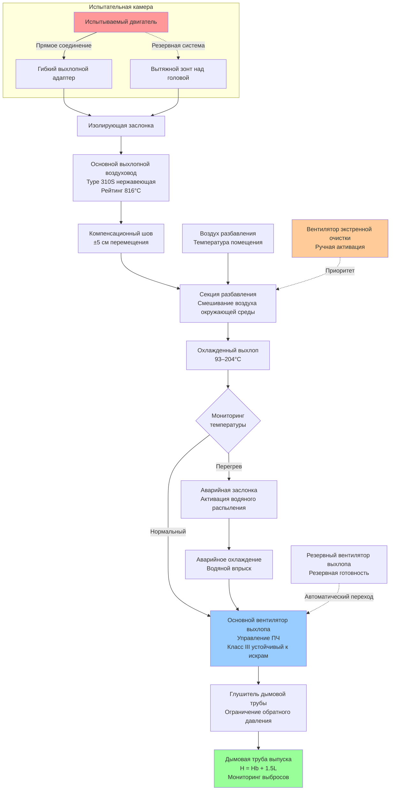

Испытательные объекты двигателей требуют специализированных систем удаления выхлопных газов для безопасного улавливания и выброса высокотемпературных продуктов сгорания с высокой скоростью при сохранении условий окружающей среды в испытательной камере и соответствии нормам выбросов. Надлежащее проектирование системы выхлопа предотвращает помехи от обратного давления на производительность двигателя и защищает персонал и оборудование.

## Методы и оборудование для улавливания выхлопа

Прямое соединение обеспечивает наиболее эффективное удержание газов сгорания. **Гибкие выхлопные адаптеры** подключаются от выпускного коллектора двигателя или выхлопной трубы к стационарным воздуховодам, приспосабливаясь к движению двигателя при испытании на динамометре. Эти адаптеры обычно используют конструкцию многослойного нержавеющего стального сильфона, рассчитанную на температуры до 649°C.

**Телескопические выхлопные трубы** позволяют осевое перемещение для позиционирования транспортного средства на шасси-динамометре. Пружинные механизмы герметизации поддерживают газонепроницаемые соединения несмотря на тепловое расширение и движение транспорта во время тестовых циклов.

**Вытяжные зонты над головой** служат резервной системой сбора выхлопа, когда прямое соединение неудобно. Скорость улавливания вытяжки должна преодолевать импульс струи выхлопных газов:

$$V_c = V_e \sqrt{\frac{A_e}{A_h}} + 30$$

где $V_c$ — скорость улавливания (м/ч), $V_e$ — скорость выхлопа (м/ч), $A_e$ — площадь выхлопной трубы (м²), и $A_h$ — площадь лица вытяжки (м²). Коэффициент безопасности 30 м/ч учитывает воздушные потоки в помещении.

**Быстроразъемные муфты** облегчают быструю переналадку между испытуемыми агрегатами. Конфигурация с шаровым шарниром приспосабливается к угловому смещению при сохранении целостности уплотнения при повышенных температурах.

## Материалы воздуховодов высокой температуры

Выбор материала зависит от максимальной температуры газа, химического воздействия и структурных требований.

**Нержавеющая сталь тип 304** обеспечивает адекватную коррозионную стойкость для температур выхлопа ниже 538°C. Толщина стенки варьируется от 16-го размера для малых воздуховодов до 10-го размера для магистралей большого диаметра, подверженных тепловому расширению.

**Нержавеющая сталь тип 310S или 321** расширяет температурный диапазон обслуживания до 816°C с повышенной стойкостью к окислению. Эти сплавы устойчивы к сернистому воздействию дизельного выхлопа и поддерживают структурную целостность при тепловых циклах.

**Требования по изоляции** предотвращают теплопередачу в занятые помещения и снижают тепловое расширение. Изоляция из силиката кальция или керамического волокна поддерживает температуру наружной поверхности ниже 60°C. Расчет толщины изоляции:

$$t = \frac{k(T_g - T_s)}{q''} - \frac{hD}{2k}$$

где $t$ — толщина изоляции (см), $k$ — теплопроводность (кДж·см/ч·м²·°C), $T_g$ — температура газа (°C), $T_s$ — предел температуры поверхности (°C), $q''$ — тепловой поток (кДж/ч·м²), $h$ — коэффициент пленки, и $D$ — диаметр воздуховода (м).

**Компенсационные швы** приспосабливают тепловой рост на длинных участках воздуховода. Металлические сильфонные компенсационные швы, рассчитанные на выхлопное обслуживание, обычно позволяют ±5 см перемещения на один шов. Расчет расстояния:

$$L_{max} = \frac{\Delta_{joint}}{\alpha \Delta T}$$

где $L_{max}$ — максимальное расстояние между швами (м), $\Delta_{joint}$ — емкость перемещения шва (см), $\alpha$ — коэффициент теплового расширения (6.9×10⁻⁶ см/см·°C для нержавеющей стали), и $\Delta T$ — изменение температуры (°C).

## Выбор вентилятора для выхлопа горячих газов

Высокотемпературные вентиляторы выхлопа должны выдерживать тепловое напряжение при сохранении стабильной производительности при различных нагрузках двигателя.

**Радиальные вентиляторы с лопатками** работают с выхлопом, загрязненным частицами, с минимальными отложениями. Конструкции с обратным изгибом или аэродинамической формой обеспечивают более высокую эффективность, но требуют более чистых газовых потоков. Конструкция материала включает колеса из алюминиевого литья для температур ниже 204°C или сварные стальные конструкции для более высоких температур.

**Дератирование температуры вентилятора** учитывает сниженную плотность воздуха при повышенных температурах:

$$Q_{actual} = Q_{design} \sqrt{\frac{T_{design}}{T_{actual}}}$$

$$SP_{actual} = SP_{design} \frac{T_{actual}}{T_{design}}$$

где температуры — абсолютные (К = °C + 273). Вентилятор, выбранный для воздуха 21°C, работающий при выхлопе 260°C, требует примерно в 1,32 раза большей объемной производительности.

**Преобразователи частоты** модулируют скорость вентилятора для соответствия условиям нагрузки двигателя, предотвращая чрезмерное отрицательное давление при холостом ходу или легкой нагрузке. Стратегии управления отслеживают температуру выхлопных газов или давление в испытательной камере.

**Конструкция, устойчивая к искрам** (AMCA класс II или III) предотвращает возгорание несгоревших углеводородов в дизельном выхлопе или при испытании с обогащенной топливной смесью. Материалы рабочего колеса из цветных металлов исключают образование искр.

## Температура выхлопа по типам двигателей

| Тип двигателя | Темп. выхлопа на холостом ходу | Темп. выхлопа на полной нагрузке | Пиковая переходная темп. | Рекомендуемый рейтинг воздуховода |
|-------------|-------------------|------------------------|---------------------|-------------------------|
| Бензиновый автомобильный | 149–204°C | 427–538°C | 649°C | 760°C |
| Дизельный автомобильный | 93–149°C | 316–482°C | 538°C | 649°C |
| Тяжелый дизель | 121–177°C | 371–593°C | 704°C | 816°C |
| Бензиновый спортивный | 204–260°C | 538–760°C | 871°C | 982°C |
| Природный газ промышленный | 177–232°C | 482–649°C | 760°C | 871°C |
| Малый авиационный поршневой | 149–204°C | 371–538°C | 649°C | 760°C |
| Турбодизель | 149–204°C | 427–649°C | 816°C | 927°C |

## Разбавление и охлаждение перед выпуском

Выхлопные газы обычно требуют охлаждения перед выпуском в атмосферу или отбором проб для анализа выбросов.

**Разбавление воздухом окружающей среды** смешивает воздух помещения с выхлопом для снижения температуры и концентрации. Расчет коэффициента разбавления:

$$DR = \frac{T_e - T_{target}}{T_{target} - T_a} + 1$$

где $DR$ — коэффициент разбавления, $T_e$ — температура выхлопа (°C), $T_{target}$ — целевая смешанная температура (°C), и $T_a$ — температура воздуха окружающей среды (°C). Достижение выпуска 93°C из выхлопа 538°C при температуре окружающей среды 21°C требует примерно 6,4:1 разбавления.

**Системы разбавления Вентури** используют импульс выхлопных газов для индуцирования воздуха окружающей среды через радиальные щели. Эти пассивные системы не требуют внешнего питания, но увеличивают обратное давление на 5–10 см вод. ст.

**Охлаждение водяным распылением** обеспечивает быстрое снижение температуры с минимальным разбавлением воздухом. Емкость испарительного охлаждения:

$$\dot{m}_w = \frac{\dot{m}_e c_p (T_e - T_{target})}{h_{fg}}$$

где $\dot{m}_w$ — расход воды (кг/ч), $\dot{m}_e$ — расход выхлопа (кг/ч), $c_p$ — удельная теплоемкость выхлопа (0,26 кДж/кг·°C), и $h_{fg}$ — теплота парообразования (2257 кДж/кг при атмосферном давлении).

**Системы рекуперации тепла** извлекают тепловую энергию для отопления помещений или промышленного использования. Теплообменники типа кожухотрубные с выхлопом на стороне трубок облегчают очистку и техническое обслуживание. Падение давления на стороне газа обычно ограничивает рекуперацию тепла 40–60% доступной энергии.

## Требования соответствия экологическим нормам

Нормы выбросов регулируют как концентрацию, так и общую массу выпуска.

**Пределы дымности** ограничивают видимые выбросы, обычно до 20% дымности или менее. Дизельный выхлоп при ускорении или испытании под высокой нагрузкой может потребовать фильтрации или доочистки для соответствия местным разрешениям на качество воздуха.

**Отчетность о ЛОС и NOx** применяется к объектам, совокупные выбросы которых превышают пороговые количества. Системы непрерывного мониторинга выбросов (CEMS) могут потребоваться для основных источников.

**Требования к высоте дымовой трубы** обеспечивают адекватную дисперсию. Формула надлежащей инженерной практики EPA:

$$H_{stack} = H_b + 1.5L$$

где $H_{stack}$ — минимальная высота дымовой трубы (м), $H_b$ — высота здания (м), и $L$ — меньшее из высоты здания или максимальной проектной ширины здания (м).

**Контроль запаха** решает проблемы общественного беспокойства даже когда выбросы соответствуют нормативным требованиям. Системы адсорбции углеродом или каталитического окисления удаляют углеводороды, ответственные за неприятные запахи.

## Положения экстренного удаления выхлопа

Испытательные объекты требуют избыточной емкости выхлопа для безопасности.

**Резервные вентиляторы выхлопа** поддерживают минимальную вентиляцию во время обслуживания или отказа основного вентилятора. Автоматическое управление заслонками переводит поток выхлопа на резервное оборудование при отклонении давления или изменении статуса вентилятора.

**Системы экстренной очистки** быстро эвакуируют испытательные камеры после катастрофического отказа двигателя или пожара. Вентиляторы большого объема, рассчитанные на полную смену воздуха в течение 2–3 минут, предотвращают накопление опасных газов.

**Противопожарные заслонки** в выхлопных воздуховодах закрываются при обнаружении высокой температуры для предотвращения распространения огня через воздуховоды. Плавкое звено, срабатывающее при 141°C, обеспечивает отказоустойчивую работу независимо от наличия электроэнергии.

**Ручные органы управления переопцией** в местах экстренного выхода позволяют персоналу активировать максимальный выхлоп во время эвакуации.

