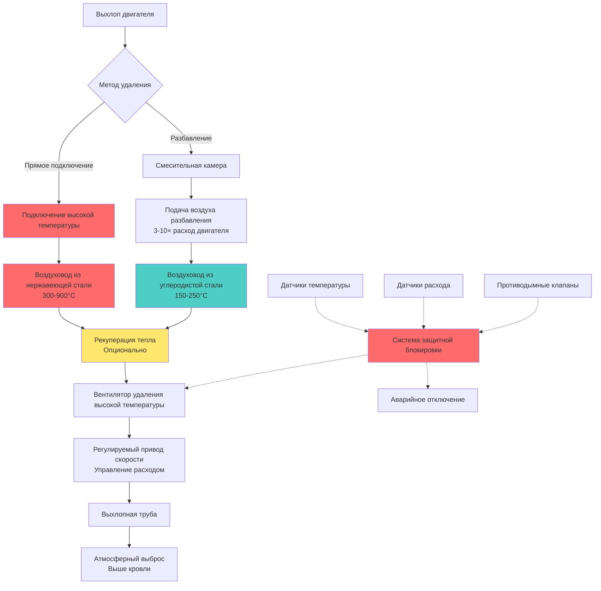

## Сравнение методов прямого подключения и разбавления

Системы удаления отработанных газов для испытательных ячеек двигателей используют два основных подхода: прямое подключение и разбавление. Выбор зависит от типа двигателя, продолжительности испытаний, температуры отработанных газов и ограничений объекта.

**Прямое подключение** напрямую присоединяет выхлоп двигателя к воздуховодам удаления с минимальным разбавлением воздуха. Этот метод справляется с полной температурой выхлопа (300-650°C для дизельных двигателей, до 900°C для газовых турбин во время переходных режимов) и требует материалов и конструкции, устойчивых к высоким температурам. Скорость удаления равна расходу воздуха двигателя плюс расход топлива:

$$Q_{extract} = Q_{engine} + Q_{fuel} = \dot{m}_{air} + \dot{m}_{fuel}$$

где $\dot{m}_{air}$ — массовый расход воздуха сгорания двигателя (кг/с) и $\dot{m}_{fuel}$ — массовый расход топлива (кг/с).

**Удаление с разбавлением** вводит наружный или кондиционированный воздух в поток выхлопа сразу после выхода двигателя, снижая температуру газа до 150-250°C перед поступлением в воздуховод удаления. Это позволяет использовать стандартные строительные материалы, но требует значительно большего объемного расхода. Степень разбавления обычно составляет от 3:1 до 10:1:

$$Q_{dilution} = Q_{exhaust} \times (DR - 1)$$

где $DR$ — степень разбавления. Общий расход удаления становится:

$$Q_{total} = Q_{exhaust} + Q_{dilution}$$

Воздух разбавления может вводиться через кольцевые смесительные камеры, вентури-разбавители или специальные форсунки впрыска, расположенные для обеспечения турбулентного перемешивания и предотвращения расслоения.

## Сравнение методов удаления

| Параметр | Прямое подключение | Удаление с разбавлением |
|-----------|---------------|---------------------|
| **Материал воздуховода** | Нержавеющая сталь 304/316 | Углеродистая сталь, алюминированная сталь |
| **Рабочая температура** | 300-900°C | 150-250°C |
| **Объемный расход** | Минимальный (объем двигателя) | 3-10× расход двигателя |
| **Мощность вентилятора** | Ниже (меньший объем) | Выше (больший объем) |
| **Рекуперация тепла** | Отличный потенциал | Ограниченный потенциал |
| **Стоимость установки** | Выше (специальные материалы) | Ниже (стандартные материалы) |
| **Гибкость** | Ограничена условиями проектирования | Адаптируется к различным двигателям |
| **Отклик при пуске** | Быстрый тепловой отклик | Медленнее, требует воздуха разбавления |

## Технические характеристики вентиляторов удаления для горячих газов

Вентиляторы удаления должны выдерживать непрерывное воздействие повышенных температур, коррозионных продуктов сгорания и циклических тепловых напряжений. Критические характеристики включают:

**Номинальная температура**: Вентиляторы, обрабатывающие выхлоп при прямом подключении, требуют конструкции класса III (400°C непрерывно, 600°C периодически) согласно AMCA 99. Системы разбавления обычно работают при 150-250°C, что позволяет использовать конструкцию класса I (максимум 200°C).

**Материалы конструкции**: Рабочие колеса вентиляторов для высокотемпературной службы используют аустенитную нержавеющую сталь (304, 316) или высоконикелевые сплавы. Подшипники устанавливаются снаружи с удлиненными валами и водяным охлаждением или воздушным охлаждением опор для поддержания смазки ниже 90°C.

**Выбор вентилятора**: Центробежные вентиляторы с загнутыми назад лопатками или профильные обеспечивают стабильную работу при различных нагрузках двигателя. Требования к статическому давлению учитывают:
- Потери трения в воздуховоде (обычно 500-1500 Па)
- Ограничения обратного давления выхлопа (критично для производительности двигателя)
- Скорость выброса из трубы (минимум 15-25 м/с для рассеивания шлейфа)

Возможность повышения давления:

$$\Delta P_{fan} = \Delta P_{duct} + \Delta P_{stack} + \Delta P_{accessories} + P_{velocity}$$

где $P_{velocity} = \frac{1}{2}\rho V^2$ на выходе трубы.

## Регулируемые приводы скорости для управления расходом

Преобразователи частоты (VFD) модулируют скорость вентилятора удаления в соответствии с условиями работы двигателя, поддерживая оптимальное обратное давление выхлопа и минимизируя потребление энергии. Стратегии управления включают:

**Управление обратным давлением**: Датчики давления контролируют обратное давление выхлопа двигателя, регулируя скорость вентилятора для поддержания уставки (обычно 50-500 Па манометрического давления в зависимости от технических характеристик двигателя). Превышение максимального обратного давления вызывает сигналы тревоги и может ограничить нагрузку двигателя.

**Компенсация температуры**: Для систем разбавления VFD регулирует количество воздуха разбавления на основе измеренной температуры выхлопа, поддерживая безопасные условия эксплуатации воздуховода.

**Экономия энергии**: Работа вентиляторов на 80% скорости снижает потребление энергии примерно до 51% мощности при полной скорости (закон подобия: Мощность ∝ скорость³), обеспечивая значительную экономию при испытаниях с частичной нагрузкой.

## Возможности рекуперации тепла

Выхлоп двигателя представляет значительный энергетический поток, пригодный для рекуперации тепла. Дизельный двигатель мощностью 1 МВт с тепловым КПД 35% отвергает примерно 500 кВт через выхлоп при температуре 400-500°C.

**Методы рекуперации тепла**:
- Теплообменники выхлопа типа "оболочка и трубка" для генерации горячей воды (подача 70-90°C)
- Котлы отходящего тепла для производства низкого давления пара (150-200°C насыщенный)
- Системы органического цикла Ренкина (ORC) для производства электроэнергии
- Абсорбционные холодильные машины для производства охлаждения

Рекуперируемое тепло:

$$Q_{recoverable} = \dot{m}_{exhaust} \times c_p \times (T_{in} - T_{out})$$

где $c_p \approx 1,1$ кДж/(кг·K) для продуктов сгорания и $T_{out}$ ограничена точкой кислотной росы (обычно 150-180°C для дизельного топлива).

## Проектирование трубы для выброса отработанных газов

Выхлопные трубы рассеивают продукты сгорания выше занятых территорий и предотвращают повторное попадание в воздухозаборы здания.

**Высота трубы**: Определяется моделированием рассеивания (AERMOD, SCREEN3) для поддержания приземных концентраций ниже нормативных пределов. Минимальная высота обычно превышает высоту здания на 3-6 метров или в 1,5 раза больше размера здания, в зависимости от того, что больше.

**Скорость выброса**: Минимум 15 м/с предотвращает нисходящие потоки; 20-25 м/с обеспечивают адекватный подъем шлейфа. Диаметр трубы:

$$D_{stack} = \sqrt{\frac{4Q}{\pi V}}$$

где $Q$ — объемный расход (м³/с) при температуре трубы и $V$ — скорость выброса (м/с).

**Защита от дождя**: Колпаки от дождя или конические отражатели предотвращают попадание воды при сохранении беспрепятственного выброса.

## Мониторинг и защитные блокировки

Комплексный мониторинг предотвращает повреждение оборудования и обеспечивает безопасную эксплуатацию:

**Мониторинг температуры**: Термопары на входе воздуховода удаления, посередине и на входе вентилятора инициируют сигналы тревоги при предустановленных пороговых значениях и запускают последовательности аварийного разбавления или отключения.

**Проверка расхода**: Датчики перепада давления или анемометры подтверждают адекватный расход удаления перед разрешением пуска двигателя.

**Предотвращение обратного потока**: Электромоторные или гравитационные клапаны предотвращают обратный поток во время остановки вентилятора, защищая объект от проникновения выхлопных газов.

**Последовательность блокировки**: Пуск двигателя заблокирован, если вентилятор удаления не работает с доказанным адекватным расходом. Высокая температура выхлопа, низкий расход удаления или отказ вентилятора инициируют немедленное отключение двигателя и активацию аварийного воздуха разбавления.
