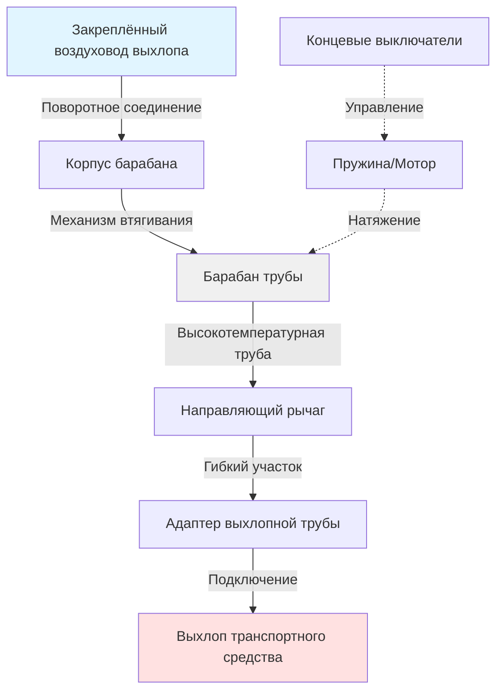

Системы автоматического барабана выхлопной трубы обеспечивают гибкие, втягивающиеся соединения между выхлопными отверстиями двигателя и закреплённой системой воздуховодов в испытательных камерах. Эти системы должны приспосабливаться к различным положениям транспортных средств при сохранении герметичных соединений и выдержке экстремальных температур выхлопных газов.

## Конструкции автоматического барабана трубы

Потолочные установки барабана позиционируют механизм хранения трубы над головой, максимизируя полезное пространство испытательной камеры. Корпус барабана содержит барабан намотки, механизм втягивания и поворотное соединение с закреплённым выхлопным воздуховодом. Длины труб обычно находятся в диапазоне от 6 до 12 м в зависимости от размеров камеры и требований к позиционированию транспортного средства.

Настенные конфигурации размещают барабан на периметре камеры, направляя трубу горизонтально к транспортному средству. Такое расположение подходит для узких камер или объектов с опасениями помех от подвесных кранов. Горизонтальное развёртывание требует осторожной поддержки трубы для предотвращения провисания и обеспечения надлежащего потока выхлопа.

Системы с подвижным рычагом объединяют жёсткий телескопический рычаг с гибким участком трубы в точке подключения к транспортному средству. Рычаг обеспечивает грубое позиционирование, а труба приспосабливается к окончательному выравниванию с выхлопным отверстием. Этот гибридный подход снижает износ трубы от повторяющихся циклов растяжения.

## Материалы высокотемпературных труб

Температуры выхлопных газов на выходе варьируются от 149°C при холостом ходу до 649°C при полной нагрузке. Конструкция трубы должна выдерживать эти экстремумы при сохранении гибкости для втягивания.

| Материал | Макс. температура | Гибкость | Срок службы |
|----------|-------------------|----------|------------|
| Стекловолокно с силиконовым покрытием | 316°C постоянно | Хорошая | 2-3 года |
| Спираль из нержавеющей стали | 649°C постоянно | Средняя | 5-7 лет |
| Ткань Inconel | 760°C постоянно | Удовлетворительная | 7-10 лет |
| Композит из керамического волокна | 982°C постоянно | Плохая | 3-5 лет |
| Стекловолокно, пропитанное PTFE | 260°C постоянно | Отличная | 2-4 года |

Трубы из стекловолокна с силиконовым покрытием обеспечивают наилучший баланс устойчивости к температуре, гибкости и стоимости для большинства приложений. Внешний слой силикона защищает основу из стекловолокна от истирания, а тканевая конструкция обеспечивает размерную стабильность при тепловых циклах.

Трубы со спиралью из нержавеющей стали предлагают превосходные температурные характеристики, но требуют большего радиуса изгиба и создают более высокие нагрузки на механизмы втягивания. Эти трубы подходят для испытания высокопроизводительных двигателей, где температуры выхлопа регулярно превышают 538°C.

## Выбор диаметра трубы и расчёты потока

Надлежащий диаметр трубы обеспечивает адекватную эвакуацию выхлопа без чрезмерного противодавления. Требуемый диаметр зависит от рабочего объёма двигателя и максимальных оборотов:

$$Q = \frac{V_{d} \times RPM \times VE}{3456}$$

где $Q$ — поток выхлопа в CFM (м³/ч), $V_{d}$ — объём в кубических дюймах, $RPM$ — максимальная скорость испытания, $VE$ — объёмный КПД (обычно 0,85 для атмосферных двигателей, 1,2-1,5 для двигателей с наддувом).

Минимальный диаметр трубы получается из допустимой скорости:

$$D = \sqrt{\frac{4Q}{\pi V_{max}}}$$

где $D$ — диаметр в дюймах, $V_{max}$ — максимальная скорость, ограниченная 4000 фут/мин для предотвращения избыточного шума и падения давления.

## Методы подключения к выхлопу двигателя

Телескопические адаптеры выхлопной трубы надвигаются на выхлопное отверстие транспортного средства и фиксируются пружинными штифтами или кулачковыми защёлками. Нос адаптера включает коническое сужение, которое приспосабливается к различным диаметрам выхлопных труб от 5 до 10 см. Гибкий сильфонный участок между адаптером и жёсткой трубной муфтой поглощает вибрацию двигателя.

Системы магнитного соединения используют редкоземельные магниты, встроенные во фланец адаптера, для достижения быстрого присоединения без механических крепежей. Магнитная сила удерживает соединение против противодавления выхлопа, позволяя быстро отсоединиться при движении транспортного средства. Эти муфты требуют гладких, ферромагнитных выхлопных кончиков для надёжного уплотнения.

Капоты улавливания позиционируют фланцевый раструб вокруг выхлопного отверстия без прямого контакта. Диаметр капота превышает выхлопную трубу на 10-15 см, создавая воздушный зазор, который втягивает окружающий воздух в поток выхлопа. Этот метод предотвращает загрязнение от утечек выхлопа, но требует более высоких скоростей вентиляции для обработки разбавляющего воздуха.

## Монтаж барабана и позиционирование

Потолочные барабаны устанавливаются на конструкционные стальные балки или армированный кровельный настил с использованием виброизолирующих кронштейнов. Высота монтажа позиционирует полностью втянутую трубу на высоте не менее 2,4 м над полом для обеспечения зазора для транспортных средств и персонала. Поворотное соединение на 360 градусов у подключения воздуховода позволяет трубе следовать за движением транспортного средства без скручивания.

Центральная линия барабана должна быть выравнена с типичным местоположением выхлопа транспортного средства для минимизации углов развёртывания трубы. Смещённый монтаж вызывает развёртывание трубы под углом, увеличивая износ первого витка и создавая неравномерное натяжение на барабане.

## Пружинное и моторизованное втягивание

Барабаны с пружиной постоянного усилия используют свёрнутую плоскую пружину, которая оказывает равномерное натяжение на всё диапазоне растяжения. Пружина устанавливается концентрично с барабаном трубы и разворачивается при развёртывании трубы. Эта пассивная система не требует электроэнергии, но ограничивает вес и длину трубы ограничениями усилия пружины. Максимальные длины труб обычно остаются ниже 9 м с конструкцией диаметром 15 см.

Системы моторизованного втягивания используют электрические или пневматические двигатели, управляемые концевыми выключателями и регуляторами переменной скорости. Двигатель включается при поступлении сигнала втягивания, наматывая трубу с контролируемой скоростью. Защита от перепробега предотвращает чрезмерное натяжение барабана, которое может повредить трубу. Эти системы обрабатывают более тяжёлые трубы и более длительные прогоны, но требуют источника питания и периодического обслуживания двигателя.

Гибридные конструкции объединяют мотор для втягивания с механическим тормозом или муфтой для предотвращения нежелательного растяжения. Мотор обеспечивает контролируемое наматывание, а тормоз исключает необходимость постоянной подачи энергии для удержания трубы в положении.

## Обслуживание и интервалы замены

Проверяйте трубы ежемесячно на предмет разрывов, истирания или термического разложения. Первые 90 см трубы у подключения к транспортному средству испытывают наибольшие температуры и износ, часто требуя замены до того, как остаток показывает повреждение. Некоторые объекты устанавливают жертвенный участок в начале с быстроразъёмными муфтами для упрощения частичной замены трубы.

Смазывайте поворотные соединения и подшипники барабана ежеквартально, используя высокотемпературную смазку с рейтингом не менее 204°C. Поворотное соединение испытывает непрерывное вращение при позиционировании транспортного средства и закипает без надлежащей смазки.

Заменяйте пружинные механизмы каждые 5 лет или 10 000 циклов растяжения, в зависимости от того, что произойдёт раньше. Усталость пружины снижает усилие втягивания с течением времени, позволяя трубе провисать и создавая опасность споткнувшегося.

Очищайте внутренние части труб ежегодно с помощью сжатого воздуха для удаления углеродистых отложений и конденсата. Накопленные отложения ограничивают поток воздуха и создают локальные горячие точки, которые ускоряют разложение материала. Записывайте все операции обслуживания и отслеживайте циклы растяжения с помощью механических или электронных счётчиков, чтобы установить графики замены на основе фактических схем использования.
