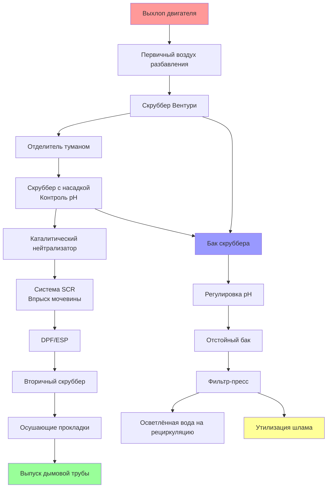

## Конструкции мокрых скрубберов для удаления твёрдых частиц

Мокрые скрубберы представляют основную технологию удаления твёрдых частиц и газообразных загрязнений из потоков выхлопа испытательных камер двигателей. Эти системы используют жидкие распылители (обычно воду или химические растворы) для захвата и нейтрализации загрязнений перед выпуском в атмосферу.

**Скрубберы Вентури** обеспечивают наивысшую эффективность удаления тонких твёрдых частиц. Поток выхлопа ускоряется через сходящийся участок, распыляя промывочную жидкость на мельчайшие капли. Эффективность сбора подчиняется формуле:

$$\eta = 1 - e^{-\frac{KL}{d_p^2 v_g}}$$

где $\eta$ — эффективность сбора, $K$ — эмпирическая константа (0,1–0,4), $L$ — отношение жидкости к газу (л/м³), $d_p$ — диаметр частицы (мкм), $v_g$ — скорость газа (м/с).

**Скрубберы с насадкой** используют структурированную или случайную насадку для максимизации площади контакта газ-жидкость. Падение давления на насадке составляет:

$$\Delta P = \frac{f \cdot L \cdot \rho_g \cdot v_g^2}{2 \cdot d_h}$$

где $f$ — коэффициент трения, $L$ — глубина насадки (м), $\rho_g$ — плотность газа (кг/м³), $d_h$ — гидравлический диаметр (м). Типичная глубина насадки для испытаний двигателей составляет 1,5–3,0 м.

**Скрубберы-башни распыления** используют несколько уровней распылительных сопел для создания противоточного потока. При более низком падении давления (250–750 Па) они требуют повышенных расходов жидкости (0,5–2,0 л/м³ газа) и достигают умеренную эффективность для частиц размером более 2–5 мкм.

## Каталитические нейтрализаторы для контроля выбросов

Системы каталитического окисления преобразуют оксид углерода и несгоревшие углеводороды в диоксид углерода и водяной пар. Трёхкомпонентные катализаторы одновременно сокращают выбросы NOx в стехиометрических потоках выхлопа.

**Материалы катализаторных подложек** включают керамические сотовые монолиты (400–900 ячеек на квадратный дюйм) и металлические фольговые подложки. Активное каталитическое покрытие содержит платину, палладий и родий в точных пропорциях, оптимизированных для диапазона температур выхлопа.

Окна рабочих температур критичны: 300–450°C для выхода на режим, с оптимальным преобразованием при 400–800°C. Для испытаний дизельных двигателей дизельные окислительные катализаторы (DOC) требуют температур выхлопа выше 200°C для 90%-го преобразования CO и HC.

**Соображения пространственной скорости** определяют размер катализатора. Объёмная часовая пространственная скорость газа (GHSV) обычно составляет 30 000–80 000 ч⁻¹:

$$\text{GHSV} = \frac{Q}{V_{cat}}$$

где $Q$ — объёмный расход (м³/ч в стандартных условиях), $V_{cat}$ — объём катализатора (м³).

## Методы обработки NOx и SOx

**Системы селективного каталитического восстановления (SCR)** впрыскивают раствор мочевины (дизельная выхлопная жидкость) для восстановления NOx до азота и воды:

$$4\text{NO} + 4\text{NH}_3 + \text{O}_2 \rightarrow 4\text{N}_2 + 6\text{H}_2\text{O}$$

$$2\text{NO}_2 + 4\text{NH}_3 + \text{O}_2 \rightarrow 3\text{N}_2 + 6\text{H}_2\text{O}$$

Системы SCR достигают 70–95%-го сокращения NOx при 300–450°C с проскоком аммиака ниже 10 ppm. Скорость дозирования мочевины составляет:

$$\dot{m}_{urea} = \frac{\text{NSR} \cdot \dot{m}_{NOx} \cdot M_{urea}}{M_{NH_3} \cdot c_{urea}}$$

где NSR — нормализованное стехиометрическое соотношение (обычно 1,0–1,1), $\dot{m}_{NOx}$ — массовый расход NOx, $c_{urea}$ — концентрация раствора мочевины (32,5% по массе).

**Удаление SOx** требует щелочных промывочных растворов. Растворы гидроксида натрия или карбоната натрия нейтрализуют диоксид серы:

$$\text{SO}_2 + 2\text{NaOH} \rightarrow \text{Na}_2\text{SO}_3 + \text{H}_2\text{O}$$

Эффективность промывки зависит от pH (оптимальный диапазон 8–10), отношения жидкости к газу и времени контакта. Двухступенчатые скрубберы разделяют удаление твёрдых частиц (первая ступень) и нейтрализацию кислотных газов (вторая ступень).

## Системы фильтрации твёрдых частиц

**Дизельные фильтры твёрдых частиц (DPF)** захватывают частицы сажи на керамических стеночных фильтрах. Эффективность фильтрации превышает 95% для частиц размером более 0,1 мкм. Циклы регенерации окисляют накопленную сажу при 550–650°C посредством активных (впрыск топлива) или пассивных (катализаторное покрытие) методов.

Падение давления на чистом DPF приблизительно составляет:

$$\Delta P_{clean} = \frac{8 \mu L v_w}{\varepsilon d_p^2} + \frac{\rho v_w^2}{2 \varepsilon^2}$$

где $\mu$ — вязкость газа (Па·с), $L$ — толщина стенки фильтра (м), $v_w$ — скорость у стенки (м/с), $\varepsilon$ — пористость, $d_p$ — средний диаметр пор (мкм).

**Электростатические осадители (ESP)** для испытательных камер с высокими нагрузками твёрдых частиц обеспечивают эффективность сбора 95–99,9%. Электроды коронного разряда заряжают частицы, которые мигрируют к пластинам сбора под влиянием электрического поля 30–60 кВ.

## Эффективность удаления загрязнений

| Загрязнитель | Технология | Эффективность удаления | Условия эксплуатации |
|-----------|------------|-------------------|---------------------|
| **Твёрдые частицы (PM10)** | Скруббер Вентури | 95–99% | L/G = 0,7–1,5 л/м³, ΔP = 5–15 кПа |
| **Твёрдые частицы (PM2,5)** | Вентури + ESP | 98–99,9% | Напряжение ESP 40–60 кВ |
| **Оксид углерода (CO)** | Каталитический нейтрализатор | 90–98% | T = 400–800°C, достаточный O₂ |
| **Углеводороды (HC)** | Каталитический нейтрализатор | 85–95% | T = 350–750°C |
| **Оксиды азота (NOx)** | Система SCR | 70–95% | T = 300–450°C, NSR = 1,0–1,1 |
| **Диоксид серы (SO₂)** | Щелочной скруббер | 90–99% | pH 8–10, L/G = 5–15 л/м³ |
| **Летучие органические соединения** | Тепловой/каталитический окислитель | 95–99,9% | T = 750–1000°C (тепловой) |
| **Проскок аммиака** | Окислительный катализатор | 80–95% | Ниже по потоку от SCR |

## Требования экологических разрешений

Системы очистки выхлопа испытательных объектов должны соответствовать федеральным, государственным и местным нормам качества воздуха. **Разрешения на эксплуатацию Раздела V** применяются к крупным источникам (потенциальные выбросы >100 т/год любого критериального загрязнителя или >10/25 т/год опасных воздействий).

**Пределы выбросов** варьируются по юрисдикциям, но обычно включают:
- Твёрдые частицы: 0,01–0,05 гр/дсф (23–115 мг/дсм³)
- NOx: 0,5–2,0 фунт/ГДж (215–860 мг/МДж)
- CO: 1,0–5,0 фунт/ГДж (430–2150 мг/МДж)
- Дымность: 10–20% (6-минутное среднее)

**Системы непрерывного мониторинга выбросов (CEMS)** измеряют NOx, CO, CO₂, O₂ и дымность, когда уровни выбросов превышают пороги. Квартальные тесты относительной точности (RATA) проверяют производительность CEMS в пределах ±10% от эталонных методов.

**Испытание дымовой трубы** проверяет производительность скруббера ежегодно или один раз в два года с использованием эталонных методов EPA (метод 5 для твёрдых частиц, метод 7E для NOx, метод 10 для CO).

## Обработка и утилизация воды скруббера

Замкнутые системы воды скруббера минимизируют потребление воды и сброс сточных вод. Ключевые процессы обработки включают:

**Контроль pH** поддерживает оптимальную эффективность промывки и предотвращает коррозию. Автоматические системы дозирования добавляют гидроксид натрия (повышает pH) или серную кислоту (понижает pH) на основе непрерывного мониторинга pH. Целевые диапазоны: 6,5–8,5 для скрубберов твёрдых частиц, 8,0–10,0 для скрубберов кислотных газов.

**Разделение твёрдых частиц** удаляет накопленные твёрдые частицы через отстойные баки (время пребывания 2–4 часа) и фильтр-прессы или центрифуги. Шлам обычно содержит 15–25% твёрдых частиц после обезвоживания.

**Химическое осаждение** обрабатывает растворённые металлы с использованием извести, хлорида железа(III) или полимерных коагулянтов. Тяжёлые металлы (свинец, кадмий, цинк из износа двигателя) осаждаются в виде гидроксидов при pH 8–11.

**Обработка продувки** предотвращает накопление растворённых твёрдых веществ (TDS). Когда TDS превышает 3000–5000 мг/л, скорости продувки 1–5% от расхода рециркуляции поддерживают качество системной воды. Сброс должен соответствовать местным стандартам предварительной обработки:
- Взвешенные твёрдые вещества (TSS): <100 мг/л
- Масла и жиры: <50 мг/л
- Тяжёлые металлы: Варьируется по элементам и юрисдикциям
- pH: 6,0–9,0

**Характеризация шлама** определяет требования утилизации. Неопасный шлам утилизируется на одобренных полигонах, в то время как опасный шлам (превышающий пределы RCRA Toxicity Characteristic Leaching Procedure) требует обработки или утилизации на разрешённых объектах опасных отходов.

Скорости подачи воды обычно составляют 0,5–2,0% от расхода рециркуляции скруббера, учитывая испарение (основная потеря), унос (0,001–0,02% от расхода газа) и продувку. Для системы выхлопа 8480 м³/ч (5000 CFM) с рециркуляцией скруббера 3785 л/мин (1000 GPM) требования по подаче воды приблизительно составляют 19–76 л/мин (5–20 GPM) непрерывно.
