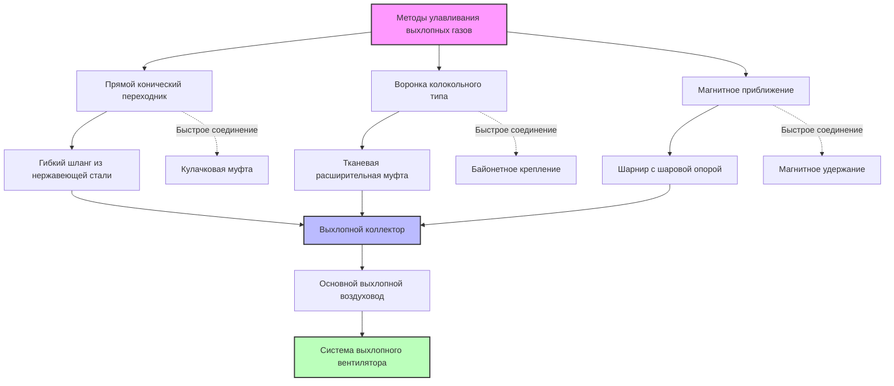

Системы улавливания выхлопных газов обеспечивают прямое соединение с выхлопными выводами двигателя для эффективного удаления газов сгорания во время испытаний на динамометре, сертификации выбросов и опытно-конструкторских работ. Правильная конструкция поддерживает противодавление выхлопных газов, близкое к атмосферному, при полном улавливании токсичных продуктов сгорания.

## Конструкции выхлопных переходников

Конфигурации переходников соответствуют различным геометриям выхлопных выводов различных платформ транспортных средств:

**Конические переходники** используют градуированные сужающиеся участки для соответствия различным диаметрам труб. Стандартные автомобильные конусы охватывают диапазон 38–102 мм для покрытия выхлопных труб легковых автомобилей. Версии для тяжелого оборудования расширяются до 152 мм для дизельных грузовиков. Угол конуса обычно составляет 15–20 градусов для сбалансирования глубины введения и эффективности герметизации.

**Колокольные переходники** имеют расширяющиеся входные участки, направляющие поток выхлопных газов в систему улавливания. Эти конструкции допускают боковое смещение до ±13 мм, критическое для транспортных средств, расположенных на шасси-динамометрах, где точное расположение выхлопной трубы варьируется.

**Щелевые головки улавливания** используют пружинные механические захваты, которые зажимают выхлопные трубы. Регулируемый зазор между губками обеспечивает размещение различных диаметров без замены переходника. Механизмы отпускания позволяют быстро подключать и отключать транспортное средство во время последовательности испытаний.

**Магнитные переходники крепления** используют редкоземельные магниты для закрепления легких воронок улавливания на ферромагнитных выхлопных компонентах. Эти бесконтактные системы предотвращают добавление противодавления, но требуют соблюдения близкого допуска на позиционирование (зазор <6 мм) для эффективного улавливания.

## Методы гибкого соединения

Гибкие шланговые участки между переходниками выхлопных газов и жесткими выхлопными воздуховодами обеспечивают движение транспортного средства во время работы динамометра:

**Гофрированный стальной шланг из нержавеющей стали** обеспечивает стойкость к температуре до 649°C с отличной гибкостью. Множественные гофры допускают радиус изгиба в 3–5 раз больше диаметра шланга. Толщина стенки 0,3–0,5 мм сбалансирована по гибкости и рейтингу давления.

**Тканевые расширительные муфты** используют стекловолокно с силиконовым покрытием для температур до 260°C. Эти легкие соединения сжимаются и расширяются на 50–100 мм для следования движению шасси транспортного средства. Тканевые муфты вносят минимальное ограничение потока, но требуют ежегодной проверки на деградацию.

**Шарниры с шаровыми опорами** соединяют жесткие трубные участки со сферическими подшипниковыми узлами, допускающими угловые отклонения ±30 градусов. Типичные установки используют два шаровых шарнира в серию для размещения сложных картин движения во время испытания на ускорение.

**Резиновый шланг с проволочным армированием** служит для приложений с более низкой температурой (непрерывно 177°C). Встроенная стальная проволока предотвращает коллапс в условиях вакуума. Эти экономичные соединения подходят для испытания бензиновых двигателей, где температура выхлопных газов остается умеренной.

## Требования к эффективности улавливания

Полное улавливание выхлопных газов предотвращает загрязнение лаборатории монооксидом углерода и оксидами азота:

**Скорость потока на лице** переходника должна превышать скорость выхлопного потока для предотвращения утечек. Минимальная скорость потока 10,2 м/с обеспечивает адекватный запас улавливания для легковых автомобилей на холостом ходу. Испытание высокопроизводительности требует 15,2–20,3 м/с для улавливания высокоскоростных выхлопных импульсов.

**Улавливание корпусом** дополняет соединение выхлопной трубы потолочным козырьком, рассчитанным на 340–680 м³/ч для сбора летучих выбросов из утечек или событий отключения. Позиционирование козырька в пределах 305 мм от выхлопного выводов максимизирует эффективность.

**Испытание с газом-трассером** проверяет производительность улавливания с использованием гексафторида серы, введенного на выхлопную трубу. Мониторинг SF₆ в реальном времени в зоне дыхания лаборатории подтверждает утечку <10 ppm, что соответствует эффективности улавливания >99,9%.

## Рассмотрения противодавления

Сопротивление выхлопной системы влияет на производительность двигателя и характеристики выбросов:

Общее противодавление состоит из сопротивления переходника, потерь гибкого соединения и трения воздуховода:

$$\Delta P_{total} = \Delta P_{adapter} + \Delta P_{flex} + \Delta P_{duct}$$

Падение давления на переходнике определяется по формуле:

$$\Delta P_{adapter} = K_a \cdot \frac{\rho V^2}{2}$$

где $K_a$ = коэффициент потерь переходника (0,1–0,3 для хорошо спроектированных конусов), $\rho$ = плотность выхлопного газа (кг/м³) и $V$ = скорость (м/с).

**Максимальное допустимое противодавление** обычно ограничено 0,37–0,75 кПа выше атмосферного для предотвращения потерь мощности двигателя. Испытание сертификации согласно протоколам EPA и CARB требует противодавления в пределах ±0,12 кПа от дорожных условий.

**Мониторинг давления** использует датчики дифференциального давления, связанные с давлением окружающей среды лаборатории. Непрерывная запись во время цикла испытаний проверяет соответствие спецификациям противодавления.

Гибкий шланг вносит падение давления в зависимости от длины и диаметра:

$$\Delta P_{flex} = f \cdot \frac{L}{D} \cdot \frac{\rho V^2}{2}$$

где $f$ = коэффициент трения (0,02–0,04 для гофрированной нержавеющей стали), $L$ = длина шланга (м) и $D$ = диаметр (м).

## Системы быстрого соединения

Быстрое крепление переходника сокращает время оборота испытательной ячейки:

**Кулачковые муфты** используют поворот на четверть оборота для соединения переходника с выхлопной трубой транспортного средства. Канавчатые профили обеспечивают положительное удержание, противодействующее силам разделения до 445 Н. Среднее время соединения составляет 3–5 секунд на выхлопную трубу.

**Байонетные крепления** используют механизмы с штифтом и пазом, позволяющие установку с нажатием и скручиванием. Пружинные штифты автоматически закрепляют положения детали. Типический крутящий момент монтажа 7–14 Н⋅м обеспечивает надежное крепление.

**Пневматические зажимы** активируются через приводы цилиндров, управляемые ножными переключателями. Сила зажатия 220–890 Н обеспечивает размещение различных толщин стенок труб. Регуляторы давления регулируют силу для предотвращения повреждения компонентов выхлопа.

**Магнитные системы быстрого соединения** позиционируют массивы редкоземельных магнитов вокруг выхлопных выводов, автоматически центрируя воронки улавливания. Усилие при отрыве превышает 133 Н для предотвращения случайного отключения во время испытания.

## Конфигурации с несколькими выхлопными системами

Транспортные средства с двумя или четырьмя выхлопными выводами требуют координированного улавливания:

**Коллекторный сбор** объединяет несколько соединений выхлопных труб в одиночные ходы воздуховодов. Y-фитинги объединяют двойные выхлопы с включенными углами 30–45 градусов, минимизирующие турбулентность. Размеры коллектора следуют:

$$A_{manifold} \geq 1.2 \sum A_{tailpipes}$$

где $A$ обозначает площадь поперечного сечения. Перегрузка на 20% предотвращает чрезмерное увеличение скорости.

**Независимое улавливание** поддерживает отдельные потоки выхлопных газов для анализа цилиндров двигателя во время опытно-конструкторских работ. Двойные системы экстракции с выделенными вентиляторами предотвращают перекрестное загрязнение образцов выбросов.

**Синхронизированное позиционирование** использует механизмы связей для одновременного позиционирования нескольких переходников. Параллелограммные связи поддерживают равномерный зазор между головками улавливания при смещении узла в центровую линию транспортного средства.

## Типы переходников и области применения

| Тип переходника | Диапазон диаметра | Предел температуры | Типичное применение | Время соединения |
|--------------|---------------|-------------------|---------------------|-----------------|
| Конический переходник | 38–102 мм | 649°C | Легковые автомобили | 10–15 секунд |
| Конус для тяжелого оборудования | 76–152 мм | 760°C | Дизельные грузовики | 15–20 секунд |
| Колокольная воронка | 51–127 мм | 260°C | Допуск на смещение | 5–8 секунд |
| Щелевой зажим | 38–89 мм | 538°C | Быстрая смена транспортного средства | 3–5 секунд |
| Магнитное улавливание | 51–102 мм | 204°C | Нулевое противодавление | 2–3 секунды |
| Байонетное крепление | 51–76 мм | 427°C | Стандартный автопарк | 3–5 секунд |
| Кулачковая муфта | 38–102 мм | 649°C | Высокопроизводительное испытание | 3–5 секунд |

**Выбор материала** устраняет коррозионные компоненты выхлопных газов. Нержавеющая сталь типа 304 адекватно служит бензиновым двигателям. Нержавеющая сталь типа 316 или 321 обеспечивает превосходную устойчивость к соединениям серы для дизельных приложений. Inconel 625 обеспечивает экстремальные температуры для опытно-конструкторских работ с гоночными двигателями.

**Уплотнительные интерфейсы** используют высокотемпературные прокладки (керамическое волокно или графит), рассчитанные на 816°C. Уплотнения сжимающего типа исключают деградацию клея. Металлические конические сиденья обеспечивают герметичные уплотнения без прокладок в экстремальных приложениях.

**Протоколы технического обслуживания** включают еженедельный осмотр переходника на скопление углерода, ежемесячное обследование гибкого шланга на трещины или деградацию и ежеквартальную проверку падения давления. Документация поддерживает отслеживаемость калибровки для соответствия испытанию сертификации.
