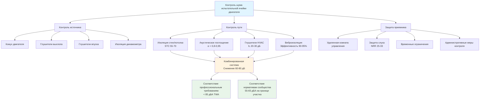

Испытательные ячейки двигателей генерируют экстремальные уровни шума, которые создают проблемы для безопасности рабочих, работы оборудования и отношений с сообществом. Надлежащее акустическое проектирование интегрирует звукоизоляцию, поглощение и контроль шума системы HVAC для создания безопасных, соответствующих нормативам испытательных сред.

## Источники звука в среде испытания двигателя

Испытательные ячейки двигателей содержат множество высокоинтенсивных источников шума, работающих одновременно.

### Основные источники шума

**Механический шум двигателя:**
- Стук поршня и удары шатуна: 95-105 дБА
- Шум механизма клапанов: 85-95 дБА
- Шум зубчатого зацепления: 90-100 дБА
- Свист турбокомпрессора: 100-110 дБА

**Шум выхлопной системы:**
- Сырой выброс выхлопных газов: 120-140 дБА
- Пульсации выхлопа на частоте воспламенения
- Резонансы в выхлопных трубопроводах
- Регенерация системы очистки отработавших газов

**Шум впускного воздуха:**
- Турбулентность на входе воздушного фильтра: 80-95 дБА
- Срыв потока компрессора турбокомпрессора
- Шум потока в дроссельной заслонке
- Резонансы во впускном коллекторе

**Шум динамометра:**
- Кавитация в гидротормозе: 95-110 дБА
- Вентиляторы охлаждения с вихревыми токами: 85-100 дБА
- Передача вибрации муфты
- Шум подшипников на высоких скоростях

**Вклад системы HVAC:**
- Выброс из воздухораспределителя подачи: 60-75 дБА
- Турбулентность решетки возврата воздуха: 55-70 дБА
- Излучение энергии из воздуховода: 50-65 дБА
- Шум вентилятора, передаваемый через воздуховоды

## Требования контроля шума и нормативное регулирование

### Предельно допустимые уровни профессионального воздействия OSHA

OSHA 29 CFR 1910.95 устанавливает предельно допустимые уровни воздействия:

- 90 дБА для 8-часового эквивалентного уровня (TWA)
- обменный коэффициент 5 дБ при сокращении продолжительности вдвое
- максимальный предел импульсного шума 115 дБА
- программа охраны слуха требуется при TWA 85 дБА

**Допустимая продолжительность воздействия:**

$$T = \frac{8}{{2^{(L-90)/5}}}$$

где $T$ = допустимые часы и $L$ = уровень звука (дБА).

### Нормативы шума сообщества

Большинство юрисдикций ограничивают шум на границе участка:

- Дневное время (7:00 - 22:00): 55-65 дБА
- Ночное время (22:00 - 7:00): 45-55 дБА
- Промышленные зоны: 70-80 дБА максимум

**Затухание на расстоянии:**

$$L_2 = L_1 - 20\log_{10}\left(\frac{r_2}{r_1}\right)$$

где $L_1$ и $L_2$ — уровни звука на расстояниях $r_1$ и $r_2$.

### Промышленные стандарты

- ANSI/ASA S12.19: Измерение профессионального воздействия шума
- ISO 362: Измерение шума при проезде транспортного средства
- SAE J1074: Процедура измерения уровня звука двигателя

## Принципы акустического проектирования испытательных ячеек

### Звукоизолирующие конструкции

**Сборки стен и потолков:**
- Целевой индекс изоляции звука (STC): 55-70
- Двойная конструкция стены с воздушным зазором: 20-41 см
- Виниловые барьеры с нагрузкой по массе: 4,9-9,8 кг/м²
- Развязанный каркас стоек для предотвращения боковых путей передачи

**Звукоизолирующая способность:**

$$TL = 20\log_{10}(f \cdot m) - 47$$

где $f$ = частота (Гц) и $m$ = поверхностная плотность (кг/м²).

### Акустическое поглощение

Внутренние поверхности требуют высоких коэффициентов поглощения в широком диапазоне частот.

**Целевые коэффициенты поглощения:**
- 125 Гц (низкая частота): α ≥ 0,40
- 500 Гц (средняя частота): α ≥ 0,80
- 2000 Гц (высокая частота): α ≥ 0,95

**Контроль времени реверберации:**

$$T_{60} = \frac{0.049V}{A}$$

где $V$ = объем помещения (м³) и $A$ = общее поглощение (сабины).

Целевое время реверберации: 0,5-1,0 с для испытательных ячеек.

### Специализированные акустические кожухи

**Безэховые камеры:**
- Клиновидные поглотители глубиной 61-122 см
- Условия свободного звукового поля выше 80 Гц
- Используются для прецизионного тестирования качества звука

**Полубезэховые ячейки:**
- Отражающий пол, поглощающие стены/потолок
- Моделирует автомобиль на дорожной поверхности
- Более низкие строительные затраты, чем полностью безэховые

## Вклад шума системы HVAC

Системы HVAC должны обеспечивать массивные потоки воздуха без ухудшения акустических характеристик.

### Ограничения скорости воздушного потока

Для соответствия критериям NC-45 до NC-55:

| Местоположение | Макс. скорость | Ожидаемый уровень NC |
|----------|--------------|-------------------|
| Основной воздуховод подачи | 12,7-15,2 м/с | NC-50 |
| Боковые воздуховоды | 7,6-10,2 м/с | NC-45 |
| Воздухораспределители | 2,0-3,0 м/с | NC-40 |
| Решетки возврата | 3,0-4,1 м/с | NC-45 |

### Применение глушителей воздуховодов

**Требования к вносимым потерям:**
- Октавная полоса 63 Гц: 10-15 дБ
- Октавная полоса 125 Гц: 15-20 дБ
- 250-2000 Гц: 20-30 дБ
- 4000-8000 Гц: 15-25 дБ

**Перепад давления глушителя:**

$$\Delta P = \frac{\rho V^2}{2} \cdot K_L$$

где $\rho$ = плотность воздуха, $V$ = скорость и $K_L$ = коэффициент потерь (0,5-2,0 для глушителей).

### Виброизоляция

Все оборудование HVAC требует изоляции:
- Виброизоляторы вентилятора: эффективность 90-95%
- Гибкие соединители воздуховодов: минимум 30-61 см
- Пружинные подвески для воздуховодов, проходящих сквозь испытательную ячейку
- Прокладки из неопрена в местах прохождения сквозь стены/потолок

## Соображения по защите слуха рабочих

### Оценка воздействия

Требуется постоянный мониторинг из-за изменяющихся условий испытания:
- Персональные дозиметры для технических специалистов
- Мониторинг площади при полнонагрузочном испытании
- Частотный анализ для выбора защиты слуха

### Средства защиты слуха (SPD)

**Корректировка показателя снижения шума (NRR):**

$$Фактическое\ затухание = \frac{NRR - 7}{2}$$

**Требуемая защита:**
- Пенопластовые вкладыши: NRR 29-33 (фактическое 15-20 дБ)
- Наушники: NRR 22-31 (фактическое 12-18 дБ)
- Двойная защита: комбинированное снижение 25-30 дБ

### Административные меры контроля

- Ограничение времени в ячейке во время работы: максимум 2-4 часа
- Удаленные помещения наблюдения: окна STC-60
- Системы внутренней связи с микрофонами шумоподавления
- Сигнальные огни, указывающие на высокие уровни шума

## Смягчение воздействия шума на сообщество

### Ориентация здания

- Размещение испытательных ячеек вдали от границ участка
- Стратегическое размещение точек выброса выхлопа
- Использование массы здания как барьера для прилегающих площадей

### Наружные системы глушения

**Глушители выхлопной трубы:**
- Реактивные камеры: 20-30 дБ вносимых потерь
- Поглощающие перегородки: 15-25 дБ
- Комбинированные системы: 30-40 дБ общее снижение

### Операционные ограничения

- Ограничение полнонагрузочного испытания дневными часами
- Координация высокошумных операций
- Ведение журнала жалоб и ответных действий

## Справочная таблица уровней шума

| Тип двигателя | Пиковый уровень звука | Доминирующая частота | Требуемое затухание |
|-------------|------------------|-------------------|----------------------|
| Малый бензиновый (< 2л) | 100-110 дБА | 500-2000 Гц | 40-50 дБ |
| Крупный бензиновый (> 4л) | 105-115 дБА | 125-1000 Гц | 45-55 дБ |
| Легкий дизель | 105-120 дБА | 250-1000 Гц | 50-60 дБ |
| Средний дизель | 110-125 дБА | 125-500 Гц | 55-65 дБ |
| Тяжелый дизель | 115-130 дБА | 63-500 Гц | 60-70 дБ |
| Турбированный дизель | 120-135 дБА | 500-4000 Гц | 65-75 дБ |
| Гоночный двигатель | 125-140 дБА | 1000-8000 Гц | 70-80 дБ |

## Интеграция стратегии контроля шума

## Соображения интеграции проектирования

Акустическая производительность зависит от комплексной интеграции системы. Конструкция стен и потолков устанавливает базовую изоляцию, требуя минимум STC-55 для легких приложений и STC-70 для испытаний тяжелого дизеля. Внутренние поглощающие обработки уменьшают накопление реверберирующего звука, нацеливаясь на время реверберации ниже 1,0 с.

Системы HVAC представляют особые проблемы из-за требуемых расходов воздуха 50-150 воздухообменов в час. Глушители воздуховодов должны обеспечивать адекватные вносимые потери без чрезмерных штрафов за перепад давления. Размещение оборудования обработки воздуха вне испытательных ячеек предотвращает загрязнение шумом оборудования при проведении измерений.

Виброизоляция предотвращает передачу через конструкцию посредством элементов здания. Фундаменты двигателя, крепление динамометра и оборудование HVAC все требуют анализа собственных частот и эффективности изоляции для предотвращения усиления резонанса.

Защита рабочих объединяет инженерные меры контроля (изоляция, поглощение), административные меры контроля (временные ограничения, ротация) и средства индивидуальной защиты (двойная защита слуха). Регулярное аудиометрическое тестирование проверяет эффективность программы и выявляет дефициты воздействия, требующие корректирующих действий.
