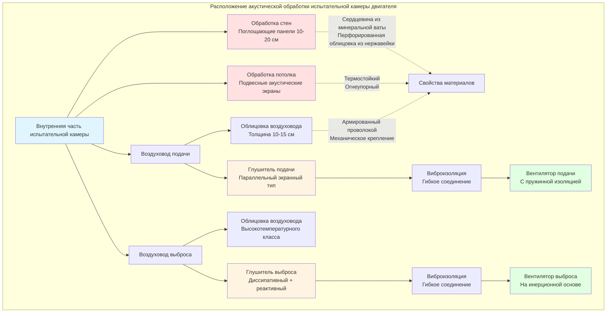

Испытательные камеры двигателей создают экстремальные уровни звукового давления, превышающие 120 дBA при полной мощности испытаний. Надлежащая акустическая обработка защищает как точность испытательного оборудования, так и безопасность персонала, сохраняя при этом контролируемые условия окружающей среды, необходимые для точных измерений производительности.

## Звукопоглощающая обработка стен и потолков

Звукопоглощающая обработка снижает реверберацию в испытательной камере, предотвращая попадание отраженной звуковой энергии на приборы и создание опасных условий шума. Эффективный коэффициент поглощения $\alpha_{eff}$ для многослойной системы определяется по формуле:

$$\alpha_{eff} = 1 - \left(1 - \alpha_1\right)\left(1 - \alpha_2\right)\left(1 - \alpha_3\right)$$

где $\alpha_1$, $\alpha_2$ и $\alpha_3$ представляют коэффициенты поглощения отдельных слоев.

Конструкции стен обычно состоят из перфорированных металлических облицовок над сердцевинами из стекловолокна или минеральной ваты толщиной от 10 до 20 см. Процент открытой площади перфорированных облицовок напрямую влияет на эффективность поглощения:

$$\alpha = \frac{4r}{(1+r)^2}$$

где $r$ — отношение акустического сопротивления, связанное с процентом открытой площади и глубиной воздушного зазора.

Обработка потолков требует особого внимания из-за излучаемого двигателем тепла. Подвесные акустические экраны или облака, расположенные на 45–90 см ниже конструктивного потолка, обеспечивают поглощение звука, позволяя одновременно происходить тепловой стратификации. Такая конфигурация поддерживает акустическую производительность без термической деградации материалов.

## Облицовка воздуховодов и глушители

Системы HVAC, обслуживающие испытательные камеры, требуют агрессивной акустической обработки для предотвращения передачи звука через воздуховоды подачи и выброса. Внутренняя облицовка воздуховода обеспечивает затухание 3–8 дB на метр в зависимости от частоты и размеров воздуховода.

Вносимая потеря звука $IL$ для облицованных прямоугольных воздуховодов определяется по формуле:

$$IL = 1.05 \cdot P \cdot \alpha \cdot \frac{L}{A} \text{ (дB)}$$

где $P$ — периметр (м), $\alpha$ — коэффициент поглощения облицовки, $L$ — длина облицованного участка (м), $A$ — площадь поперечного сечения (м²).

Диссипативные глушители, установленные в основных линиях подачи и выброса, обеспечивают вносимую потерю 15–40 дB в критических диапазонах частот. Параллельные экранные глушители с проходными каналами 10–15 см обеспечивают баланс между акустической производительностью и приемлемым перепадом давления, обычно 25–38 Па при расчетном расходе воздуха.

Реактивные глушители с использованием расширительных камер и резонаторов устраняют низкочастотные компоненты шума ниже 250 Гц, где звукопоглощающие материалы теряют эффективность. Потеря передачи $TL$ для расширительной камеры определяется по формуле:

$$TL = 10 \log_{10}\left[1 + \frac{1}{4}\left(\frac{S_2}{S_1} - \frac{S_1}{S_2}\right)^2 \sin^2(kL)\right]$$

где $S_1$ и $S_2$ — входное и внутреннее сечения камеры, $k$ — волновое число, $L$ — длина камеры.

## Виброизоляция оборудования HVAC

Все оборудование HVAC, обслуживающее испытательные камеры, требует виброизоляции для предотвращения передачи структурного шума. Вентиляторы подачи и выброса, установленные на инерционные основания с пружинными или эластомерными изоляторами, достигают эффективности изоляции 90–95 %.

Требуемая эффективность изоляции $\eta$ определяется по формуле:

$$\eta = 1 - \left(\frac{f_n}{f_d}\right)^2$$

где $f_n$ — собственная частота изолированной системы, $f_d$ — возмущающая частота. Системы изоляции должны обеспечивать $f_d/f_n > 3$ для надлежащей производительности.

Гибкие воздуховодные соединения на всех интерфейсах оборудования предотвращают короткое замыкание виброизоляции. Соединения должны обеспечивать прогиб в 1,5–2 раза больше ожидаемого диапазона и поддерживать герметичные уплотнения при динамических нагрузках.

## Выбор материалов для высокотемпературных сред

Испытательные камеры испытывают повышенные температуры из-за отвода тепла от двигателя и выхлопных газов. Акустические материалы должны сохранять производительность и структурную целостность в этих условиях.

Минеральная вата, рассчитанная на постоянное воздействие температур до 649°C, обслуживает зоны с высокой температурой рядом с выхлопными системами. Материалы из стекловолокна выдерживают умеренные температуры до 232°C для общей обработки камеры. Металлические облицовки должны быть из нержавеющей стали или алюминия для устойчивости к термическому циклированию и коррозии от продуктов сгорания.

Изменение коэффициента поглощения в зависимости от температуры происходит по формуле:

$$\alpha_T = \alpha_0 \left(1 + \beta \Delta T\right)$$

где $\alpha_0$ — базовый коэффициент, $\beta$ — температурный коэффициент (обычно −0,002 до −0,005 на °C), $\Delta T$ — повышение температуры выше эталонных условий.

## Огнеупорные акустические материалы

Испытательные камеры требуют огнестойкого строительства из-за наличия топлива и высокотемпературной работы. Все акустические материалы должны соответствовать требованиям ASTM E84 класса A с индексом распространения пламени менее 25 и индексом образования дыма менее 50.

Некомбустибельные материалы с сердцевиной из минеральной ваты по природе удовлетворяют требованиям пожарной безопасности. Металлические облицовки обеспечивают дополнительную огнестойкость при сохранении акустической прозрачности через перфорацию. Клеи и механические крепежи также должны иметь соответствующие рейтинги огнестойкости.

Системы огнеупорной облицовки воздуховодов используют армированную проволокой минеральную вату, закрепленную механическим крепежом, а не клеем. Такая конструкция выдерживает тепловой удар при пожаре без выброса материалов в воздушные потоки.

## Техническое обслуживание и замена

Акустическая обработка в испытательных камерах деградирует из-за термического циклирования, воздействия вибрации и загрязнения от выбросов двигателя. Интервалы проверки 6–12 месяцев выявляют деградацию материала до того, как производительность пострадает.

Общие режимы отказа включают:

- **Засорение перфорации облицовки** масляным туманом и накоплением частиц, снижающее поглощение
- **Сжатие изоляции** от повторяющихся циклов теплового расширения, уменьшающее эффективную толщину
- **Коррозия крепежа**, приводящая к провисанию или отсоединению материала
- **Эрозия облицовки воздуховода** при высоких скоростях, обнажающая голые металлические поверхности

Модульная конструкция панелей облегчает замену поврежденных участков без полной переделки системы. Люки доступа, стратегически расположенные, позволяют проводить проверку и обслуживание скрытой облицовки воздуховодов.

Графики замены материалов зависят от интенсивности эксплуатации: объекты с высокой интенсивностью использования требуют обновления каждые 3–5 лет, в то время как камеры с умеренным использованием могут продлить срок службы до 7–10 лет.

## Свойства акустических материалов

| Тип материала | NRC | Предел температуры (°C) | Плотность (кг/м³) | Рейтинг огнестойкости | Типовое применение |
|---------------|-----|------------------------|------------------|-------------|---------------------|
| Плита из минеральной ваты | 0,85–0,95 | 649 | 64–128 | Класс A | Панели стен/потолков, зоны высоких температур |
| Плита из стекловолокна | 0,80–0,90 | 232 | 48–96 | Класс A | Панели стен/потолков, умеренные зоны |
| Перфорированный металл (15 % открытого) | 0,65–0,75 | 1093+ | N/A | Некомбустибельный | Материал облицовки |
| Минеральная вата армированная проволокой | 0,75–0,85 | 649 | 96–160 | Класс A | Облицовка воздуховода |
| Акустический поролак (меламин) | 0,90–1,00 | 149 | 11–19 | Класс A | Приложения с низкой температурой только |
| Облицовка воздуховода из стекловолокна | 0,70–0,80 | 232 | 24–48 | Класс A | Стандартная воздуховодная сеть |
| Керамическое волокнистое одеяло | 0,60–0,70 | 1260 | 64–128 | Некомбустибельный | Экстремальный высокотемпературный выброс |

**Примечание:** NRC (коэффициент снижения шума) является среднеарифметическим значением коэффициентов поглощения на частотах 250, 500, 1000 и 2000 Гц.

Комбинация надлежащей разработанной звукопоглощающей обработки, эффективных глушителей в воздуховодах и комплексной виброизоляции создает среды в испытательных камерах, отвечающие как требованиям акустической производительности, так и требованиям операционной долговечности. Выбор материалов с акцентом на огнестойкость и устойчивость к температуре обеспечивает долгосрочную надежность в этих суровых условиях эксплуатации.
