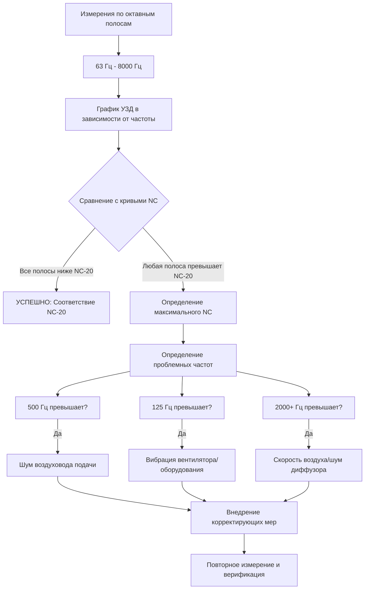

## Стандарты критериев шума

Испытательные стенды двигателей требуют строгого контроля фонового шума для обеспечения точного измерения акустических характеристик двигателя. HVAC системы должны соответствовать определенным рейтингам критериев шума (NC) для предотвращения помех прецизионному испытательному оборудованию и обеспечения достоверности измерений.

### Основы системы рейтинга NC

Система рейтинга NC оценивает шум, генерируемый HVAC, в октавных полосах от 63 Гц до 8000 Гц. Рейтинг соответствует наивысшей кривой октавной полосы, которую уровень измеренного звукового давления достигает или превышает.

Соотношение между рейтингом NC и уровнем звукового давления в октавной полосе следует формуле:

$$SPL_{NC} = NC + K_f$$

где $K_f$ — зависящий от частоты коэффициент из стандартизированных кривых NC, а $SPL_{NC}$ представляет максимально допустимый уровень звукового давления на каждой центральной частоте октавной полосы.

Для расчета составных рейтингов NC:

$$NC_{composite} = 10 \log_{10} \left( \sum_{i=1}^{n} 10^{NC_i/10} \right)$$

где $NC_i$ представляет индивидуальные вклады NC по октавным полосам.

## Целевые рейтинги NC по зонам

Различные зоны в испытательных стендах двигателей требуют конкретных акустических условий:

| Тип зоны | Целевой рейтинг NC | Максимальный NC | Критические частоты |
|-----------|-----------------|------------|---------------------|
| Прецизионные испытательные камеры | NC-15 | NC-20 | 125-500 Гц |
| Стандартные испытательные камеры | NC-20 | NC-25 | 125-1000 Гц |
| Комнаты управления | NC-25 | NC-30 | 250-2000 Гц |
| Комнаты сбора данных | NC-20 | NC-25 | 125-1000 Гц |
| Калибровка приборов | NC-15 | NC-18 | 63-4000 Гц |
| Зоны наблюдения | NC-30 | NC-35 | 500-2000 Гц |
| Машинные отделения | NC-50 | NC-55 | Все полосы |

### Требования к комнатам управления

Комнаты управления требуют NC-25 или лучше для обеспечения:

- Четкой словесной коммуникации во время испытаний
- Точного мониторинга систем обратной связи по звуку
- Минимальной утомляемости оператора во время длительных сеансов испытаний
- Надежной интерпретации данных без акустических помех

Целевой спектр обеспечивает:

$$SPL_{500Hz} \leq NC + 5 \text{ дБ}$$
$$SPL_{1000Hz} \leq NC + 2 \text{ дБ}$$

Эти соотношения приоритизируют ясность речевых частот.

## Требования анализа по октавным полосам

Комплексная акустическая верификация требует измерений по октавным полосам на центральных частотах: 63, 125, 250, 500, 1000, 2000, 4000 и 8000 Гц.

### Протокол измерения

**Пространственная выборка:**
- Минимум 5 позиций измерения на испытательную камеру
- Расстояние между точками не превышающее 3 метра
- Высоты на уровне 1,2 м (сидячее положение) и 1,5 м (стоячее положение)
- Исключить позиции в пределах 1 м от отражающих поверхностей

**Временная выборка:**
- Минимум 30 секунд интегрирования на одну позицию
- Быстрое взвешивание по времени (125 мс) для идентификации оборудования
- Медленное взвешивание по времени (1 с) для верификации соответствия NC

**Фоновые условия:**
- Все испытательное оборудование отключено
- HVAC системы работают при нормальном расходе воздуха
- Внешние двери закрыты и герметизированы
- Никакого персонала в испытательной камере во время измерения

### Методология анализа

Расчет уровня звукового давления по октавной полосе:

$$SPL_{octave} = 10 \log_{10} \left( \frac{1}{T} \int_0^T \left(\frac{p(t)}{p_{ref}}\right)^2 dt \right)$$

где $p_{ref} = 20 \times 10^{-6}$ Па, а $T$ — период интегрирования.

## Спецификации шума оборудования HVAC

### Системы подачи воздуха

**Блоки обработки воздуха:**
- Излучаемый шум корпуса: на 10 дБ ниже целевого NC на выпуске
- Уровень звуковой мощности вентилятора: $LW \leq 85$ дBA для помещений NC-20
- Коэффициент затухания плены: минимум 15 дБ на 500 Гц

**Спецификации воздуховодов:**
- Облицованные секции воздуховодов минимум 6 м в длину перед терминальными устройствами
- Стекловолокнистая облицовка толщиной 50 мм, плотностью 48 кг/м³
- Максимальная скорость воздуха: 4 м/с в последних 10 м перед испытательной камерой
- Потери при вставке акустической облицовки:

$$IL_{duct} = \alpha L_{eff} P/A$$

где $\alpha$ — коэффициент поглощения, $L_{eff}$ — эффективная длина, $P$ — периметр, $A$ — площадь поперечного сечения.

**Терминальные устройства:**
- Диффузоры рассчитаны на NC-20 при 150 % рабочего расхода воздуха
- Заслонки расположены минимум 3 м перед диффузорами
- Отсутствие объемных заслонок в последних 5 м воздуховода

### Системы выпуска

Максимальные уровни звуковой мощности на решетках выпуска испытательной камеры:

$$LW_{grille} \leq NC_{target} + 10 \log_{10}(A) - 10$$

где $A$ — площадь пола испытательной камеры в квадратных метрах.

## Требования к фоновому шуму для испытаний

Испытание акустики двигателя требует фонового шума как минимум на 10 дБ ниже минимальных ожидаемых уровней шума двигателя:

$$\Delta L_{min} = L_{engine,min} - L_{background} \geq 10 \text{ дБ}$$

Для прецизионных измерений:
- Низкочастотные испытания (< 250 Гц): разделение 15 дБ
- Среднечастотные испытания (250-2000 Гц): разделение 10 дБ
- Высокочастотные испытания (> 2000 Гц): разделение 8 дБ

## Методы измерения и верификации

### Требования к приборам

**Шумомеры:**
- Тип 1 прецизионный согласно IEC 61672-1
- Диапазон частот: 20 Гц до 20 кГц (±1 дБ)
- Динамический диапазон: минимум 80 дБ
- Калибровка не позже 12 месяцев

**Микрофоны:**
- Отклик в свободном поле, диаметр 12,7 мм
- Чувствительность: 50 мВ/Па типичная
- Полевая калибровка до и после измерений с использованием класса 1 акустического калибратора (1000 Гц, 94 дБ или 114 дБ)

### Протокол верификации

1. **Предварительная базовая линия:** Измерение с завершением строительства, HVAC неактивна
2. **Вклад HVAC:** Измерение с системами при расчетном расходе, без работы двигателя
3. **Соответствие по октавным полосам:** Верификация всех полос на соответствие целевому NC
4. **Пространственная однородность:** Подтверждение вариации ±3 дБ в позициях измерения
5. **Временная стабильность:** Верификация вариации ±2 дБ в течение 24-часового периода

## Документация по соответствию

Требуемые результаты включают:

**Отчеты об измерениях:**
- Разметка стенда с сеткой измерений
- Таблицы данных по октавным полосам для каждой позиции
- Графики наложения кривых NC
- Условия работы оборудования во время испытаний
- Температура и влажность окружающей среды

**Акустический сертификат:**
- Заявление о соответствии целевым рейтингам NC
- Идентификация любых несоответствующих областей
- План корректирующих мероприятий для дефектов
- Печать и подпись профессионального инженера

**Верификация в соответствии с чертежами:**
- Подтверждение установленной облицовки воздуховода
- Модель диффузора и рейтинги NC
- Спецификации глушителя и расположение
- Детали виброизоляции

Надлежащая документация обеспечивает соответствие испытательного стенда договорным акустическим требованиям и предоставляет базовые данные для будущих сравнений при деградации акустических характеристик.
