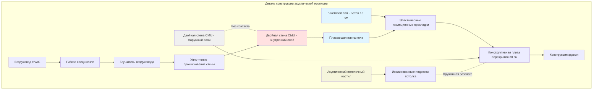

Испытательные камеры двигателей генерируют экстремальные уровни звукового давления (110-130 дBA), требующие комплексной акустической изоляции для защиты соседних пространств и соответствия нормативным ограничениям шума. Эффективная акустическая изоляция сочетает высокие потери передачи звука, развязанную конструкцию и тщательное внимание к путям боковой передачи.

## Требования STC для стен и перегородок

Sound Transmission Class (STC) — рейтинги количественно оценивают способность перегородок блокировать звук. Стены испытательной камеры двигателя обычно требуют STC 60-70 в зависимости от требований соседних пространств и уровней исходного шума.

Потеря передачи звука на определённой частоте следует соотношению:

$$TL = 20 \log_{10}(m \cdot f) - 47$$

где $m$ — поверхностная масса (кг/м²) и $f$ — частота (Гц). Это соотношение закона массы демонстрирует, что удвоение массы стены увеличивает потери передачи примерно на 6 дB.

Для многослойных конструкций с воздушным зазором теоретическая потеря передачи звука становится:

$$TL_{total} = TL_1 + TL_2 + 20 \log_{10}(d \cdot f) - 29$$

где $TL_1$ и $TL_2$ — потери передачи отдельных слоёв и $d$ — глубина полости (м).

### Таблица производительности конструкций

| Тип конструкции | Рейтинг STC | Типичное применение |
|------------------|------------|-------------------|
| Блоки CMU 20 см, окрашенные | 48 | Испытательные камеры низкой мощности |
| Блоки CMU 30 см, заполненные сердцевины | 55 | Камеры средней мощности |
| Двойные блоки CMU 20 см, зазор 10 см | 65 | Камеры для двигателей высокой мощности |
| Двойные блоки CMU 15 см + упругая развязка | 70 | Источники экстремального шума |
| Бетон 20 см + CMU 15 см, зазор 15 см | 72 | Максимальная изоляция |
| Трёхслойная конструкция | 75+ | Научные учреждения |

Критические детали конструкции:
- **Масса**: минимальная поверхностная масса 3.6 кг/м² для первичного барьера
- **Развязка**: отдельные конструктивные каркасы для каждого слоя двойных стен
- **Поглощение в полости**: 7.6-15 см минеральных волокнистых матов в воздушных зазорах для контроля резонанса
- **Целостность уплотнения**: акустический герметик на всех проходах и соединениях

## Акустическое уплотнение проходов воздуховодов

Воздуховоды HVAC создают наиболее значительный путь боковой передачи при ненадлежащей изоляции. Звук проникает тремя способами: прорыв через стенку воздуховода, передача звука в воздуховоде и утечка проникновения.

### Стратегия обработки проникновений

1. **Толщина стенки воздуховода**: минимум калибр 16 (1.5 мм) стали для первых 3 м от камеры
2. **Оборачивание с изоляцией**: минимум 5 см винила с массой, нагруженной (1 кг/м²), обёрнутого вокруг воздуховода
3. **Гильза проникновения**: стальная гильза на 15 см больше воздуховода, заполненная акустическим герметиком
4. **Гибкие соединения**: соединения из неопрена или стекловолоконной ткани с обеих сторон стены
5. **Внутренние глушители**: диссипативные или реактивные глушители в пределах 1.5 м от проникновения

Вставочная потеря, требуемая для глушителей воздуховода:

$$IL_{required} = NR_{wall} - TL_{duct} + 10 \log_{10}(S_{duct}/S_{wall})$$

где $NR_{wall}$ — снижение шума стены, $TL_{duct}$ — потеря передачи воздуховода и $S$ представляют площади поверхности.

## Акустическая изоляция дверей и окон

Двери доступа представляют слабые точки в акустическом барьере. Звуконепроницаемые дверные блоки должны соответствовать или превышать рейтинги STC стены.

**Требования к конструкции двери:**
- **Сердцевина**: монолитная сердцевина с внутренним демпфированием (сотовая структура + свинцовый лист)
- **Уплотнения**: непрерывные периферийные уплотнения сжатия (выпуклые или магнитные)
- **Порог**: автоматический опускающийся уплотнитель или пружинный щёток
- **Фурнитура**: существенная защёлка с 8+ точками зацепления
- **Масса**: минимальная поверхностная плотность 190 кг/м²

Двойные звуконепроницаемые двери обеспечивают превосходную изоляцию:
- Две двери STC-50, разделённые вестибюлем 1.2-1.8 м, достигают эффективного STC 65-70
- Стены вестибюля совпадают с конструкцией испытательной камеры
- Блокировка предотвращает одновременное открывание дверей во время тестирования
- Внутренние поверхности обработаны 5 см акустического поглощения

**Окна для наблюдения** требуют:
- Конструкция из ламинированного стекла: два стекла 1.3 см закалённого стекла + слой PVB 0.15 см
- Различные толщины стёкол (например, 1.3 см + 1 см) для избежания резонанса
- Минимальный зазор воздуха 10 см между стёклами
- Упругое крепление в раме с акустическим герметиком
- Достижимый STC 48-52 для двойного стекла, до STC 60 для тройного стекла

## Концепции дизайна плавающего пола

Передача структурной вибрации требует систем массово-пружинной изоляции для предотвращения связи между испытательной камерой и конструкцией здания.

### Параметры дизайна плавающего пола

Собственная частота изолированной напольной системы:

$$f_n = \frac{1}{2\pi}\sqrt{\frac{k}{m}}$$

где $k$ — жёсткость пружины (Н/м) и $m$ — поддерживаемая масса (кг). Целевая собственная частота: 8-12 Гц для испытательных камер двигателей.

Эффективность изоляции на рабочих частотах:

$$Efficiency = 1 - \left(\frac{f_n}{f}\right)^2$$

где $f$ — возмущающая частота. Собственная частота 10 Гц обеспечивает эффективность изоляции 96% на 50 Гц.

**Слои конструкции (снизу вверх):**
1. Конструктивная плита здания (эталонный уровень)
2. Эластомерные прокладки (плотность 0.10-0.15 см прогиба под нагрузкой)
3. Плавающая армированная бетонная плита (30-45 см толщиной, 732-1098 кг/м²)
4. Упругая подложка (0.6 см пробки или резины)
5. Чистовой пол (эпоксидное покрытие или стальная пластина)

**Критические детали:**
- Полная периферийная изоляционная щель (2.5-5 см минимум)
- Нет жёстких соединений между плавающей и конструктивной плитами
- Упругие закрывающие полосы на щели, заполненные акустическим герметиком
- Изолированные водостоки и проходы коммуникаций

## Предотвращение передачи структурного звука

Помимо изоляции пола, все конструктивные соединения требуют развязки:

**Соединения стены с конструкцией:**
- Упругие зажимы или каналы, поддерживающие внутренний слой двойной стены
- Неопреновые опорные прокладки под основанием стены
- Отсутствие прямых связей между слоями, кроме упругих соединителей через каждые 1.8 м

**Изоляция потолка:**
- Пружинные подвески (3.8-5 см прогиба), поддерживающие акустический потолок
- Развязка от стен испытательной камеры с 2.5 см периферийной щелью
- Внутреннее распорочение независимое от системы потолка

**Крепление оборудования:**
- Инерционные основания на изоляционных креплениях (отдельно от напольной системы)
- Гибкие соединения для всех коммуникаций
- Отсутствие жёстких трубопроводов в пределах 6 м от изолированных конструкций

## Требования к шуму в соседних пространствах

Целевые уровни шума в пространствах, окружающих испытательные камеры двигателей, зависят от использования и функции:

| Тип соседнего пространства | Уровень проектирования (NC) | Уровень проектирования (дBA) |
|--------------------|-------------------|-------------------|
| Офисы | NC 35-40 | 40-45 |
| Комнаты управления | NC 30-35 | 35-40 |
| Лаборатории | NC 40-45 | 45-50 |
| Коридоры | NC 45-50 | 50-55 |
| Механические помещения | NC 50-55 | 55-60 |
| Граница владения (внешняя) | -- | 55-65 (дневное время) |

Требуемое снижение шума стены:

$$NR = SPL_{source} - SPL_{receiver} + 10 \log_{10}(S/A)$$

где $SPL_{source}$ — уровень звукового давления испытательной камеры, $SPL_{receiver}$ — приемлемый уровень приёмника, $S$ — площадь стены (м²) и $A$ — поглощение в помещении приёмника (м² сабин).

Для испытательной камеры на уровне 120 дBA с соседним офисом, требующим 40 dBA:
- Требуемый NR = 120 - 40 + 10 log(S/A) ≈ 80 + коэффициент коррекции
- Типичная коррекция: +5 до +15 дB в зависимости от геометрии
- Целевой показатель проектирования: минимум STC 65-70

Проверка путём акустического тестирования подтверждает производительность изоляции перед запуском высокомощных испытаний двигателя.
