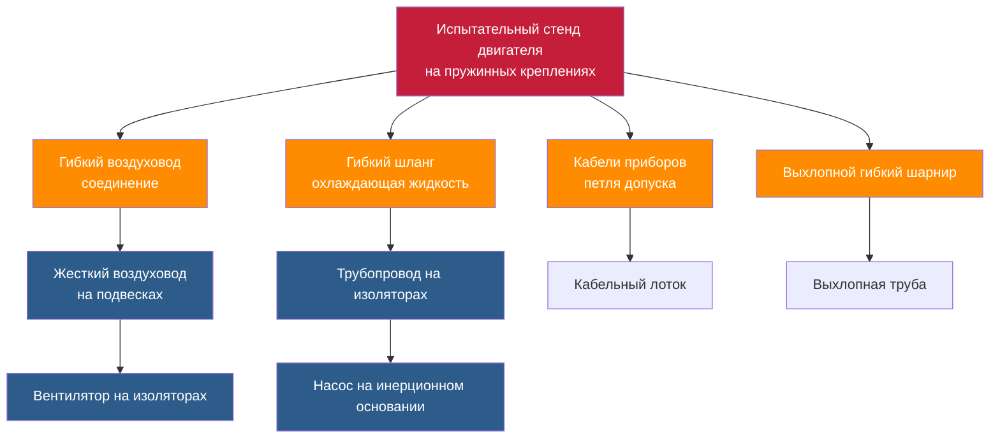

Виброизоляция в установках для испытания двигателей предотвращает воздействие колебаний, генерируемых при испытаниях, на точность измерений и целостность конструкции, защищая чувствительное оборудование. Испытание двигателей создает интенсивные циклические нагрузки от процессов горения, дисбаланса вращающихся элементов и работы динамометра, требующие надежной изоляции для поддержания точности измерений и защиты прилегающих зон.

## Источники вибрации при испытании двигателей

Установки для испытания двигателей генерируют несколько источников вибрации, действующих одновременно в широком частотном диапазоне. Понимание этих источников определяет проектирование системы изоляции.

### Основные генераторы вибрации

**Силы сгорания** создают доминирующее возбуждение при испытаниях работающего двигателя. События воспламенения в цилиндрах генерируют импульсивные силы на частотах, определяемых скоростью двигателя и его конструкцией:

$$f_{firing} = \frac{N \times RPM}{60 \times 2}$$

Где:
- $f_{firing}$ = частота вспышек (Гц)
- $N$ = количество цилиндров
- $RPM$ = частота вращения двигателя (обороты в минуту)
- Деление на 2 учитывает четырёхтактный цикл

Шестицилиндровый двигатель при 3000 об/мин производит импульсы воспламенения на частоте 150 Гц с гармониками, распространяющимися до 600 Гц и выше.

**Дисбаланс вращающихся элементов** коленчатого вала, маховиков и ротора динамометра генерирует синусоидальные силы на частоте вращения. Даже прецизионно отбалансированные компоненты создают остаточный дисбаланс, производящий силы, пропорциональные квадрату угловой скорости:

$$F_{imbalance} = m \times e \times \omega^2$$

Где:
- $F_{imbalance}$ = дисбалансная сила (Н)
- $m$ = дисбалансная масса (кг)
- $e$ = эксцентриситет (м)
- $\omega$ = угловая скорость (рад/с)

**Работа динамометра** вводит дополнительную вибрацию от электромагнитных сил в блоках вихревых токов, пульсаций давления в гидротормозах и зацепления зубьев в механических поглотителях. AC динамометры генерируют пульсацию крутящего момента с удвоенной частотой сети (100 Гц или 120 Гц), наложенную на компоненты испытательной частоты.

### Вторичные источники

Оборудование HVAC, обслуживающее испытательные камеры, создает фоновую вибрацию, которая может влиять на измерения. Вентиляционные вентиляторы, насосы охлаждения и компрессоры, работающие при 900-3600 об/мин, производят вибрацию в диапазоне 15-60 Гц, требующую изоляции от конструкций испытательной камеры.

## Влияние на точность измерения

Загрязнение вибрацией снижает точность измерений через несколько механизмов, влияющих на данные как установившихся, так и переходных испытаний.

### Помехи в измерениях

**Системы измерения крутящего момента** с использованием тензометрических датчиков нагрузки обнаруживают вибрацию как паразитные сигналы, наложенные на истинный крутящий момент. Вибрация пола, передаваемая через крепления динамометра, выглядит как колебания крутящего момента, особенно проблематичная при низконагруженных испытаниях, когда соотношение сигнал-шум падает.

**Отбор проб выбросов** требует стабильного позиционирования зонда в потоке выхлопных газов. Вибрация вызывает движение зонда относительно картины потока, производя колеблющиеся концентрации образца, которые увеличивают неопределенность измерения. Нормы устанавливают максимальное смещение зонда для обеспечения репрезентативного отбора проб.

**Датчики давления**, измеряющие давление в цилиндре, давление во впускном коллекторе и противодавление выхлопа, проявляют чувствительность к ускорению. Установка датчиков на вибрирующих поверхностях индуцирует пьезоэлектрические или деформационные сигналы, неотличимые от колебаний давления.

**Измерение расхода** точность снижается, когда вибрация вызывает завышение показаний турбинных счетчиков, нарушение регулярности отрыва вихрей или генерирование ложных сдвигов фазы в счетчиках Кориолиса. Спецификации производителя обычно ограничивают вибрацию при установке 0,5 g RMS.

### Частотно-зависимая чувствительность

Системы измерения проявляют максимальную чувствительность, когда частоты вибрации совпадают с резонансами датчиков, обычно в диапазоне 100-1000 Гц для промышленных датчиков. Системы изоляции должны обеспечивать ослабление 20-30 дБ на этих критических частотах для поддержания установленной точности.

## Принципы проектирования систем изоляции

Изоляция испытательной камеры двигателя требует многоуровневого подхода, охватывающего различные частотные диапазоны и защищающего как точность измерений, так и целостность конструкции.

### Изоляция испытательного стенда

Основной уровень изоляции поддерживает узел двигатель-динамометр на упругих креплениях, которые развязывают массу испытательного стенда от конструкции пола. Задачи проектирования включают:

**Выбор собственной частоты** размещает резонанс системы значительно ниже рабочих частот. Для двигателей, работающих 1000-6000 об/мин (17-100 Гц), собственная частота должна оставаться ниже 5 Гц:

$$f_n = \frac{1}{2\pi} \sqrt{\frac{k}{m}} < 5 \text{ Гц}$$

Это требует статического прогиба, превышающего 10 мм:

$$\delta = \frac{g}{(2\pi f_n)^2} = \frac{9.81}{(2\pi \times 5)^2} \approx 10 \text{ мм}$$

**Проектирование инерционного основания** обеспечивает жесткое крепление двигателя и динамометра при концентрации массы на плоскости изоляции. Армированные бетонные основания толщиной 300-600 мм обеспечивают, чтобы узел двигатель-основание действовал как жесткое тело ниже 50 Гц, предотвращая внутренние изгибные режимы, которые нарушают изоляцию.

### Многоуровневая изоляция

Комбинирование элементов изоляции нацелено на различные частотные диапазоны:

- **Первичный уровень**: стальные пружины (25-50 мм прогиб) изолируют 10-100 Гц от частоты вспышек и дисбаланса
- **Вторичный уровень**: эластомерные прокладки под инерционным основанием ослабляют 100-500 Гц от механических ударов
- **Третичная изоляция**: индивидуальное крепление датчиков на демпфированные массы снижают 200-2000 Гц структурного шума

### Проектирование фундамента

Фундаменты испытательной камеры требуют изоляции от строительной конструкции для предотвращения передачи вибрации в прилегающие пространства. Подходы включают:

**Разделенные плиты**: пол испытательной камеры сооружен на независимых фундаментах, разделенных 50-100 мм изоляционными швами, заполненными упругим материалом. Это архитектурное разделение предотвращает низкочастотную передачу через непрерывные бетонные пути.

**Плавающие полы**: весь пол испытательной камеры поддерживается пружинами или пневматическими опорами, создавая массо-пружинную систему с собственной частотой 3-8 Гц. Общая масса пола 50 000-200 000 кг обеспечивает достаточную инерцию для стабильности при нагрузках испытания при достижении коэффициентов изоляции, превышающих 10:1 выше 15 Гц.

## Рассмотрение собственной частоты

Правильный выбор собственной частоты балансирует эффективность изоляции против стабильности системы и поддерживает адекватное разделение от частот возбуждения.

### Требования к частотному соотношению

Теория передачи вибрации показывает, что изоляция начинается, когда частота возмущения превышает $\sqrt{2}$ раз собственную частоту (частотное соотношение > 1,414). Практическая изоляция требует более высоких соотношений:

| Частотное соотношение | Передача вибрации | Эффективность изоляции |
|-----------------|------------------|---------------------|
| 1,5 | 0,92 | 8% |
| 2,0 | 0,50 | 50% |
| 3,0 | 0,14 | 86% |
| 4,0 | 0,07 | 93% |
| 5,0 | 0,04 | 96% |
| 10,0 | 0,01 | 99% |

Установки испытания двигателей, нацеленные на 90% эффективность изоляции, требуют частотных соотношений, превышающих 3,0, размещая собственную частоту на одну треть от самой низкой рабочей скорости или ниже.

### Многомерный анализ

Изоляция испытательного стенда функционирует как система с шестью степенями свободы с различными собственными частотами для вертикального, горизонтального и ротационных режимов. Полный анализ требует:

$$\omega_{vertical} = \sqrt{\frac{k_v}{m}}$$

$$\omega_{rocking} = \sqrt{\frac{k_v \times d^2 + k_h \times h^2}{I}}$$

Где:
- $k_v$, $k_h$ = жесткость по вертикали и горизонтали (Н/м)
- $d$ = расстояние между изоляторами
- $h$ = высота центра тяжести
- $I$ = момент инерции массы (кг⋅м²)

Правильное размещение изолятора обеспечивает, чтобы все собственные частоты оставались ниже одной трети минимальной частоты возбуждения.

## Требования к передаче вибрации

Критерии вибрации испытательного сооружения устанавливают максимально допустимые уровни вибрации в прилегающих пространствах и в местах измерения.

### Критерии испытательной камеры

| Местоположение | Скорость (мм/с RMS) | Смещение (мкм) | Диапазон частот |
|----------|---------------------|-------------------|-----------------|
| Испытательный стенд (на основании) | 5,0-10,0 | 50-100 | 10-1000 Гц |
| Пол камеры | 0,5-1,0 | 5-10 | 10-1000 Гц |
| Соседний офис | 0,15-0,30 | 2-5 | 8-100 Гц |
| Прецизионная лаборатория | 0,05-0,10 | 0,5-1,0 | 5-500 Гц |

### Методология расчета

Требуемая передача вибрации определяется из вибрации источника и допустимой вибрации приемника:

$$T_{required} = \frac{V_{allowable}}{V_{source}}$$

Для испытательного стенда, генерирующего 8,0 мм/с, и предела соседнего офиса 0,2 мм/с:

$$T_{required} = \frac{0.2}{8.0} = 0.025 \text{ (97,5% изоляция)}$$

Достижение этой передачи требует частотного соотношения:

$$\frac{f}{f_n} = \sqrt{\frac{1}{T} + 1} = \sqrt{\frac{1}{0.025} + 1} \approx 6.4$$

## Интеграция с системами HVAC

Системы HVAC, обслуживающие испытательные камеры, требуют осторожной интеграции для предотвращения создания путей передачи вибрации, которые обходят изоляцию испытательного стенда.

### Гибкие соединения

Все сервисы, подключающиеся к изолированным испытательным стендам, требуют гибких элементов, которые допускают движение без передачи вибрации:

**Соединения воздуховодов** используют тканевые расширительные шарниры (300-600 мм длина) с минимальной амплитудой 25 мм. Конструкция из холста или неопреном покрытого стекловолокна обеспечивает гибкость при сохранении герметичности воздуха. Шарниры должны поддерживать вес воздуховода без ограничения движения.

**Соединения трубопроводов** используют гибкие шланги, металлические мехи или резиновые расширительные шарниры в зависимости от давления и температуры. Системы охлаждения двигателя, работающие при 90°C и 350 кПа, используют EPDM шланги с нержавеющей стальной оплеткой, минимум 500 мм длины для адекватной гибкости.

**Электрические сервисы** требуют петель допуска, обеспечивающих 150-200 мм свободного хода. Кабельные трубки защищают проводники во время движения, предотвращая натяжение на клеммах.

### Изоляция оборудования HVAC

Вентиляционные вентиляторы, насосы и компрессоры, обслуживающие испытательные камеры, требуют изоляции, предотвращающей загрязнение окружающей среды измерения:

- Вентиляторы подачи/вытяжки: пружинные изоляторы, минимум 25 мм прогиб
- Насосы охлаждения: инерционные основания с пружинными креплениями
- Воздушные компрессоры: отдельный фундамент с конструктивным разрывом
- Воздуховоды: изолированные подвески с интервалом 2-3 м
- Трубопроводы: изоляция стояков и гибкие ответвления

### Защита приборостроения

Оборудование измерения, установленное отдельно от испытательного стенда, выигрывает от дополнительной изоляции:

- Системы сбора данных: шкафы, установленные на амортизирующие крепления
- Анализаторы выбросов: размещенные на скамье с виброподушками
- Оборудование кондиционирования: изолированные стойки оборудования
- Панели управления: крепленные к стене с упругими прокладками

Надлежащая виброизоляция преобразует установки испытания двигателей из загрязненных вибрацией сред в прецизионные лаборатории измерений, способные разрешать изменения мощности в доли лошадиных сил и вариации выбросов в миллионные доли. Многоуровневая изоляция, охватывающая различные частотные диапазоны, в сочетании с тщательным вниманием к устранению жестких путей передачи, обеспечивает точность измерения, требуемую современной разработкой двигателей и сертификационными испытаниями.
