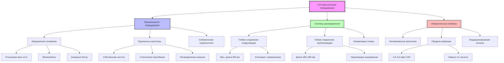

Изоляция оборудования в испытательных камерах для двигателей защищает системы HVAC от вибраций, генерируемых двигателем, одновременно предотвращая передачу вибраций от оборудования HVAC на испытательное оборудование. Правильная изоляция обеспечивает точность измерений, продлевает срок службы оборудования и гарантирует надежность данных испытаний.

## Виброизоляция оборудования HVAC

Оборудование HVAC, обслуживающее испытательные камеры двигателей, должно быть изолировано как от вибраций строительных конструкций, так и от собственных механических вибраций.

### Изоляция вентиляторов и воздуходувок

Приточные и вытяжные вентиляторы должны быть установлены на системы изоляции, подобранные в соответствии с их рабочими характеристиками:

**Требования к собственной частоте:**

$$f_n = \frac{1}{2\pi}\sqrt{\frac{k}{m}}$$

где $f_n$ — собственная частота (Гц), $k$ — жесткость пружины (Н/м), $m$ — опирающаяся масса (кг).

**Эффективность изоляции:**

$$\eta = 1 - \frac{1}{1 + \left(\frac{f}{f_n}\right)^2}$$

где $f$ — частота возмущения, $f_n$ — собственная частота изолятора. Для достижения эффективности изоляции 95% отношение частот $f/f_n$ должно превышать 4,5.

### Изоляция насосов

Насосы охлаждающей воды, насосы хладагента и гидравлические насосы требуют тщательной изоляции:

- Насосы с прямым приводом: изоляторы из неопренового мата или пружинные крепления
- Насосы на основании: инерционное основание с пружинными изоляторами
- Высокоскоростные насосы: эффективность изоляции >98% при рабочей частоте
- Осевые нагрузки: боковые ограничители без взаимодействия с системой изоляции

## Гибкие соединения для трубопроводов и воздуховодов

Гибкие соединения предотвращают передачу вибраций через системы распределения жидкости и воздуха, а также компенсируют тепловое расширение и смещение оборудования.

### Гибкие соединения воздуховодов

Тканевые или эластомерные соединители, установленные у входов оборудования:

- Длина: минимум 150 мм, предпочтительно 300 мм
- Материал: ткань с покрытием из неопрена для приложений HVAC
- Диапазон температур: в соответствии с температурой среды воздуховода
- Давление: 125% от максимального давления системы
- Установка: провисание без натяжения

**Ограничение жесткости соединителя:**

$$k_{conn} < \frac{k_{iso}}{10}$$

где $k_{conn}$ — жесткость соединителя, $k_{iso}$ — жесткость изолятора. Жесткость соединителя не должна снижать эффективность изоляции.

### Гибкие соединения трубопроводов

Шланги из нержавеющей стали с оплеткой или резиновые компенсаторы:

- Длина шланга: минимум 450–600 мм
- Радиус изгиба: >10-кратный диаметр трубы для минимизации потерь давления
- Поддержка: независимые опоры трубопровода, не подвешенные от оборудования
- Анкеры: надлежащее размещение для управления силами в системе

## Проектирование инерционных оснований для вентиляторов и насосов

Инерционные основания обеспечивают массу и жесткость для вращающегося оборудования, снижая собственную частоту системы и повышая эффективность изоляции.

### Критерии проектирования

**Минимальное отношение масс:**

$$R_m = \frac{M_{base}}{M_{equip}} \geq 1,5$$

где $M_{base}$ — масса основания, $M_{equip}$ — масса оборудования. Для тяжелого оборудования требуется $R_m \geq 2,0$.

**Жесткость основания:**

- Минимальная толщина: 150 мм для небольших вентиляторов (<5 кВт)
- Стандартная толщина: 200–300 мм для большинства оборудования HVAC
- Тяжелое оборудование: 300–450 мм для больших вентиляторов и насосов

### Методы конструкции

- Железобетон: наиболее распространен, эффективен по массе
- Стальная конструкция: изготовлена для обеспечения доступа к оборудованию
- Комбинированная: стальная конструкция с бетонным заполнением для оптимального распределения массы
- Анкерные болты: закреплены эпоксидной смолой, рассчитаны на крутящий момент и осевые силы оборудования

## Требования к изоляции динамометра

Динамометры генерируют значительные динамические силы, которые должны быть изолированы от строительной конструкции и систем HVAC.

### Проектирование системы изоляции

**Величина динамической силы:**

$$F_d = m \cdot e \cdot \omega^2$$

где $m$ — вращающаяся масса, $e$ — эксцентриситет, $\omega$ — угловая скорость (рад/с).

**Требуемое статическое прогибание:**

$$\delta_{st} = \frac{g}{\omega_n^2} = \frac{9,81}{(2\pi f_n)^2}$$

Для изоляции от работы на частоте 600 об/мин (10 Гц) с отношением частот 5:

$$\delta_{st} = \frac{9,81}{(2\pi \cdot 2)^2} = 62 \text{ мм}$$

### Рассмотрения при установке

- Отдельный фундамент: динамометр на изолированном фундаменте
- Зазоры: минимум 50 мм сейсмического зазора вокруг фундамента
- Инженерные сети: все соединения через гибкие соединители
- Выравнивание: точное крепление без предварительного напряжения изоляторов

## Изоляция измерительных приборов для обеспечения точности

Измерительные приборы требуют уровней вибрации ниже спецификаций производителя для обеспечения точности данных.

### Пределы вибрации

| Тип прибора | Максимальная вибрация | Диапазон частот |
|-----------------|-------------------|-----------------|
| Прецизионные датчики крутящего момента | 0,5 мм/с СКЗ | 10–1000 Гц |
| Датчики нагрузки | 1,0 мм/с СКЗ | 10–1000 Гц |
| Датчики давления | 2,0 мм/с СКЗ | 10–500 Гц |
| Расходомеры (турбинные) | 0,3 мм/с СКЗ | 10–1000 Гц |
| Датчики температуры (прецизионные) | 5,0 мм/с СКЗ | 10–500 Гц |

### Методы монтажа

- Независимое крепление: отдельные опоры для приборов, отделенные от вибрирующего оборудования
- Демпфирующие кронштейны: эластомерная изоляция для монтажа датчиков
- Экранированные кабели: предотвращение электрических помех от движения кабелей, вызванного вибрацией
- Кондиционирование сигнала: низкочастотная фильтрация для удаления артефактов вибрации

## Проверка эффективности изоляции

Испытания после установки подтверждают производительность системы изоляции.

### Процедуры измерения

**Измерение передачи:**

$$T = \frac{V_{transmitted}}{V_{source}}$$

где $V_{transmitted}$ — скорость вибрации в точке приема, $V_{source}$ — скорость в источнике.

**Уменьшение вносимых потерь:**

$$IL = 20 \log_{10}\left(\frac{V_{before}}{V_{after}}\right) \text{ дБ}$$

### Протокол испытания

1. **Измерение базовой линии**: вибрация в точках крепления оборудования с заблокированными или жесткими изоляторами
2. **Измерение при работе**: вибрация при активных изоляторах в нормальном режиме работы
3. **Частотный анализ**: определение резонансов и проверка отношений частот
4. **Критерии приемки**: передача <0,25 (75% изоляция) на рабочих частотах

### Требования к изоляции оборудования

| Тип оборудования | Тип изолятора | Прогибание | Эффективность | Инерционное основание |
|----------------|---------------|------------|------------|--------------|
| Центробежные вентиляторы (<5 кВт) | Неопреновые маты | 6–10 мм | >85% | Опционально |
| Центробежные вентиляторы (5–20 кВт) | Пружины | 25–40 мм | >90% | Рекомендуется |
| Центробежные вентиляторы (>20 кВт) | Пружины | 40–75 мм | >95% | Обязательно |
| Осевые вентиляторы | Пружины | 25–50 мм | >90% | Обязательно |
| Центробежные насосы (<10 кВт) | Неопрен/пружины | 10–25 мм | >85% | Опционально |
| Центробежные насосы (>10 кВт) | Пружины | 25–50 мм | >90% | Обязательно |
| Градирни | Пружины/воздух | 50–100 мм | >95% | Опционально |
| Чиллеры (поршневые) | Пружины | 50–75 мм | >95% | Обязательно |
| Чиллеры (центробежные) | Пружины/маты | 25–40 мм | >90% | Рекомендуется |

## Интеграция при проектировании

Успешная изоляция оборудования требует координации между механическими, конструктивными и приборными дисциплинами:

- **Конструкции**: проектирование фундамента для нагрузок изолированного оборудования
- **Механика**: выбор оборудования с учетом требований изоляции
- **Управление**: размещение датчиков для минимизации воздействия вибраций
- **Пусконаладка**: проверочное испытание эффективности изоляции

Правильно спроектированные системы изоляции оборудования защищают оборудование HVAC, обеспечивают точность измерений при испытаниях и гарантируют долгосрочную надежность объекта в требовательной среде испытательной камеры двигателя.
