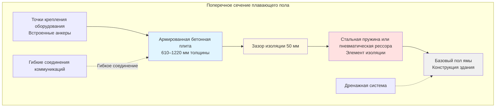

Системы изоляции полов представляют собой основу контроля вибраций на объектах испытания двигателей, предотвращая передачу динамических нагрузок от испытательного оборудования в конструкцию здания. Правильно спроектированные системы плавающего пола достигают частоты виброизоляции ниже 5 Гц при поддержке статических и динамических нагрузок, превышающих 450 кН.

## Концепции конструкции плавающего пола

Плавающий пол состоит из массивной бетонной плиты, поддерживаемой на элементах изоляции, механически развязанных от окружающей конструкции здания. Изолированная масса функционирует как инерционный блок, снижая амплитуду вибраций, передаваемых в базовую конструкцию.

Фундаментальный принцип изоляции следует:

$$T = \frac{1}{\sqrt{(\frac{f}{f_n})^2 - 1}}$$

где $T$ — передаточность, $f$ — частота вынуждающей силы, $f_n$ — собственная частота системы изоляции.

Собственная частота зависит от изолированной массы и жесткости пружины:

$$f_n = \frac{1}{2\pi}\sqrt{\frac{k}{m}}$$

Для эффективной изоляции при рабочих скоростях двигателя (1200–6000 об/мин или 20–100 Гц) собственная частота должна быть ниже 5 Гц, что требует:

$$\frac{f}{f_n} > 4.5$$

Плавающий пол должен поддерживать минимальный зазор изоляции 5 см от всех соседних конструкций, включая стены, колонны и проходы коммуникаций. Этот зазор компенсирует динамические прогибы, одновременно предотвращая передачу вибраций через конструкцию.

## Требования к инерционным блокам

Масса инерционного блока определяет эффективность системы изоляции. Требования к массе следуют:

$$M_{block} = (8 \text{ до } 12) \times M_{equipment}$$

Для установки динамометра мощностью 50 000 фунтов плавающий пол должен иметь минимальную массу свыше 1 800 кН. Типичная толщина бетона варьируется от 610 до 1220 мм с армированием, разработанным для статических нагрузок и динамических напряжений.

Центр тяжести комбинированной массы оборудования и пола должен совпадать с геометрическим центром элементов изоляции, чтобы предотвратить режимы качания. Асимметричное расположение оборудования требует дополнительной бетонной массы или переустановки изоляционных пружин.

Распределение нагрузки по элементам изоляции должно оставаться равномерным в пределах 10 процентов. Неравномерная нагрузка вызывает наклон и снижает эффективность изоляции.

## Системы изоляции на пружинах и пневматических рессорах

### Стальные пружинные изоляторы

Стальные пружины обеспечивают надежную, не требующую обслуживания изоляцию с прогибами от 50 до 150 мм. Выбор пружины требует:

$$\delta = \frac{g}{(2\pi f_n)^2}$$

где $\delta$ — статический прогиб, $g$ — ускорение свободного падения.

Для $f_n = 3$ Гц требуемый прогиб равен 110 мм. Жесткость пружины тогда равна:

$$k = \frac{W}{\delta}$$

Открытые спиральные пружины устойчивы к коррозии и допускают колебания температуры. Несколько пружин параллельно увеличивают грузоподъемность при сохранении требуемого прогиба.

### Системы пневматических рессор

Пневматические рессоры предлагают несколько преимуществ:

- Регулируемая жесткость пружины через управление давлением
- Возможность саморегулирования, компенсирующая изменения массы
- Более низкие собственные частоты (достижимы 1,5–2,5 Гц)
- Демпфирование через управляемый поток воздуха

Системы пневматических рессор требуют непрерывного воздухоснабжения, регулирования давления и управления выравниванием. Резервные системы обеспечивают изоляцию во время перебоев питания. Установка в герметичные ямы защищает компоненты от загрязнения.

## Конструкция ям для систем изоляции

Ямы систем изоляции должны вмещать:

- Полный диапазон прогибов, включая динамические отклонения
- Доступ для установки и обслуживания
- Дренаж и защиту от влаги
- Маршрутизацию коммуникаций без жестких соединений

Глубина ямы равна статическому прогибу плюс динамический прогиб плюс 150 мм:

$$D_{pit} = \delta_{static} + \delta_{dynamic} + 150\text{ мм}$$

Для систем со статическим прогибом 100 мм и динамическим диапазоном 50 мм минимальная глубина ямы равна 300 мм.

Стены ямы должны изолировать плавающий пол, используя сжимаемые материалы. Дренажные системы удаляют воду без создания жестких соединений. Люки доступа позволяют провести осмотр пружин и их замену.

## Расчеты грузоподъемности

Общая нагрузка на систему изоляции включает:

- Собственный вес плавающего пола: $W_{floor} = \rho_{concrete} \times V$
- Статический вес оборудования: $W_{equipment}$
- Динамические нагрузки от тяги: $F_{dynamic}$
- Силы термического расширения: $F_{thermal}$

Суммарная вертикальная нагрузка на элемент изоляции:

$$P_{element} = \frac{W_{total} + F_{dynamic,max}}{N_{elements}}$$

где $N_{elements}$ представляет количество точек изоляции.

Коэффициенты безопасности от 1,5 до 2,0 применяются к статической грузоподъемности. Динамическая грузоподъемность должна превышать статическую грузоподъемность минимум на 50 процентов для компенсации пиковых динамических нагрузок.

## Типы систем изоляции пола

| Тип системы | Диапазон частот | Прогиб | Преимущества | Применение |
|-------------|-----------------|--------|------------|-----------|
| Стальные спиральные пружины | 2,5–5 Гц | 50–150 мм | Не требуют обслуживания, надежны | Среднемощные испытательные камеры |
| Пневматические рессоры | 1,5–3 Гц | 100–250 мм | Регулируемые, саморегулирующиеся | Крупные испытательные стенды двигателей |
| Резина при сдвиге | 5–8 Гц | 13–25 мм | Низкопрофильные, экономичные | Легкое оборудование |
| Комбинированная пружина-демпфер | 2–4 Гц | 75–125 мм | Управляемое демпфирование | Высокие динамические нагрузки |
| Пневматическое выравнивание | 1,5–2,5 Гц | 150–300 мм | Отличная низкочастотная изоляция | Прецизионное тестирование |

## Координация со строительной конструкцией

Системы плавающего пола требуют координации с:

### Конструктивное проектирование
- Грузоподъемность фундамента для увеличенных постоянных нагрузок
- Высоты между этажами, вмещающие глубину ямы
- Шаг колонн, поддерживающих края пола
- Системы сейсмического крепления

### Маршрутизация коммуникаций
- Гибкие соединения для всех коммуникаций, пересекающих зазоры изоляции
- Трубопроводы охлаждающей жидкости с петлями расширения
- Электрический кабелепровод с гибкими участками
- Воздуховоды выхлопа с гибкими суставами

### Последовательность строительства
- Земляные работы для ямы и установка базовой плиты
- Установка и выравнивание элементов изоляции
- Размещение плавающего пола с конструкционными швами
- Установка оборудования после отверждения бетона (минимум 28 дней)

Правильная координация предотвращает жесткие соединения, которые обходят системы изоляции и нарушают эффективность контроля вибраций. Успех требует сотрудничества между конструктивными инженерами, проектировщиками HVAC и операторами испытательных камер с начального проектирования через пуск в эксплуатацию.
