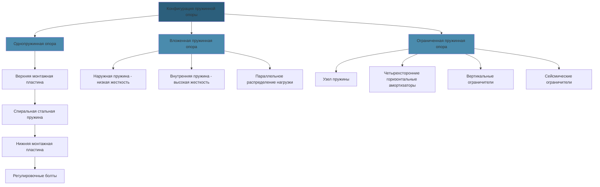

Стальные пружинные изоляторы обеспечивают надежную виброизоляцию тяжелого испытательного оборудования двигателей и конструкционных фундаментов. Упругое поведение спиральных пружин обеспечивает эффективную изоляцию в широком диапазоне частот при поддержке значительных статических нагрузок с минимальными требованиями к техническому обслуживанию.

## Проектирование стальных пружинных изоляторов

Пружинные изоляторы состоят из спиральных стальных катушек, спроектированных так, чтобы деформироваться под нагрузкой, сохраняя контролируемые характеристики жесткости. Геометрия пружины — диаметр проволоки, диаметр витка, количество активных витков и свободная высота — определяет грузоподъемность и собственную частоту изолятора.

Выбор материала обычно предусматривает высокоуглеродистую пружинную сталь (ASTM A229) для легких и средних применений или хромокремниевую легированную сталь (ASTM A401) для суровых условий эксплуатации с повышенными температурами или коррозионными средами. Поверхности пружин получают защитные покрытия (порошковое покрытие, цинкование или эпоксидная смола) для предотвращения коррозии во влажной атмосфере испытательной камеры.

Узлы корпуса включают верхнюю и нижнюю монтажные пластины с регулировочными болтами для регулировки при установке. Устройства боковой стабилизации — либо встроенные ограничители ветра, либо внешние амортизаторы — предотвращают чрезмерное горизонтальное движение во время переходных процессов.

## Расчеты статического прогиба

Статический прогиб под нагрузкой определяет собственную частоту изолированной системы. Соотношение между прогибом и частотой следует из:

$$f_n = \frac{1}{2\pi}\sqrt{\frac{g}{\delta}}$$

где $f_n$ — собственная частота (Гц), $g$ — ускорение свободного падения (9,81 м/с²), и $\delta$ — статический прогиб (м).

Для эффективной изоляции собственная частота должна оставаться значительно ниже частоты возбуждения. Эффективность изоляции увеличивается с коэффициентом частоты:

$$\eta = \frac{f_d^2 - f_n^2}{f_d^2} \times 100\%$$

где $f_d$ — частота возбуждения и $f_n$ — собственная частота.

Жесткость пружины связывает приложенную нагрузку с прогибом:

$$k = \frac{W}{\delta}$$

где $k$ — жесткость пружины (кН/м), $W$ — приложенная нагрузка (кН), и $\delta$ — прогиб (м).

Стандартные прогибы для приложений испытания двигателей:

| **Применение** | **Статический прогиб** | **Собственная частота** | **Эффективность изоляции при 600 об/мин** |
|---|---|---|---|
| Испытательные стенды легкого класса | 13–25 мм | 5,0–7,0 Гц | 90–94% |
| Фундаменты динамометров среднего класса | 25–51 мм | 3,5–5,0 Гц | 94–96% |
| Опоры двигателей тяжелого класса | 51–76 мм | 2,9–3,5 Гц | 96–97% |
| Системы критической изоляции | 76–102 мм | 2,5–2,9 Гц | 97–98% |

## Требования к амортизаторам для стабилизации

Амортизаторы ограничивают горизонтальное смещение во время переходных процессов запуска, экстренной остановки или сейсмических событий, при этом разрешая нормальное колебательное движение. Конструктивные соображения включают:

**Зазор**: Горизонтальный зазор между компонентами амортизатора обычно составляет 6–13 мм, позволяя ±3–6 мм бокового движения перед срабатыванием.

**Материал амортизатора**: Эластомерные прокладки или амортизирующие элементы поглощают энергию удара при срабатывании амортизатора, предотвращая металлический контакт, который создал бы ударные нагрузки и передачу шума.

**Конфигурация ограничения**: Четырехсторонее горизонтальное ограничение предотвращает движение во всех боковых направлениях. Вертикальное ограничение может включать ограничители подъема для оборудования, подверженного вертикальным силам или сейсмическому подъему.

**Сейсмическое проектирование**: В зонах высокой сейсмичности амортизаторы должны ограничивать движение, чтобы предотвратить перегрузку пружины при сохранении функциональности пружины. Сейсмические амортизаторы срабатывают при больших смещениях (13–25 мм) по сравнению с рабочими амортизаторами.

## Жесткость пружины и грузоподъемность

Правильный выбор пружины требует точного анализа распределения нагрузки по всем монтажным точкам. Неравномерное распределение нагрузки снижает эффективность изоляции и может перегрузить отдельные пружины.

**Грузоподъемность**: Пружины должны работать при 80–90% номинальной грузоподъемности при максимальной статической нагрузке, обеспечивая резервную емкость для динамических нагрузок и неравномерного распределения веса. Коэффициент безопасности 1,5–2,0 применяется к предельной прочности пружины.

**Вложенные пружины**: Тяжелые нагрузки могут требовать конфигурации вложенных пружин — наружная и внутренняя пружины работают параллельно — для достижения целевого прогиба в рамках пространственных ограничений. Суммарная жесткость пружины равна:

$$k_{total} = k_1 + k_2$$

**Пружины прогрессивной жесткости**: Некоторые приложения используют пружины прогрессивной жесткости, где расстояние между витками варьируется, обеспечивая мягкий начальный отклик с повышенной жесткостью при больших деформациях для защиты от перегрузок.

## Многонаправленная изоляция

Пружинные изоляторы главным образом сопротивляются вертикальным нагрузкам, но обеспечивают ограниченную горизонтальную жесткость. Отношение горизонтальной жесткости к вертикальной обычно составляет от 0,8:1 до 1,2:1, обеспечивая почти равную изоляцию во всех направлениях.

Для приложений, требующих специфических направленных характеристик:

- **Вертикальная изоляция**: Пружины, установленные в жесткие боковые ограничения, изолируют вертикальные силы, блокируя горизонтальное движение
- **Улучшенная боковая изоляция**: Пружины с пониженной горизонтальной жесткостью (достигаемой посредством геометрического проектирования) улучшают горизонтальную изоляцию для оборудования со значительными боковыми силами
- **Изоляция по шести степеням свободы**: Комбинированные системы пружина-маятник обеспечивают независимый контроль характеристик изоляции во всех трансляционных и ротационных режимах

## Спецификации пружинных опор

| **Параметр** | **Легкий класс** | **Средний класс** | **Тяжелый класс** | **Критическое обслуживание** |
|---|---|---|---|---|
| Диапазон нагрузок (на опору) | 445–2224 Н | 2224–8896 Н | 8896–44480 Н | 44480–222400 Н |
| Статический прогиб | 13–25 мм | 25–51 мм | 51–76 мм | 76–102 мм |
| Жесткость пружины | 3500–17500 Н/м | 8750–35000 Н/м | 17500–87500 Н/м | 52500–262500 Н/м |
| Собственная частота | 5,0–7,0 Гц | 3,5–5,0 Гц | 2,9–3,5 Гц | 2,5–2,9 Гц |
| Эффективность изоляции (600 об/мин) | 90–94% | 94–96% | 96–97% | 97–98% |
| Отношение горизонтальной жесткости | 1,0:1 | 0,9:1 | 0,85:1 | 0,8:1 |
| Зазор амортизатора | ±3 мм | ±6 мм | ±10 мм | ±13 мм |
| Коэффициент безопасности | 2,0 | 1,75 | 1,5 | 1,5 |

## Техническое обслуживание и проверка

Пружинные изоляторы требуют периодической проверки для проверки продолжающейся производительности и структурной целостности:

**Визуальная проверка (ежеквартально)**:
- Состояние пружины — коррозия, деградация покрытия, остаточная деформация
- Монтажное оборудование — ослабление, износ, выравнивание
- Зазор амортизатора — проверка правильности размеров зазора
- Выравнивание — проверка на оседание или смещение

**Проверка производительности (ежегодно)**:
- Измерение статического прогиба под рабочей нагрузкой
- Проверка собственной частоты посредством ударного тестирования или вынужденной вибрации
- Проверка функциональности горизонтального ограничения
- Распределение нагрузок по всем монтажным точкам

**Корректирующие действия**:
- Замена пружин, показывающих остаточную деформацию, превышающую 5% конструкционного прогиба
- Восстановление защитных покрытий на поврежденных поверхностях
- Регулировка выравнивания для восстановления правильного распределения нагрузок
- Затяжка оборудования до указанных значений крутящего момента

Замену пружин следует производить в виде полных наборов, когда любой изолятор показывает деградацию, сохраняя равномерные характеристики жесткости во всей системе изоляции. Смешивание старых и новых пружин создает неравномерное распределение нагрузок и снижает эффективность изоляции.

Ведение записей отслеживает измерения прогиба, собственную частоту и визуальное состояние, устанавливая базовые данные для анализа тенденций. Отклонение от базовых значений указывает на деградацию, требующую корректирующих действий, прежде чем производительность системы значительно ухудшится.
