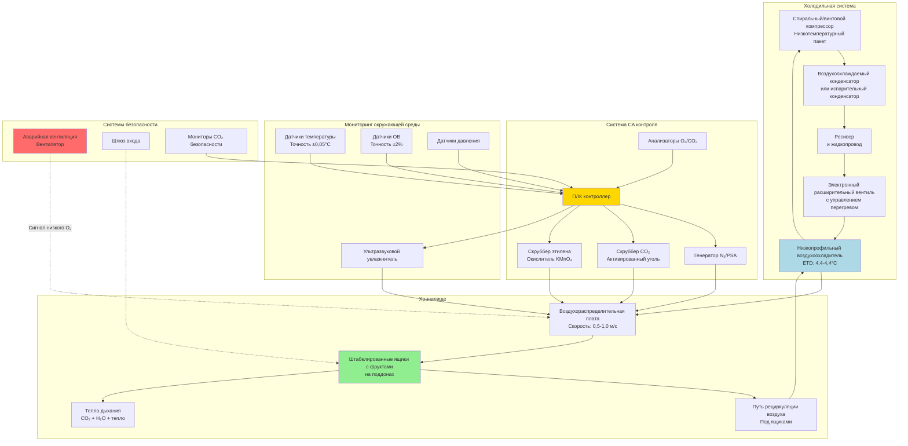

## Физические принципы HVAC для фруктохранилищ

Фруктохранилища требуют точного управления окружающей средой для замедления дыхания, минимизации потери влаги и предотвращения микробного роста. Основная задача — управление метаболическим теплом, генерируемым живой тканью, при сохранении строгих допусков по температуре (±0,3°C), относительной влажности (90-95%) и в контролируемом хранилище (CA) — по составу газа (O₂, CO₂, N₂).

### Дыхание фруктов и генерация тепла

Ткань живых фруктов продолжает клеточное дыхание после уборки, потребляя кислород и генерируя тепло, диоксид углерода и водяной пар. Скорость дыхания следует температурозависимой кинетике, описываемой уравнением Аррениуса:

$$R_T = R_{ref} \cdot Q_{10}^{(T-T_{ref})/10}$$

Где:
- $R_T$ = скорость дыхания при температуре T (мг CO₂/кг·ч)
- $R_{ref}$ = скорость дыхания при эталонной температуре (обычно 0°C)
- $Q_{10}$ = температурный коэффициент (обычно 2,0–4,0 для фруктов)
- $T$ = температура хранения (°C)
- $T_{ref}$ = эталонная температура (°C)

Скорость генерации метаболического тепла от дыхания:

$$q_{resp} = \frac{R_T \cdot m_{fruit} \cdot h_{fg,CO_2}}{M_{CO_2}}$$

Где:
- $q_{resp}$ = тепловая нагрузка дыхания (Вт)
- $m_{fruit}$ = масса хранящихся фруктов (кг)
- $h_{fg,CO_2}$ = теплота сгорания на моль CO₂ (≈ 450 кДж/моль при окислении глюкозы)
- $M_{CO_2}$ = молярная масса CO₂ (44 г/моль)

Для яблок при 0°C типичное тепло дыхания составляет 3–5 Вт/т. При 10°C это увеличивается до 15–25 Вт/т, что демонстрирует критическую важность точного управления температурой.

### Расчет общей холодильной нагрузки

Общая холодильная нагрузка для хранилища фруктов объединяет несколько источников тепла:

$$Q_{total} = Q_{resp} + Q_{product} + Q_{transmission} + Q_{infiltration} + Q_{equipment} + Q_{lights} + Q_{people}$$

**Холодильная нагрузка продукта** (удаление полевого тепла):

$$Q_{product} = \frac{m_{fruit} \cdot c_p \cdot (T_{initial} - T_{storage})}{\Delta t_{cooling}}$$

Где:
- $c_p$ = удельная теплоёмкость фруктов (обычно 3,6–3,9 кДж/кг·K для фруктов с высоким содержанием воды)
- $\Delta t_{cooling}$ = период охлаждения (часы)

**Трансмиссионная нагрузка** через изолированные стены:

$$Q_{transmission} = U \cdot A \cdot (T_{ambient} - T_{storage})$$

Для фруктохранилищ коэффициент теплопередачи стен не должен превышать 0,15 Вт/м²·K (минимум RSI 6,7 изоляции).

### Требования к условиям хранения по типам фруктов

| Тип фрукта | Температура (°C) | ОВ (%) | O₂ (%) | CO₂ (%) | Макс. хранение (месяцы) | Дыхание при 0°C (мг CO₂/кг·ч) |
|------------|------------------|--------|--------|---------|----------------------|-----------------------------------|
| Яблоки (CA) | -1 до 0 | 90-95 | 1-3 | 1-3 | 8-12 | 2-5 |
| Груши (CA) | -1,5 до -0,5 | 90-95 | 2-3 | 0-1 | 5-7 | 2-4 |
| Апельсины | 3 до 9 | 85-90 | Воздух | Воздух | 3-4 | 4-8 |
| Виноград | -1 до 0 | 90-95 | 2-5 | 1-3 | 3-6 | 3-6 |
| Клубника | 0 | 90-95 | 5-10 | 15-20 | 0,5 | 15-25 |
| Бананы | 13 до 15 | 90-95 | Воздух | Воздух | 1-2 | 12-20 |
| Черника | -0,5 до 0 | 90-95 | 2-5 | 12-20 | 2-3 | 8-12 |

*Данные основаны на USDA Agriculture Handbook 66 и ASHRAE Refrigeration Handbook Chapter 37*

## Проектирование HVAC систем для фруктохранилищ

### Выбор холодильной системы

Воздухоохладители для фруктохранилищ должны обеспечивать высокую холодильную производительность, минимизируя скорость воздуха на поверхности фруктов во избежание высыхания. Критерии проектирования:

- **Разность температур испарителя (ETD):** максимум 4,4°C для поддержания высокой влажности
- **Скорость воздуха:** максимум 0,5 м/с через хранящиеся фрукты
- **Скорость на поверхности катушки:** 1,5–2,0 м/с
- **Цикл разморозки:** горячий газ или электрический с минимальной длительностью отключения

Требуемая производительность испарителя учитывает нагрузку снижения температуры плюс установившиеся нагрузки:

$$Q_{evap} = \frac{Q_{total}}{\eta_{system}} \cdot SF$$

Где $\eta_{system}$ — эффективность системы (0,85–0,90) и SF — коэффициент безопасности (1,15–1,25).

### Интеграция системы контролируемой атмосферы

CA хранилище снижает дыхание путём ограничения доступности кислорода. Система HVAC должна интегрироваться с:

1. **Генераторами азота или системами адсорбции при перепаде давления (PSA)** для снижения O₂ с 21% до целевых уровней
2. **Скрубберами CO₂** (активированный уголь или известковые слои) для предотвращения токсического накопления
3. **Скрубберами этилена** (окислители перманганата калия) для чувствительных к этилену сортов
4. **Герметичной конструкцией** с переходными камерами и мониторингом давления

Скорость воздухообмена для помещений CA должна быть минимизирована:

$$ACH = \frac{Q_{infiltration}}{V_{room} \cdot \rho_{air} \cdot c_{p,air} \cdot \Delta T} \times 3600$$

Целевое значение: < 0,5 воздухообмена в 24 часа для эффективного поддержания CA.

### Стратегия управления влажностью

Поддержание 90-95% ОВ предотвращает потерю веса фруктов, избегая конденсации на поверхности, которая способствует грибковому росту. Равновесная влажность достигается благодаря:

- **Высокой температуре испарителя** (малая ETD снижает удаление влаги)
- **Испарительным увлажнителям** или ультразвуковым распылителям для дополнительного увлажнения
- **Надлежащей циркуляции воздуха** для поддержания равномерных условий без мёртвых зон

Скорость потери влаги из хранящихся фруктов:

$$\dot{m}_{loss} = h_m \cdot A_{fruit} \cdot (w_{surface} - w_{air})$$

Где:
- $h_m$ = коэффициент массопередачи (кг/м²·с)
- $A_{fruit}$ = площадь поверхности хранящихся фруктов (м²)
- $w_{surface}$, $w_{air}$ = отношения влажности на поверхности фрукта и в массе воздуха (кг воды/кг сухого воздуха)

## Диаграмма HVAC системы фруктохранилища

## Стратегии управления и оптимизация

### Контур управления температурой

Хранилище фруктов требует точного PI или PID управления с:

- **Пропорциональная полоса:** 1,1–2,2°C
- **Время интегрирования:** 5–10 минут
- **Время дифференцирования:** 1–2 минуты (если используется)

Электронный расширительный вентиль модулирует поток хладагента для поддержания постоянного перегрева (4,4–6,7°C), при этом вентилятор испарителя циклирует или модулирует для управления температурой помещения.

### Поэтапный протокол снижения температуры

После уборки фрукты попадают в хранилище при полевой температуре (15–27°C). Быстрое охлаждение вызывает конденсацию и потенциальное повреждение холодом. Рекомендуемое поэтапное снижение:

1. **Этап 1:** охлаждение до 4°C со скоростью 1,1–2,2°C в час
2. **Этап 2:** выдержка при 4°C в течение 12–24 часов (выравнивание)
3. **Этап 3:** охлаждение до конечной температуры хранения со скоростью 0,6–1,1°C в час

Этот протокол минимизирует внутренние температурные градиенты при предотвращении конденсации на поверхности.

### Последовательность установления CA

Для контролируемого хранилища атмосферы:

1. **Герметизировать помещение** и проверить скорость утечки < 2% объёма за 24 часа
2. **Снизить O₂** с 21% до целевого при впрыске N₂ 0,5–1% в день
3. **Мониторить повышение CO₂** от дыхания фруктов
4. **Активировать CO₂ скруббирование** когда концентрация превышает целевой + 1%
5. **Поддерживать установившееся состояние** непрерывным мониторингом и небольшими корректировками

## Соображения энергоэффективности

Фруктохранилище представляет 30–40% энергопотребления после уборки в коммерческих операциях. Стратегии оптимизации:

- **Компрессоры и вентиляторы испарителя с переменной скоростью** снижают паразитные нагрузки во время установившейся работы
- **Рекуперация тепла** от нагнетания компрессора для разморозки или отопления помещений
- **Ночное снижение** для хранилищ между циклами загрузки (температура может колебаться на 0,6–1,1°C ночью без влияния на качество)
- **Охлаждение экономайзером** в холодных климатах при температуре окружающей среды ниже температуры хранения

Коэффициент производительности для низкотемпературного хранилища фруктов:

$$COP = \frac{Q_{evap}}{W_{comp}} = \frac{h_1 - h_4}{h_2 - h_1}$$

Типичные значения COP варьируют от 2,0–3,5 при температурах испарителя -3,9 до 1,7°C.

## Контрольный список проектирования и типичные отказы

**Критические элементы проектирования:**

- Изоляция RSI ≥ 6,7 для стен, RSI 8,8 для потолков
- Пароизоляция на теплой стороне всех изолированных поверхностей
- Изоляция пола и обогрев для предотвращения морозного пучения при подземной конструкции
- Резервная холодильная производительность (конфигурация N+1 для критического хранилища)
- Аварийное питание для компрессоров и управления
- Потоки воздуха, исключающие горячие пятна и мёртвые зоны

**Типичные режимы отказа:**

- Неадекватная циркуляция воздуха, вызывающая температурную стратификацию (ΔT > 1,1°C сверху вниз)
- Чрезмерная скорость воздуха, вызывающая обезвоживание фруктов и потерю веса
- Недостаточная производительность разморозки, приводящая к обледенению катушки и потере производительности
- Утечка газа в помещениях CA, предотвращающая стабильный контроль атмосферы
- Конденсация на потолке и стенах из-за термических мостиков на конструктивных проёмах

Успешная HVAC система фруктохранилища балансирует конкурирующие требования: достаточная холодильная производительность, минимальное удаление влаги, равномерное распределение температуры и для CA хранилища — герметичная конструкция с интегрированным управлением атмосферой. Проектирование на основе точных расчётов нагрузок и соответствия рекомендациям ASHRAE и USDA обеспечивает оптимальное сохранение качества фруктов и максимальную длительность хранения.
