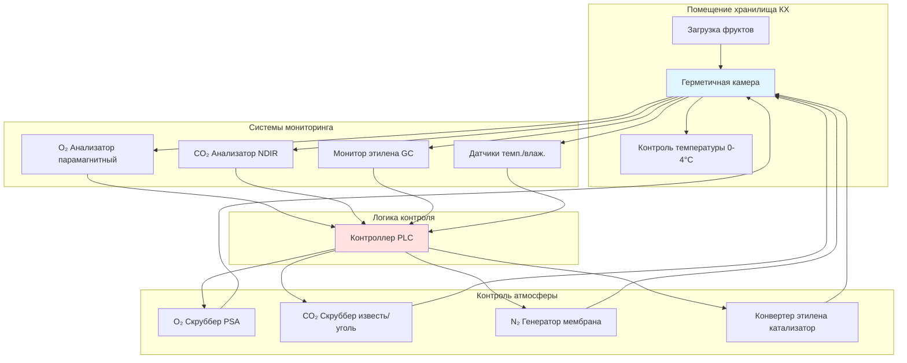

## Фундаментальные принципы хранилища КХ

Контролируемое хранилище (КХ) расширяет срок хранения фруктов путём манипулирования составом атмосферы для снижения метаболической активности. В отличие от обычного охлаждаемого хранилища, работающего в стандартных атмосферных условиях (20,95% O₂, 0,04% CO₂), КХ намеренно изменяет концентрации газов для подавления дыхания, отсрочки созревания и минимизации деградации качества.

Коэффициент дыхания управляет метаболизмом фруктов:

$$RQ = \frac{\text{CO}_2 \text{ produced}}{\text{O}_2 \text{ consumed}} = \frac{n_{\text{CO}_2}}{n_{\text{O}_2}}$$

Для большинства фруктов, подвергающихся аэробному дыханию, RQ приближается к 1,0, что указывает на полное окисление углеводов. Снижая доступность кислорода, КХ смещает метаболизм в сторону более низких скоростей дыхания без возникновения анаэробных путей брожения, которые вызывают неприятные запахи.

## Управление концентрацией газов

Скорость дыхания следует кинетике Михаэлиса-Ментен относительно концентрации кислорода:

$$R = \frac{R_{\max} [\text{O}_2]}{K_m + [\text{O}_2]}$$

Где:
- $R$ = фактическая скорость дыхания (мг CO₂/кг·ч)
- $R_{\max}$ = максимальная скорость дыхания при атмосферном O₂
- $[\text{O}_2]$ = концентрация кислорода (%)
- $K_m$ = константа Михаэлиса (обычно 2-5% для большинства фруктов)

Ниже константы Михаэлиса скорость дыхания уменьшается пропорционально концентрации кислорода. Нижний предел кислорода (НПК) представляет пороговое значение, ниже которого инициируется анаэробный метаболизм, выделяющий этанол и ацетальдегид.

Повышенный диоксид углерода обеспечивает дополнительное подавление метаболизма посредством конкурентного ингибирования окислительных ферментов:

$$R_{\text{CO}_2} = R_{\text{O}_2} \cdot \left(1 - \frac{[\text{CO}_2]}{[\text{CO}_2]_{\text{crit}}}\right)$$

Критическая концентрация CO₂ варьируется в зависимости от вида и сорта, составляя от 1% для чувствительных к CO₂ фруктов до 10% для толерантных сортов.

## Компоненты системы КХ

## Требования КХ по типам фруктов

| Тип фруктов | Температура (°C) | O₂ (%) | CO₂ (%) | Относительная влажность (%) | Продолжительность хранения (месяцы) |
|------------|------------------|--------|---------|----------------------|---------------------------|
| Яблоки (Делишес) | 0 до 1 | 1,0-2,0 | 1,0-2,0 | 90-95 | 6-8 |
| Яблоки (Гренни Смит) | 0 до 1 | 1,5-2,5 | 3,0-5,0 | 90-95 | 9-12 |
| Груши (Барлетт) | -1 до 0 | 2,0-3,0 | 0,5-1,0 | 90-95 | 2-3 |
| Груши (Анжу) | -1 до 0 | 1,0-2,0 | 0,5-1,0 | 90-95 | 5-7 |
| Персики | -0,5 до 0 | 1,0-2,0 | 3,0-5,0 | 90-95 | 1-2 |
| Нектарины | -0,5 до 0 | 1,0-2,0 | 3,0-5,0 | 90-95 | 1-2 |
| Вишни (сладкие) | -1 до 0 | 3,0-10,0 | 10,0-15,0 | 90-95 | 1-2 |
| Киви | 0 до 1 | 1,0-2,0 | 3,0-5,0 | 90-95 | 5-6 |

## Преимущества снижения кислорода

Снижение концентрации кислорода с атмосферного 20,95% до 1-3% уменьшает скорость дыхания на 60-80%. Это снижение напрямую коррелирует с расширенным сроком хранения посредством нескольких механизмов:

**Подавление активности ферментов**: Кислородозависимые ферменты, включая полифенолоксидазу (потемнение), липоксигеназу (деградация мембран) и аскорбинокислотоксидазу (потеря витамина C), показывают сниженную активность при низком содержании O₂.

**Ингибирование продукции этилена**: Биосинтез этилена требует кислорода для активности ACC-оксидазы. При концентрациях O₂ ниже 8% выработка этилена уменьшается экспоненциально, задерживая климактерическое созревание у чувствительных фруктов.

**Сохранение хлорофилла**: Низкий кислород замедляет деградацию хлорофилла, сохраняя зелёный цвет семечковых фруктов и задерживая пожелтение.

## Эффекты повышения диоксида углерода

Повышенный CO₂ (1-15% в зависимости от вида) обеспечивает преимущества, независимые от снижения кислорода:

**Стабилизация мембран**: Диоксид углерода изменяет текучесть мембран и снижает утечку ионов, поддерживая целостность клеток.

**Ингибирование ферментов**: Высокий CO₂ конкурентно ингибирует центры связывания этилена и напрямую подавляет полигалактуронизу (фермент размягчения) и другие ферменты, связанные со созреванием.

**Подавление грибкового роста**: Концентрации диоксида углерода выше 5% ингибируют прорастание спор и рост мицелия распространённых постуборочных патогенов, включая Botrytis, Penicillium и Monilinia.

Массовый баланс для накопления CO₂ в герметичном хранилище:

$$\frac{d[\text{CO}_2]}{dt} = \frac{M \cdot R}{V \cdot \rho_{\text{air}}} - Q_{\text{scrubber}}$$

Где:
- $M$ = масса фруктов (кг)
- $R$ = скорость дыхания (мг CO₂/кг·ч)
- $V$ = объём помещения (м³)
- $\rho_{\text{air}}$ = плотность воздуха (кг/м³)
- $Q_{\text{scrubber}}$ = скорость удаления CO₂ (мг/ч)

## Контроль этилена в хранилище КХ

Концентрация этилена должна оставаться ниже 1 ppm для оптимального хранения климактерических фруктов. При концентрациях, превышающих 1 ppm, этилен вызывает каскады созревания даже при оптимальных условиях КХ. Каталитические конвертеры окисляют этилен при 200-300°C:

$$\text{C}_2\text{H}_4 + 3\text{O}_2 \xrightarrow{\text{catalyst}} 2\text{CO}_2 + 2\text{H}_2\text{O}$$

Скруббера перманганата калия обеспечивают химическое окисление для меньших установок, достигая эффективности удаления 90-95%.

## Количественная оценка расширения сроков хранения

Коэффициент температуры Q₁₀ в сочетании с эффектами КХ предсказывает расширение сроков хранения:

$$\text{Срок хранения}_{\text{КХ}} = \text{Срок хранения}_{\text{воздух}} \times \frac{R_{\text{воздух}}}{R_{\text{КХ}}} \times Q_{10}^{(T_{\text{воздух}}-T_{\text{КХ}})/10}$$

Типичное КХ расширяет срок хранения яблок с 3-4 месяцев (охлажденный воздух) до 9-12 месяцев, что представляет 3-кратное улучшение, в основном благодаря подавлению дыхания.

## Механизмы поддержания качества

КХ сохраняет качественные характеристики посредством физиологического контроля:

**Сохранение твёрдости**: Снижение активности полигалактуронизы и пектинметилэстеразы сохраняет целостность клеточной стенки. Скорость потери твёрдости снижается с 1-2 N/неделю при хранении в воздухе до 0,2-0,4 N/неделю в КХ.

**Сохранение кислотности**: Катаболизм органических кислот уменьшается пропорционально скорости дыхания, сохраняя титруемую кислотность и вкусовой баланс.

**Профилактика поверхностного загара**: Условия низкого кислорода подавляют окисление α-фарнезена в продукты коньюгированной триеновой окисления, ответственные за поверхностный загар яблок и груш.

## Стандарты и внедрение

ASHRAE Refrigeration Handbook Chapter 37 предоставляет рекомендации по хранилищу КХ. Коммерческие установки следуют протоколам Сети постуборочной информации Вашингтонского государственного университета и USDA Agricultural Handbook 66 для специфичных требований продукции.

Системы адсорбции с перепадом давления (PSA) извлекают кислород из окружающего воздуха, подавая 95-99% азота для снижения концентрации O₂ до целевых уровней. Системы мембранного разделения предлагают более низкие капитальные затраты для установок, требующих умеренного снижения O₂ (3-5%).

## Компоненты

- Контролируемое хранилище яблок
- Контролируемое хранилище груш
- Контролируемое хранилище косточковых фруктов
- Преимущества снижения кислорода
- Эффекты повышения диоксида углерода
- Контроль этилена в хранилище КХ
- Расширение сроков хранения КХ
- Поддержание качества КХ
