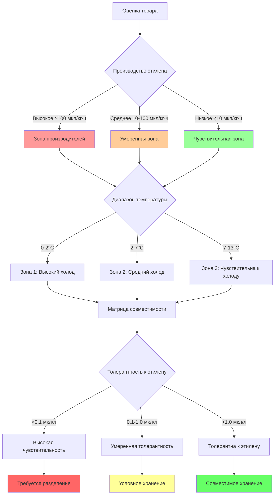

## Интеграция товаров

Смешанное хранение товаров на фруктовых складах требует точной интеграции тепловых и атмосферных требований. Анализ совместимости сосредоточен на трех физических параметрах: скоростях производства этилена, оптимальных диапазонах температуры хранения и коэффициентах респираторного метаболизма. Неправильная интеграция ускоряет старение через каскады, вызванные этиленом, и накопление метаболического тепла.

## Физика чувствительности к этилену

Этилен (C₂H₄) действует как растительный гормон, запускающий автокаталитическое созревание через опосредованную рецепторами трансдукцию сигнала. Чувствительность варьируется в зависимости от товара на основе плотности рецепторов и характеристик проницаемости мембраны.

Зависимость "доза-ответ" этилена следует кинетике Михаэлиса-Ментена:

$$R_{ripening} = \frac{R_{max} \cdot [C_2H_4]}{K_m + [C_2H_4]}$$

Где:
- $R_{ripening}$ = скорость созревания (безразмерная, шкала 0-1)
- $R_{max}$ = максимальный ответ созревания
- $[C_2H_4]$ = концентрация этилена (мкл/л)
- $K_m$ = константа полусыщения (специфична для товара)

Индекс кумулятивного повреждения от этилена интегрирует концентрацию во времени:

$$D_{ethylene} = \int_0^t [C_2H_4](\tau) \cdot S_c \cdot e^{-E_a/(RT(\tau))} \, d\tau$$

Где:
- $D_{ethylene}$ = индекс повреждения (мкл·ч/л)
- $S_c$ = коэффициент чувствительности товара (зависит от вида)
- $E_a$ = энергия активации связывания рецептора (кДж/моль)
- $R$ = универсальная газовая постоянная (8,314 Дж/моль·К)
- $T$ = абсолютная температура (К)

Температура экспоненциально модулирует чувствительность к этилену через кинетику ферментов. Увеличение на 10°C обычно удваивает активность рецепторов, описываемую коэффициентом Q₁₀:

$$Q_{10} = \left(\frac{k_{T+10}}{k_T}\right)$$

Для большинства фруктов значение $Q_{10}$ колеблется от 2,0 до 3,5 для процессов, вызванных этиленом.

## Зоны совместимости товаров

Совместимость хранения зависит от перекрывающихся оптимальных диапазонов температуры, относительной влажности и максимально допустимой концентрации этилена.

## Группы совместимости фруктов

Товары разделяются на группы совместимости на основе требований к температуре, производства этилена и чувствительности к этилену.

| Группа совместимости | Репрезентативные товары | Диапазон температуры (°C) | Производство этилена (мкл/кг·ч) | Чувствительность к этилену | Разделение хранения |
|---------------------|---------------------------|------------------------|-------------------------------|---------------------|-------------------|
| **Группа A: Высокочувствительные к холоду** | Киви, яблоки (большинство сортов), груши азиатские | 0-2 | 0,1-2,0 | Высокая (<0,1 мкл/л) | Отделить от производителей |
| **Группа B: Высокотолерантные к холоду** | Груши европейские (Барлет, Анжу), яблоки (Гренни Смит) | 0-2 | 2,0-10,0 | Умеренная (0,1-1,0 мкл/л) | Совместимы с Группой A |
| **Группа C: Среднечувствительные к холоду** | Черника, вишня сладкая, виноград | 2-7 | 0,05-0,5 | Очень высокая (<0,05 мкл/л) | Максимальная изоляция требуется |
| **Группа D: Средние производители холода** | Абрикосы, сливы, нектарины | 2-7 | 10-50 | Низкая (>1,0 мкл/л) | Изолировать от A, B, C |
| **Группа E: Климактерические чувствительные к холоду** | Авокадо (спелое), томаты, бананы | 7-13 | 50-200 | Умеренная (0,5-2,0 мкл/л) | Рекомендуется отдельное помещение |
| **Группа F: Неклимактерические чувствительные к холоду** | Цитрусовые, ананасы, манго (некоторые сорта) | 7-13 | 0,1-1,0 | Низкая (>2,0 мкл/л) | Совместимы с Группой E |

## Анализ совместимости смешанного хранения

Индекс совместимости для двух товаров количественно определяет возможность хранения:

$$CI_{ij} = \left(1 - \frac{|\Delta T_{opt}|}{T_{tolerance}}\right) \cdot \left(1 - \frac{E_{production,i}}{E_{tolerance,j}}\right) \cdot \left(1 - \frac{|\Delta RH|}{RH_{tolerance}}\right)$$

Где:
- $CI_{ij}$ = индекс совместимости (0-1, >0,7 приемлемо)
- $\Delta T_{opt}$ = разница оптимума температуры (°C)
- $T_{tolerance}$ = полоса толерантности температуры (°C)
- $E_{production,i}$ = скорость производства этилена товаром i (мкл/кг·ч)
- $E_{tolerance,j}$ = пороговая толерантность к этилену товара j (мкл/л)
- $\Delta RH$ = разница относительной влажности (%)
- $RH_{tolerance}$ = полоса толерантности влажности (%)

## Стратегии разделения

Методы физического разделения решают проблему несовместимости через атмосферную изоляцию. Вертикальная стратификация использует различия плотности, так как этилен (молекулярный вес 28,05 г/моль) проявляет небольшую положительную плавучесть относительно воздуха (средний молекулярный вес 28,97 г/моль) при температурах хранения. Горизонтальное разделение с выделенной обработкой воздуха предотвращает перекрестное загрязнение через независимые циклы циркуляции.

Системы скрубберов обеспечивают улучшение химической совместимости. Окисление перманганатом калия преобразует этилен через:

$$C_2H_4 + KMnO_4 \rightarrow CO_2 + H_2O + MnO_2 + K^+$$

Каталитическое окисление при 150-300°C достигает эффективности удаления >95%:

$$C_2H_4 + 3O_2 \xrightarrow{catalyst} 2CO_2 + 2H_2O$$

Требования мощности скруббера масштабируются с скоростью генерации этилена и объемом циркуляции воздуха:

$$Q_{scrubber} = \frac{m_{fruit} \cdot E_{production} \cdot 22,4}{M_{C_2H_4} \cdot \eta_{removal} \cdot 1000}$$

Где:
- $Q_{scrubber}$ = объемная мощность скруббера (л/ч)
- $m_{fruit}$ = масса фруктов (кг)
- $E_{production}$ = скорость производства (мкл/кг·ч)
- $M_{C_2H_4}$ = молекулярный вес этилена (28,05 г/моль)
- $\eta_{removal}$ = эффективность скруббера (доля)
- 22,4 = молярный объем при СТУ (л/моль)

## Интеграция контролируемой атмосферы

Хранение в контролируемой атмосфере модифицирует совместимость товаров через подавление дыхания. Пониженный O₂ (1-3%) и повышенный CO₂ (1-5%) снижают биосинтез этилена путем подавления ферментов ACC синтазы и ACC оксидазы в пути производства этилена.

Модифицированное дыхательное частное при условиях контролируемой атмосферы:

$$RQ_{CA} = \frac{CO_2 \, produced}{O_2 \, consumed} = f([O_2], [CO_2], T)$$

Типичные значения RQ смещаются от 1,0 (нормальный воздух) к 1,2-1,5 в условиях контролируемой атмосферы, указывая на измененные метаболические пути. Это снижает производство этилена на 40-70% для климактерических фруктов, расширяя совместимость между иначе несовместимыми товарами.

## Протоколы реализации

Проектирование помещения должно обеспечивать разделение через:

1. **Выделенные помещения**: Товары групп A и C требуют изоляции от групп D и E
2. **Барьеры воздушного потока**: Положительные перепады давления (5-15 Па) предотвращают миграцию этилена
3. **Этапирование скрубберов**: Расположение скрубберов выше по течению от чувствительных товаров
4. **Температурное зонирование**: Отдельные схемы охлаждения для несовместимых температурных полос
5. **Плотность мониторинга**: Датчики этилена из расчета 1 на 200 м² для смешанного хранения, 1 на 500 м² для однородных грузов

Экономическая оптимизация уравновешивает затраты на разделение с потерями деградации товара, количественно определяемыми через анализ чистой приведенной стоимости длительности хранения, стоимости товара и коэффициентов сохранения качества в различных сценариях интеграции.

## Компоненты

- Требования к хранению сортов яблок
- Условия хранения груш
- Хранение косточковых фруктов
- Хранение киви в контролируемой атмосфере
- Условия хранения авокадо
- Специфичные для товара протоколы
- Совместимость смешанного хранения
