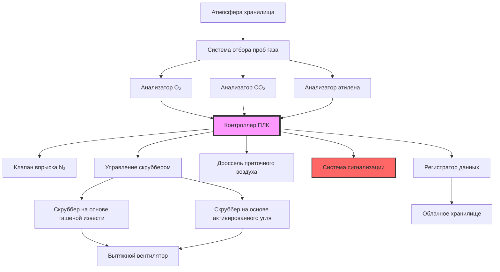

## Основы контроля атмосферы

Хранение в контролируемой атмосфере (CA) продлевает срок годности фруктов за счет манипулирования концентрациями газов. Дыхание фруктов потребляет кислород и выделяет углекислый газ и этилен, что требует постоянного управления атмосферой. Процесс дыхания описывается уравнением:

$$C_6H_{12}O_6 + 6O_2 \rightarrow 6CO_2 + 6H_2O + \text{тепло}$$

Целевые параметры атмосферы для хранения в режиме CA обычно поддерживают содержание кислорода на уровне 1–3% и CO₂ на уровне 1–5% в зависимости от вида продукции. Без активного скруббинга CO₂ накапливается до токсичных уровней (>10%) в течение нескольких дней.

## Технологии скруббинга CO₂

### Скрубберы на основе гашеной извести

Скрубберы на основе гашеной извести (гидроксида кальция) работают по принципу химической абсорбции:

$$Ca(OH)_2 + CO_2 \rightarrow CaCO_3 + H_2O$$

Расчет скрубберной емкости основан на стехиометрических соотношениях. Одна моля Ca(OH)₂ (74 г) реагирует с одной молем CO₂ (44 г):

$$Q_{CO_2} = \frac{m_{lime} \times M_{CO_2}}{M_{Ca(OH)_2}} \times \eta$$

Где:
- $Q_{CO_2}$ = емкость удаления CO₂ (кг)
- $m_{lime}$ = масса гашеной извести (кг)
- $M_{CO_2}$ = молекулярная масса CO₂ (44 г/моль)
- $M_{Ca(OH)_2}$ = молекулярная масса Ca(OH)₂ (74 г/моль)
- $\eta$ = эффективность скруббера (0,85–0,95)

Для хранилища, генерирующего 20 кг CO₂ в сутки, требуемая масса извести:

$$m_{lime} = \frac{20 \times 74}{44 \times 0,90} = 37,4 \text{ кг/сутки}$$

Расход воздуха через скруббер должен обеспечивать достаточное время контакта. Типичные расчетные скорости составляют 0,3–0,5 м/с через слой извести при минимальном времени контакта 2–3 секунды.

### Скрубберы на основе активированного угля

Активированный уголь удаляет этилен и летучие органические соединения посредством физической адсорбции. Удельная поверхность превышает 1000 м²/г, обеспечивая обширные сайты адсорбции. Равновесная емкость описывается изотермой Ленгмюра:

$$q_e = \frac{q_m K_L C_e}{1 + K_L C_e}$$

Где:
- $q_e$ = равновесная емкость адсорбции (мг/г)
- $q_m$ = максимальная емкость адсорбции
- $K_L$ = константа Ленгмюра
- $C_e$ = равновесная концентрация (ppm)

Расчет глубины слоя угля требует анализа прорыва. Для удаления этилена из 100 ppm до <1 ppm при 500 кг угля и расходе 200 CFM:

$$t_b = \frac{m_c \times q_e}{Q \times C_0 \times \rho}$$

Где:
- $t_b$ = время прорыва (часы)
- $m_c$ = масса угля (кг)
- $Q$ = расход воздуха (м³/ч)
- $C_0$ = входная концентрация (мг/м³)
- $\rho$ = плотность воздуха (кг/м³)

## Архитектура системы мониторинга

## Сравнение технологий скрубберов

| Технология | Удаление CO₂ | Удаление этилена | Эксплуатационные расходы | Регенерация | Типовая емкость |
|------|---|---|---|---|---|
| Гашеная известь | Отличное | Отсутствует | Низкие | Отсутствует (одноразовое) | 0,6 кг CO₂/кг извести |
| Активированный уголь | Плохое | Отличное | Средние | Тепло (300–400°C) | 0,3 кг C₂H₄/кг угля |
| Молекулярные сита | Хорошее | Хорошее | Высокие | Тепло + вакуум | 0,4 кг CO₂/кг сита |
| Мембранное разделение | Отличное | Отсутствует | Высокие | Отсутствует (непрерывное) | Переменная в зависимости от давления |
| PSA-системы | Отличное | Отсутствует | Средние | Перепад давления | 0,5 кг CO₂/кг адсорбента |

## Выбор газоанализатора

### Измерение кислорода

Парамагнитные анализаторы используют парамагнитные свойства кислорода. Молекулы кислорода испытывают силу в магнитном поле:

$$F = \chi V \frac{dB}{dx}$$

Где:
- $F$ = сила, действующая на пробу газа
- $\chi$ = магнитная восприимчивость
- $V$ = объем пробы
- $dB/dx$ = градиент магнитного поля

Точность: ±0,1% O₂, диапазон 0–25%, время отклика <10 секунд.

Электрохимические сенсоры обеспечивают экономичные альтернативы. Гальванические элементы генерируют ток, пропорциональный парциальному давлению кислорода. Типичный срок службы: 18–24 месяца, точность ±0,5%.

### Измерение углекислого газа

Анализаторы с недисперсионной инфракрасной спектроскопией (NDIR) измеряют поглощение CO₂ на длине волны 4,26 мкм. Поглощение описывается законом Бугера — Ламберта — Бера:

$$I = I_0 e^{-\alpha C L}$$

Где:
- $I$ = прошедшая интенсивность
- $I_0$ = падающая интенсивность
- $\alpha$ = коэффициент поглощения
- $C$ = концентрация CO₂
- $L$ = длина оптического пути

Точность: ±0,1% CO₂, диапазон 0–20%, минимальный дрейф, отсутствие расходных материалов.

### Обнаружение этилена

Фотоионизационные детекторы (PID) или газовая хроматография измеряют этилен на уровне ppb. Этилен ускоряет созревание даже при концентрации 0,1 ppm, что требует высокочувствительного обнаружения. PID ионизирует молекулы с помощью УФ-лампы (10,6 эВ):

Предел обнаружения: 0,05 ppm этилена, время отклика <30 секунд.

## Интеграция системы

Программируемые логические контроллеры (PLC) поддерживают заданные значения с помощью пропорционально-интегрально-дифференциального (ПИД) регулирования:

$$u(t) = K_p e(t) + K_i \int_0^t e(\tau)d\tau + K_d \frac{de(t)}{dt}$$

Где:
- $u(t)$ = управляющий выходной сигнал
- $e(t)$ = ошибка (заданное значение — измеренное)
- $K_p, K_i, K_d$ = параметры настройки

Типичные значения настройки для камер контролируемой атмосферы (CA):
- $K_p$ = 0,5–1,0 (коэффициент усиления пропорциональной составляющей)
- $K_i$ = 0,1–0,3 (постоянная времени интегральной составляющей)
- $K_d$ = 0,05–0,1 (постоянная времени дифференциальной составляющей)

Журналирование данных фиксирует параметры каждые 5–15 минут. Исторические данные позволяют проводить анализ тенденций и оптимизацию оборудования. Подключение к облаку обеспечивает удаленный мониторинг и уведомления об аварийных ситуациях.

## Эксплуатационные требования

Интервалы калибровки соответствуют спецификациям производителя: обычно ежеквартально для NDIR-анализаторов CO₂ и ежемесячно для электрохимических сенсоров O₂. Сертификат калибровочного газа, прослеживаемый к стандартам NIST, обеспечивает точность.

Техническое обслуживание скрубберов включает:
- Гашеная известь: замена при 80% карбонизации (увеличение веса в 1,35 раза)
- Активированный уголь: регенерация или замена при наступлении прорыва
- Фильтры: замена при перепаде давления 0,5 дюйма вод. ст.

Уставки сигнализации защищают качество продукции:
- O₂ <0,5% или >5%
- CO₂ >8%
- Отклонение температуры ±1°C
- Отключение электроэнергии
- Неисправность анализатора

Резервные анализаторы в критически важных помещениях предотвращают ложные срабатывания и обеспечивают непрерывную работу во время технического обслуживания.
