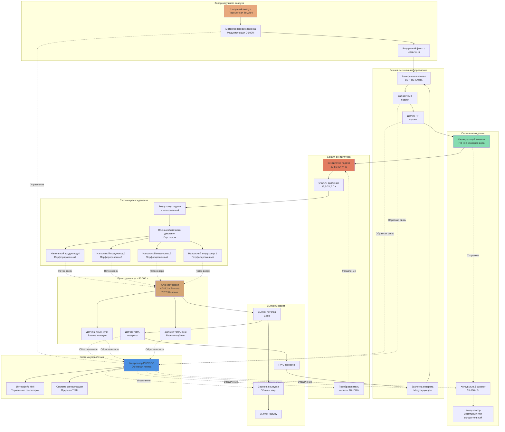

# Системы HVAC для хранения картофеля

Коммерческое хранение картофеля требует точного контроля окружающей среды для сохранения качества клубней, предотвращения прорастания, минимизации болезней и снижения потерь при хранении на протяжении 6-10 месяцев. Эффективное проектирование HVAC интегрирует управление температурой, поддержание высокой влажности и стратегическую вентиляцию для создания оптимальных условий на различных этапах хранения и для различных применений.

## Требования к хранению в зависимости от применения

Температура хранения существенно варьируется в зависимости от предполагаемого использования, что связано с взаимосвязью между температурой и накоплением сахара в ткани картофеля. Холодовое подслащивание происходит ниже 7,2°C, так как крахмал преобразуется в восстанавливающие сахара, создающие нежелательное потемнение при жарке или переработке.

| Применение | Диапазон температур | Относительная влажность | Продолжительность хранения | Температура лечения | Скорость вентиляции |
|---------|-------------------|-------------------|------------------|-------------|------------------|
| Переработка (чипсы/фри) | 7,2-10°C | 90-95% | 6-10 месяцев | 12,8-15,6°C | 0,05-0,15 CFM (85-255 м³/ч на т) |
| Свежий рынок (столовой сорт) | 3,3-5,6°C | 90-95% | 3-6 месяцев | 10-12,8°C | 0,05-0,20 CFM (85-340 м³/ч на т) |
| Семенной картофель | 3,3-4,4°C | 90-95% | 6-9 месяцев | 10-12,8°C | 0,10-0,25 CFM (170-425 м³/ч на т) |
| Кратковременное хранение | 10-12,8°C | 85-90% | 1-3 месяца | Не требуется | 0,20-0,50 CFM (340-850 м³/ч на т) |

**Обоснование контроля температуры:**

Картофель для переработки требует более теплого хранения для предотвращения накопления сахара, вызывающего темный цвет при жарке и нежелательные вкусовые качества. Критический порог составляет 7,2°C, ниже которого восстанавливающие сахара (глюкоза и фруктоза) быстро накапливаются благодаря ферментативному преобразованию крахмала. Картофель для свежего рынка переносит более низкие температуры, так как потемнение при готовке менее проблематично для потребителей. Семенной картофель требует самого холодного хранения для поддержания покоя и предотвращения преждевременного прорастания до сезона посадки.

## Выделение тепла дыхания и анализ тепловой нагрузки

Картофельные клубни - это живые организмы, которые продолжают клеточное дыхание во время хранения, выделяя метаболическое тепло, которое должно быть удалено для поддержания целевых температур. Скорость дыхания экспоненциально зависит от температуры, следуя закону Вант-Гоффа.

**Модель скорости дыхания:**

Скорость выделения тепла дыхания следует экспоненциальному температурному соотношению:

$$Q_{resp} = Q_0 \cdot e^{k(T - T_0)}$$

Где:
- $Q_{resp}$ = скорость выделения тепла дыхания (кДж/ч·т)
- $Q_0$ = базовая скорость дыхания при эталонной температуре
- $k$ = температурный коэффициент (типично 0,08-0,12 на °C)
- $T$ = температура хранения (°C)
- $T_0$ = эталонная температура (типично 0°C)

**Типичные скорости дыхания по температурам:**

| Температура хранения | Тепло дыхания (кДж/ч·т) | Производство СО₂ (мг/кг·ч) |
|---------------------|-------------------------------|--------------------------|
| 3,3°C | 0,158-0,211 | 1,5-2,0 |
| 5,6°C | 0,211-0,296 | 2,0-2,8 |
| 7,2°C | 0,264-0,370 | 2,5-3,5 |
| 10°C | 0,370-0,528 | 3,5-5,0 |
| 12,8°C | 0,528-0,740 | 5,0-7,0 |

**Расчет общей холодильной нагрузки:**

Для хранилища емкостью 50 000 т с удалением полевого тепла:

$$Q_{total} = Q_{sensible} + Q_{resp} + Q_{infiltration} + Q_{structure}$$

**Удаление чувствительного тепла:**

$$Q_{sensible} = m \cdot c_p \cdot \Delta T$$

- Масса клубней: $m = 50 000 \text{ т} = 50 000 000 \text{ кг}$
- Удельная теплоемкость: $c_p = 3,56 \text{ кДж/кг·°C}$ (79% влажности)
- Снижение температуры: $\Delta T = 18,3°C - 7,2°C = 11,1°C$
- Чувствительное тепло: $Q_s = 50 000 000 \times 3,56 \times 11,1 = 1 973 400 000 \text{ кДж}$
- Период охлаждения: 14-21 день (постепенное охлаждение)
- Средняя скорость: $1 973 400 000 \div (14 \times 86400) = 1 639 \text{ кДж/с} = 1 639 \text{ кВт}$

**Тепло дыхания (постоянная нагрузка):**

При температуре хранения 7,2°C:
$$Q_{resp} = 50 000 \text{ т} \times 0,317 \text{ кДж/ч·т} = 15 850 \text{ кДж/ч} = 4,4 \text{ кВт}$$

**Пиковое требование к холодильной мощности:**

Во время начальной фазы охлаждения: 1 639 + 4,4 = **1 643,4 кВт (467 кВт охлаждения)**

Во время долгосрочного хранения: **4,4 кВт** плюс структурные и инфильтрационные нагрузки.

## Требования фазы лечения кожуры и процесс образования пробки

Фаза лечения кожуры сразу после сбора критична для заживления ран, установки кожицы и профилактики болезней благодаря биологическому процессу образования пробки (суберизации). Эта фаза требует значительно отличающихся условий окружающей среды от долгосрочного хранения и представляет наиболее критический период управления HVAC для сохранения качества клубней.

**Оптимальные параметры лечения кожуры:**

| Параметр | Спецификация | Допуск | Влияние отклонения |
|-----------|--------------|-----------|---------------------|
| Температура | 10-15,6°C | ±1,1°C | Снижение скорости суберизации |
| Оптимальная точка | 12,8°C | ±0,6°C | Максимальное заживление ран |
| Относительная влажность | 90-95% | ±3% | Потеря влаги >0,5%/сут |
| Продолжительность | 10-14 дней | По сорту | Неполное закрытие раны |
| Скорость воздуха | <4,6 м/с над кучей | Критично | Высыхание ран |
| Скорость вентиляции | 0,01-0,05 CFM (17-85 м³/ч на т) | Минимальная | Сохранение тепла/влаги |

**Физиология суберизации:**

Суберизация - это образование пробкового слоя (пробелла) путем отложения суберина, сложного липидно-ароматического полиэстера, который создает водонепроницаемый барьер. Процесс включает:

1. **Клеточный ответ (0-48 часов):** Вызванное ранением выделение этилена запускает дифференциацию клеток под поврежденной тканью.

2. **Образование феллогена (2-5 дней):** Пробковый камбий развивается из коровых паренхимных клеток непосредственно под поверхностью раны.

3. **Отложение суберина (5-14 дней):** Вновь образованные клетки феллема откладывают суберин в клеточные стенки, создавая непроницаемый барьер.

**Модель скорости заживления ран:**

Скорость заживления ран следует экспоненциальному приближению к полноте:

$$H(t) = H_{max} \left(1 - e^{-kt}\right)$$

Где:
- $H(t)$ = процент завершения заживления в момент времени $t$
- $H_{max}$ = максимально достижимое заживление (типично 95-98%)
- $k$ = константа скорости заживления (функция температуры и RH)
- $t$ = время (дни)

При оптимальных условиях (12,8°C, 95% RH): $k \approx 0,25 \text{ сут}^{-1}$

**Зависимость суберизации от температуры:**

$$k(T) = k_0 \cdot Q_{10}^{(T-T_0)/10}$$

Где:
- $Q_{10}$ = температурный коэффициент (типично 2,0-2,5 для суберизации)
- $T_0$ = эталонная температура (10°C)
- $k_0$ = константа скорости при эталонной температуре

Это соотношение демонстрирует, что суберизация происходит в два раза быстрее при 15,6°C по сравнению с 10°C, но чрезмерная температура (>18,3°C) способствует росту патогенов и гниению.

**Ответ системы HVAC во время лечения кожуры:**

Система вентиляции должна переключиться с режима активного охлаждения на режим пассивного сохранения тепла. Тепло дыхания из массы клубней (0,528-0,740 кДж/ч·т при 12,8°C) обеспечивает естественное нагревание, обычно повышая температуру кучи на 2,8-5,6°C выше внешней температуры, если вентиляция минимальна.

**Стратегия управления фазой лечения кожуры:**

1. **Герметизация хранилища:** Закройте все заслонки вентиляции и двери, чтобы удержать тепло дыхания и влагу.

2. **Мониторинг повышения температуры:** Тепло дыхания естественно нагревает кучу от температуры уборки (18,3-21,1°C) или поддерживает целевую 12,8°C.

3. **Минимальная циркуляция:** Работайте вентиляторы на 0,01-0,02 CFM (17-34 м³/ч на т) для предотвращения стратификации без потерь тепла.

4. **Управление влажностью:** Дыхательная влага от клубней обычно обеспечивает адекватную влажность. Каждая тонна производит приблизительно 0,009-0,014 кг воды/сут через транспирацию и дыхание.

5. **Дополнительное тепло:** В холодных климатах или при поздней уборке может потребоваться дополнительное тепло для достижения 12,8°C. Требуемое тепло:

$$Q_{heat} = Q_{structure\ loss} + Q_{infiltration} - Q_{respiration}$$

Для типичной конструкции со стенами RSI 3,52 и наружной температурой 4,4°C:
- Потеря через конструкцию: ~336 кДж/с на хранилище 50 000 т
- Выделение от дыхания: 147 кДж/с при 12,8°C
- Требуемое отопление: 189 кДж/с

6. **Мониторинг прогресса заживления ран:** Визуальный осмотр репрезентативных клубней в 7 и 14 дни для проверки установки кожицы и закрытия ран. Неполное заживление требует продления периода лечения.

## Управление температурой и постепенное охлаждение

Резкие изменения температуры напрягают клубни и увеличивают риск конденсации. Лучшая практика отрасли требует постепенного охлаждения со скоростью 0,28-0,56°C в день от температуры лечения к целевой температуре хранения.

**Пример графика охлаждения:**
1. Уборка до лечения: 18,3°C → 12,8°C за 3-5 дней
2. Фаза лечения: Удержание при 12,8°C в течение 10-14 дней
3. Постепенное охлаждение: 12,8°C → 7,2°C со скоростью 0,28°C/день = 20 дней
4. Долгосрочное хранение: Удержание при 7,2°C в течение 6-10 месяцев

Общее время перехода от уборки к стабильному хранению: 33-39 дней.

**Анализ передачи тепла:**

Во время постепенного охлаждения система вентиляции удаляет как полевое тепло, так и тепло дыхания при тщательном управлении скоростью. Психрометрический процесс включает:
- Наружный воздух в условиях окружающей среды (переменные)
- Смешивание с воздухом возврата из хранилища (7,2-12,8°C, 90-95% RH)
- Управляемый расход воздуха для достижения целевой скорости охлаждения

Для охлаждения на 0,28°C/сут в хранилище 50 000 т:
- Ежедневное удаление тепла: 50 000 000 кг × 3,56 кДж/кг·°C × 0,28°C = 49 840 000 кДж/сут
- Средняя скорость: 49 840 000 ÷ 86 400 с = 577 кДж/с = 577 кВт
- Плюс тепло дыхания: 4,4 кВт
- Общее требование охлаждения: 581,4 кВт на переходном этапе

## Управление влажностью и управление влагой

Поддержание 90-95% RH необходимо для предотвращения потери веса, высыхания кожицы и ухудшения качества. При этом уровне влажности градиент парциального давления между поверхностью клубня и окружающим воздухом минимален, снижая потерю влаги от транспирации.

**Предотвращение потери веса:**

При температуре хранения 7,2°C:
- 90% RH: Скорость потери веса примерно 0,1-0,2% в месяц
- 80% RH: Скорость потери веса примерно 0,5-0,8% в месяц
- 70% RH: Скорость потери веса примерно 1,5-2,5% в месяц

Для хранилища 50 000 т при 80% RH по сравнению с 95% RH в течение 8 месяцев:
- Дополнительная потеря при 80% RH: 0,6% × 8 месяцев = 4,8%
- Потеря веса: 50 000 т × 0,048 = 2 400 т
- Экономический ущерб при 0,88 €/кг: €2 112 000 в потерях от усадки

**Стратегии управления влажностью:**

Поддержание высокой влажности опирается на:
1. Минимальную вентиляцию наружным воздухом на этапе хранения (снижает проникновение сухого воздуха)
2. Герметичную оболочку здания для предотвращения инфильтрации
3. Вклад дыхательной влаги от массы клубней
4. Системы увлажнения (туманообразование, испарительные прокладки) при необходимости дополнительной влаги
5. Избежание избыточной вентиляции, которая удаляет влажность

**Предотвращение конденсации:**

Хотя требуется высокая влажность, конденсация на поверхностях клубней способствует развитию болезней. Стратегии предотвращения включают:
- Однородную температуру по всей куче (исключает холодные пятна)
- Адекватную циркуляцию воздуха для предотвращения стратификации
- Изолированные стены и потолок для поддержания поверхностных температур выше точки росы
- Постепенные изменения температуры для предотвращения переходной конденсации

## Проектирование системы вентиляции

Принудительная воздушная вентиляция через кучу картофеля - краеугольный камень эффективного управления хранилищем. Проектирование системы должно вмещать переменные требования к расходу воздуха на различных этапах хранения.

**Скорости вентиляции по этапам:**

| Этап хранения | Расход воздуха (CFM на т) | Назначение |
|---------------|------------------------|---------|
| Начальное охлаждение | 1,0-2,0 (1 700-3 400 м³/ч на т) | Быстрое удаление полевого тепла |
| Лечение кожуры | 0,01-0,05 (17-85 м³/ч на т) | Минимальное движение воздуха |
| Постепенное охлаждение | 0,3-0,8 (510-1 360 м³/ч на т) | Управляемое снижение температуры |
| Долгосрочное хранение | 0,05-0,2 (85-340 м³/ч на т) | Поддержание температуры |
| Нагрев для отправки | 0,5-1,5 (850-2 550 м³/ч на т) | Управляемое повышение температуры |

**Перепад давления и выбор вентилятора:**

Воздушный поток через навалочное хранилище картофеля встречает сопротивление. Перепад статического давления зависит от высоты кучи, скорости воздушного потока и распределения размеров клубней.

Эмпирическое соотношение (уравнение Шедда):
- ΔP = k × (V/D)^n × H
- Где: ΔP = перепад давления (см вод. ст.), V = поверхностная скорость (м/мин), D = диаметр клубня (см), H = высота кучи (м), k и n - эмпирические константы

Для типичных условий хранения:
- Высота кучи: 4,3-6,1 м
- Расход воздуха: 1,0 CFM (1 700 м³/ч на т) на этапе охлаждения
- Перепад давления: 37,3-74,7 Па

**Расчет размера вентилятора для хранилища 50 000 т:**
- Требуемый расход: 50 000 т × 1,5 CFM = 75 000 CFM = 127 500 м³/ч (пиковое охлаждение)
- Статическое давление: 62,2 Па (через кучу 4,9 м)
- Мощность вентилятора: (127 500 м³/ч × 62,2 Па) ÷ (3 600 × эффективность 65%) = 33,9 кВт
- Установленная мощность: мотор 37 кВт с управлением VFD

Преобразователи частоты необходимы для эффективной работы на широком диапазоне требуемых расходов воздуха на протяжении сезона хранения.

**Конфигурации системы распределения:**

Используются три основных конфигурации:

1. **Плена избыточного давления с напольными воздуховодами:** Воздух подается вверх через перфорированные воздуховоды, встроенные в или ниже пола, перемещаясь вверх через кучу.

2. **Система разрежения:** Перфорированные потолочные воздуховоды всасывают воздух вниз через кучу. Обеспечивает лучшую однородность, но требует большей энергии.

3. **Поперечная вентиляция:** Горизонтальный поток воздуха через ширину кучи. Требует тщательного проектирования расстояния между воздуховодами и расположения для предотвращения мертвых зон.

Системы избыточного давления наиболее распространены благодаря меньшим требованиям статического давления и простоте управления температурой на входе.

**Диаграмма системы вентиляции хранилища картофеля:**

**Описание картины потока воздуха:**

Система вентиляции с избыточным давлением подает кондиционированный воздух через напольные распределительные воздуховоды с отверстиями, расположенными на расстоянии 30-61 см друг от друга. Воздух движется вверх через кучу картофеля со скоростями 1,5-4,6 м/мин (на основе 0,5-2,0 CFM на т), удаляя тепло дыхания и поддерживая однородную температуру. Высота кучи 4,3-6,1 м создает перепад статического давления 37,3-74,7 Па в соответствии с данными ASABE D272.3 по сопротивлению воздушному потоку.

Возвратный воздух выходит с поверхности кучи, перемещается к потолочным точкам сбора и возвращается в камеру смешивания, где смешивается с наружным воздухом. Система управления модулирует положение заслонки наружного воздуха для максимизации свободного охлаждения, когда условия окружающей среды это позволяют, снижая время работы механического охлаждения.

## Подавление прорастания и управление покоем

Прорастание снижает товарность, увеличивает потерю веса (ростки потребляют 2-3% сухого вещества клубня) и ухудшает качество клубней из-за истощения питательных веществ и повышенной восприимчивости к патогенам. Экологический контроль - основной метод подавления прорастания без применения химикатов, дополняемый химическими или физическими ингибиторами при необходимости.

**Период физиологического покоя:**

Картофель находится в естественном эндодормании, контролируемом балансом абсцизовой кислоты (АБК) и гиббереллинов внутри клубня. Продолжительность покоя варьируется по сортам:

| Тип сорта | Период покоя | Примеры | Стратегия хранения |
|-------------|-----------------|----------|------------------|
| Очень короткий | 60-75 дней | Norchip, Snowden | Требуются химические ингибиторы |
| Короткий | 75-100 дней | Russet Burbank, Superior | Температура + ингибиторы |
| Средний | 100-130 дней | Russet Norkotah, Ranger Russet | Управления температурой достаточно |
| Длинный | 130-150 дней | Shepody, Goldrush | Минимальное вмешательство |

**Зависимость роста ростков от температуры:**

После прерывания покоя, скорость удлинения ростков следует экспоненциальному температурному соотношению:

$$R_{sprout} = R_0 \cdot e^{k_s(T - T_{min})}$$

Где:
- $R_{sprout}$ = скорость удлинения ростка (мм/сут)
- $R_0$ = базовая скорость при пороговой температуре
- $k_s$ = коэффициент роста ростков (0,08-0,12 на °C)
- $T$ = температура хранения (°C)
- $T_{min}$ = минимальная температура прорастания (~1,7°C)

**Скорости роста ростков по температурам:**

| Температура хранения | Скорость роста ростка | Время до ростков 5 мм | Метод подавления |
|---------------------|-------------------|---------------------|-------------------|
| 3,3°C | 0,1-0,2 мм/сут | 25-50 дней | Температуры достаточно |
| 5,6°C | 0,3-0,5 мм/сут | 10-17 дней | Температура + мониторинг |
| 7,2°C | 0,8-1,2 мм/сут | 4-6 дней | Требуются химические ингибиторы |
| 10°C | 2,0-3,5 мм/сут | 1,4-2,5 дня | Необходимы ингибиторы |
| 12,8°C | 4,0-6,0 мм/сут | 0,8-1,2 дня | Требуется быстрое вмешательство |

**Стратегия экологического подавления прорастания:**

**Для свежего рынка (столового картофеля):**
Поддерживайте 3,3-5,6°C на протяжении всего хранения. Холодная температура достаточно подавляет рост ростков для хранения 3-6 месяцев без химических ингибиторов. Мониторьте холодовое подслащивание в чувствительных сортах.

**Для картофеля переработки:**
Температура в одиночку (7,2-10°C) недостаточна. Требуется многостороннее решение:

1. **Начальный период покоя:** Поддерживайте 7,2-10°C, без вмешательства не требуется на протяжении первых 60-120 дней.

2. **Управление после прерывания покоя:** Применяйте ингибиторы прорастания перед видимым появлением ростков:
   - Химические: Хлорпрофам (CIPC), 1,4-диметилнафталин (1,4-DMN)
   - Физические: Применение этилена, повторное удаление почек
   - Натуральные: Эфирные масла (мята кудрявая, тмин), малеиновый гидразид

**Применение химического ингибитора и координация HVAC:**

Эффективность ингибитора прорастания зависит от однородного распределения паров по всей куче картофеля, требуя осторожного управления вентиляцией.

**Протокол применения:**

1. **Предварительная подготовка (10-14 дней после уборки):**
   - Завершите фазу лечения кожуры с хорошим заживлением ран
   - Достигните целевой температуры хранения (7,2-10°C)
   - Убедитесь в однородности температуры (в пределах 1,1°C)

2. **Фаза применения:**
   - Вводите ингибитор через тепловое туманообразование или ультромалый объем распыла
   - Выключите все вентиляторы вентиляции для удержания паров
   - Закройте двери и заслонки для предотвращения выхода паров
   - Применение происходит в вечернее/ночное время для стабильных условий

3. **Период распределения (12-24 часа после применения):**
   - Полное отсутствие вентиляции для позволения оседания паров на поверхностях клубней
   - Мониторинг температуры кучи (может подняться на 1,1-2,8°C из-за задержанного тепла дыхания)
   - Обеспечьте температуру ниже 12,8°C для предотвращения ускоренного дыхания

4. **Возобновление вентиляции:**
   - Постепенно перезапустите вентиляцию на 0,05-0,10 CFM (85-170 м³/ч на т)
   - Вернитесь к нормальной вентиляции хранения за 48 часов
   - Мониторьте восстановление однородности температуры

**Требования HVAC для применения ингибитора:**

- **Герметичные заслонки:** Моторизованные заслонки с герметизирующими прокладками для предотвращения утечки паров во время выключения применения.

- **Возможность рециркуляции:** Внутренние вентиляторы циркуляции для распределения паров ингибитора без введения наружного воздуха.

- **Управление переопределением температуры:** Автоматическое возобновление вентиляции, если температура кучи превышает 14,4°C во время выключения применения.

- **Изоляция секторов:** Крупные объекты получают выгоду от зонированной вентиляции, позволяющей поэтапную обработку секций.

**Стратегия повторного применения:**

Большинство химических ингибиторов требуют переприменения каждые 60-90 дней для поддержания эффективности. Система HVAC должна вмещать 3-5 циклов применения на сезон хранения без ухудшения качества.

## Системы охлаждения и отвода тепла

Крупные коммерческие хранилища требуют механического охлаждения для дополнения охлаждения на основе вентиляции, особенно в теплых климатах или во время начального охлаждения, когда наружные температуры превышают целевые хранилища.

**Варианты систем охлаждения:**

1. **Системы прямого расширения (ПВ):** Охлаждающие змеевики в воздухозаборе подачи, обычно используют хладагенты R-404A или R-448A. Распространены в меньших хранилищах (3 500-10 500 т).

2. **Системы охлажденной воды:** Центральный охладитель с распределенными охлаждающими змеевиками. Предпочитаются для крупных многопомещений хранилищ благодаря операционной гибкости и эффективности.

3. **Дополнение испарительного охлаждения:** В засушливых климатах испарительное предварительное охлаждение наружного воздуха снижает требование механического охлаждения на 30-50%.

**Рассмотрения проектирования охлаждающего змеевика:**

- Большая площадь поверхности и низкая скорость воздуха (1,5-2,0 м/с) для минимизации чрезмерного осушивания
- Температурный перепад: Воздух подачи только на 1,1-2,8°C ниже температуры хранения для предотвращения чрезмерного высыхания
- Стратегия оттаивания: Оттаивание по времени или по требованию для предотвращения накопления льда без чрезмерного нагрева

**Оптимизация энергоэффективности:**

Охлаждение представляет 60-80% общего потребления энергии при хранении. Стратегии эффективности включают:
- Свободное охлаждение, когда условия снаружи это позволяют (экономайзер наружного воздуха)
- Компрессоры с переменной скоростью для соответствия изменяющейся нагрузке
- Управление плавающим давлением конденсатора
- Рекуперация тепла для обогрева помещений или операций нагрева

## Интеграция систем и стратегия управления

Автоматизированные системы управления интегрируют температурное, влажностное и вентиляционное управление для оптимизации условий хранения при минимизации потребления энергии.

**Архитектура системы управления:**

Современные хранилища используют PLC или DDC системы, мониторящие:
- Множественные датчики температуры по всей куче (вертикальное и горизонтальное распределение)
- Датчики влажности в воздухе подачи и возврата
- Наружная температура и влажность
- Статус вентилятора и обратная связь VFD
- Статус системы охлаждения

**Логика операционного управления:**

Последовательность управления приоритизирует свободное охлаждение над механическим охлаждением:

1. **Режим экономайзера наружного воздуха:** Когда наружная температура ниже целевой и влажность приемлема, используется 100% наружный воздух.

2. **Режим смешанного воздуха:** Наружный воздух смешивается с возвратным для достижения целевой температуры подачи при поддержании влажности.

3. **Режим охлаждения:** Когда наружный воздух не обеспечивает пользу, рециркулируемый воздух механически охлаждается.

4. **Минимальная вентиляция:** Во время долгосрочного хранения периодическая вентиляция (1-2 раза в неделю) поддерживает уровни кислорода и удаляет накопившийся CO₂ от дыхания.

**Требования к однородности температуры:**

Система управления должна поддерживать температурный перепад в пределах 1,1-1,7°C по всей куче картофеля. Это требует:
- Стратегического расположения датчиков на разных глубинах и локациях
- Мониторинга температур как подачи, так и возврата
- Регулировки расходов воздуха для компенсации горячих пятен
- Периодического картирования температур кучи для проверки распределения

## Стандарты сельскохозяйственной инженерии и лучшие практики

Проектирование и эксплуатация хранилищ картофеля должны ссылаться на установленные стандарты сельскохозяйственной инженерии для обеспечения правильных расчетов сопротивления воздушному потоку, проектирования систем вентиляции и анализа тепловой нагрузки.

**Стандарты ASABE (Американское общество сельскохозяйственных и биологических инженеров):**

**ASABE D272.3 - Сопротивление воздушному потоку зерна, семян, других сельскохозяйственных продуктов:**

Этот стандарт предоставляет эмпирические уравнения для перепада давления через навалочные сельскохозяйственные продукты, включая картофель. Форма уравнения Шедда:

$$\Delta P = \frac{k \cdot V^n \cdot H}{D^m}$$

Где:
- $\Delta P$ = перепад статического давления (см вод. ст.)
- $V$ = поверхностная скорость воздуха (м/мин)
- $H$ = глубина продукта (м)
- $D$ = средний диаметр частицы (см)
- $k$, $n$, $m$ = эмпирические константы из данных ASABE

Для картофеля (5-10 см диаметр):
- $k = 0,0456$ (безразмерная константа)
- $n = 1,84$ (показатель скорости)
- $m = 0,52$ (показатель диаметра)

**Пример расчета для кучи 4,9 м с вентиляцией 1,0 CFM на т:**

При 50 000 т в 3 720 м² площади:
- Расход воздуха: $50 000 \times 1,0 = 50 000$ CFM = 84 950 м³/ч
- Поверхностная скорость: $V = 84 950 \div 3 720 = 22,8$ м/ч = 0,38 м/мин
- Средний диаметр клубня: $D = 7,6$ см
- Высота кучи: $H = 4,9$ м

$$\Delta P = \frac{0,0456 \times 0,38^{1,84} \times 4,9}{7,6^{0,52}} = \frac{0,0456 \times 0,143 \times 4,9}{2,35} = 0,0068 \text{ см вод. ст.}$$

Этот перепад давления определяет выбор вентилятора и размер мотора в соответствии со стандартами ASABE EP268.5 (стандарты производительности вентиляторов).

**ASABE D245.7 - Влажностные взаимосвязи растительных сельскохозяйственных продуктов:**

Предоставляет психрометрические соотношения для содержания влаги и равновесной относительной влажности. Картофель поддерживает 78-82% содержание влаги в равновесии с 90-95% хранилищной средой RH.

**ASABE EP413.2 - Отопление, охлаждение и вентиляция теплиц:**

Хотя сосредоточена на приложениях теплиц, методология расчета скорости вентиляции применима к сельскохозяйственным хранилищам, требующим точного контроля окружающей среды.

**Приложения ASHRAE:**

**Справочник ASHRAE—Охлаждение, Глава 37: Фрукты и овощи:**

Предоставляет комплексные данные для хранения картофеля:
- Удельная теплоемкость выше замерзания: 3,56 кДж/кг·°C
- Удельная теплоемкость ниже замерзания: 1,76 кДж/кг·°C
- Скрытая теплота плавления: 477 кДж/кг
- Точка замерзания: -1,8°C
- Скорости дыхания по температурам
- Рекомендуемые условия хранения по сортам и применениям

**Справочник ASHRAE—Приложения HVAC, Глава 25: Системы промышленной сушки:**

Рассматривает передачу тепла и массы в навалочных сельскохозяйственных продуктах, применимую к тепловому анализу кучи картофеля.

**Отраслевые рекомендации и исследования:**

**Публикации расширения университетов:**

- **Бюллетень расширения Университета Айдахо 778:** "Проектирование и управление коммерческим хранилищем картофеля" - Комплексное руководство по проектированию, охватывающее конструктивное проектирование, системы вентиляции, холодильное оборудование и практику управления.

- **Пособие расширения Университета штата Вашингтон EM057:** "Управление хранилищем картофеля" - Детальное операционное руководство по управлению температурой, контролю влажности и подавлению прорастания.

- **Публикация расширения Университета Висконсина A3654:** "Хранение картофеля" - Фокус на интеграцию управления болезнями с контролем окружающей среды.

- **Бюллетень расширения Университета штата Мичиган E-2954:** "Хранение картофеля" - Региональная адаптация для климатических условий Великих озер.

**Стандарты USDA:**

**Служба сельскохозяйственного маркетинга USDA:**
- Стандарты Соединенных Штатов для категорий картофеля (действительные с 1997 г., изменены в 2011 г.)
- Определяют параметры качества, на которые влияют условия хранения, включая синяки от давления, повреждение морозом, серьезность прорастания
- Связанные с хранением дефекты, снижающие рыночную стоимость

**Рекомендации Международного центра картофеля (CIP):**

Исследовательские рекомендации для хранения в развивающихся регионах и альтернативные методы хранения для регионов без холодильной инфраструктуры.

**Требования соответствия:**

**Строительные коды:**
- Международный строительный кодекс (IBC) Глава 3: Исключения сельскохозяйственных зданий для структур, используемых исключительно для хранения урожая
- NFPA 101: Кодекс безопасности жизни - Сниженные требования занятости для сельскохозяйственного складирования товаров
- Местные юрисдикции могут потребовать сертификацию структурного инженера для глубоких хранилищ (>5,5 м)

**Защита от пожара:**
- NFPA 13: Требования системы спринклеров (часто исключаются для сельскохозяйственного складирования товаров)
- NFPA 70: Национальный электрический кодекс статья 547 (Сельскохозяйственные здания) - Оборудование, взрывозащищенное от пыли, в системах вентиляции
- Системы охлаждения аммиаком: Соответствие IIAR 2, PSM/RMP при заряде >4 536 кг

**Электрические коды:**
- Статья NEC 547: Сельскохозяйственные здания - адресует коррозионные среды, накопление пыли и заземление оборудования
- Классификация опасного местоположения Класс II, Раздел 2 для картофельной пыли в областях системы вентиляции
- Контроллеры моторов и VFD рассчитаны на сельскохозяйственные среды (рекомендуется NEMA 4X)

**Безопасность работников:**
- OSHA 1910.146: Требуемое ограниченное пространство - хранилища требуют разрешение на вход
- OSHA 1910.147: Блокировка/маркировка - обязательно для обслуживания систем вентиляции
- Безопасность хладагента: Обучение IIAR для систем аммиака, сертификация EPA раздел 608 для галокарбоновых систем
- Накопление CO₂, генерируемого дыханием (0,5-1,0% в герметичном хранилище) требует проверки атмосферы перед входом

**Экологические нормы:**
- EPA раздел 608: Обращение с хладагентом и утилизация при обслуживании системы
- Государственные нормы на применение ингибитора прорастания (статус регистрации CIPC варьируется)
- Разрешения на сброс сточных вод, если испарительные конденсаторы или системы увлажнения генерируют значительный сброс

---

Эффективное проектирование HVAC для хранения картофеля требует понимания физиологических требований клубней на протяжении уборки, лечения кожуры, охлаждения и этапов долгосрочного хранения. Системы должны обеспечивать точный контроль температуры, поддерживать высокую влажность без конденсации, доставлять гибкие скорости вентиляции и интегрироваться с программами управления прорастанием. При надлежащем проектировании и эксплуатации эти системы сохраняют качество клубней, минимизируют потери при хранении и обеспечивают круглогодичное предложение рынка из сезонного урожая.
