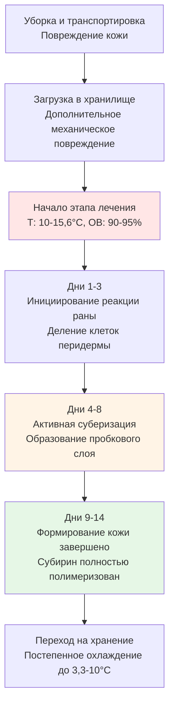

## Физические основы лечения картофеля

Лечение картофеля — это контролируемый экологический процесс, который ускоряет заживление ран путем суберизации — образования защитного пробкового слоя (субирина) на разрезанных и потертых поверхностях. Этот биохимический процесс в критической степени зависит от температуры и относительной влажности, что делает точное управление HVAC необходимым для успешного экономического хранения.

### Кинетика заживления ран

Скорость отложения субирина следует температурозависимой ферментативной кинетике. Скорость заживления ран можно моделировать с использованием модифицированного соотношения Аррениуса:

$$
r_{healing} = A \cdot e^{-\frac{E_a}{RT}} \cdot f(RH)
$$

Где:
- $r_{healing}$ = скорость заживления ран (мкм/день)
- $A$ = предэкспоненциальный множитель (зависит от сорта)
- $E_a$ = энергия активации суберизации (обычно 45-55 кДж/моль)
- $R$ = универсальная газовая постоянная (8,314 Дж/моль·К)
- $T$ = абсолютная температура (К)
- $f(RH)$ = коэффициент коррекции влажности

Коэффициент коррекции влажности демонстрирует пороговый отклик:

$$
f(RH) = \begin{cases}
0.2 & \text{если } RH < 85\% \\
1.0 & \text{если } 90\% \leq RH \leq 95\% \\
0.6 & \text{если } RH > 98\%
\end{cases}
$$

При температуре 10-15,6°C оптимальные условия обеспечивают скорость заживления 8-12 мкм/день, что завершает образование кожи за 10-14 дней для ран глубиной до 100-150 мкм.

### Термодинамические соображения

Среда лечения должна уравновешивать три конкурирующих требования:

1. **Генерация метаболического тепла**: Дыхание производит 1,4-1,8 кВт на 100 кг картофеля при температурах лечения
2. **Испарительное охлаждение**: Потеря воды охлаждает клубни, но снижает реализуемый выход
3. **Предотвращение конденсации**: Поверхностная влага способствует развитию бактериальной мягкой гнили

Соотношение явного тепла во время лечения обычно составляет 0,4-0,5, что указывает на существенную скрытую нагрузку от дыхания и необходимого поддержания поверхностной влаги.

## Требования к проектированию системы HVAC

### Управление температурой

Поддерживайте температуру 10-15,6°C по всему объему хранилища с пространственной равномерностью ±1,1°C. Оптимальная температура лечения представляет компромисс:

- **Ниже 10°C**: Ферментативная активность замедляется, продление времени лечения за пределами экономической целесообразности
- **Выше 15,6°C**: Скорости дыхания увеличиваются, способствуя прорастанию и развитию патогенов

Температура подаваемого воздуха должна быть в пределах 1,7-2,8°C от установки хранилища, чтобы предотвратить локальное переохлаждение в точках выхода воздуха.

### Управление влажностью

Целевая относительная влажность 90-95% создает насыщенный пограничный слой, необходимый для синтеза субирина без скопления свободной воды. Психрометрическое требование:

$$
RH_{target} = \frac{p_{v,air}}{p_{sat}(T_{surface})} \times 100\%
$$

Где:
- $p_{v,air}$ = парциальное давление пара в основном воздухе
- $p_{sat}(T_{surface})$ = давление насыщения на поверхности картофеля

Достичь этого через:
- **Системы увлажнения** (паровые или испарительные) когда точка росы наружного воздуха низкая
- **Минимальное количество воздухообменов** (0,5-1,0 ACH) для сохранения влаги
- **Режим рециркуляции** (90-95% рециркулируемого воздуха)

### Стратегия вентиляции

Скорость воздуха над штабелями картофеля должна быть 0,075-0,125 м/с для:
- Равномерного распределения температуры
- Предотвращения накопления CO₂ (поддержание <5000 ppm)
- Избежания чрезмерного испарительного высыхания

Требуемая скорость воздушного потока:

$$
\text{м}^3/\text{ч} = \frac{Q_{total}}{1.08 \times \Delta T}
$$

Для хранилища на 450 т с общей нагрузкой 1160 кВт и повышением температуры 1,7°C:

$$
\text{м}^3/\text{ч} = \frac{1160}{1.08 \times 1.7} = 630 \text{ м}^3/\text{ч (371 CFM)}
$$

## Этапы процесса лечения

## Сравнение протоколов лечения

| Параметр | Быстрое лечение | Стандартное лечение | Продленное лечение | Неадекватное |
|-----------|-----------|---------------|---------------|------------|
| **Температура** | 15,6-18,3°C | 10-15,6°C | 7,2-10°C | <7,2°C |
| **Относительная влажность** | 95-98% | 90-95% | 85-90% | <85% |
| **Продолжительность** | 7-10 дней | 10-14 дней | 14-21 дней | Переменная |
| **Глубина заживления** | 80-100 мкм | 100-150 мкм | 100-120 мкм | <50 мкм |
| **Энергозатраты** | Низкие | Умеренные | Высокие | Очень низкие |
| **Риск болезни** | Повышенный | Минимальный | Низкий | Высокий |
| **Риск прорастания** | Высокий | Низкий | Очень низкий | Низкий |
| **Время хранения** | 4-5 месяцев | 6-8 месяцев | 6-8 месяцев | 2-3 месяца |
| **Потеря веса** | 2-3% | 1,5-2,5% | 1-2% | 0,5-1% |

## Спецификации оборудования

### Мощность охлаждения

Общая тепловая нагрузка состоит из:

$$
Q_{total} = Q_{product} + Q_{respiration} + Q_{ambient} + Q_{equipment}
$$

Для объекта на 227 т:
- Охлаждение продукта (13,3°C до 12,8°C за 14 дней): 3,5 кВт среднее
- Тепло дыхания: 2,2 кВт
- Потери передачи (152 мм изоляции, RSI-5,3): 2,3 кВт
- Тепло вентилятора и инфильтрация: 1,0 кВт
- **Общая расчетная нагрузка**: 9,0 кВт (2,6 т охлаждения)

### Требования увлажнения

Скорость добавления влаги для поддержания 90-95% ОВ:

$$
W_{add} = \frac{\text{м}^3/\text{ч} \times 1.2 \times \Delta W}{60}
$$

Где $\Delta W$ = разница между наружной и целевой характеристикой влажности (кг/кг).

Для 680 м³/ч с наружными условиями 4,4°C, 60% ОВ, поступающими в хранилище с целевой температурой 12,8°C:
- Наружное соотношение влажности: 0,0021 кг/кг
- Целевое соотношение влажности (12,8°C, 92% ОВ): 0,0055 кг/кг
- $\Delta W$ = 0,0034 кг/кг
- Требуемое увлажнение: 0,26 кг/мин или 15,6 кг/ч

### Система управления

Реализуйте последовательность управления с поэтапным включением:

1. **Первичное управление**: Модулирующее охлаждение для поддержания 12,8°C ± 0,6°C
2. **Вторичное управление**: Ступени увлажнителя включение/выключение на основе установки 90-95% ОВ
3. **Безопасный режим переключения**: Сигнал тревоги высокой температуры (>16,7°C) запускает максимальное охлаждение
4. **Вентиляция**: Поступление свежего воздуха на основе времени (2-4 часа в день) для управления CO₂

## Мониторинг производительности

Непрерывно отслеживайте эти параметры:
- **Температура**: Несколько датчиков в верхней, средней и нижней части штабеля
- **Относительная влажность**: Аспирируемые датчики в воздуховоде возврата
- **Концентрация CO₂**: Еженедельный отбор проб или непрерывный мониторинг
- **Потеря веса**: Периодическое отбор проб для проверки <3% общей потери во время лечения

Успешное лечение производит плотные, сухие клубни с полным образованием кожи, готовые к переходу на долгосрочное хранение при 3,3-10°C в зависимости от предполагаемого использования (свежий рынок, переработка или семена).

## Типичные ошибки проектирования

Избегайте этих ошибок:
- **Недостаточная мощность увлажнения**: Приводит к чрезмерной потере веса и неполному заживлению
- **Плохое распределение воздуха**: Создает температурную стратификацию и непостоянное качество лечения
- **Чрезмерная подача свежего воздуха**: Удаляет влагу быстрее, чем увлажнители могут восполнить
- **Быстрое охлаждение**: Инициирует фазу хранения до завершения заживления ран
- **Неадекватный мониторинг**: Не обнаруживает неисправности оборудования во время критического периода лечения

Фаза лечения определяет успех хранения на весь сезон. Правильное проектирование HVAC обеспечивает равномерное заживление ран, минимизирует развитие болезней и максимизирует реализуемый выход.
