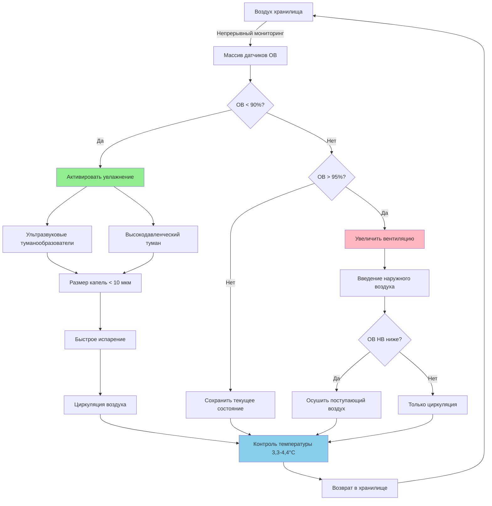

## Физические принципы хранения картофеля при контролируемой влажности

Хранение картофеля при относительной влажности 90-95% представляет критический порог, при котором равновесие давления насыщенного пара между поверхностью клубня и окружающим воздухом минимизирует потери веса, вызванные транспирацией, при одновременном предотвращении конденсации, способствующей бактериальной мягкой гнили и грибковым заболеваниям.

Передача влаги из клубней картофеля подчиняется первому закону Фика о диффузии, где поток массы зависит от градиента давления пара между поверхностью клубня (по сути 100% ОВ на испаряющейся поверхности) и воздухом хранилища. При 90-95% ОВ этот градиент остается минимальным, снижая потери веса до 0,3-0,5% в месяц в сравнении с потерями 3-5% в месяц при 80% ОВ.

### Градиент давления водяного пара

Движущая сила для потери влаги из хранящегося картофеля:

$$\Delta P_v = P_{sat}(T_{surface}) - \phi \cdot P_{sat}(T_{air})$$

Где:
- $\Delta P_v$ = разница давления пара (Па)
- $P_{sat}(T_{surface})$ = давление насыщенного пара на поверхности клубня (Па)
- $\phi$ = относительная влажность воздуха хранилища (0,90-0,95 для оптимального хранения)
- $P_{sat}(T_{air})$ = давление насыщенного пара при температуре воздуха (Па)

### Расчет потерь веса

Процентные потери веса в месяц на основе дефицита давления пара:

$$W_{loss} = \frac{k \cdot A \cdot \Delta P_v \cdot t}{\rho_{potato} \cdot V} \times 100$$

Где:
- $W_{loss}$ = процент потерь веса
- $k$ = коэффициент массопередачи (типично 2-4 × 10⁻⁸ кг/(м²·с·Па) для картофеля)
- $A$ = площадь поверхности кучи картофеля (м²)
- $t$ = время хранения (секунды)
- $\rho_{potato}$ = объемная плотность картофеля (650-700 кг/м³)
- $V$ = объем кучи картофеля (м³)

При температуре хранения 3,3-4,4°C:
- **95% ОВ**: $\Delta P_v$ ≈ 40 Па, потери веса ≈ 0,3%/месяц
- **90% ОВ**: $\Delta P_v$ ≈ 80 Па, потери веса ≈ 0,5%/месяц
- **85% ОВ**: $\Delta P_v$ ≈ 120 Па, потери веса ≈ 1,2%/месяц
- **80% ОВ**: $\Delta P_v$ ≈ 160 Па, потери веса ≈ 2,5%/месяц

## Расчет системы контроля влажности

## Влияние относительной влажности на качество хранящегося картофеля

| Диапазон ОВ | Потери веса/месяц | Состояние кожуры | Риск заболевания | Прорастание | Продолжительность хранения |
|----------|-------------------|----------------|--------------|-----------|------------------|
| 95-98% | 0,2-0,3% | Отличное, без сморщивания | **Высокий** - конденсация способствует мягкой гнили | Нормальное | 6-8 месяцев |
| **90-95%** | **0,3-0,5%** | **Отличное, минимальное сморщивание** | **Низкий** - оптимальный баланс | **Нормальное** | **8-10 месяцев** |
| 85-90% | 0,8-1,2% | Хорошее, незначительное сморщивание | Низкий | Слегка ускоренное | 6-8 месяцев |
| 80-85% | 2,0-2,5% | Удовлетворительное, видимое сморщивание | Очень низкий | Ускоренное | 4-6 месяцев |
| 75-80% | 3,5-4,5% | Плохое, сильное сморщивание | Очень низкий | Быстрое | 2-4 месяца |
| < 75% | > 5,0% | Неприемлемое, высыхание | Минимальный | Быстрое, затем спячка | < 2 месяцев |

## Психрометрический анализ

При оптимальных условиях хранения картофеля (3,9°C, 92,5% ОВ):
- Температура сухого термометра: 3,9°C
- Температура влажного термометра: 3,5°C
- Точка росы: 3,2°C
- Удельная влажность: 5,35 г/кг
- Энтальпия: 19,1 кДж/кг

Узкий температурный диапазон между сухим и влажным термометрами (0,7°C) требует точного контроля температуры для предотвращения конденсации на поверхности клубней при сохранении высокой влажности воздуха.

## Требования к системе увлажнения

**Требуемая скорость добавления влаги**:

$$\dot{m}_w = \dot{V} \cdot \rho_{air} \cdot (\omega_{target} - \omega_{supply})$$

Для хранилища объемом 1,414 м³ с 2 воздухообменами в час:
- $\dot{V}$ = 2,832 м³/мин
- $\rho_{air}$ = 1,19 кг/м³ при 3,9°C
- $\omega_{target}$ = 5,35 г/кг (92,5% ОВ)
- $\omega_{supply}$ = 4,29 г/кг (75% ОВ при 3,9°C наружного воздуха)

$$\dot{m}_w = 2,832 \times 1,19 \times (5,35 - 4,29) = 3,60 \text{ кг/мин} = 5,18 \text{ л/день}$$

## Технологии увлажнения

**Ультразвуковые туманообразователи**:
- Размер капель: 1-5 мкм (мгновенно испаряется без увлажнения поверхности)
- Энергоэффективность: 1-2 кВт на 4,5 кг/ч производительности
- Минимальное добавление тепла: < 0,03 кДж/с на единицу туманообразователя
- Точный контроль ОВ: ±2% точность при ступенчатом режиме работы

**Высокодавленческое туманообразование**:
- Рабочее давление: 5,5-8,3 МПа
- Размер капель: 10-15 мкм (быстрое испарение при низкой скорости воздуха)
- Требуемая мощность: 3-5 кВт на 4,5 кг/ч производительности
- Равномерность распределения: отличная в системах с принудительной циркуляцией воздуха

**Испарительные материалы**:
- Не рекомендуется для хранения картофеля из-за риска превышения целевой ОВ
- Сложно поддерживать 90-95% без превышения порога конденсации

## Взаимодействие температуры и влажности

Связь между температурой и безопасной максимальной влажностью:

$$RH_{max} = 100 \times \left(1 - \frac{\Delta T_{safety}}{T_{dewpoint} - T_{air}}\right)$$

Где $\Delta T_{safety}$ = 1,1-1,7°C минимальный температурный перепад для предотвращения конденсации на поверхности при циклировании циркуляции воздуха.

При температуре воздуха 3,9°C с запасом безопасности 1,1°C:
- Максимальная безопасная ОВ ≈ 94-95%
- Ниже этого порога локальные холодные точки не будут иметь конденсацию
- Скорость воздуха по поверхности клубней должна оставаться ниже 0,25 м/с для предотвращения конвективного охлаждения

## Стратегия мониторинга и управления

**Размещение датчиков**:
- Минимум 4 датчика на 283 м³ объема хранилища
- Вертикальная стратификация: датчики у пола, на средней высоте и под потолком
- Горизонтальное распределение: углы и центральные зоны
- Требуемая точность: ±2% ОВ, ±0,3°C температуры

**Логика управления**:
- Основной диапазон управления: 91-94% ОВ (зона гистерезиса предотвращает избыточное циклирование)
- Увлажнение активируется ниже 91% ОВ
- Увеличение вентиляции активируется выше 94% ОВ
- Интегральное время: движущееся среднее 5 минут для фильтрации переходных колебаний

**Блокировки безопасности**:
- Отключить увлажнение, если какой-либо датчик превышает 96% ОВ
- Аварийная вентиляция при 97% ОВ, поддерживаемой 10 минут
- Обнаружение конденсации через датчики влажности листьев на поверхности клубней

## Экономическое воздействие контроля влажности

Для 453,6 т хранящегося картофеля в течение 8 месяцев:

| Поддерживаемая ОВ | Потери веса | Экономический ущерб (@0,27 р./кг) | Премия стоимости системы |
|---------------|-------------|---------------------------|---------------------|
| 90-95% | 0,4% (1,814 кг) | 490 р. | Базовая линия |
| 85-90% | 1,0% (4,536 кг) | 1,225 р. | -20,400 р. начальные |
| 80-85% | 2,2% (9,979 кг) | 2,695 р. | -33,900 р. начальные |

Инвестиция в высокоточные системы увлажнения (54,000-81,000 р. для хранилища объемом 1,414 м³) обеспечивает окупаемость в течение одного сезона хранения благодаря снижению потерь от усадки.

## Оптимизация скорости вентиляции

Введение свежего воздуха должно сбалансировать:
- Удаление тепла дыхания: 0,35-0,58 кДж/кг/день от метаболизма картофеля
- Удаление CO₂: сохранять ниже 5,000 ppm для предотвращения физиологического повреждения
- Контроль влажности: минимизировать сухой наружный воздух, требующий повторного увлажнения

Оптимальная скорость вентиляции:

$$CFM_{ventilation} = \max\left(\frac{Q_{respiration}}{1.08 \times \Delta T}, \frac{V_{storage}}{ACH_{min}}\right)$$

Где ACH_min = 1-2 воздухообмена в час при активном хранении, 4-6 воздухообменов в час при начальном охлаждении.

---

**Файл**: `/Users/evgenygantman/Documents/github/gantmane/hvac/content/specialty-applications-testing/specialty-hvac-applications/farm-crops-processing/potato-storage/rh-90-95-percent/_index.md`

**Краткое содержание**: Комплексное техническое руководство охватывает физико-технический расчет систем HVAC для хранения картофеля при 90-95% относительной влажности, включая расчеты давления пара, формулы потерь веса, психрометрический анализ, расчет размера систем увлажнения и стратегии управления для оптимизации качества хранения при минимизации экономических потерь.
