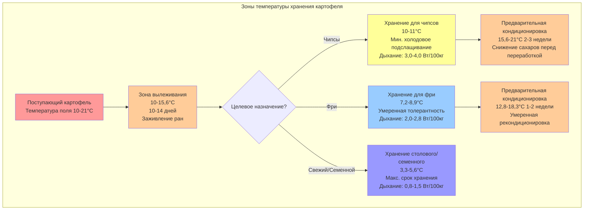

Требования к температуре хранения картофеля варьируются от 3,3°C до 10°C в зависимости от целевого назначения, что обусловлено термодинамической зависимостью между температурой и скоростью биохимических реакций. Основная инженерная задача заключается в балансе между скоростью физиологического дыхания (которое генерирует тепло) и холодовым подслащиванием (которое делает клубни непригодными для переработки).

## Термодинамика дыхания

Клубни картофеля остаются метаболически активными после сбора урожая, потребляя кислород и выделяя углекислый газ, водяной пар и тепло. Скорость дыхания следует кинетике Аррениуса:

$$k = A e^{-\frac{E_a}{RT}}$$

Где:
- $k$ = скорость дыхания (мг CO₂/кг·ч)
- $A$ = предэкспоненциальный множитель (частотный фактор)
- $E_a$ = энергия активации (обычно 50-70 кДж/моль для дыхания картофеля)
- $R$ = универсальная газовая постоянная (8,314 Дж/моль·К)
- $T$ = абсолютная температура (К)

Скорость генерации тепла от дыхания приблизительно равна:

$$Q_{resp} = m \cdot k \cdot \Delta H_{comb}$$

Где:
- $Q_{resp}$ = тепловая нагрузка от дыхания (Вт)
- $m$ = масса картофеля (кг)
- $k$ = скорость дыхания (кг CO₂/кг·с)
- $\Delta H_{comb}$ = теплота сгорания (~450 кДж/моль CO₂ для окисления углеводов)

Для практических расчетов нагрузки HVAC генерация тепла от дыхания составляет от 0,8 до 1,2 Вт на 100 кг при 3,3°C до 2,5-4,0 Вт на 100 кг при 10°C, что представляет собой увеличение в 3-4 раза в этом температурном диапазоне.

## Механизм холодового подслащивания

Ниже 10°C картофель проявляет холодовое подслащивание — ферментативное превращение крахмала в восстанавливающие сахара (глюкозу и фруктозу). Это происходит потому, что низкие температуры ингибируют активность синтазы сахарозо-фосфата, в то время как активность амилазы сохраняется. Температурный коэффициент (Q₁₀) для этой конверсии составляет примерно 2-3, что означает удвоение или утроение скоростей реакции при каждом повышении температуры на 10°C.

При переработке картофеля, хранящегося ниже 7,2°C, в процессе жарки или выпечки восстанавливающие сахара вступают в реакции Майяра с аминокислотами, что приводит к темно-коричневой дисколорации и горьковатому привкусу. Это делает выбор температуры критически важным для приложений переработки.

## Требования к температуре по целевому назначению

| Целевое назначение | Температура хранения | Диапазон ВЛ | Порог сахаров | Физиологическое обоснование |
|---------|-----|------------|--------------|-------|
| **Переработка чипсов** | 10-11°C | 90-95% | <0,25% восстанавливающих сахаров | Предотвращение холодового подслащивания; поддержание качества жарки |
| **Переработка картофеля фри** | 7,2-8,9°C | 90-95% | <0,30% восстанавливающих сахаров | Баланс между твердостью и цветом; умеренная толерантность к подслащиванию |
| **Свежий рынок (столовый)** | 3,3-5,6°C | 90-95% | Не критично | Максимальное увеличение срока хранения; сладость допустима |
| **Семенной картофель** | 3,3-4,4°C | 90-95% | Не критично | Поддержание покоя; предотвращение прорастания |
| **Раннее хранение (вылеживание)** | 10-15,6°C | 90-95% | Н/Д | Стимулирование заживления ран через образование суберина |

## Термическая стратификация зоны хранения

## Соображения по проектированию системы HVAC

**Компоненты нагрузки на охлаждение:**

Общая охлаждающая нагрузка состоит из:

$$Q_{total} = Q_{resp} + Q_{field} + Q_{infiltration} + Q_{envelope}$$

Для хранилища объемом 10 000 цвт (453 600 кг):

**Распределение воздуха:**

Поддерживайте скорость воздуха через картофельную насыпь в диапазоне 0.2–0.4 м/с (40–80 фут/мин), чтобы обеспечить равномерное распределение температуры, избегая при этом чрезмерного удаления влаги. Коэффициент конвективной теплоотдачи при этих скоростях:

$$h_c = 10.45 - v + 10v^{0.5}$$

где $v$ — скорость воздуха в м/с, что дает значение $h_c$ в диапазоне 12–18 Вт/(м²·К) для типичных условий хранения.

**Контроль влажности:**

Поддерживайте относительную влажность 90–95%, чтобы предотвратить потерю массы, избегая при этом конденсации. Скорость потери массы описывается уравнением:

$$\frac{dm}{dt} = -h_m \cdot A \cdot (P_{sat,surface} - P_{air})$$

где $h_m$ — коэффициент массоотдачи (связан с $h_c$ соотношением Льюиса), $A$ — площадь поверхности, а разность давлений пара является движущей силой потери влаги. При относительной влажности ниже 90% картофель теряет 0.5–1.0% массы в месяц; при относительной влажности выше 98% конденсация способствует развитию бактериальной мягкой гнили.

## Стратегия контроля температуры

Современные хранилища картофеля используют регулируемые системы охлаждения с точным контролем температуры (±0.3°C) и протоколами постепенного снижения температуры:

1. **Первичное заживление (вылеживание):** 10–15.6°C в течение 10–14 дней для формирования слоя суберина на ранах
2. **Постепенное охлаждение:** снижение на 0.3–0.6°C в день до целевой температуры хранения
3. **Фаза поддержания:** удержание заданной температуры с минимальными колебаниями
4. **Подготовка к переработке:** нагрев до 15.6–21.1°C со скоростью 0.3–0.6°C в день для ферментативного снижения накопленных сахаров

Медленные темпы изменения температуры предотвращают образование конденсата на поверхности клубней и позволяют скоростям дыхания адаптироваться постепенно, минимизируя физиологический стресс.

## Стандарты и ссылки

Рекомендации по температуре хранения основаны на стандарте ASABE S557 «Проектирование и управление хранилищами картофеля» и исследованиях университетских служб поддержки (Университет Айдахо, Университет штата Вашингтон, Корнель). Спецификации перерабатывающей промышленности обычно требуют:

- Картофель для чипсов: содержание восстанавливающих сахаров <0.20% по данным колориметрического анализа
- Картофель для жарки: содержание восстанавливающих сахаров <0.30% и значение цвета L* >60 после жарки

Эти спецификации напрямую ограничивают допустимые диапазоны температур хранения и требуют стратегий климат-контроля, специфичных для конечного использования.
