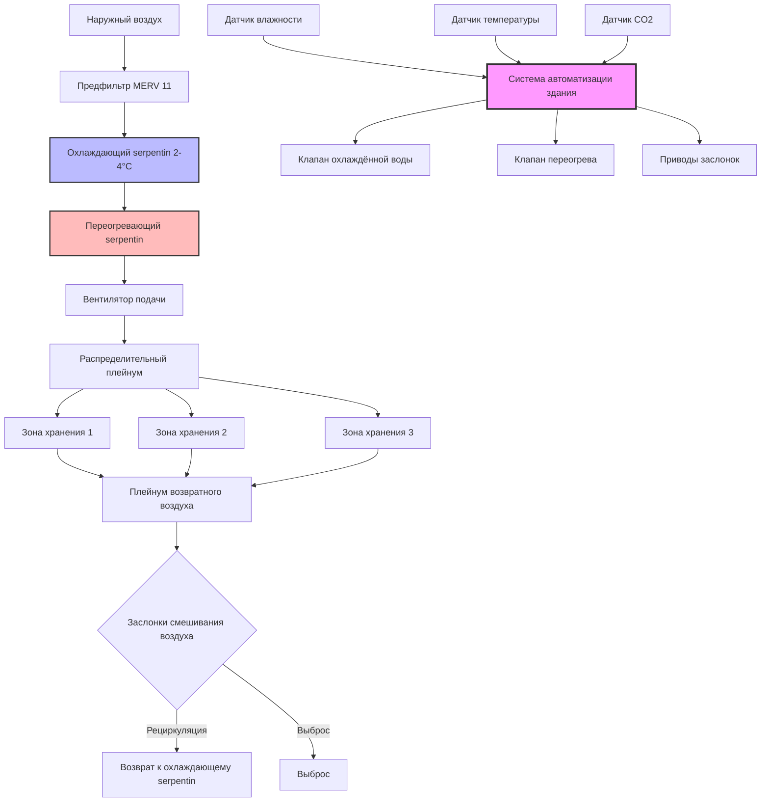

# Системы HVAC для объектов хранения семян

Хранение семян представляет одно из наиболее критичных применений точного климатического контроля в сельском хозяйстве. Фундаментальная задача заключается в сохранении жизнеспособности семян путём контроля скорости биохимического порчи, которая удваивается при каждом увеличении содержания влаги в семенах на 1% или при повышении температуры на 5°C от исходных условий.

## Физические принципы хранения семян

### Динамика равновесного содержания влаги

Семена — гигроскопичные материалы, которые постоянно обмениваются влагой с окружающим воздухом до достижения равновесия. Равновесное содержание влаги (ЕМС) зависит от относительной влажности, температуры и состава семян согласно модифицированному уравнению Хендерсона:

$$\text{EMC} = \left[\frac{-\ln(1-\text{RH}/100)}{A \cdot (T+C)}\right]^{1/B}$$

Где:
- EMC = равновесное содержание влаги (% по влажности)
- RH = относительная влажность (%)
- T = температура (°C)
- A, B, C = эмпирические константы, специфичные для типа семян

Для большинства сельскохозяйственных семян:
- A = 8,0 × 10⁻⁵
- B = 1,8–2,2
- C = 49,81

Связь между содержанием влаги в семенах и сроком хранения следует эмпирическому правилу Харрингтона:

$$\text{Storage Life} = K \cdot 2^{-(M+T/5)}$$

Где K — константа, M — содержание влаги (%), T — температура (°C). Эта экспоненциальная зависимость требует точного климатического контроля.

### Передача тепла и влаги

Скорость переноса влаги между семенем и воздухом подчиняется закону диффузии Фика:

$$\frac{dm}{dt} = -D \cdot A \cdot \frac{dC}{dx}$$

Где D — коэффициент диффузии (м²/с), A — площадь поверхности (м²), dC/dx — градиент концентрации. Повышение температуры увеличивает коэффициенты диффузии по экспоненте согласно уравнению Аррениуса:

$$D = D_0 \cdot e^{-E_a/RT}$$

Это создаёт положительную обратную связь, при которой выделение тепла от дыхания семян ускоряет миграцию влаги и дальнейшую порчу.

## Архитектура системы HVAC

### Глубокое осушение с переогревом

Система использует переохлаждение для удаления влаги значительно ниже точки росы с последующим контролируемым переогревом для достижения целевых условий. Требуемая температура на выходе из охлаждающего serpentin рассчитывается из психрометрических зависимостей:

$$T_{\text{coil}} = T_{\text{dp}} - \Delta T_{\text{approach}}$$

Где температура точки росы получена из уравнения Антуана:

$$T_{\text{dp}} = \frac{B}{\ln(A/P_v) - C}$$

Для водяного пара: A = 8,07131, B = 1730,63, C = 233,426, с давлением пара в мм рт. ст.

Нагрузка переогрева зависит от коэффициента чувствительного тепла и общего охлаждения:

$$Q_{\text{reheat}} = Q_{\text{total}} \cdot (1 - \text{SHR}) \cdot \frac{\Delta T_{\text{reheat}}}{T_{\text{coil}} - T_{\text{space}}}$$

## Требования к условиям хранения по типам семян

| Тип семян | Температура (°C) | Относительная влажность (%) | Целевое содержание влаги (% по влажности) | Максимальная продолжительность хранения (лет) | Воздухообмены в час |
|-----------|------------------|----------------------|-------------------------------|----------------------------------|------------------|
| Зерновые культуры (пшеница, кукуруза) | 5–10 | 50–60 | 10–12 | 5–10 | 2–4 |
| Соя | 5–10 | 50–60 | 11–13 | 3–5 | 2–4 |
| Овощные семена | 5–10 | 25–35 | 5–8 | 3–5 | 4–6 |
| Семена деревьев (ортодоксальные) | 0–5 | 30–40 | 6–9 | 10–20 | 1–2 |
| Семена цветов | 10–15 | 35–45 | 6–8 | 2–4 | 3–5 |
| Семена трав | 5–10 | 40–50 | 8–10 | 5–8 | 2–4 |
| Масличные культуры (подсолнечник, рапс) | 0–5 | 40–50 | 7–9 | 1–3 | 3–5 |

## Проектные соображения

### Анализ психрометрических процессов

Процесс кондиционирования воздуха следует пути на психрометрической диаграмме:

1. **Охлаждение и осушение**: Смешанный воздух пересекает линию насыщения в точке аппарата точки росы
2. **Переогрев**: Постоянная абсолютная влажность с увеличением температуры сухого термометра
3. **Кондиционирование помещения**: Чувствительное тепловыделение от дыхания семян и инфильтрации

Коэффициент обхода влияет на производительность:

$$\text{BF} = \frac{T_{\text{leaving}} - T_{\text{ADP}}}{T_{\text{entering}} - T_{\text{ADP}}}$$

Целевые коэффициенты обхода находятся в диапазоне 0,05–0,10 для приложений хранения семян, требуя 10–20 рядов глубины охлаждающего serpentin.

### Стратегия вентиляции и рециркуляции

Подача наружного воздуха должна быть минимизирована в периоды высокой влажности, но увеличена во время благоприятных условий. Оптимальная доля наружного воздуха определяется сравнением энтальпии:

$$\text{OA}_{\text{fraction}} = \begin{cases}
0,10 & \text{если } h_{\text{outdoor}} > h_{\text{return}} \\
0,50 & \text{если } h_{\text{outdoor}} < h_{\text{return}} \text{ и RH}_{\text{outdoor}} < 50\%
\end{cases}$$

Эта стратегия экономайзера снижает охлаждающую нагрузку и одновременно удаляет газы дыхания семян (CO₂, этилен).

### Расчёт нагрузок

Чувствительное тепло от дыхания семян:

$$Q_{\text{resp}} = m_{\text{seed}} \cdot R_{\text{resp}} \cdot h_{\text{fg}}$$

Где скорость дыхания (R_resp) составляет приблизительно 0,001–0,01 кг H₂O/(кг·сут) в зависимости от содержания влаги и температуры, h_fg = 2450 кДж/кг при типичных условиях хранения.

Общая охлаждающая нагрузка включает:

- Дыхание семян: 5–15 Вт/м³
- Передача через стены/кровлю: 10–25 Вт/м²
- Инфильтрация: 0,5–1,0 воздухообмена в час
- Освещение и оборудование: 3–8 Вт/м²
- Персонал (периодически): 100 Вт/человек

### Архитектура системы управления

Многоступенчатая последовательность управления:

1. **Ступень 1** (RH < уставка + 2%): Модуляция клапана охлаждённой воды, минимальный переогрев
2. **Ступень 2** (RH > уставка + 2%): Максимальное охлаждение, пропорциональное управление переогревом
3. **Ступень 3** (RH > уставка + 5%): Включение специального осушителя на основе десиканта
4. **Аварийная** (RH > уставка + 8%): Увеличение интенсивности вентиляции, активизация резервного осушения

Управление температурой работает независимо с мёртвой зоной ±0,5°C для предотвращения чрезмерных переключений.

## Стандарты и источники

Проектирование и эксплуатация объектов хранения семян следуют:

- **ASAE S352.2**: Измерение влажности для необработанного зерна и семян
- **ASAE D245.6**: Связи влаги для растительных сельскохозяйственных продуктов
- **ASHRAE Applications Handbook Chapter 25**: Хранение сельскохозяйственной продукции
- **ISTA Rules**: Международные правила тестирования семян для хранения
- **FAO Seed Storage Guidelines**: Рекомендации по температуре и влажности по типам культур

Сумма температуры (°C) и относительной влажности (%) не должна превышать 100 при длительном хранении и предпочтительно должна оставаться ниже 80 для максимального сохранения жизнеспособности. Это эмпирическое правило соответствует типичным условиям 10°C и 50% RH или 5°C и 60% RH для ортодоксальных семян.

Поддержание этих условий требует непрерывного мониторинга с помощью откалиброванной аппаратуры (точность ±0,5°C, ±2% RH) и резервной ёмкости осушения для обеспечения непрерывной защиты генетических ресурсов и коммерческих запасов семян.
