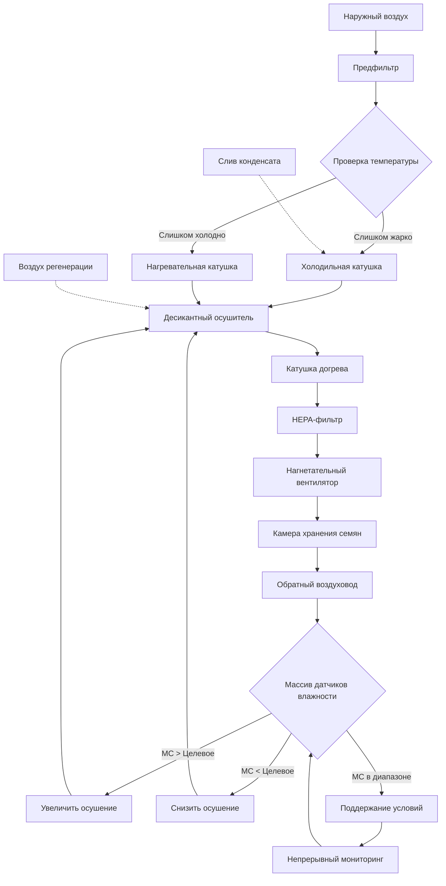

## Физические принципы равновесной влажности семян

Содержание влаги в семенах представляет собой критический баланс между их жизнеспособностью и деградацией. Семена, хранящиеся в диапазоне влажности 5–13%, поддерживают метаболический покой, сохраняя при этом всхожесть. Это состояние равновесия зависит от термодинамической взаимосвязи между активностью воды в семени и относительной влажностью окружающего воздуха.

Равновесное содержание влаги (EMC) семян подчиняется сорбционным изотермам, описываемым уравнением Хендерсона:

$$
M = \left[\frac{\ln(1-RH)}{-A(T+C)}\right]^{1/B}
$$

Где:
- $M$ = равновесное содержание влаги (доля, на сухое вещество)
- $RH$ = относительная влажность (доля)
- $T$ = температура (°C)
- $A, B, C$ = эмпирические константы, специфичные для типа семян

Взаимосвязь между активностью воды ($a_w$) и относительной влажностью определяет движущую силу миграции влаги:

$$
a_w = \frac{p}{p_s} = \frac{RH}{100}
$$

Где $p$ — давление пара на поверхности семени, а $p_s$ — давление насыщенного пара при температуре хранения.

## Требования к содержанию влаги по типам семян

Различные классификации семян требуют целевых показателей содержания влаги, основанных на их биохимическом составе и чувствительности к хранению:

| Категория семян | Оптимальная влажность (%) | Температура хранения (°C) | Макс. RH (%) | Длительность хранения |
|------|---------------|-------------------|------|------------------|
| Зерновые (пшеница, ячмень) | 12-13 | 4-10 | 60-65 | 12-18 месяцев |
| Масличные (соя, подсолнечник) | 8-9 | 1,7-7,2 | 50-55 | 8-12 месяцев |
| Бобовые (горох, фасоль) | 10-12 | 4-10 | 55-60 | 10-15 месяцев |
| Овощные семена (томат, перец) | 5-8 | 1,7-7,2 | 40-50 | 18-36 месяцев |
| Семена гибридной кукурузы | 10-12 | 4-10 | 55-60 | 8-10 месяцев |
| Мелкие зерновые (рапс, горчица) | 8-10 | 1,7-7,2 | 50-55 | 12-18 месяцев |

## Психрометрические основы хранения семян

Поддержание целевого содержания влаги требует точного контроля температуры воздуха и относительной влажности. Взаимосвязь этих параметров определяет скорость переноса влаги между семенами и средой хранения.

Скорость изменения влаги подчиняется второму закону Фика для диффузии:

$$
\frac{\partial M}{\partial t} = D_{eff} \nabla^2 M
$$

Где $D_{eff}$ — эффективный коэффициент диффузии влаги, зависящий от температуры согласно уравнению Аррениуса:

$$
D_{eff} = D_0 \exp\left(\frac{-E_a}{RT}\right)
$$

При этом $E_a$ — энергия активации (обычно 25–45 кДж/моль для семян), $R$ — универсальная газовая постоянная (8,314 Дж/(моль·К)), а $T$ — абсолютная температура.

## Проектирование систем ОВКВ для контроля влажности

## Критические параметры проектирования

**Производительность по осушению**

Рассчитайте требуемую скорость удаления влаги:

$$
\dot{m}_{water} = \dot{V} \rho_{air} (W_1 - W_2)
$$

Где $\dot{V}$ — объемный расход воздуха, $\rho_{air}$ — плотность воздуха, а $W_1, W_2$ — коэффициенты влажности (кг воды/кг сухого воздуха) на входе и выходе.

**Кратность воздухообмена**

Склады для хранения семян требуют 2–4 воздухообменов в час во время активной кондиционирования, снижаясь до 0,5–1 ACH во время стабильного хранения:

$$
ACH = \frac{Q_{supply}}{V_{storage}}
$$

**Взаимодействие температуры и влажности**

Уравнение жизнеспособности Робертса-Эллиса количественно оценивает долговечность семян в зависимости от влажности и температуры:

$$
v = K_E - C_H \log_{10}(M) - C_T T - C_Q T^2
$$

Где $v$ — период хранения до потери 50% всхожести, а $C_H, C_T, C_Q$ — видоспецифичные константы.

## Стратегии управления для прецизионного контроля влажности

**Системы осушения с использованием силикагеля**

Десикантные колеса обеспечивают точный контроль точки росы независимо от температуры, что необходимо для достижения условий с относительной влажностью ниже 50%. Температура регенерации обычно составляет 121–177°C с рекуперацией энергии:

$$
\eta_{recovery} = \frac{T_{exhaust} - T_{ambient}}{T_{regeneration} - T_{ambient}}
$$

**Мониторинг и регулирование**

Разместите датчики влажности в нескольких точках внутри хранилищ. Размещение датчиков основано на принципе миграции влаги из более теплых зон в более холодные, что создает вертикальные градиенты. Измерения проводятся в:

- Верхней поверхности (наивысший риск конденсации)
- Средней глубине (среднее значение по объему)
- Нижней зоне (самая холодная область)

**Предотвращение повреждений от пересушивания**

Чрезмерная сушка ниже 5% влажности вызывает растрескивание семенной кожуры и повреждение зародыша. Внедрите системы управления с нижним пределом, которые останавливают осушение при приближении содержания влаги к нижнему порогу:

$$
\Delta P_{crack} = \frac{E \Delta M}{(1-\nu^2)}
$$

Где механическое напряжение ($\Delta P$) в семенной кожуре связано с модулем упругости ($E$), изменением влажности ($\Delta M$) и коэффициентом Пуассона ($\nu$).

## Вопросы энергоэффективности

Системы HVAC для хранения семян работают непрерывно в течение всего срока хранения. Оптимизируйте энергопотребление с помощью:

- Частотно-регулируемых приводов на нагнетательных вентиляторах (снижение энергопотребления на 30–50%)
- Рекуперации тепла от цикла регенерации десиканта
- Ночного охлаждения при благоприятных условиях окружающей среды
- Использования тепловой массы в конструкции здания

Удельное энергопотребление для удаления влаги:

$$
SEC = \frac{E_{total}}{m_{seed} \Delta M}
$$

Обычно составляет от 800 до 1500 кВт·ч на тонну удаленной воды, варьируясь в зависимости от начального содержания влаги и условий окружающей среды.

## Стандарты и протоколы испытаний

Проверка содержания влаги проводится в соответствии со стандартом ASAE S352.2 методом сушки в печи при 103°C в течение 72 часов. Линейные влагомеры требуют калибровки по гравиметрическим методам каждые 30 дней в период активного хранения.

Выбор целевого содержания влаги балансирует между сохранением всхожести и риском развития грибков. При содержании влаги ниже 13% активность грибков прекращается для большинства видов, тогда как ферментативная деградация минимизируется при содержании влаги ниже 8% при температурах ниже 10°C.
