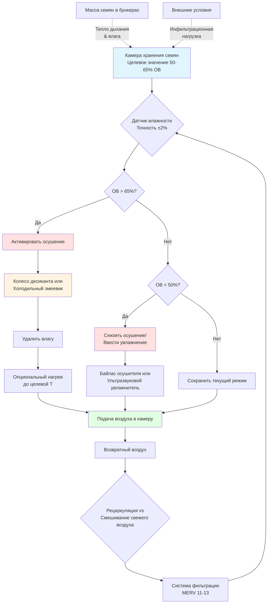

## Физические принципы контроля влажности при хранении семян

Жизнеспособность семян фундаментально зависит от поддержания влажностного равновесия между внутренней частью семени и окружающим воздухом. Гигроскопичная природа семян создает динамический влажностный обмен, управляемый изотермами сорбции, что делает точный контроль относительной влажности критически важным для долгосрочного сохранения.

### Термодинамика влажностного равновесия

Семена достигают содержания влаги при равновесии (СВР) посредством выравнивания давления паров между внутренними клеточными структурами и окружающим воздухом. Эта зависимость следует модифицированному уравнению Хендерсона:

$$\text{СВР} = \left[\frac{-\ln(1-\text{ОВ}/100)}{A \cdot (T+B)}\right]^{1/C}$$

Где:
- СВР = содержание влаги при равновесии (% на сухое основание)
- ОВ = относительная влажность (%)
- T = температура (°C)
- A, B, C = эмпирические константы, специфичные для вида семян

Для большинства сельскохозяйственных семян при 50-65% ОВ и температуре хранения 10-15°C СВР стабилизируется между 8-12% содержанием влаги, оптимальный диапазон, предотвращающий как повреждение высыханием, так и распространение грибков.

### Дыхание семян и выработка тепла

Живые ткани семян продолжают дыхание, вырабатывая метаболическое тепло и влагу в соответствии с:

$$Q_{\text{resp}} = m_s \cdot R_r \cdot f(T) \cdot f(\text{МС})$$

Где:
- $Q_{\text{resp}}$ = тепло дыхания (Вт)
- $m_s$ = масса семян (кг)
- $R_r$ = базовая скорость дыхания (Вт/кг)
- $f(T)$ = функция зависимости от температуры
- $f(\text{МС})$ = функция зависимости от содержания влаги

Поддержание 50-65% ОВ напрямую подавляет $f(\text{МС})$, снижая скорости дыхания на 60-80% по сравнению с условиями 75% ОВ. Это снижает как чувствительную тепловую нагрузку, так и выработку влаги в бункерах хранения.

## Проектирование HVAC-системы для контроля 50-65% ОВ

### Требования психрометрии

HVAC-система должна поддерживать условия приточного воздуха, учитывающие:

1. **Удаление чувствительного тепла**: тепло дыхания плюс солнечные и конструктивные теплопоступления
2. **Удаление скрытого тепла**: выпуск влаги из дыхания семян и возможная конденсация
3. **Требования вентиляции**: введение свежего воздуха без нарушения контроля ОВ

Содержание влаги приточного воздуха должно удовлетворять:

$$\omega_{\text{приток}} = \omega_{\text{помещение}} - \frac{m_{\text{влага}}}{m_{\text{воздух}}}$$

Для 50-65% ОВ при температуре хранения 12°C приточный воздух должен поддерживать 0,0045-0,0060 кг воды/кг сухого воздуха (приблизительно точка росы 5-8°C).

### Стратегии осушения

**Осушение десиккантом**

Предпочтительно для точного контроля в диапазоне 50-65% ОВ, системы с десиккантом обеспечивают:

- Непрерывное удаление влаги независимо от ограничений температуры змеевика
- Возможности рекуперации тепла регенерации
- Минимальные колебания температуры во время контроля влажности

Емкость удаления влаги колесом десиканта:

$$\dot{m}_{\text{вода}} = \dot{V} \cdot \rho_{\text{воздух}} \cdot (\omega_{\text{вход}} - \omega_{\text{выход}})$$

**Системы на основе хладагента с дополнительным нагревом**

Переохлаждение для конденсации влаги, затем повторный нагрев до целевой температуры:

$$Q_{\text{нагрев}} = \dot{m}_{\text{воздух}} \cdot c_p \cdot (T_{\text{финальная}} - T_{\text{змеевик}})$$

Менее энергоэффективно, чем десикант для этого диапазона влажности, но приемлемо для объектов меньшего размера.

## Требования ОВ для различных типов семян

Различные виды семян проявляют различные характеристики влажностного равновесия:

| Тип семян | Оптимальный диапазон ОВ | Целевое СВР | Температура хранения | Макс. длительность хранения |
|-----------|------------------------|------------|----------------------|---------------------------|
| Кукуруза | 55-65% | 10-12% | 10-15°C | 12-18 месяцев |
| Соевые бобы | 50-60% | 9-11% | 8-12°C | 10-15 месяцев |
| Пшеница | 55-65% | 11-13% | 10-15°C | 18-24 месяцев |
| Рис | 50-60% | 10-12% | 12-18°C | 12-18 месяцев |
| Семена овощей | 50-55% | 8-10% | 5-10°C | 24-36 месяцев |
| Семена цветов | 50-60% | 8-11% | 8-12°C | 18-30 месяцев |

### Требования к допускам контроля

Поддержание ОВ в пределах ±5% от уставки предотвращает влажностные циклы, которые ускоряют деградацию семян. Каждое колебание на 10% ОВ вызывает приблизительно 2% изменение СВР, вызывая растяжение-сжатие оболочки семени.

## Схема системы контроля влажности

## Стандарты и передовая практика

**Стандарты ASABE**
- ASABE S352.2: Измерение влажности немолотого зерна и семян
- ASABE D245.6: Влажностные характеристики растительных сельскохозяйственных продуктов

**Требования мониторинга**
- Датчики ОВ: точность ±2%, калибровка квартально
- Датчики температуры: точность ±0,5°C
- Проверка скорости воздуха: минимум 0,15 м/с через массу семян
- Логирование данных: минимум 15-минутные интервалы

**Оптимизация энергии**

Зависимость между температурой хранения и энергией осушения раскрывает:

$$\text{COP}_{\text{осушение}} = \frac{h_{fg}}{h_{\text{регенерация}} - h_{\text{процесс}}}$$

Эксплуатация при более низких температурах (10-12°C vs 20-25°C) снижает дифференциал давления паров, уменьшая энергию осушения на 30-40% при одновременном снижении скоростей дыхания семян.

## Ввод в эксплуатацию и проверка системы

1. **Тестирование однородности**: Проверка <3% вариации ОВ по объему хранилища
2. **Отклик нагрузки**: Подтверждение поддержания уставки системой при максимальной загрузке семян
3. **Контроль инфильтрации**: Испытание давлением объекта на <0,1 воздухообмена в час
4. **Стабильность контроля**: Мониторинг колебаний; настройка ПИД для предотвращения циклирования ОВ

Надлежащая реализация контроля 50-65% ОВ продлевает жизнеспособность семян с 6-8 месяцев (неконтролируемое хранилище) до 18-36 месяцев, сохраняя уровень всхожести выше 85% для коммерческих семенных запасов.

## Заключение

Поддержание 50-65% ОВ на объектах хранения семян требует понимания термодинамики сорбции влаги и применения систем осушения, способных обеспечить точный контроль в этом диапазоне умеренной влажности. Системы на основе десиканта обычно обеспечивают превосходную производительность по сравнению с подходами переохлаждения-повторного нагрева на основе хладагента, обеспечивая энергоэффективную работу при предотвращении повреждения влажностными циклами. В сочетании с контролем температуры при 8-15°C этот диапазон ОВ оптимизирует физические условия для долгосрочного сохранения семян у большинства сельскохозяйственных и садоводческих видов.
