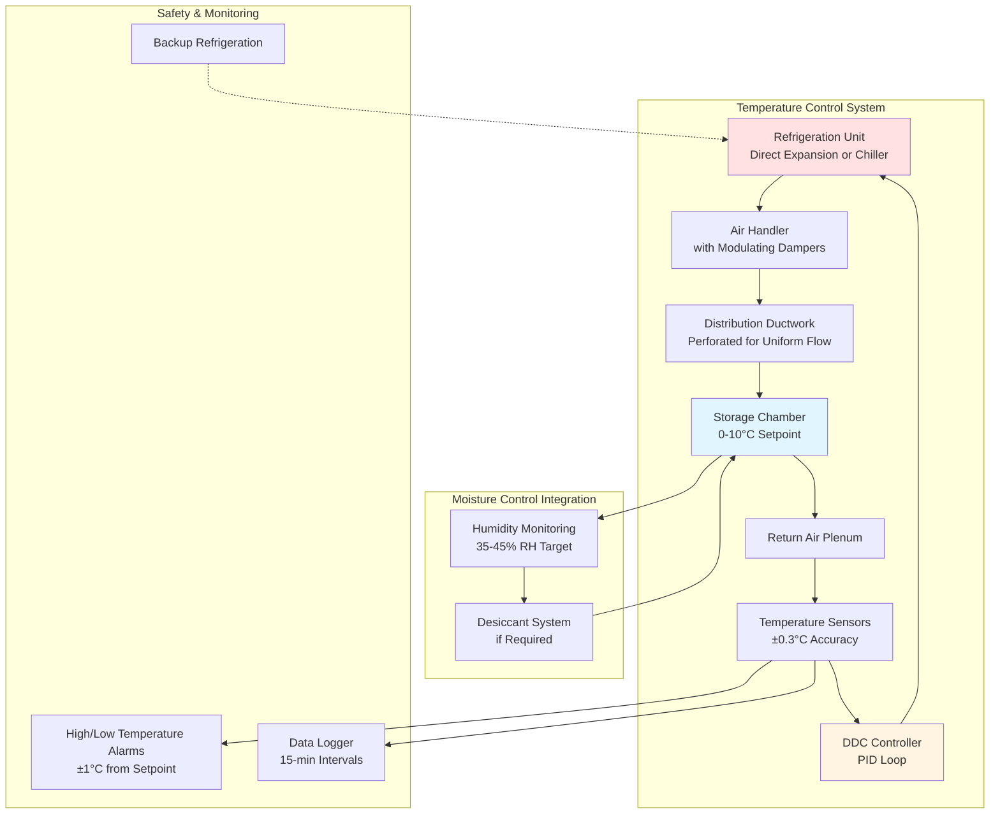

## Термодинамические принципы хранения семян при температуре 0-10°C

Холодное хранилище в диапазоне 0-10°C представляет оптимальный температурный диапазон для продления жизнеспособности семян путём снижения скорости метаболического дыхания. Этот температурный диапазон использует экспоненциальное соотношение между температурой и кинетикой биохимических реакций, определяемое уравнением Аррениуса, применённым к дыханию семян.

### Соотношение скорости дыхания и температуры

Деградация семян является фундаментальной функцией скорости дыхания, которая следует экспоненциальной температурной зависимости. Скорость дыхания при любой температуре может быть выражена как:

$$Q_r = Q_{r0} \cdot e^{\frac{-E_a}{R} \left(\frac{1}{T} - \frac{1}{T_0}\right)}$$

Где:
- $Q_r$ = скорость дыхания при температуре T (мг CO₂/кг·ч)
- $Q_{r0}$ = скорость дыхания при эталонной температуре $T_0$ (обычно 20°C)
- $E_a$ = энергия активации дыхания (обычно 50-65 кДж/моль для семян)
- $R$ = универсальная газовая постоянная (8,314 Дж/моль·К)
- $T$ = абсолютная температура (К)
- $T_0$ = эталонная абсолютная температура (К)

Коэффициент температуры Q₁₀ (изменение скорости дыхания на 10°C) для семян обычно находится в диапазоне от 2,0 до 3,0, что означает удвоение или утроение скорости дыхания при каждом увеличении температуры на 10°C:

$$Q_{10} = \left(\frac{Q_{r2}}{Q_{r1}}\right)^{\frac{10}{T_2-T_1}}$$

Для хранения при 5°C по сравнению с 20°C, предполагая Q₁₀ = 2,5, снижение скорости дыхания составляет примерно 56%, что напрямую переводится в продление долговечности семян.

## Влияние температуры на жизнеспособность семян

| Диапазон температур | Относительная скорость дыхания | Ожидаемая продолжительность хранения | Скорость потери жизнеспособности | Оптимальные типы семян |
|-------------------|---------------------------|---------------------------|---------------------|-------------------|
| 0-2°C | 0,20-0,25 | 5-10 лет | 0,5-1% в год | Ортодоксальные семена, зерновые |
| 2-4°C | 0,30-0,40 | 3-7 лет | 1-2% в год | Большинство семян овощей |
| 5-7°C | 0,45-0,55 | 2-5 лет | 2-4% в год | Бобовые, соевые бобы |
| 8-10°C | 0,60-0,75 | 1-3 года | 4-6% в год | Краткосрочное коммерческое хранение |
| Эталон: 20°C | 1,00 | <1 года | 10-15% в год | Не рекомендуется |

*Примечание: Значения предполагают влажность 8-12% и надлежащее герметичное хранилище*

## Проектирование системы HVAC для холодного хранилища семян

## Расчёт тепловой нагрузки для объектов хранения семян

Полная холодильная нагрузка для поддержания хранилища 0-10°C состоит из:

$$Q_{total} = Q_{envelope} + Q_{product} + Q_{infiltration} + Q_{respiration} + Q_{equipment}$$

### Получение тепла через оболочку здания

Через изолированные стены, потолок и пол:

$$Q_{envelope} = U \cdot A \cdot \Delta T$$

Где:
- $U$ = общий коэффициент теплопередачи (обычно 0,11-0,17 Вт/м²·K для изоляции RSI 5,3-8,8)
- $A$ = площадь поверхности (м²)
- $\Delta T$ = разность температур между окружающей средой и хранилищем (K)

### Холодильная нагрузка продукта

Для начального охлаждения массы семян от температуры окружающей среды до температуры хранения:

$$Q_{product} = \frac{m \cdot c_p \cdot \Delta T}{t}$$

Где:
- $m$ = масса семян (кг)
- $c_p$ = удельная теплоёмкость семян (обычно 1,47-1,88 кДж/кг·K)
- $\Delta T$ = снижение температуры (K)
- $t$ = период охлаждения (ч)

### Выделение тепла дыханием

Семена продолжают метаболическую активность даже при холодных температурах:

$$Q_{respiration} = m \cdot q_r \cdot C_f$$

Где:
- $m$ = масса семян (кг)
- $q_r$ = удельное выделение тепла дыханием (2,1-8,4 кДж/кг·сут при 0-10°C)
- $C_f$ = коэффициент преобразования в почасовое исчисление

## Стандарты сохранения в холодном хранилище

**Рекомендации USDA и международные стандарты хранения семян:**

- **Равномерность температуры:** максимальное колебание ±0,6°C по всему объёму хранилища
- **Стабильность температуры:** ±0,3°C от уставки в течение 24-часового периода
- **Влажность семян:** 8-12% для ортодоксальных семян перед холодным хранением
- **Относительная влажность:** 35-45% для предотвращения миграции влаги
- **Скорость воздуха:** <0,25 м/с через контейнеры с семенами для минимизации высыхания
- **Частота мониторинга:** непрерывный цифровой мониторинг с интервалом логирования 15 минут

**Рекомендации AOSA (Ассоциация официальных аналитиков семян):**

Семена, хранящиеся при 4°C с контролируемой влажностью, сохраняют скорость прорастания >85% в 3-5 раз дольше, чем при хранении при температуре окружающей среды. Каждое снижение температуры хранения на 5,6°C приблизительно удваивает долговечность семян.

## Рассмотрения при проектировании системы

**Выбор холодильной системы:**

Для объектов, хранящих 4,5-45+ тысяч кг семян:
- Системы прямого расширения (DX) для меньших объектов (<150 м³)
- Системы с гликолевым охладителем для больших операций с несколькими зонами
- Резервная холодильная мощность (конфигурация N+1) для критичных семенохранилищ
- Компрессоры переменной производительности для эффективной работы при неполной нагрузке

**Стратегия управления:**

Реализуйте управление PID (пропорционально-интегрально-дифференцирующее) с:
- Полоса пропорциональности: 1,7-2,8°C
- Время интегрирования: 5-10 минут
- Время дифференцирования: 1-2 минуты
- Уставка: 4-6°C для хранилища общего назначения

**Меры по повышению энергоэффективности:**

- Высокоэффективные компрессоры (EER >12,0)
- Цикл экономайзера при падении температуры окружающей среды ниже 10°C
- Циклы оттаивания, управляемые спросом
- Светодиодное освещение для минимизации внутреннего теплоприпуска
- Стабилизация через тепловую массу с использованием контейнеров, заполненных водой

## Заключение

Поддержание температуры хранения семян в диапазоне 0-10°C требует точного проектирования HVAC на основе термодинамических принципов, управляющих кинетикой дыхания семян. Экспоненциальное соотношение между температурой и метаболической активностью делает холодное хранилище наиболее эффективным методом для сохранения жизнеспособности семян. Надлежащее определение размера системы, равномерность температуры и непрерывный мониторинг обеспечивают оптимальное сохранение семян для сельскохозяйственных, научных и природоохранных применений.

---

**Файл:** `/Users/evgenygantman/Documents/github/gantmane/hvac/content/specialty-applications-testing/specialty-hvac-applications/farm-crops-processing/seed-storage/temperature-32-50f/_index.md`
