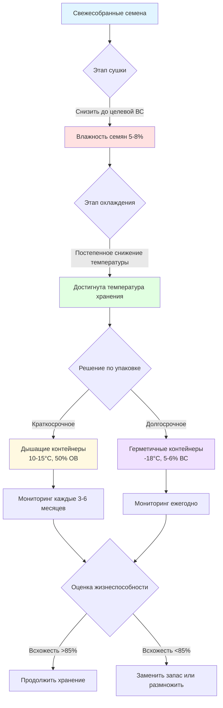
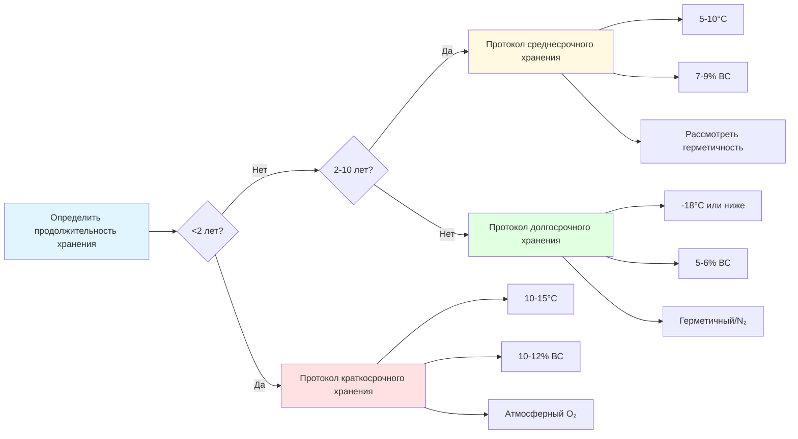

## Физические основы деградации семян

Потеря жизнеспособности семян представляет необратимый термодинамический процесс, движимый биохимической деградацией. Три параметра окружающей среды контролируют кинетику деградации: температура, содержание влаги и парциальное давление кислорода. Эти факторы ускоряют окислительное повреждение клеточных мембран, денатурацию белков хранения и фрагментацию нуклеиновых кислот посредством гидролитических реакций.

Генерирование метаболического тепла из массы семян следует:

$$Q_{resp} = m_{seed} \cdot r_{O_2} \cdot \Delta H_{comb}$$

Где $Q_{resp}$ — тепло дыхания (Вт), $m_{seed}$ — масса семян (кг), $r_{O_2}$ — скорость потребления кислорода (кг O₂/кг·с), и $\Delta H_{comb}$ — теплота сгорания углеводов семян (приблизительно 16 000 кДж/кг O₂).

## Правило Харрингтона для долголетия семян

Харрингтон установил эмпирические соотношения, количественно определяющие, как условия хранения влияют на ожидаемую продолжительность жизни семян. Правило гласит, что для ортодоксальных семян (переносящих высушивание):

**Эффект температуры:** Каждое снижение температуры хранения на 5°C удваивает долголетие семян.

**Эффект влаги:** Каждое снижение влажности семян на 1% удваивает долголетие семян.

Объединенное соотношение дает:

$$L = L_0 \cdot 2^{-(T-T_0)/5} \cdot 2^{-(M-M_0)}$$

Где $L$ — срок хранения (годы), $L_0$ — базовый срок при эталонных условиях, $T$ — температура (°C), $T_0$ — эталонная температура, $M$ — содержание влаги (%), и $M_0$ — эталонное содержание влаги.

**Критические ограничения:**
- Применяется к диапазону влажности: 5-14% (мокрый базис)
- Действительно для диапазона температур: 0-50°C
- Только ортодоксальные семена (исключает рецидивирующие типы)

Для максимального долголетия сумма $(T°C + M\%)$ не должна превышать 10-15 для коммерческого хранения или 5-8 для долгосрочного сохранения генетического материала.

## Равновесная влажность семян

Семена достигают равновесия с окружающей относительной влажностью воздуха посредством изотерм адсорбции. Уравнение Хендерсона описывает это соотношение:

$$M_e = \left[\frac{-\ln(1-RH/100)}{A \cdot (T+C)}\right]^{1/B}$$

Где $M_e$ — равновесная влажность семян (% сухой базис), $RH$ — относительная влажность (%), $T$ — температура (°C), и $A$, $B$, $C$ — константы, специфичные для семян.

Для многих сельскохозяйственных семян: $A \approx 1.0 \times 10^{-5}$, $B \approx 2.0$, $C \approx 273.15$.

### Условия равновесия по стратегиям хранения

| Тип хранения | Температура | Целевая ОВ | Целевая РВ | Ожидаемый срок |
|--------------|-------------|-----------|-----------|----------------|
| Краткосрочное (1-2 года) | 10-15°C | 50-60% | 10-12% | 18-24 месяца |
| Среднесрочное (3-10 лет) | 5-10°C | 35-45% | 7-9% | 5-10 лет |
| Долгосрочное (10+ лет) | -18°C | 25-35% | 5-6% | 20-50 лет |
| Криоконсервация | -196°C | н/п | 5% | 100+ лет |

## Механизмы подавления дыхания

Дыхание семян следует кинетике Аррениуса. Зависимость скорости дыхания от температуры:

$$r = r_0 \cdot e^{-E_a/(R \cdot T)}$$

Где $r$ — скорость дыхания, $r_0$ — предэкспоненциальный множитель, $E_a$ — энергия активации (типично 50-80 кДж/моль для семян), $R$ — газовая постоянная (8.314 Дж/моль·К), и $T$ — абсолютная температура (К).

**Ключевые стратегии подавления:**

1. **Снижение температуры:** Снижение с 25°C на 5°C снижает дыхание на 80-90%
2. **Снижение влажности:** Ниже 8% влажности ферментативная активность становится пренебрежимо малой
3. **Ограничение кислорода:** Герметичное хранилище с O₂ < 2% подавляет аэробный метаболизм
4. **Инертная атмосфера:** Среды N₂ или CO₂ предотвращают окислительное повреждение

## Протоколы тестирования всхожести

ASHRAE не указывает напрямую протоколы тестирования всхожести, но применяются стандарты AOSA (Ассоциация официальных аналитиков семян) и ISTA (Международная ассоциация тестирования семян).

**Стандартный тест всхожести:**
- Размер выборки: 400 семян (4 повтора по 100)
- Температура: Специфична для вида (типично 20-25°C)
- Субстрат: Между бумагой или в песке
- Продолжительность: 7-28 дней в зависимости от вида
- Показатель: Нормальные проростки / всего семян × 100%

**Тест ускоренного старения:**
Прогнозирует потенциал хранения путем воздействия на семена 41-45°C при 100% ОВ в течение 48-96 часов, затем проведения стандартного теста всхожести.

Индекс энергии объединяет процент всхожести с метриками роста проростков:

$$VI = \frac{\sum (G_i \cdot D_i)}{D_{max}}$$

Где $VI$ — индекс энергии, $G_i$ — количество проростков в день $i$, $D_i$ — номер дня, и $D_{max}$ — продолжительность теста.

## Матрица принятия решений по стратегии хранения

## Последствия для проектирования систем HVAC

Объекты хранения семян требуют точного контроля окружающей среды:

**Контроль температуры:**
- Допуск: ±2°C для краткосрочного, ±1°C для долгосрочного хранения
- Расчет нагрузки должен включать тепло дыхания (типично 0.5-2 Вт/м³ для сухих семян)
- Избегать термальных циклов; только постепенные изменения температуры

**Контроль влажности:**
- Десиккантная осушка предпочтительна для требований <30% ОВ
- Контроль точки росы более надежен, чем контроль ОВ при низких температурах
- Нормы вентиляции ASHRAE Standard 62.1 не применяются; минимизировать приток наружного воздуха

**Распределение воздуха:**
- Низкая скорость (< 0.5 м/с) для предотвращения расслоения влаги
- Без прямого воздушного потока на контейнеры с семенами
- Равномерное распределение температуры критично (±0.5°C по всему пространству)

**Требования к мониторингу:**
- Датчики температуры: ±0.2°C точность, <1 минута время отклика
- Датчики ОВ: ±2% точность в диапазонах низкой ОВ
- Интервал логирования: минимум 15 минут
- Пороги тревоги: Температура ±3°C, ОВ ±5% от заданного значения

## Экономическая оптимизация

Компромисс между инвестициями в хранение и затратами на замену семян:

$$C_{total} = C_{storage} + C_{replacement} \cdot P_{failure}$$

Где $C_{total}$ — общая годовая стоимость, $C_{storage}$ — стоимость эксплуатации объекта ($/год), $C_{replacement}$ — стоимость замены семян, и $P_{failure}$ — вероятность потери жизнеспособности.

Для высокоценного генетического материала или семян-оригиналов долгосрочное контролируемое хранилище показывает положительный возврат инвестиций в течение 5-10 лет по сравнению с периодическими циклами размножения семян.

## Практическое внедрение

**Подготовка перед хранением:**
1. Постепенно сушить семена (максимум снижение ВС на 0.5% в день)
2. Охлаждать поэтапно (снижение на 5-10°C в день)
3. Уравновесить при целевых условиях в течение 48 часов перед герметизацией

**Выбор контейнера:**
- Ламинированный фольго-полиэтилен для герметичного уплотнения
- Минимизировать свободное пространство (объем семян к контейнеру >0.7)
- Включить абсорберы кислорода для долгосрочного хранения

**Управление инвентарем:**
- Ротация "первым поступил — первым вышел" для коммерческих запасов
- Ежегодное тестирование всхожести для долгосрочного хранения
- Размножение при падении жизнеспособности ниже 85% от начальной
