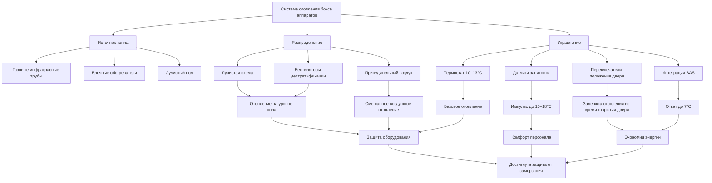

Боксы пожарных аппаратов требуют специализированных стратегий отопления, которые сбалансированы между защитой оборудования, комфортом персонала во время кратковременного присутствия и энергоэффективностью. Стандартный диапазон проектной температуры 10–16°C обеспечивает адекватную защиту аппаратов и систем здания от замерзания, одновременно минимизируя затраты на отопление в этих больших помещениях с высоким объемом и частыми операциями с дверями.

## Задание температурных уставок проектирования

Боксы аппаратов поддерживаются при более низких температурах, чем занятые помещения, из-за их периодической занятости и тепловой массы пожарных аппаратов. Уставки проектирования включают:

**Условия нормальной эксплуатации:**
- Нормальная уставка: 10–13°C
- Импульс при занятости: 16–18°C во время обслуживания аппаратов
- Минимальная уставка: 7°C для защиты от замерзания
- Температура отката: 4–7°C в периоды продолжительного отсутствия

Температура должна предотвращать замерзание водяных систем пожаротушения, водяных баков аппаратов и пенных концентратов. Современные аппараты с обогреваемыми отсеками могут переносить более низкие температуры в боксе, но сантехнические приборы и напольные стоки требуют постоянной защиты.

## Требования к защите оборудования от замерзания

Системы зданий в боксах аппаратов требуют тщательной защиты от замерзания:

**Критические компоненты:**
- Напольные стоки и траншейные стоки: поддерживать минимум 7°C
- Башни для шлангов и моечные стойки: теплотрассировка или непрерывная циркуляция
- Системы спринклеров пожаротушения: сухая труба или контур с антифризом предпочтителен
- Водопровод питьевого назначения: изолировать и поддерживать минимум 10°C
- Станции заправки аппаратов: теплотрассировка и изолированные кожухи

Сами аппараты обычно включают встроенные подогреватели бака и системы отопления отсеков, которые работают независимо от температуры в боксе. Однако резкие перепады температуры от операций с дверями могут перегрузить эти системы.

## Лучистое и принудительное воздушное отопление

Боксы аппаратов значительно выигрывают от лучистого отопления благодаря высоким потолкам и частым операциям с дверями.

### Системы лучистого отопления

**Газовые инфракрасные трубчатые обогреватели** — наиболее распространенное решение:
- Установка на высоте 3,7–6,1 м вдоль стен бокса
- Обеспечивают прямое отопление пола и поверхностей аппаратов
- Минимальное движение воздуха снижает стратификацию
- Не подвергаются влиянию операций с дверями и инфильтрации воздуха
- Время восстановления: 15–30 минут после закрытия двери

**Электрические лучистые панели** обеспечивают чистое и бесшумное функционирование:
- Подходят для станций с достаточной электрической мощностью
- Нулевые продукты сгорания
- Более низкие требования к обслуживанию
- Более высокие затраты на эксплуатацию в большинстве регионов

### Системы принудительного воздушного отопления

**Блочные обогреватели** обеспечивают быстрый отклик температуры:
- Установка в высоких точках (более 6,1 м) с горизонтальным выпуском
- Требуют вентиляторов дестратификации для равномерного распределения температуры
- Значительные потери тепла при операциях с дверями
- Более подходящи для меньших боксов или комбинированных систем

Требуемую тепловую мощность для систем лучистого отопления можно оценить по формуле:

$$Q_{radiant} = \frac{A \cdot U \cdot \Delta T}{\eta_{radiant}}$$

где $A$ — площадь пола (м²), $U$ — общий коэффициент теплопередачи (кДж/ч·м²·°C), $\Delta T$ — разность температур (°C), а $\eta_{radiant}$ — эффективность системы лучистого отопления (обычно 0,65–0,75).

## Потери тепла при операциях с дверью бокса

Операции с дверями представляют собой преобладающий механизм потерь тепла в боксах аппаратов. Каждое открытие двери создает массивный обмен воздуха:

**Потери тепла при инфильтрации:**

$$Q_{infiltration} = 1,08 \cdot CFM \cdot \Delta T$$

Для типичной двери бокса размером 4,3 м × 4,3 м мгновенный обмен воздуха приблизительно равен:

$$CFM \approx A_{door} \cdot V_{air} \cdot 60$$

где $A_{door}$ — площадь двери (18,5 м² для 4,3×4,3) и $V_{air}$ — скорость воздуха (предполагать 0,25–0,5 м/с при открытии).

**Типичное влияние операции с дверью:**
- Одиночное открытие двери: 3400–6800 CFM (5800–11600 м³/ч) мгновенного обмена
- Перепад температуры: 3–8°C в зависимости от наружных условий
- Время восстановления (лучистое): 20–40 минут
- Время восстановления (принудительный воздух): 10–20 минут
- Ежедневная потеря тепла: 30–50% от общей нагрузки отопления в холодном климате

Воздушные завесы или вестибюльные двери могут снизить инфильтрацию на 60–70%, но редко используются из-за требований к зазорам и операционных проблем.

## Сравнение опций систем отопления

| Система отопления | Начальная стоимость | Стоимость эксплуатации | Время восстановления | Комфорт | Обслуживание |
|---|---|---|---|---|---|
| Газовая инфракрасная труба | Умеренная | Низкая | 20–40 мин | Отличный | Низкое |
| Электрическая инфракрасная | Умеренно-высокая | Высокая | 20–40 мин | Отличный | Очень низкое |
| Газовые блочные обогреватели | Низкая | Умеренная | 10–20 мин | Удовлетворительный | Умеренное |
| Гидравлическое лучистое отопление пола | Очень высокая | Низкая | 60–120 мин | Отличный | Низкое |
| Гибридное лучистое/принудительный воздух | Высокая | Низкая-умеренная | 15–30 мин | Очень хороший | Умеренное |

## Соображения энергоэффективности

Боксы аппаратов потребляют значительную энергию на отопление, несмотря на низкие температурные уставки, из-за их объема и инфильтрации:

**Стратегии повышения эффективности:**
- Высокоэффективные инфракрасные обогреватели (тепловая эффективность 80–90%)
- Зонированное отопление для отдельных дверей боксов
- Датчики занятости для автоматического отката
- Изолированные подвесные двери с уплотнительными прокладками (RSI ≥ 2,1)
- Вентиляторы дестратификации для снижения стратификации потолка
- Рекуперация тепла из выхлопных газов аппаратов

Общая тепловая нагрузка объединяет потери через ограждающие конструкции и инфильтрацию:

$$Q_{total} = Q_{envelope} + Q_{infiltration} + Q_{door\_operations}$$

В холодном климате операции с дверями и инфильтрация составляют 60–75% от общего потребления энергии на отопление.

## Отката во время неиспользуемых периодов

Автоматический откат снижает потребление энергии в течение предсказуемых периодов неиспользования:

**График отката:**
- Нормальный: 10–13°C в часы дежурства
- Ночной откат: 7–10°C (полночь–6:00)
- Продолжительное отсутствие: 4–7°C (учебные упражнения, продолжительные вызовы)
- Режим импульса: 16–18°C активируется персоналом или графиком обслуживания

Современные системы автоматизации зданий могут интегрироваться с системами диспетчеризации для инициирования циклов прогрева при возвращении аппаратов из вызовов, обеспечивая комфортные условия при прибытии.

**Оценочное энергосбережение:**
- Ночной откат на 3°C: снижение энергии на отопление на 15–25%
- Оптимизированное планирование восстановления: дополнительное энергосбережение 5–10%
- Импульс на основе занятости: энергосбережение 10–15% в сравнении с постоянными 16°C

## Схема системы отопления бокса аппаратов

Стратегия низкотемпературного отопления для боксов аппаратов представляет собой баланс между защитой оборудования, готовностью к эксплуатации и энергоэффективностью. Системы лучистого отопления обеспечивают наиболее эффективное решение для этих сложных помещений, минимизируя влияние частых операций с дверями, одновременно поддерживая надежную защиту от замерзания для систем зданий и аппаратов.
