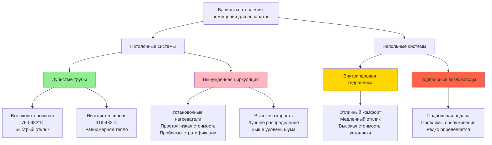

# Системы HVAC над полом и под полом

Помещения для пожарных аппаратов в депо требуют конфигурации систем отопления, которые могут размещать высоту транспортных средств до 3,96-4,27 м при сохранении эффективности работы во время частых циклов открытия дверей. Выбор между потолочным и подпольным распределением принципиально влияет на энергетическую производительность, тепловой комфорт и стоимость установки.

## Системы потолочного лучистого отопления

Газовые или электрические лучистые трубчатые системы, установленные на уровне потолка, подают инфракрасную энергию непосредственно на поверхности пола, транспортные средства и персонал без нагрева всего объема воздуха. Этот подход наиболее эффективен в высокопотолочных помещениях со значительной инфильтрацией.

### Высокоинтенсивные лучистые трубы

Высокоинтенсивные системы используют горелки U-образной или прямой конфигурации, работающие при температуре поверхности 760-982°C, излучающие коротковолновое инфракрасное излучение, которое проходит через воздух без его нагрева.

**Параметры проектирования:**

| Параметр | Значение | Примечания |
|----------|----------|-----------|
| Высота монтажа | 3,66-6,10 м | Оптимум 4,27-4,88 м для помещений аппаратов |
| Входная мощность | 315-505 кВт/м² | В зависимости от климата |
| Температура трубы | 760-982°C | Вентилируемый тип сгорания |
| Эффективность отражателя | 85-92% | Направляет излучение вниз |
| Ширина модели | 1,5-2,0× высота монтажа | На уровне пола |

Тепловой поток, подаваемый на поверхность пола, подчиняется закону обратного квадрата, модифицированному коэффициентом обзора:

$$q'' = \frac{\varepsilon \sigma (T_s^4 - T_{\infty}^4) \cos \theta}{1 + (r/h)^2}$$

Где:
- $q''$ = тепловой поток на полу (кВт/м²)
- $\varepsilon$ = степень черноты поверхности трубы (0,85-0,92)
- $\sigma$ = константа Стефана-Больцмана
- $T_s$ = температура поверхности трубы (К)
- $T_{\infty}$ = температура окружающей среды (К)
- $\theta$ = угол от нормали
- $r$ = радиальное расстояние от оси трубы
- $h$ = высота монтажа

**Преимущества:**

- Минимальное влияние инфильтрации при открытии дверей
- Быстрое восстановление после циклов открытия дверей (5-10 минут)
- Отсутствие проходов через пол или закопанных компонентов
- Эффективно работает в помещениях с высотой потолка до 7,32 м
- Гибкость зонирования с помощью нескольких трубопроводов

**Ограничения:**

- Высокие температуры поверхности требуют достаточного зазора
- Возможность затенения позади высоких аппаратов
- Первоначальная стоимость на 40-60% выше, чем вынужденная циркуляция воздуха
- Требует отвода продуктов сгорания

### Низкоинтенсивные лучистые системы

Низкоинтенсивные системы работают с температурой поверхности трубы 316-482°C благодаря конструкции горелки с рециркуляцией или электрическим резистивным элементам, производя длинноволновое излучение с мягким распределением тепла.

**Характеристики производительности:**

Более низкие температуры поверхности обеспечивают:
- Сниженные требования к зазору (3,05 м минимум вместо 3,66 м)
- Более равномерное распределение тепла
- Улучшенный комфорт для персонала, работающего под аппаратами
- Температуры эксплуатации на 15-20% ниже

Коэффициент передачи тепла излучением:

$$h_r = \varepsilon \sigma (T_s + T_{floor})(T_s^2 + T_{floor}^2)$$

Низкоинтенсивные системы обычно обеспечивают $h_r$ = 6,8-10,2 кВт/(м²·К) в сравнении с 14,2-19,9 для высокоинтенсивных единиц.

## Потолочное распределение теплого воздуха

Системы вынужденной циркуляции воздуха подают нагретый воздух через потолочные диффузоры или установочные нагреватели, расположенные по периметру помещения или на уровне потолка.

### Потолочные установочные нагреватели

Горизонтальные или вертикальные установочные нагреватели обеспечивают точечное отопление с направленными характеристиками подачи воздуха.

**Определение размера и расположения:**

$$\text{Дальность подачи} = V \times \frac{T_{подачи} - T_{окружающая}}{280}$$

Где:
- $V$ = скорость подачи воздуха (м/с)
- $T$ = температура (°C)
- Дальность подачи = горизонтальное расстояние до конечной скорости 2,5 м/с

**Соображения проектирования:**

- Входная мощность: 315-505 кВт/м² площади пола (холодный климат)
- Монтаж: высота 3,66-4,88 м, угол наклона вниз 15-30°
- Скорость подачи воздуха: 4,06-6,10 м/с у установки
- Требуется несколько установок для равномерного покрытия
- Расположение термостата: 1,52 м над полом, вдали от дверей

**Проблемы производительности:**

Термическая стратификация в высоких помещениях создает градиенты температуры:

$$\frac{dT}{dz} = 0,82 \text{ до } 1,64 \text{ °C/м}$$

Высота потолка 4,88 м создает разницу температур 4-8°C между полом и потолком, расходуя энергию на нагрев верхнего объема воздуха. Вентиляторы отстройки вертикальной циркуляции, потребляющие 1,08-1,62 Вт/м², могут снизить градиенты на 40-60%.

### Системы подачи теплого воздуха с высокой скоростью

Линейные щелевые диффузоры или форсунки на выходе подают воздух со скоростью 7,62-12,7 м/с для сохранения инерции и предотвращения стратификации.

**Характеристики системы:**

| Фактор | Высокая скорость | Стандартные установочные нагреватели |
|--------|------------------|--------------------------------------|
| Скорость подачи воздуха | 7,62-12,7 м/с | 4,06-6,10 м/с |
| Дальность подачи | 12,2-18,3 м | 6,10-9,14 м |
| Уровень звука | 40-50 NC | 35-45 NC |
| Скорость воздуха в воздуховоде | 10,16-15,24 м/с | 6,10-9,14 м/с |
| Время восстановления (цикл двери) | 20-30 мин | 30-45 мин |

## Конструкция внутриполового лучистого отопления

Гидравлический трубопровод, встроенный в бетонную плиту, подает низкотемпературное лучистое отопление с поверхности пола, обеспечивая равномерное тепло без использования потолочного пространства.

### Расположение гидравлических трубопроводов

Трубопровод PEX или PERT, установленный в змеевидной или спиральной конфигурации перед заливкой плиты, создает непрерывную нагреваемую поверхность.

**Параметры проектирования:**

$$q = \frac{T_{вода,средняя} - T_{помещение}}{R_{всего}}$$

Где:
- $q$ = выход тепла (кВт/м²)
- $T_{вода,средняя}$ = средняя температура воды (°C)
- $T_{помещение}$ = желаемая температура помещения (°C)
- $R_{всего}$ = полное тепловое сопротивление (м²·°C/кВт)

**Типичная конфигурация:**

| Параметр | Значение | Примечания |
|----------|----------|-----------|
| Расстояние между трубами | 15-30 см | Более близкое расстояние для большего выхода |
| Размер трубы | 12,7-19,05 мм PEX | Наиболее распространено 12,7 мм |
| Температура воды | 32-43°C | Низкотемпературные системы |
| Расход | 1,89-3,79 л/мин на контур | Поддерживает турбулентное течение |
| Максимальная длина контура | 61-91 м | Предотвращает чрезмерное падение давления |
| Глубина плиты выше трубы | 3,81-6,35 см | Балансирует отклик и эффективность |

Температура поверхности пола:

$$T_{поверхность} = T_{помещение} + q \times R_{поверхность}$$

Поддерживайте $T_{поверхность}$ = 24-29°C для комфорта без перегрева.

**Эффект тепловой массы:**

Тепловое хранилище бетонной плиты:

$$Q_{хранилище} = \rho c V \Delta T$$

Где:
- $\rho$ = плотность бетона = 2320 кг/м³
- $c$ = удельная теплоемкость = 0,92 кДж/(кг·К)
- $V$ = объем плиты (м³)
- $\Delta T$ = изменение температуры

Плита толщиной 15 см обеспечивает тепловой спад 4,5-6 часов, делая систему медленно реагирующей на требования к снижению и повышению температуры.

**Преимущества:**

- Чрезвычайно равномерное распределение тепла
- Отсутствие потолочного оборудования, препятствующего аппаратам
- Бесшумная работа, отсутствие движущегося воздуха
- Эффективно для постоянной занятости
- Растапливает снег, попадающий на аппараты

**Ограничения:**

- Время прогрева 3-4 часа с холодного старта
- Невозможно реагировать на быстрые изменения температуры
- Ремонт плиты затруднен при повреждении трубопровода
- Установка должна происходить во время строительства
- Первоначальная стоимость на 25-35% выше, чем лучистые трубы

## Системы подпольных воздуховодов

Траншеи бетонной плиты или системы сотовых металлических полов размещают распределение приточного воздуха ниже уровня пола, подавая теплый воздух через напольные решетки.

### Конструкция траншейного воздуховода

Предварительно отлитые или сформированные на месте бетонные траншеи размещают трубопровод подачи с съемными крышками или решетками.

**Конфигурация:**

- Глубина траншеи: 30-46 см ниже чистового пола
- Ширина: 30-61 см в зависимости от размера воздуховода
- Крышка: Стальная решетка или съемные панели
- Расстояние между решетками: 2,44-3,66 м по центру
- Размер решетки: 30×30 см до 46×61 см

Подача тепла на решетку:

$$q_{решетка} = 0,565 \times CFM \times (T_{подачи} - T_{помещение})$$

**Эксплуатационные проблемы:**

- Траншея накапливает мусор, требуя частой очистки
- Скопление влаги способствует коррозии
- Нагрузки от движения транспорта могут повредить крышки
- Утечка воздуховода сложна для обнаружения и ремонта
- Расположение решеток конфликтует с позиционированием транспорта

### Системы приподнятого напольного плена

Приподнятая конструктивная плита создает непрерывный подпольный плена для распределения воздуха, распространена в центрах обработки данных, но редко используется в помещениях для аппаратов из-за требований по нагрузке.

**Соображения по нагрузке:**

Валовой вес аппарата: 15,9-34 т (пожарные автомобили)

Сосредоточенные нагрузки на колеса:

$$P_{колесо} = \frac{W_{ось}}{n_{колеса}} \times \text{коэффициент удара}$$

Стандартные системы приподнятого пола (1,22-2,44 кПа грузоподъемность) неадекватны для нагрузок аппаратов. Системы повышенной прочности (9,76+ кПа) становятся экономически неоправданными.

## Соображения по зазорам оборудования

Расположение потолочной системы должно учитывать высоту аппарата и требования доступа.

**Размеры аппарата:**

| Тип транспорта | Высота | Ширина | Длина |
|-------|--------|--------|--------|
| Пожарный автомобиль/Насос | 3,05-3,35 м | 2,44-2,74 м | 9,14-10,67 м |
| Лестничная машина | 3,35-3,96 м | 2,59-3,05 м | 12,19-15,24 м |
| Вышка/Платформа | 3,35-3,81 м | 3,05 м | 13,72-15,24 м |
| Скорая помощь | 2,74-3,05 м | 2,13-2,44 м | 5,49-6,71 м |

**Минимальные зазоры:**

- Лучистые трубы: 61 см выше аппарата (предотвращает повреждение электроники от тепла)
- Установочные нагреватели: 46 см боковой зазор (позволяет циркуляцию воздуха)
- Воздуховод: 30 см выше аппарата (предотвращает удар)
- Осветительные приборы: 41 см выше аппарата (интегрированы с планированием HVAC)

## Сравнение эффективности системы

### Матрица сравнения производительности

| Тип системы | Энергоэффективность | Первоначальная стоимость | Операционная стоимость | Время отклика | Обслуживание | Наилучшее применение |
|-------------|-------------------|----------------------|---------------------|---------------|-------------|----------------------|
| Высокоинтенсивное лучистое | Отлично (90-95%) | Высокая | Низкая | Быстрый (5-10 мин) | Низкое | Высокая частота циклов дверей |
| Низкоинтенсивное лучистое | Отлично (85-92%) | Высокая | Низкая | Среднее (10-15 мин) | Низкое | Умеренные циклы дверей |
| Установочные нагреватели | Удовлетворительно (75-80%) | Низкая | Среднее | Среднее (15-25 мин) | Среднее | Проекты с ограниченным бюджетом |
| Воздух высокой скорости | Хорошо (80-85%) | Среднее | Среднее | Среднее (20-30 мин) | Среднее | Высокие помещения (>6,1 м) |
| Внутриполовая гидравлика | Отлично (90-95%) | Очень высокая | Очень низкая | Медленно (3-4 ч) | Низкое | Помещения с круглосуточным персоналом |
| Подпольные воздуховоды | Плохо (65-75%) | Среднее | Высокая | Медленно (30-45 мин) | Высокое | Не рекомендуется |

### Экономический анализ

Сравнение стоимости жизненного цикла (период 20 лет, помещение 743 м², климат 3333 HDD):

**Высокоинтенсивное лучистое:**
- Первоначальная стоимость: 57 000-71 000 евро (76-96 евро/м²)
- Ежегодная энергия: 4300-5700 евро
- Итого за 20 лет: 142 000-185 000 евро

**Внутриполовая гидравлика:**
- Первоначальная стоимость: 78 000-100 000 евро (105-135 евро/м²)
- Ежегодная энергия: 2900-4300 евро
- Итого за 20 лет: 135 000-186 000 евро

**Установочные нагреватели:**
- Первоначальная стоимость: 28 000-43 000 евро (38-58 евро/м²)
- Ежегодная энергия: 5700-7800 евро
- Итого за 20 лет: 142 000-200 000 евро

Внутриполовые системы достигают наименьшей стоимости эксплуатации, но требуют 8-12 лет для возмещения более высокой первоначальной стоимости благодаря энергоэффективности. Лучистые трубы предлагают лучший баланс производительности и общей стоимости для типичных применений в помещениях для аппаратов.

## Рекомендации по проектированию

**Выберите потолочное лучистое отопление когда:**
- Двери помещения открываются часто (>15 циклов/день)
- Высота потолка 3,66-6,10 м
- Требуется быстрое восстановление температуры
- Бюджет отдает приоритет более низкой эксплуатационной стоимости перед первоначальной стоимостью
- Модернизация существующего помещения

**Выберите внутриполовое лучистое отопление когда:**
- Помещение постоянно укомплектовано персоналом (24/7 занятость)
- Новое строительство с доступным размещением плиты
- Минимальная работа двери помещения (<10 циклов/day)
- Владелец отдает приоритет комфорту и бесшумной работе
- Бюджет позволяет более высокую первоначальную стоимость

**Избегайте систем подпольных воздуховодов из-за:**
- Трудности доступа к обслуживанию
- Скопления мусора и влаги
- Возможности повреждения воздуховода от нагрузок пола
- Плохой энергетической производительности от утечек

## Стратегии управления

Эффективное управление максимизирует эффективность при сохранении готовности:

**Сброс на основе наружной температуры:**

$$T_{подачи} = T_{проект} - \frac{(T_{проект} - T_{мин})(T_{наружная} - T_{наружная,проект})}{T_{внутренняя} - T_{наружная,проект}}$$

Модулирует температуру подачи или интенсивность срабатывания лучистой трубы в зависимости от условий окружающей среды.

**График отката температуры:**
- Занятое помещение (аппарат в помещении): 13-16°C
- Ненанятые ночи: 7-10°C
- Глубокий откат (>8 часов): 4-7°C (внутриполовые системы не рекомендуются для глубокого отката)

**Блокировка двери:**
- Увеличьте выход отопления на 10 минут до запланированного возврата аппарата
- Уменьшите выход при открытии двери помещения (предотвращение потерь)
- Возобновите обычную работу через 5 минут после закрытия двери

## Заключение

Системы потолочного лучистого отопления обеспечивают наиболее эффективное решение для помещений аппаратов пожарных депо, сочетая энергоэффективность с быстрым откликом на воздействие циклов открытия дверей. Высокоинтенсивные лучистые трубы обеспечивают экономию энергии на 30-40% по сравнению с системами вынужденной циркуляции воздуха, требуя минимального обслуживания. Внутриполовые лучистые системы предлагают превосходный комфорт и наименьшую эксплуатационную стоимость, но медленный тепловой отклик ограничивает применимость помещениями с постоянным персоналом и нечастыми циклами открытия дверей. Системы подпольных воздуховодов представляют проблемы обслуживания и производительности, которые перевешивают любые преимущества установки, что делает их неподходящими для применения в помещениях для аппаратов. Выбор системы должен отдавать приоритет времени отклика, частоте циклов открытия дверей и полной стоимости владения перед первоначальной стоимостью.
