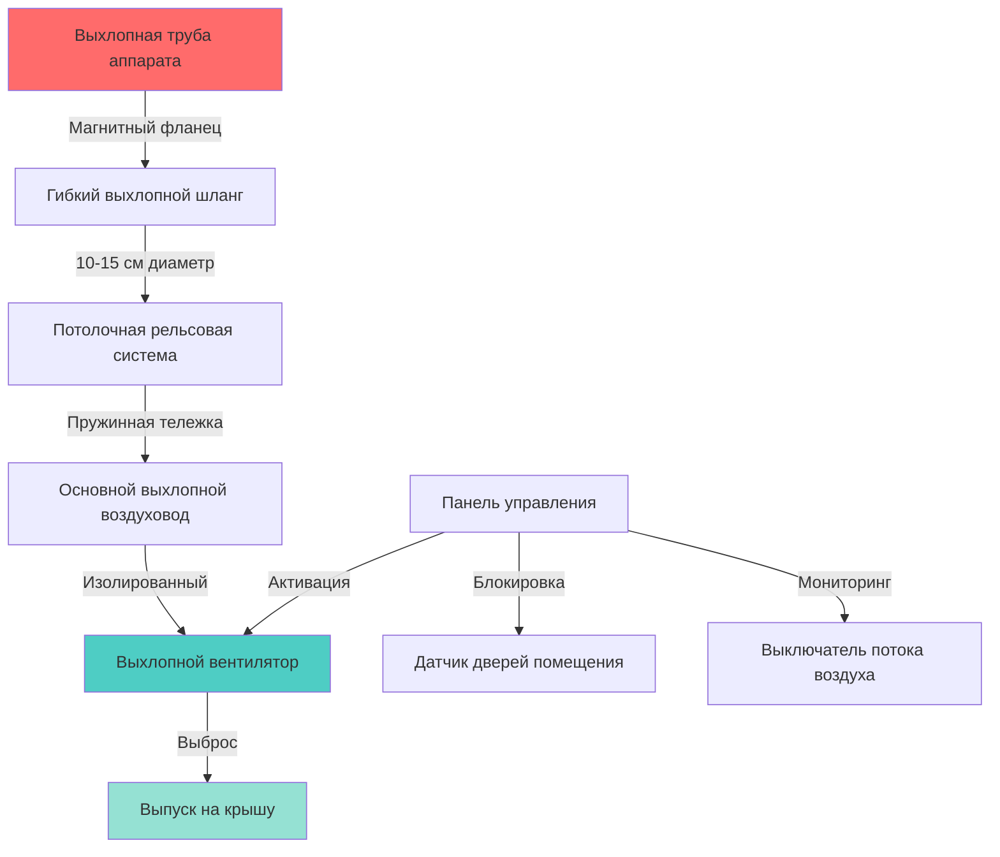

Системы улавливания выхлопа в местах дислокации обеспечивают наиболее эффективный метод удаления дизельного выхлопа непосредственно у выхлопной трубы аппарата до того, как выбросы рассеиваются в помещение дислокации. При правильной установке и эксплуатации эти системы улавливают 95–99% выхлопных газов, значительно снижая воздействие на пожарных канцерогенных частиц дизельного выхлопа.

## Системы прямого подключения к выхлопной трубе

Системы прямого подключения используют жесткие или гибкие воздуховоды, которые подключаются непосредственно к выхлопной трубе транспортного средства через фланец улавливания. Соединение должно компенсировать движение транспортного средства при въезде и выезде, сохраняя эффективное уплотнение.

**Основные компоненты:**

- Фланцы улавливания размером на 1,3–2,5 см больше диаметра выхлопной трубы
- Механизмы разъединения с пружиной или магнитом
- Материалы, стойкие к нагреву, рассчитанные на постоянное воздействие 649°C
- Конструкция из нержавеющей стали или алюминированной стали
- Быстроразъемные соединения для быстрого развертывания

Фланец улавливания обычно имеет коническое входное отверстие, которое направляет выхлопную трубу, с внутренними уплотняющими прокладками, которые компенсируют небольшое смещение. Правильный размер требует, чтобы фланец надевался на выхлопную трубу с минимальным зазором, обеспечивая тепловое расширение.

## Системы гибких шлангов на направляющих

Системы на направляющих подвешивают гибкий выхлопной шланг от потолочной рельсовой системы, позволяя шлангу следовать за движением транспортного средства при движении задним ходом. Эти системы обеспечивают максимальную гибкость для различных типов аппаратов и конфигураций парковки.

**Конфигурации системы:**

- Потолочные монорельсовые пути с тележками-кареткой
- Пружинные балансиры для шлангов обеспечивающие постоянное натяжение
- Гибкие выхлопные шланги диаметром 10–15 см
- Расстояния подачи до 12 м от подключения вентилятора
- Ручное или моторизованное позиционирование шлангов

Система направляющих должна обеспечивать плавное движение с низким трением, чтобы предотвратить перемещение шланга, которое может привести к смещению соединения с выхлопной трубой. Материалы рельсов включают оцинкованную сталь или алюминий с герметизированными подшипниковыми тележками.

## Магнитные разъемы с автоматическим отключением

Магнитные разъемы обеспечивают автоматическое отсоединение при отъезде аппарата, предотвращая повреждение шланга и обеспечивая безопасное отправление при срочном вызове. Магнитная муфта должна обеспечивать достаточную удерживающую силу во время работы при чистом отсоединении под нагрузками отъезда.

**Параметры конструкции:**

- Удерживающая сила: 67–111 Н для типичного аппарата
- Сила отсоединения: 133–222 Н усилия вытягивания
- Высокотемпературные неодимовые магниты
- Контактные поверхности из нержавеющей стали
- Уплотняющая прокладка на интерфейсе фланца-выхлопной трубы

Магнитная сила должна быть откалибрована для сопротивления нормальной вибрации транспортного средства и турбулентности воздуха при одновременном отсоединении до повреждения шланга. Испытания должны проверить чистое отсоединение на различных скоростях и углах отъезда.

## Расчет вентилятора и размеры воздуховодов системы

Правильный расчет вентилятора обеспечивает адекватную скорость захвата выхлопных газов при минимизации потребления энергии и шума. Система должна преодолевать потери статического давления в воздуховодах, фитингах и выпуске на крышу, обеспечивая при этом достаточную скорость транспортировки для предотвращения оседания частиц.

### Расчет расхода воздуха

Требуемый расход воздуха зависит от размера двигателя и объема выхлопных газов. Для дизельных аппаратов:

$$Q = \frac{CID \times RPM \times VE}{3456}$$

Где:
- $Q$ = расход воздуха (CFM)
- $CID$ = рабочий объем двигателя (кубические дюймы)
- $RPM$ = максимальная скорость холостого хода (обычно 1000–1200 об/мин)
- $VE$ = объемный КПД (0,80–0,85 для дизеля)
- $3456$ = коэффициент преобразования

Для типичного дизельного двигателя 500 CID при 1200 об/мин:

$$Q = \frac{500 \times 1200 \times 0.82}{3456} = 142 \text{ CFM}$$

Добавьте коэффициент безопасности 25–30% на потери в системе:

$$Q_{design} = 142 \times 1.25 = 178 \text{ CFM на аппарат}$$

### Расчет статического давления

Общее статическое давление системы включает все компоненты сопротивления:

$$SP_{total} = SP_{duct} + SP_{fittings} + SP_{hose} + SP_{discharge}$$

Для гибких шланговых секций:

$$SP_{hose} = f \times \frac{L}{D} \times \frac{V^2}{4005}$$

Где:
- $f$ = коэффициент трения (0,03–0,05 для гибкого шланга)
- $L$ = длина шланга (футы)
- $D$ = диаметр шланга (дюймы)
- $V$ = скорость (фут/мин)

Поддерживайте скорость транспортировки 914–1219 м/мин для предотвращения оседания частиц при минимизации потерь давления.

### Выбор вентилятора

Выбирайте центробежные вентиляторы, рассчитанные на высокотемпературную работу (минимум 204°C) с обратно изогнутыми или профилированными лопатками для эффективности. Электродвигатель вентилятора должен быть расположен вне потока воздуха или использовать высокотемпературные электродвигатели.

## Рекомендации NIOSH и NFPA

**NFPA 1500** (Стандарт по охране труда и здоровью пожарных служб) требует:

- Системы улавливания выхлопа для всех закрытых помещений дислокации аппаратов
- Активация систем перед запуском двигателя аппарата
- Предотвращение автоматического отключения при отказе системы
- Визуальная и звуковая сигнализация при неисправности системы
- Протоколы регулярного осмотра и технического обслуживания

**Рекомендации NIOSH:**

- Улавливание у выхлопной трубы предпочтительнее разбавления вентиляции
- Минимум 95% эффективность улавливания на режиме холостого хода
- Проверка расхода воздуха во время ежегодного тестирования
- Блокировка с зажиганием аппарата, если возможно
- Подготовка всего персонала по правильному подключению

**Требования к установке:**

- Длина шланга минимизирована для снижения потерь давления
- Воздуховоды с наклоном 0,6 см на 30 см в сторону дренажа конденсата
- Изоляция воздуховодов для предотвращения конденсации
- Место выпуска на 3 м от воздухозаборников
- Аварийное отключение у вентилятора для обслуживания

## Лучшие практики установки

**Рассмотрение при планировании:**

1. **Расположение путей** — расположите пути в соответствии с ожидаемыми позициями парковки аппаратов, обеспечивая 0,6–0,9 м бокового смещения
2. **Конструктивная поддержка** — потолочные пути должны выдерживать вес шланга плюс динамические нагрузки от движения транспортного средства
3. **Электрическая блокировка** — интегрируйте с органами управления дверями помещения, чтобы гарантировать открытие дверей перед отъездом аппарата
4. **Управление конденсатом** — установите дренажи в нижних местах с вторичными или автоматическими дренажными системами
5. **Доступность** — обеспечьте доступ для осмотра шлангов и замены фланцев

**Процедуры пуска в эксплуатацию:**

- Проверьте расход воздуха в каждой позиции парковки аппарата с помощью траверсирования трубки Пито
- Протестируйте магнитное отключение под различными углами и скоростями
- Подтвердите работу блокировки с дверями помещения и зажиганием аппарата
- Задокументируйте исходный расход воздуха для сравнения при обслуживании
- Обучите всех сотрудников процедурам подключения и устранению неисправностей

**График обслуживания:**

- **Еженедельно**: визуальный осмотр шлангов и соединений
- **Ежемесячно**: чистка фланцев и проверка магнитной удерживающей силы
- **Ежеквартально**: проверка расходов воздуха и функции сигнализации
- **Ежегодно**: профессиональный осмотр подшипников вентилятора и электродвигателя
- **Раз в два года**: замена гибких шланговых секций с признаками износа

## Сравнение систем улавливания в местах дислокации

| Тип системы | Эффективность улавливания | Стоимость установки | Стоимость эксплуатации | Обслуживание | Лучшее применение |
|-------------|-------------------|-------------------|------------------|-------------|------------------|
| **Потолочный путь с магнитным отключением** | 95–99% | 28 000–42 000 руб. за помещение | Низкая | Средняя | Новое строительство, несколько типов аппаратов |
| **Рельсовый барабан с фиксированной позицией** | 90–95% | 17 500–28 000 руб. за помещение | Низкая | Низкая | Фиксированная парковка, ограниченное разнообразие аппаратов |
| **Подземный пружинный барабан** | 92–97% | 35 000–52 500 руб. за помещение | Низкая | Средняя–высокая | Высокоэффективные объекты, чистая эстетика |
| **Жесткое сочлененное плечо** | 97–99% | 42 000–63 000 руб. за помещение | Низкая | Низкая | Одиночный аппарат, точное позиционирование |
| **Потолочное плечо с тросовым приводом** | 93–97% | 24 500–35 000 руб. за помещение | Низкая | Средняя | Модернизация, экономичное решение |

**Критерии выбора:**

- Потолочные рельсовые системы обеспечивают оптимальный баланс производительности и гибкости
- Магнитные разъемы необходимы для надежности срочного реагирования
- Подземные системы исключают потолочные препятствия, но усложняют обслуживание
- Жесткие плечи обеспечивают наивысшую эффективность улавливания, но ограничивают гибкость аппаратов
- Тросовые системы обеспечивают экономичное решение для модернизации

**Интеграция со строительными системами:**

Выхлоп из местов дислокации должен скоординироваться с общей вентиляцией помещения для предотвращения отрицательного давления, которое может привести к обратному потоку выхлопа в занятые помещения. Обеспечьте поступление воздуха в количестве 100–110% от выхлопного воздушного потока через специализированные установки или пассивные жалюзи, заблокированные работой выхлопного вентилятора.

Контроль температуры становится критическим, когда большие объемы наружного воздуха поступают в зимние месяцы. Рассмотрите инфракрасное отопление или вентиляторы для разделения слоев воздуха, чтобы поддерживать комфорт без чрезмерного потребления энергии. Никогда не допускайте, чтобы выхлоп из местов дислокации был единственным источником вентиляции — дополнительные воздухообмены удаляют выбросы при отсутствии выхлопа и поддерживают качество воздуха в периоды без выхлопа.
