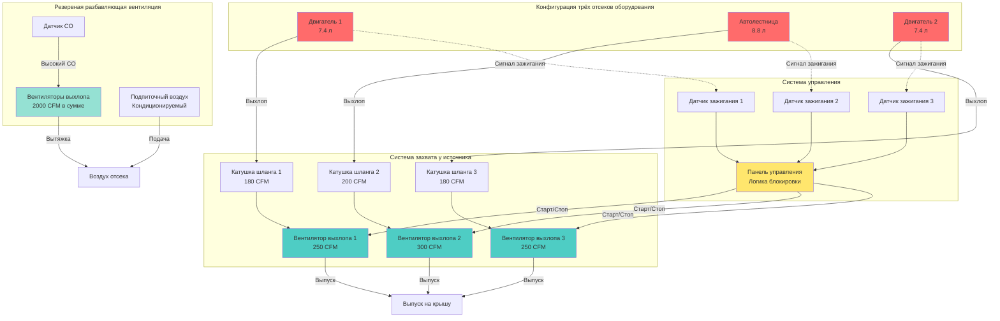

# Системы удаления выхлопных газов транспортных средств для пожарного оборудования

Системы удаления выхлопных газов являются основной защитой от воздействия канцерогенов для пожарных, работающих в отсеках оборудования. Дизельный твёрдый отход содержит более 40 документированных канцерогенов, причём эпидемиологические исследования связывают хроническое воздействие с повышенным риском развития рака. Эффективное удаление выхлопных газов требует комплексного проектирования с учётом методологии захвата, ёмкости системы, автоматических управлений и резервных стратегий вентиляции.

## Захват у источника в сравнении с разбавляющей вентиляцией

Фундаментальный выбор проектирования заключается в прямом захвате выхлопа у выхлопной трубы либо в разбавлении выхлопных газов по всему объёму отсека.

### Системы захвата у источника

Системы захвата у источника механически подсоединяются к выхлопным трубам транспортных средств, извлекая выхлопные газы до их рассеивания в занятое пространство. Такой подход обеспечивает эффективность захвата 95–99% при надлежащей эксплуатации.

**Архитектура системы:**

- Шарнирные стрелы или потолочные катушки шланга
- Высокотемпературный выхлопной шланг (номинально 650°C минимум)
- Магнитные или пружинные соединители выхлопной трубы с автоматическим отсоединением
- Специализированные вытяжные вентиляторы (обычно по одному на позицию оборудования)
- Выпуск выхлопа минимум на 3 м от воздухозаборников

**Характеристики производительности:**

Требуемый поток выхлопа зависит от объёма двигателя и условий эксплуатации. Для дизельных двигателей на холостом ходу:

$$Q_{capture} = 0.15 \times V_{engine} + 100$$

Где:
- $Q_{capture}$ = требуемый поток захвата (CFM)
- $V_{engine}$ = объём двигателя (кубические дюймы)
- 100 = дополнительный поток для запаса прочности

Для типичного пожарного автомобиля с объёмом двигателя 7,4 л (450 кубических дюймов):

$$Q_{capture} = 0.15 \times 450 + 100 = 167.5 \text{ CFM (284 м³/ч)}$$

Стандартные системы обеспечивают 150–400 CFM (255–680 м³/ч) на позицию, масштабируемые в соответствии с наибольшим обслуживаемым оборудованием.

**Преимущества:**

- Минимальное потребление энергии (работает только во время работы двигателя)
- Отсутствие разрежения отсека или штрафа на нагрев подпиточного воздуха
- Эффективное удаление загрязнений у источника
- Более низкие долгосрочные эксплуатационные расходы

**Ограничения:**

- Требует дисциплины команды при подсоединении/отсоединении
- Техническое обслуживание оборудования и периодическая замена шланга
- Не захватывает выбросы во время предварительного прогрева перед подсоединением
- Неэффективен, если команда обходит систему в экстренных ситуациях

### Системы разбавляющей вентиляции

Разбавляющая вентиляция обеспечивает воздухообмен по всему отсеку, снижая концентрацию загрязнений благодаря объёмному потоку воздуха. Такой подход служит резервной защитой или автономным решением, когда захват у источника невозможен.

**Методология проектирования:**

Расчёт требуемого потока разбавляющей вентиляции с использованием производительности загрязнения и допустимых пределов воздействия:

$$Q_{dilution} = \frac{G \times 403 \times SF}{PEL - C_{background}}$$

Где:
- $Q_{dilution}$ = поток разбавляющей вентиляции (CFM)
- $G$ = производительность загрязнения (л/мин)
- 403 = коэффициент конверсии единиц
- $SF$ = коэффициент безопасности (обычно 1,5–2,0)
- $PEL$ = предельно допустимое значение воздействия (мг/м³)
- $C_{background}$ = фоновая концентрация (мг/м³)

**Практические расчётные мощности:**

| Условие эксплуатации | Воздухообмены/час | Типичное применение |
|---------------------|------------------|---------------------|
| Неоккупированный/двигатели выключены | 4–6 воздухообмена/ч | Фоновая вентиляция |
| Случайное движение оборудования | 8–10 воздухообмена/ч | Нормальная эксплуатация |
| Продолжительный холостой ход без захвата у источника | 12–15 воздухообмена/ч | Режим аварийного резерва |
| Несколько одновременно работающих транспортных средств | 15–20 воздухообмена/ч | Тренировки или техническое обслуживание |

Для отсека оборудования объёмом 340 м³, требующего 10 воздухообмена/ч:

$$Q = \frac{340 \times 10}{60} = 56.7 \text{ м³/ч (2000 CFM)}$$

**Элементы проектирования системы:**

- Низкоуровневый выхлоп (на высоте 30 см от пола), так как охлаждённый дизельный выхлоп оседает
- Подпиточный воздух, кондиционируемый для поддержания температуры отсека 10–16°C
- Регулируемое управление с переменной скоростью на основе датчиков CO или дизельного твёрдого отхода
- Небольшое разрежение (0,05–0,125 кПа) относительно занятых пространств

## Требования NFPA 1500 для удаления выхлопных газов

NFPA 1500: Стандарт программы охраны труда и здоровья пожарной службы устанавливает обязательные требования для контроля выхлопов транспортных средств.

**Основные требования:**

1. **Раздел 6.6.1**: Пожарные части должны быть спроектированы для минимизации воздействия выхлопных газов транспортных средств
2. **Раздел 6.6.2**: Требуются системы прямого захвата у источника или эффективная механическая вентиляция
3. **Раздел 6.6.3**: Системы должны активироваться автоматически при запуске двигателя
4. **Раздел 6.6.4**: Место выпуска выхлопа предотвращает загрязнение воздухозаборников

**Стратегия соответствия:**

Основное соответствие использует захват у источника с блокировками автоматической активации. Разбавляющая вентиляция обеспечивает вторичную защиту во время периодов предварительного подсоединения и отказов системы.

| Требование NFPA | Реализация захвата у источника | Разбавляющий резерв |
|------------------|------------------------------|-----------------|
| Минимизировать воздействие | Прямое подсоединение к выхлопной трубе | Непрерывная вентиляция отсека 6+ воздухообмена/ч |
| Автоматическая активация | Блокировка зажигания запускает вентилятор | Датчики CO включают высокоскоростной режим |
| Место выпуска выхлопа | Выпуск 3+ м от воздухозаборников | Стенные вытяжные вентиляторы высокий/низкий |
| Предотвращение загрязнения | Отрицательное давление в выхлопном воздуховоде | Отсек слегка разряжен относительно соседних пространств |

## Расчёт системы для нескольких единиц оборудования

Отсеки с несколькими единицами оборудования требуют анализа ёмкости для решения сценариев одновременной эксплуатации.

**Методология расчёта:**

1. **Определение состава оборудования:** Подсчёт и классификация всех транспортных средств по размеру двигателя
2. **Установление коэффициента одновременной эксплуатации:** Вероятность одновременной работы двигателя
3. **Расчёт общей ёмкости системы:** Сумма отдельных требований с коэффициентом разнообразия

**Коэффициенты одновременной эксплуатации:**

- Станция с 2 отсеками: 1,0 (оба оборудования могут работать одновременно)
- Станция с 3 отсеками: 0,85 (маловероятно непрерывная работа всех трёх)
- Станция с 4+ отсеками: 0,75 (статистическое разнообразие снижает пиковый спрос)

Для станции с 3 отсеками с двигателями, требующими 180, 200 и 180 CFM:

$$Q_{total} = (180 + 200 + 180) \times 0.85 = 476 \text{ CFM (809 м³/ч)}$$

**Конфигурации систем:**

**Отдельные вентиляторы (рекомендуется):**
- Специализированный вытяжной вентилятор на позицию оборудования
- Размер в соответствии с наибольшим транспортным средством на этой позиции
- Независимая эксплуатация исключает перекрёстные помехи между позициями
- Типично: 200–400 CFM на вентилятор

**Центральный вентилятор с ответвлёнными воздуховодами:**
- Один более крупный вентилятор обслуживает несколько позиций через воздуховоды
- Моторизованные заслонки изолируют неактивные позиции
- Более низкая стоимость оборудования, но более сложная установка
- Типично: 500–1200 CFM центральный вентилятор

## Блокировка с запуском транспортного средства

Блокировки автоматической активации обеспечивают работу удаления выхлопных газов при работе двигателей, исключая зависимость от ручных действий экипажа во время экстренного реагирования.

**Методы блокировки:**

**Электрическое датчирование:**
- Трансформатор тока на цепи стартера или выходе генератора
- Датчик напряжения через переключатель зажигания
- Наиболее надёжный метод для постоянной активации
- Типичный порог: 20–30 секунд после запуска двигателя

**Дифференциальное давление:**
- Датчик обратного давления выхлопа в шланге захвата
- Активирует вентилятор при обнаружении потока выхлопа
- Резервный метод при недоступности электрических подключений
- Время отклика: 5–10 секунд

**Оптическое обнаружение:**
- Инфракрасные датчики обнаруживают горячие выхлопные газы
- Бесконтактное датчирование для приложений модификации
- Подвержены ложным срабатываниям от других источников тепла

**Последовательность управления:**

1. Зажигание транспортного средства активирует → датчик обнаруживает запуск двигателя
2. Задержка по времени (10–20 секунд) позволяет стабилизировать двигатель
3. Вентилятор выхлопа активируется на полной скорости
4. Сигнал тревоги указывает на активную систему (визуальный/звуковой)
5. Выключение двигателя → задержка по времени (60–90 секунд) очищает остаточный выхлоп
6. Вентилятор деактивируется, система перезагружается

**Требования блокировки:**

- Ручное переопределение позволяет тестировать вентилятор без запуска транспортных средств
- Переопределение автоматически перезагружается после максимум 15 минут
- Система контролирует работу вентилятора; тревога при отказе вентилятора начать работу
- Экстренный выезд оборудования обходит систему (ручное отсоединение)

## Интеграция с дверями отсека

Двери отсека оборудования создают значительное взаимодействие с системами удаления выхлопных газов через инфильтрацию и эффекты давления.

**Эффекты открытия двери:**

Каждое открытие двери отсека обменивает 1,5–2,0 объёма отсека, вводя подпиточный воздух, который влияет на производительность системы удаления выхлопов:

$$Q_{infiltration} = V_{bay} \times ACH_{door} \times \frac{n_{cycles}}{60}$$

Где:
- $V_{bay}$ = объём отсека (м³)
- $ACH_{door}$ = воздухообмены на цикл двери (1,5–2,0)
- $n_{cycles}$ = операции двери в час

**Стратегии интеграции:**

**Координация с задержкой по времени:**
- Вентиляторы выхлопа снижают до минимальной скорости при открытии двери
- Предотвращает чрезмерный приток наружного воздуха
- Вентиляторы возвращаются на полную скорость через 60 секунд после закрытия двери

**Контроль давления:**
- Датчики дифференциального давления отслеживают давление отсека
- Система модулирует поток выхлопа для поддержания небольшого разрежения
- Предотвращает чрезмерное разрежение во время закрытой двери, которое мешает работе

**Блокировки подпиточного воздуха:**
- Кондиционируемый подпиточный воздух активируется при работе разбавляющей вентиляции
- Предотвращает чрезмерное разрежение, мешающее операции двери
- Типично: 80% объёма выхлопа предусматривается как подпиточный воздух

## Защита здоровья пожарных

Дизельный выхлоп содержит канцерогенные соединения, включая бензол, формальдегид и полициклические ароматические углеводороды (ПАУ). Международное агентство по изучению рака (IARC) классифицирует дизельный выхлоп как канцероген первой группы.

**Пути воздействия:**

- Вдыхание во время позиционирования оборудования и техобслуживания
- Контактное воздействие с осевшим твёрдым отходом
- Проглатывание через контакт рук со ртом

**Инженерные управления:**

**Первичная защита (захват у источника):**
- Снижает концентрации отсека на 95–99% во время подсоединённой работы
- Исключает необходимость в средствах защиты органов дыхания во время обычного обслуживания
- Наиболее эффективный и предпочитаемый OSHA контроль иерархии

**Вторичная защита (разбавляющая вентиляция):**
- Поддерживает фоновые концентрации ниже пороговых значений воздействия
- Обеспечивает непрерывную защиту во время предварительного прогрева перед подсоединением
- Вентиляция 6+ воздухообмена/ч поддерживает 8-часовое среднее значение ниже NIOSH REL

**Третичная защита (административные управления):**
- СОП, требующие захвата у источника перед продолжительным холостым ходом
- Прогрев оборудования на открытом воздухе при практической возможности
- Ежегодный мониторинг воздуха для проверки уровней воздействия

**Надзор за здоровьем:**

Пожарные части, внедрившие комплексный контроль выхлопов, демонстрируют измеримые улучшения здоровья:

- Снижение биомаркеров для воздействия ПАУ (1-гидроксипирен в моче)
- Снижение сообщаемых респираторных симптомов
- Снижение заболеваемости сердечно-сосудистыми заболеваниями

**Проверка производительности системы:**

Регулярное тестирование обеспечивает эффективность удаления выхлопов:

| Параметр проверки | Периодичность | Критерии приемки |
|----------------|-----------|---------------------|
| Скорость захвата у выхлопной трубы | Ежегодно | 30+ м/мин при холостом ходу двигателя |
| Поток воздуха вытяжного вентилятора | Ежегодно | В пределах 10% от расчётного CFM |
| Работа блокировки | Ежеквартально | Вентилятор запускается в течение 30 секунд от зажигания |
| Концентрация CO в отсеке | Ежемесячно | <35 ppm во время работы оборудования |
| Перепад давления в системе | Ежегодно | <500 Па (указывает на закупорку воздуховода) |

---

**Ссылки:**

- NFPA 1500: Стандарт программы охраны труда и здоровья пожарной службы
- ACGIH Industrial Ventilation Manual, Глава 10: Местные системы отвода
- NIOSH Alert: Профилактика профессионального воздействия антинеопластических и других опасных лекарственных средств
- ASHRAE 62.1: Вентиляция для приемлемого качества воздуха в помещениях

**Связанные темы:**

- Компоненты и спецификации системы захвата у источника
- Материалы выхлопного шланга дизельного удаления и их номиналы
- Стратегии управления инфильтрацией двери отсека
- Системы отопления пожарных станций для отсеков оборудования
