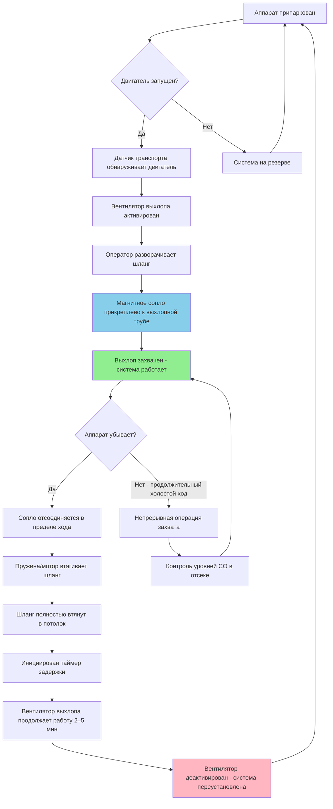

Системы катушек для отвода дизельного выхлопа служат механизмом доставки для вентиляции с захватом у источника на пожарных станциях, позиционируя гибкие выхлопные шланги для подключения к выхлопным трубам аппарата. Правильное проектирование катушки обеспечивает быстрое развертывание, надежное втягивание и минимальное воздействие на операции экстренного реагирования.

## Потолочные конфигурации катушек для шлангов

Потолочные катушки для шлангов являются стандартным подходом установки для систем отвода выхлопов в аппаратном отсеке. Верхнее позиционирование держит шланги приподнятыми в состоянии втянутого хранения, предотвращая опасность спотыкания и защищая шланги от движения транспорта.

**Стратегическое позиционирование:**

Размещайте катушки для шлангов непосредственно над позициями парковки транспорта, смещенные на 60–90 см в сторону задней части для выравнивания с типичными положениями выхлопных труб. Устанавливайте катушки на высоте 2,4–3 м над готовым полом (AFF) для обеспечения достаточного зазора для поднятых воздушных аппаратов и позволяя полное разворачивание шланга без контакта с полом во время развертывания.

Позиционируйте катушки для обеспечения прямолинейного развертывания к выхлопным трубам, минимизируя изгибы, которые увеличивают перепад давления и снижают срок службы шланга. Для аппаратов с двойными выхлопными отверстиями установите две независимые катушки для шлангов или укажите сборку с двойным шлангом.

**Конструкция поворотного рычага:**

Включите возможность поворота на 180 градусов для размещения вариаций парковки и позволяющую переустановку аппарата без отключения захвата выхлопа. Укажите тяжелые шариковые опоры или запечатанные роликовые опоры с поворотом, рассчитанные на непрерывные циклы нагрузки. Упорные подшипники должны поддерживать вертикальный вес шланга (7–11 кг типично) плюс динамическую нагрузку во время циклов разворачивания/втягивания.

Обеспечьте положительные упоры в пределах поворота для предотвращения скручивания шланга и поддержания правильной ориентации к соединениям выхлопного воздуховода. Установите гибкие соединители воздуховодов на входах катушки для изоляции механических вибраций и размещения полного радиуса поворота без помех воздуховодам.

**Требования к зазорам:**

Поддерживайте минимальный зазор 30 см от направляющих потолочных дверей, осветительных приборов и конструктивных элементов. Проверьте достаточную высоту потолка для полностью втянутого диаметра катушки шланга (типично 20–30 см диаметр намотки) плюс корпус катушки. Учитывайте аппараты с расширенной высотой (аэрошвы, платформы, световые башни) для предотвращения контакта во время транзита по отсеку.

## Длина шланга и требования к втягиванию

Выбор длины шланга балансирует гибкость развертывания в зависимости от потерь перепада давления и надежности втягивания. Чрезмерная длина увеличивает потери на трение и снижает скорость захвата у сопла, в то время как недостаточная длина ограничивает позиционирование аппарата.

**Определение длины:**

Рассчитайте требуемую длину шланга используя геометрические связи:

$$L = \sqrt{(D_h)^2 + (D_v)^2} + S$$

Где:
- $L$ = Требуемая длина шланга (м)
- $D_h$ = Горизонтальное расстояние от катушки до выхлопной трубы (м)
- $D_v$ = Вертикальное расстояние от катушки до выхлопной трубы (м)
- $S$ = Резерв сервиса, типично 0,6–0,9 м

Стандартные длины шлангов находятся в диапазоне 3,6–6 м для типичных конфигураций аппаратного отсека. Проверьте фактическое расстояние развертывания для каждого типа аппарата, учитывая:

- Вариации длины транспорта
- Позиционирование выхлопной трубы (центральный или боковой выход)
- Требования зазора для операций подъема кабины
- Диапазон регулировки для допуска позиции парковки

**Производительность втягивания:**

Полное втягивание должно произойти в течение 2–4 секунд после отпускания сопла для предотвращения повреждения шланга от отъезжающего транспорта. Сила втягивания должна преодолеть:

$$F_r = F_h + F_f + F_g$$

Где:
- $F_r$ = Требуемая сила втягивания (Н)
- $F_h$ = Компонент веса шланга (Н)
- $F_f$ = Сила трения в шланге и подшипниках катушки (Н)
- $F_g$ = Гравитационная составляющая для вертикального подъема (Н)

Размер натяжения пружины или крутящего момента мотора для обеспечения запаса 25–35% выше расчетной силы втягивания для поддержания согласованной производительности по мере старения пружин или накопления износа подшипников.

## Пружинные и моторизованные системы катушек

Механизмы втягивания катушек для шлангов используют либо пружины постоянного усилия, либо электрические моторы, каждый с отличительными характеристиками производительности.

| Тип системы | Катушки с пружинным приводом | Моторизованные катушки |
|-------------|-------------------------------|------------------------|
| **Скорость втягивания** | Немедленное (< 2 сек) | Отложенное (3–5 сек) |
| **Начальная стоимость** | $800–1 500 за катушку | $2 000–3 500 за катушку |
| **Требования питания** | Отсутствуют | 120В переменный ток, 2–5A типично |
| **Частота обслуживания** | Ежегодная проверка натяжения пружины | Ежеквартальная проверка мотора/контроллера |
| **Режим отказа** | Постепенная потеря натяжения | Полный отказ втягивания |
| **Срок службы** | 10–15 лет | 8–12 лет (замена мотора) |
| **Уровень шума** | Низкий (< 60 дBA) | Умеренный (65–75 dBA) |
| **Интеграция управления** | Пассивное (автоматическое) | Активное (требуются датчики) |
| **Производительность в холодную погоду** | Отличная | Хорошая (может потребоваться обогреватель) |

**Пружинные системы:**

Механизмы с постоянным усилием пружины обеспечивают надежное втягивание посредством накопления механической энергии. По мере разворачивания шланга пружина наматывается на барабан хранения, накапливая потенциальную энергию, выпущенную при втягивании.

Преимущества включают:
- Мгновенное втягивание при отпускании сопла
- Отсутствие требования к электроэнергии
- Простая, надежная конструкция
- Минимальные требования обслуживания
- Предсказуемый профиль усилия на всем протяжении хода

Ограничения включают:
- Усталость пружины со временем (потеря натяжения 5–10% за десятилетие)
- Ограниченный диапазон регулировки для различных весов шлангов
- Более высокое начальное натяжение может смещать магнитные сопла во время движения транспорта задним ходом
- Требуется ручная регулировка натяжения при обслуживании

**Моторизованные системы:**

Моторизованные катушки с электрическим приводом используют редукторы или прямой привод мотора, управляемые концевыми выключателями или роторными кодировщиками. Датчики обнаружения транспорта (фотоэлектрические, индуктивные или чувствительные к давлению) запускают последовательность автоматического втягивания.

Преимущества включают:
- Программируемая скорость втягивания и задержка
- Управляемое натяжение предотвращает смещение сопла
- Легко размещает различные веса шлангов
- Интеграция с системами автоматизации зданий
- Диагностическая обратная связь для обслуживания

Ограничения включают:
- Требования к распределению электроэнергии
- Сложность системы управления
- Отложенное втягивание создает потенциальное окно повреждения шланга
- Более высокая нагрузка обслуживания (щетки мотора, концевые выключатели, датчики)
- Рекомендуется вспомогательный механизм пружины для отказа питания

**Критерии выбора:**

Укажите катушки с пружинным приводом для:
- Установок нового строительства
- Проектов с ограниченным бюджетом
- Станций с ограниченной электрической мощностью
- Приложений в холодном климате
- Установок, требующих минимального обслуживания

Укажите моторизованные катушки для:
- Приложений переоборудования, где натяжение пружины может смещать существующие магнитные сопла
- Станций с системами автоматизации зданий
- Приложений, требующих отложенное втягивание для безопасности оператора
- Установок с различными длинами или весами шлангов

## Подключение к выхлопным трубам транспорта

Методы подключения шланга к выхлопной трубе определяют эффективность захвата системы, скорость развертывания и требования обслуживания.

**Подключения с магнитным соплом:**

Сборки редкоземельного магнита создают полузакрытые соединения через магнитное притяжение к ферромагнитным материалам выхлопной трубы. Сопла включают контурные резиновые прокладки, которые соответствуют геометрии выхлопной трубы, достигая эффективности захвата 95–98%.

Спроектируйте подключение шланга к соплу с положительной механической фиксацией (байонетный замок, резьбовой воротник или быстроразъемный муфта) для предотвращения разделения во время движения транспорта задним ходом. Магнитная сила удержания (11–23 кг типично) должна превышать натяжение втягивания шланга для предотвращения преждевременного отключения, оставаясь в пределах безопасных ограничений силы ручного удаления.

**Прямые переходные адаптеры:**

Жесткие или полужесткие адаптеры выхлопной трубы обеспечивают механические соединения через ленты зажима, резьбовые воротники или быстроразъемные муфты. Эти системы достигают эффективности захвата более 99% посредством позитивного уплотнения.

Последовательность подключения влияет на время экстренного реагирования. Укажите конструкции быстрого разъединения, которые завершают подключение/отключение менее чем за 3 секунды на аппарат. Обучите персонал правильной технике подключения для предотвращения перекрестной нарезки, неполного зацепления или повреждения прокладки.

**Шарнирная артикуляция с шаровой втулкой:**

Установите шарниры с шаровой втулкой между завершением шланга и узлом сопла для размещения смещения выхлопной трубы и движения транспорта во время операций задним ходом. Укажите шарниры с:
- Способность углового отклонения: минимум ±15 градусов
- Способность поворота: 360 градусов непрерывный
- Рейтинг температуры: 260°C непрерывный, 427°C прерывистый
- Материал уплотнения: высокотемпературный силикон или фторэластомер

Эта артикуляция предотвращает перекручивание шланга во время развертывания и снижает требования к силе подключения для операторов.

## Выбор материалов для долговечности

Материалы выхлопного шланга должны выдерживать непрерывное воздействие высоких температур, кислых конденсатов, озона и механического истирания, сохраняя гибкость на протяжении всего диапазона рабочей температуры.

**Конструкция шланга:**

Укажите многослойную конструкцию с включением:

1. **Внутренний слой:** Высокотемпературный силиконовый каучук или фторполимер (ПТФЭ, ФЭП), обеспечивающий химическую стойкость и гладкие поверхности потока
2. **Армирование:** Спираль из нержавеющей стали (калибр 20–22) или шнур из стекловолокна, поддерживающий целостность конструкции при условиях всасывания
3. **Наружное покрытие:** Ткань из стекловолокна, покрытая силиконом, или полиэстер, покрытый неопреном, обеспечивающие устойчивость к истиранию и защиту от погодных условий

**Требования производительности:**

| Свойство | Спецификация | Метод тестирования |
|----------|--------------|-------------------|
| Диапазон температур | -40°C до +260°C непрерывный | ASTM D6815 |
| Предел прочности при растяжении | > 5,5 МПа | ASTM D412 |
| Устойчивость к разрыву | > 25 кН/м | ASTM D624 |
| Стойкость к пламени | Самопогашение | UL 94 V-0 |
| Устойчивость к озону | Без трещин после 168 ч | ASTM D1149 |
| Остаточная деформация при сжатии | < 25% при 204°C | ASTM D395 |
| Устойчивость к вакууму | Без коллапса при -2,5 кПа | SMACNA HVAC-DCS |

**Концевые муфты:**

Изготавливайте соединения шланга к катушке используя оцинкованную сталь, нержавеющую сталь или алюминий с порошковым покрытием. Закрепляйте шланги к муфтам посредством ареолированных наконечников, резьбовых воротников с кольцами сжатия или адгезионного крепления в соответствии со спецификациями производителя.

Укажите защитные кольца натяжения при переходах шланга к муфте для предотвращения концентрации напряжения и преждевременного отказа. Все металлические компоненты в контакте с конденсатом выхлопа требуют коррозионностойких покрытий или материалов (предпочтительна нержавеющая сталь типа 304/316).

**Конструкция катушки:**

Изготавливайте барабаны и рамы катушки из стали 11–14 калибра с порошковым покрытием или горячим оцинкованием для защиты от коррозии. Спроектируйте диаметр барабана для ограничения минимального радиуса изгиба шланга до $R_{min} \geq 3D_{hose}$ для предотвращения перекручивания и удлинения срока службы.

Подшипники должны быть запечатанными шариковыми или роликовыми типом со смазкой для высокой температуры (марка NLGI 2, точка каплепадения > 204°C), пригодной для непрерывной эксплуатации. Укажите расы и уплотнения подшипников из нержавеющей стали для коррозионных сред.

## Графики обслуживания и проверки

Систематическое обслуживание предотвращает неожиданные сбои и обеспечивает согласованную производительность захвата на протяжении всего срока службы системы.

**Ежемесячные проверки (операторы аппаратов):**

Проводите визуальную проверку во время процедур плановой проверки аппарата:
- Проверьте, что шланг полностью разворачивается и втягивается без заеданий
- Проверьте внешнюю поверхность шланга на наличие порезов, истирания или теплового повреждения
- Проверьте силу удержания магнитного сопла (должна требовать умышленного усилия для удаления)
- Протестируйте датчики обнаружения транспорта и автоматическую активацию вентилятора
- Документируйте любые аномалии в журнале обслуживания станции

**Ежеквартальные проверки (обслуживание предприятия):**

Проводите детальное функциональное тестирование:
- Измерьте время втягивания с полного разворачивания (должно быть < 4 секунд)
- Проверьте поворот поворотного рычага на полный ход поворота на 180 градусов
- Проверьте подключение шланга к катушке на наличие ослабления или коррозии
- Протестируйте состояние прокладки магнитного сопла и производительность уплотнения
- Очистите внешнюю поверхность шланга и удалите загрязнение маслом или химикатами
- Смажьте подшипники катушки и точки опоры в соответствии с графиком производителя

**Ежегодная комплексная проверка (подрядчик HVAC):**

Выполните полную проверку производительности системы:
- Проведите измерение расхода воздуха в каждой позиции шланга используя калиброванный анемометр
- Проверьте минимальный расход захвата (350–500 CFM (595–849 м³/ч) типично)
- Измерьте статическое давление на входе катушки (должно быть 75–200 Па)
- Проведите испытание дымом для проверки эффективности захвата > 95%
- Проверьте натяжение пружины или работу мотора (отрегулируйте/замените по необходимости)
- Документируйте все измерения в записях обслуживания

**Интервалы замены компонентов:**

| Компонент | Интервал замены | Индикаторы |
|-----------|-----------------|-----------|
| Выхлопной шланг | 5–8 лет | Видимое треснувшее покрытие, сниженная гибкость, повреждение внутреннего слоя |
| Магнитные сопла | 3–5 лет | Сила удержания < 9 кг, затвердение прокладки |
| Картриджи пружин | 10–15 лет | Время втягивания > 5 секунд, неполное втягивание |
| Электрические моторы | 8–12 лет | Шум подшипников, перегрев, сниженный крутящий момент |
| Подшипники | 10–15 лет | Шероховатость при вращении, видимая коррозия |

Замените шланги немедленно при возникновении любого из следующих повреждений:
- Сквозные прокалывания или разрывы
- Тепловое повреждение (плавление, обугливание или серьезное изменение цвета)
- Воздействие армирования проволокой или разрыв
- Разделение или ослабление концевой муфты
- Коллапс при условиях вакуума

## Последовательность операции системы катушки для выхлопа

Следующая диаграмма иллюстрирует полный операционный цикл типичной системы катушки для отвода дизельного выхлопа в аппаратном отсеке пожарной станции.

**Примечания операции:**

Цикл системы приоритеты безопасности оператора и надежности захвата:

1. **Автоматическая активация:** Датчики обнаружения транспорта исключают зависимость от ручного управления вентилятором, обеспечивая удаление выхлопа начинается немедленно при запуске двигателя
2. **Магнитное отсоединение:** Автоматическое отпускание сопла на расстояние 3–5 м движения транспорта предотвращает повреждение шланга и обеспечивает быстрое экстренное реагирование
3. **Быстрое втягивание:** Втягивание, приводимое пружиной или мотором, завершается в течение 2–4 секунд для очистки пола отсека перед отъездом аппарата
4. **Цикл очистки:** Вентиляторы выхлопа продолжают работу после отъезда аппарата для очистки остаточных частиц дизеля из атмосферы отсека
5. **Отказоустойчивая конструкция:** Система по умолчанию переходит в активацию вентилятора при любом отказе датчика, приоритизируя качество воздуха над потреблением энергии

Персонал станции должен проверить правильную работу системы при смене смены для обеспечения готовности к экстренному реагированию.

## Соображения проектирования

**Распределение потока воздуха:**

Размер выхлопного коллектора для поддержания сбалансированного потока воздуха через все катушки для шлангов при одновременной работе нескольких аппаратов. Спроектируйте статическое давление воздуховода для обеспечения 100–150 Па на самой дальней катушке для шланга, обеспечивая достаточную скорость захвата.

Максимальная скорость в коллекторе сбора не должна превышать 12,7 м/с для ограничения шума и перепада давления. При 200 м³/ч на шланг и четырех позициях аппарата, размер коллектора требует:

$$A_{min} = \frac{Q_{total}}{V_{max}} = \frac{800}{12,7} = 0,063 \text{ м}^2$$

Это дает минимум диаметр 280 мм, при стандартном размере 300 мм обеспечивая проектный запас.

**Положения в холодном климате:**

Подогреваемый подпиточный воздух предотвращает замерзание шланга от конденсата выхлопа в условиях ниже нуля. Размер установок подпиточного воздуха для обеспечения подачи воздуха 18–24°C, равного 100% выхлопного потока для поддержания давления в отсеке.

Установите дренажные клапаны в низких точках выхлопного коллектора для удаления конденсата до замораживания. Укажите материалы шлангов с рейтингами низкотемпературной гибкости для предотвращения трещин во время развертывания в холодную погоду.

**Управление шумом:**

Шум вентилятора выхлопа не должен превышать 65 dBA в аппаратном отсеке или 45 dBA в примыкающих жилых помещениях. Укажите встроенные глушители в выхлопном воздуховоде, рассчитанные на максимум 38 Па перепада давления при расходе проектирования. Выбирайте катушки с низким уровнем шума подшипников и гладкими профилями втягивания для минимизации операционного уровня звука.

Правильно спроектированные системы катушек для выхлопа обеспечивают надежный, долгосрочный захват дизельного выхлопа с минимальной нагрузкой обслуживания, защищая здоровье пожарных при сохранении готовности к экстренному реагированию.
