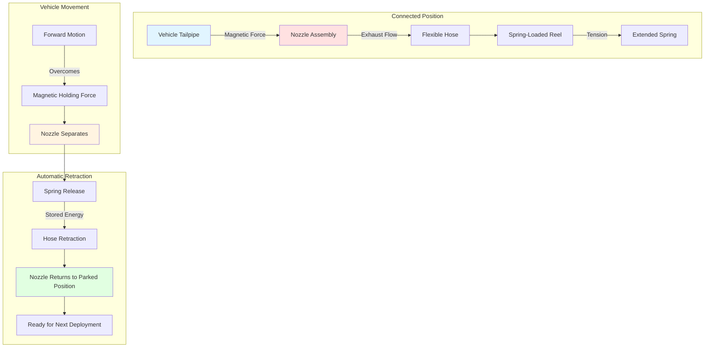

Системы форсунок с магнитным и пружинным управлением обеспечивают автоматические механизмы присоединения и отсоединения для удаления дизельного выхлопа на пожарных станциях, позволяя быстро развернуть транспортное средство при сохранении эффективного улавливания у источника во время прогрева и стационарной работы. Эти инженерные устройства соединения балансируют конкурирующие требования надежного улавливания выхлопа и мгновенного разделения при реагировании на чрезвычайную ситуацию.

## Работа магнитного отсоединения

Системы магнитных форсунок используют постоянные магниты из редкоземельных элементов, расположенные в радиальном или окружном порядке для создания притягивающих сил между узлом форсунки и ферромагнитными выхлопными трубами транспортного средства. Конструкция магнитной цепи определяет удерживающую силу, характеристики отпускания и надежность при работе.

**Основы магнитной силы:**

Притягивающая сила между магнитом и выхлопной трубой подчиняется соотношению:

$$F = \frac{B^2 A}{2\mu_0}$$

Где:
- $F$ = магнитная сила (Н)
- $B$ = плотность магнитного потока на воздушном зазоре (Тл)
- $A$ = эффективная площадь магнитного контакта (м²)
- $\mu_0$ = проницаемость свободного пространства ($4\pi \times 10^{-7}$ Гн/м)

Практические системы форсунок пожарных станций генерируют удерживающие силы 110–220 Н для сохранения соединения во время вибрации двигателя и движения транспортного средства при обеспечении надежного разделения на расчетных расстояниях движения.

**Конструкция магнитной цепи:**

Магниты из неодима-железо-бора (NdFeB) обеспечивают наивысший энергетический продукт для компактных узлов форсунок, при этом типичные марки N42–N52 предлагают максимальные рабочие температуры 80–150°C. Высокотемпературные марки (N42SH через N52SH) расширяют рабочие пределы до 150°C, компенсируя теплопередачу системы выхлопа к корпусам форсунок.

Воздушный зазор между магнитом и выхлопной трубой критически влияет на удерживающую силу. Для воздушного зазора 2 мм (с учетом хромового покрытия, коррозии или неровностей поверхности):

$$B_{gap} = \frac{B_r}{1 + \frac{\mu_r \times g}{L_m}}$$

Где:
- $B_r$ = остаточная плотность потока материала магнита (1,2–1,4 Тл для NdFeB)
- $\mu_r$ = относительная проницаемость магнита (≈1,05)
- $g$ = расстояние воздушного зазора (м)
- $L_m$ = толщина магнита в направлении поля (м)

Увеличение воздушного зазора с 1 мм до 3 мм обычно снижает удерживающую силу на 40–60%, подчеркивая важность конформного контакта форсунки с выхлопной трубой.

## Пружинное автоматическое отключение

Механизмы пружинного отпускания преобразуют движение транспортного средства в механическое разделение соединения форсунка-выхлопная труба. Пружинная система должна накапливать достаточную энергию для преодоления магнитной удерживающей силы при сохранении управляемой скорости втягивания шланга.

**Анализ силы отпускания:**

Требуемая сила пружины отпускания превышает магнитную удерживающую силу на коэффициент отпускания $k_r$ (обычно 1,3–1,5):

$$F_{spring} = k_r \times F_{mag} + F_{hose} + F_{friction}$$

Где:
- $F_{spring}$ = сила пружины отпускания (Н)
- $k_r$ = коэффициент надежности отпускания (безразмерный)
- $F_{mag}$ = магнитная удерживающая сила (Н)
- $F_{hose}$ = сила сопротивления шланга при втягивании (Н)
- $F_{friction}$ = трение в оси и подшипниках (Н)

Для типичной установки с магнитной силой 220 Н, сопротивлением шланга 45 Н и трением 15 Н требуемая сила пружины равна:

$$F_{spring} = 1,4 \times 220 + 45 + 15 = 368 \text{ Н}$$

**Кинематика втягивания:**

Системы барабана с пружинным управлением достигают контролируемого втягивания через конструкции пружин с постоянной силой или постоянным крутящим моментом. Линейная скорость втягивания варьируется в зависимости от удлинения шланга:

$$v(x) = \sqrt{\frac{2(F_{spring} - F_{drag})x}{m_{eff}}}$$

Где:
- $v(x)$ = скорость втягивания при удлинении $x$ (м/с)
- $F_{drag}$ = аэродинамическое и фрикционное сопротивление (Н)
- $m_{eff}$ = эффективная масса шланга и форсунки (кг)

Максимальные скорости втягивания 1,5–2,5 м/с предотвращают хлесткое движение шланга и повреждение оборудования при обеспечении быстрого освобождения от отсека аппарата.

## Совместимость адаптера выхлопной трубы

Узлы форсунок должны соответствовать диапазону конфигураций выхлопных труб в парке пожарных аппаратов, включая вариации в диаметре, ориентации и высоте крепления.

**Требования по размерам:**

| Параметр выхлопной трубы | Диапазон | Соответствие форсунки |
|--------------------------|----------|----------------------|
| Внешний диаметр | 63–152 мм | Регулируемая радужка или несколько размеров форсунок |
| Угол выхода | 0–45° от горизонтали | Шарнирное соединение (±30°) |
| Высота над полом | 300–900 мм | Регулируемая длина шланга и положение барабана |
| Толщина стенки | 1,5–3,0 мм | Глубина магнитной цепи |
| Материал | Ферритная сталь, нержавеющая сталь | Минимальное содержание стали для магнитного крепления |

Выхлопные трубы из аустенитной нержавеющей стали (серия 300) имеют низкую магнитную проницаемость, снижая удерживающую силу на 85–95% по сравнению с углеродистой сталью. Решения адаптеров включают:

1. **Механические зажимы:** ленточные или муфтовые зажимы для немагнитных выхлопных труб
2. **Адгезивные магнитные полосы:** ферромагнитный материал, применяемый к поверхности выхлопной трубы
3. **Гибридные системы:** комбинированное магнитное и механическое удержание

**Эффективность герметизации:**

Интерфейс форсунка-выхлопная труба создает полугерметичное соединение с контролируемой утечкой. Эффективность улавливания $\eta_c$ связана с отношением площади утечки:

$$\eta_c = \frac{Q_{captured}}{Q_{total}} = \frac{1}{1 + \frac{A_{leak}}{A_{nozzle}} \sqrt{\frac{\Delta P_{nozzle}}{\Delta P_{leak}}}}$$

Где:
- $A_{leak}$ = площадь зазора между форсункой и выхлопной трубой (м²)
- $A_{nozzle}$ = площадь горла форсунки (м²)
- $\Delta P_{nozzle}$ = перепад давления через форсунку (Па)
- $\Delta P_{leak}$ = разность давлений на пути утечки (Па)

Правильно подогнанные форсунки достигают 95–98% эффективности улавливания, при этом остальные газы выхлопа направляются в общую систему вентиляции отсека аппарата.

## Надежность соединения при прогреве транспортного средства

Периоды прогрева транспортного средства создают тепловые и вибрационные нагрузки на соединение форсунок. Дизельные двигатели генерируют температуры выхлопной трубы 150–400°C во время прогрева, при этом тепловое расширение влияет на геометрию соединения.

**Тепловые соображения:**

Линейное расширение выхлопной трубы во время прогрева подчиняется:

$$\Delta L = \alpha \times L_0 \times \Delta T$$

Для удлинения выхлопной трубы на 600 мм, нагреваемого с 20°C до 300°C:

$$\Delta L = 12 \times 10^{-6} \times 0,6 \times 280 = 2,0 \text{ мм}$$

Это увеличение на 2 мм может сместить положение форсунки, требуя гибкого крепления или шарнирных соединений для сохранения зацепления.

**Устойчивость к вибрации:**

Вибрация двигателя передается через систему выхлопа на основных частотах 20–100 Гц (соответствующих частотам вращения двигателя 600–3000 об/мин для 4-тактных двигателей). Магнитное соединение должно сопротивляться вибрационному ускорению:

$$a_{vib} = (2\pi f)^2 A_{vib}$$

Где:
- $a_{vib}$ = вибрационное ускорение (м/с²)
- $f$ = частота вибрации (Гц)
- $A_{vib}$ = амплитуда вибрации (м)

Для вибрации 50 Гц при амплитуде 0,5 мм:

$$a_{vib} = (2\pi \times 50)^2 \times 0,0005 = 49,3 \text{ м/с}^2$$

Результирующая динамическая сила на узле форсунки массой 2 кг составляет 98,6 Н, требуя магнитных удерживающих сил значительно выше этого порога для предотвращения преждевременного отсоединения.

## Автоматическое отсоединение при движении транспортного средства

Автоматическое разделение происходит, когда сила тяги транспортного средства превышает объединенное сопротивление магнитной удерживающей силы и сопротивления шланга. Расстояние разделения $d_{sep}$ зависит от характеристик пружины и геометрии отпускания.

**Механика разделения:**

Для транспортного средства, ускоряющегося с скоростью $a$ с прикрепленной магнитной форсункой:

$$F_{traction} - F_{mag} - F_{hose}(d) = m_{vehicle} \times a$$

Разделение происходит при достижении накопленного удлинения шланга:

$$d_{sep} = \frac{F_{mag} + F_{hose,max}}{k_{hose}}$$

Где $k_{hose}$ представляет эффективную константу жесткости системы шланга-барабана.

Типичные расстояния разделения составляют 3–5 м, обеспечивая достаточный зазор для втягивания форсунки перед выходом транспортного средства из дверного проема отсека.

**Безопасность отпускания:**

Отпускание форсунки должно происходить предсказуемо для предотвращения:
- Запутывания шланга с компонентами транспортного средства
- Повреждения выхлопной трубы от чрезмерных боковых сил
- Помех для соседних аппаратов
- Травм персонала от раскачивающихся шлангов

Особенности безопасности включают:
1. Ограничители силы разрыва (пороговое значение 150–250 Н)
2. Направляющие дорожки втягивания, предотвращающие боковое раскачивание
3. Амортизирующие упоры в полностью втянутом положении
4. Визуальные и звуковые индикаторы статуса зацепления форсунки

## Руководство по установке и регулировке

Правильная установка обеспечивает надежную работу в парке транспортных средств и оперативных сценариях, встречающихся в приложениях служб противопожарной защиты.

**Позиционирование барабана шланга:**

Установите барабаны шлангов для удовлетворения геометрических ограничений:

1. **Горизонтальное смещение:** 0,3–0,6 м от продольной оси транспортного средства
2. **Высота вертикального расположения:** 2,4–3,0 м над уровнем пола
3. **Продольное положение:** 1,0–1,5 м впереди выхлопной трубы при припаркованном транспортном средстве

Это позиционирование минимизирует радиус изгиба шланга и позволяет естественное выравнивание между форсункой и выхлопной трубой.

**Регулировка магнитной силы:**

Некоторые конструкции форсунок позволяют регулировать магнитную силу через:
- регулировку расстояния между магнитами (изменение эффективного воздушного зазора)
- выбор магнитов различных марок
- добавление/удаление элементов магнита

Проверьте удерживающую силу с помощью откалиброванной тянущей шкалы, прилагаемой перпендикулярно поверхности выхлопной трубы. Целевые значения:

| Тип транспортного средства | Минимальная удерживающая сила | Максимальная удерживающая сила |
|---------------------------|-------------------------------|--------------------------------|
| Легкий автомобиль скорой помощи | 110 Н | 180 Н |
| Основной насосный автомобиль | 130 Н | 220 Н |
| Аппарат с выдвижной лестницей | 150 Н | 245 Н |

Чрезмерная магнитная сила предотвращает надежное разделение; недостаточная сила позволяет отсоединение во время вибрации.

**Калибровка натяжения пружины:**

Отрегулируйте натяжение пружинного барабана для достижения полного втягивания без чрезмерного ускорения:

1. Удлините шланг на максимальную длину развертывания
2. Измерьте время втягивания и конечную скорость
3. Отрегулируйте предварительное натяжение пружины для достижения времени втягивания 2–4 секунды
4. Проверьте втягивание с нагруженной форсункой (тестовый вес 0,5–1,0 кг)

Задокументируйте позиции регулировки пружины и производительность втягивания для каждого положения отсека аппарата.

**Проверка выравнивания:**

С припаркованным транспортным средством в обычной позиции:
1. Разверните форсунку к выхлопной трубе
2. Проверьте осевое выравнивание в пределах ±15° продольной оси выхлопной трубы
3. Убедитесь в отсутствии защемления или чрезмерного изгиба шланга (радиус > 300 мм)
4. Подтвердите магнитное зацепление с слышимым "щелчком" или тактильной обратной связью
5. Примените боковое смещение (±50 мм) для проверки стабильности соединения

Повторите проверку для вариаций позиции припаркованного транспортного средства (±150 мм продольное, ±100 мм боковое) для учета вариабельности позиционирования водителя.

## Сравнение систем

Выбор между магнитной и пружинной системами зависит от оперативных приоритетов, характеристик парка и ограничений при установке.

| Особенность | Магнитная форсунка | Механизм пружинного управления |
|-------------|-------------------|--------------------------------|
| Способ присоединения | Магниты из редкоземельных элементов к ферромагнитной выхлопной трубе | Сила механической пружины |
| Удерживающая сила | 110–220 Н | 150–370 Н |
| Триггер отпускания | Движение транспортного средства преодолевает магнитную силу | Натяжение пружины преодолевает сопротивление |
| Совместимость выхлопной трубы | Требует ферромагнитный материал | Совместима со всеми материалами |
| Сложность установки | Средняя (выравнивание магнита критично) | Низкая (стандартное крепление барабана шланга) |
| Требования по регулировке | Подгонка магнитной силы для каждого транспортного средства | Калибровка натяжения пружины |
| Эффективность улавливания | 95–98% (полугерметичное соединение) | 92–96% (зависит от подгонки форсунки) |
| Частота обслуживания | Ежеквартальная инспекция магнита | Ежемесячная проверка натяжения пружины |
| Расстояние разделения | 3–5 м типично | 2–4 м типично |
| Температурное ограничение | 150°C непрерывно (зависит от марки NdFeB) | 200°C+ (зависит от материала пружины) |
| Стоимость (относительная) | Выше (материалы магнита) | Ниже (механические компоненты) |
| Режим отказа | Постепенное снижение силы (деградация магнита) | Внезапное (усталость/разрыв пружины) |

Гибридные системы, объединяющие магнитное крепление и пружинное втягивание, обеспечивают оптимальную производительность, объединяя надежное соединение магнитных форсунок с положительными характеристиками разделения пружинных механизмов.

**Оперативная надежность:**

Обычные протоколы тестирования проверяют продолжающуюся производительность системы:

- **Еженедельно:** визуальная инспекция на повреждения шланга, выравнивание форсунки
- **Ежемесячно:** проверка натяжения пружины, проверка магнитной удерживающей силы
- **Ежеквартально:** полный цикл развертывания/втягивания для всех позиций
- **Ежегодно:** комплексное испытание под нагрузкой, замена износившихся компонентов

Задокументированное тестирование выявляет тенденции деградации до отказа системы, сохраняя требуемую для готовности к реагированию на чрезвычайные ситуации надежность 99%+.

Надлежащим образом спроектированные и обслуживаемые системы магнитных и пружинных форсунок обеспечивают критический интерфейс между системами выхлопа аппаратов и инфраструктурой извлечения зданий, защищая здоровье пожарных при поддержке критических для выполнения миссии возможностей быстрого развертывания.
