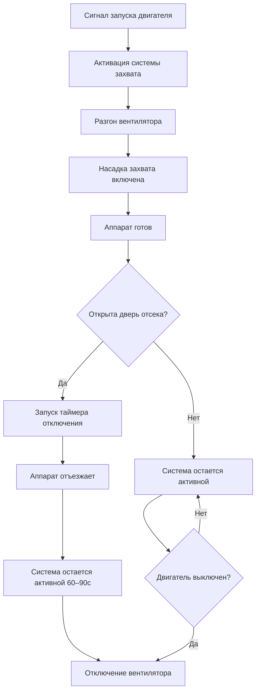

Системы захвата у источника обеспечивают наиболее эффективный метод удаления дизельного выхлопа в момент его образования в отсеках пожарных аппаратов. Эти системы используют устройства прямого подключения или захвата вблизи источника, которые крепятся к выхлопным трубам автомобилей и извлекают выхлопные газы до их распространения в жилое пространство.

## Принципы прямого захвата выхлопов

Захват выхлопов методом прямого подключения работает на принципе захвата выхлопных газов непосредственно у выхлопной трубы через герметичное или почти герметичное соединение. Система создает отрицательное давление внутри воздуховода выхлопов, которое преодолевает обратное давление выхлопов автомобиля при эффективном захвате газов.

Фундаментальный механизм захвата основывается на создании адекватного статического давления в точке захвата:

$$\Delta P_{capture} = P_{exhaust} + P_{duct} + P_{stack}$$

где $\Delta P_{capture}$ представляет общий перепад давления, который должен преодолеть вентилятор извлечения, $P_{exhaust}$ — обратное давление выхлопов транспортного средства, $P_{duct}$ учитывает потери на трение в воздуховодах, а $P_{stack}$ представляет требования к давлению выброса на дымовой трубе.

Устройство захвата должно выдерживать быстрый отъезд транспортного средства, обычно автоматически отключаясь при отъезде аппарата. Пружинные, магнитные или пневматические механизмы отпускания обеспечивают быстрое отключение при сохранении эффективности захвата во время периодов прогрева двигателя.

## Требования к эффективности захвата

Эффективные системы захвата у источника должны обеспечивать минимальную эффективность захвата 95% при работе транспортного средства на холостом ходу и в период прогрева. Такая эффективность гарантирует, что менее 5% выхлопных газов попадает в атмосферу отсека, защищая пожарных от воздействия дизельных твердых частиц и токсичных газов.

Эффективность захвата зависит от нескольких критических параметров:

- **Качество герметичности соединения**: Минимизация утечек воздуха в месте соединения с выхлопной трубой
- **Скорость выхлопа**: Поддержание достаточной скорости для преодоления турбулентного выхода
- **Время отклика системы**: Активация захвата в течение 3–5 секунд после запуска двигателя
- **Конструкция воздуховода**: Предотвращение чрезмерных перепадов давления, снижающих эффективность захвата

Протоколы тестирования обычно используют измерения газа-трассера для проверки эффективности захвата в различных условиях нагрузки двигателя и окружающей температуры.

## Расчет вентилятора для извлечения выхлопов

Вентиляторы извлечения выхлопов должны быть рассчитаны на обработку комбинированного потока выхлопов от самого крупного оборудования при преодолении всех потерь давления в системе. Требуемая производительность вентилятора следует из:

$$Q_{fan} = Q_{exhaust} \times N_{vehicles} \times SF$$

где $Q_{fan}$ — общая производительность вентилятора (CFM), $Q_{exhaust}$ представляет максимальный поток выхлопов на одно транспортное средство (обычно 600–1200 CFM в зависимости от объема двигателя), $N_{vehicles}$ — количество одновременно работающих точек захвата, а $SF$ — коэффициент безопасности (1,15–1,25).

Требования к статическому давлению вентилятора обычно составляют от 1,0 до 1,8 кПа в зависимости от длины воздуховода и высоты дымовой трубы. Центробежные вентиляторы выхлопов с отогнутыми назад или лопатками аэрофойля обеспечивают эффективную работу в требуемом диапазоне.

### Параметры расчета системы

| Параметр | Малый аппарат | Средний аппарат | Крупный аппарат |
|-----------|--------------|-----------------|-----------------|
| Объем двигателя | 5–7 л | 8–12 л | 13–15 л |
| Расход выхлопов | 600–800 CFM (17–23 м³/ч) | 800–1000 CFM (23–28 м³/ч) | 1000–1200 CFM (28–34 м³/ч) |
| Диаметр воздуховода | 15 см | 20 см | 25 см |
| Скорость захвата | 10–13 м/с | 10–13 м/с | 10–13 м/с |
| Статическое давление вентилятора | 1,0–1,2 кПа | 1,2–1,4 кПа | 1,4–1,8 кПа |
| Мощность двигателя | 0,75–1,5 кВт | 1,5–2,2 кВт | 2,2–3,7 кВт |

Преобразователи частоты позволяют модулировать скорость вентилятора на основе количества активных точек захвата, снижая потребление энергии при работе одного транспортного средства.

## Маршрутизация воздуховодов и материалы

Воздуховоды выхлопов должны выдерживать постоянное воздействие горячих, коррозионных дизельных выхлопных газов, содержащих соединения серы, водяной пар и твердые частицы. Выбор материала критически влияет на долговечность системы и требования к техническому обслуживанию.

**Предпочтительные материалы воздуховодов:**

- **Нержавеющая сталь 304 или 316**: Отличная коррозионная стойкость, подходит для температур до 649°C
- **Алюминизированная сталь**: Экономичная альтернатива для приложений с умеренной температурой (до 427°C)
- **Оцинкованная сталь**: Ограниченное использование из-за деградации цинкового покрытия под воздействием кислотного конденсата

Маршрутизация воздуховодов должна минимизировать горизонтальные участки и включать постоянный уклон (минимум 0,6 см на 30 см) в направлении точек сбора конденсата. Гибкие шланговые секции, соединяющие насадку захвата с жестким воздуховодом, должны использовать материалы, рассчитанные на высокую температуру, способные выдерживать постоянное воздействие 260°C.

Избегайте резких изгибов (используйте минимум изгибы с радиусом 1,5D) и включите точки доступа для очистки каждые 6–7,6 м горизонтального участка. Расстояние между опорами следует SMACNA стандартам с дополнительным усилением в местах изменения направления.

## Рассмотрение выброса на дымовой трубе

Конструкция выброса на дымовой трубе предотвращает повторное попадание выхлопных газов в воздухозаборники здания при обеспечении адекватного рассеивания. Скорость выброса должна превышать 13 м/с для достижения надлежащего подъема факела и предотвращения условий нисходящего потока.

Минимальная высота дымовой трубы следует из:

$$H_{stack} = H_{building} + 0,9 + \frac{V_{discharge}}{335}$$

где $H_{stack}$ и $H_{building}$ измеряются в метрах, а $V_{discharge}$ — скорость выброса в м/с.

Располагайте дымовые трубы на расстоянии не менее 3 м по горизонтали от любого воздухозаборника, открываемого окна или границы участка. Дефлекторы не должны препятствовать скорости выброса или создавать чрезмерное обратное давление — используйте прямые выбросы или колпаки с высокой скоростью, специально разработанные для выхлопных применений.

В холодном климате изолируйте дымовые трубы, чтобы предотвратить чрезмерное образование конденсата и обледенение. Дренажи конденсата у основания дымовой трубы предотвращают накопление влаги и коррозию.

## Интеграция системы с дверями отсеков

Системы захвата у источника должны интегрироваться с органами управления дверями отсеков пожарного оборудования, чтобы обеспечить надлежащую работу системы во время движения транспортных средств. Последовательность блокировки обычно следует:

Логика блокировки предотвращает отключение вентилятора во время активного захвата выхлопов, поддерживает работу в течение заданного периода после отъезда транспортного средства (очистка остаточных выхлопов из воздуховодов) и координирует с датчиками положения двери отсека для оптимизации потребления энергии.

Переключатели положения, установленные на двери, подают сигнал системе управления при отъезде аппарата, запуская последовательность отключения по времени. Это предотвращает преждевременное отключение вентилятора при обеспечении того, что система не работает бесконечно после выхода транспортного средства.

Возможности экстренного переопределения позволяют ручную активацию системы для операций техническое обслуживание или тестирования. Индикаторные лампы состояния в каждой точке захвата обеспечивают визуальное подтверждение работы системы для операторов аппарата.

## Проверка производительности системы

Введите в эксплуатацию системы захвата у источника с помощью комплексных протоколов тестирования, которые проверяют эффективность захвата, производительность вентилятора и работу последовательности управления. Измерьте статическое давление в расчетных точках, подтвердите соответствие скоростей выброса минимальным требованиям и проверьте функциональность блокировки путем имитации движения аппарата.

Ежегодное тестирование должно включать проверку эффективности захвата с использованием методов с газом-трассером, проверку фильтров (если применимо) и подтверждение всех предохранительных блокировок. Документируйте производительность системы для отслеживания деградации во времени и выявления потребностей в техническом обслуживании до отказа системы.

Системы захвата у источника представляют основную защиту от воздействия дизельного выхлопа в пожарных депо, требуя тщательного проектирования, надлежащей установки и регулярного технического обслуживания для защиты здоровья пожарных на протяжении всей их карьеры.
