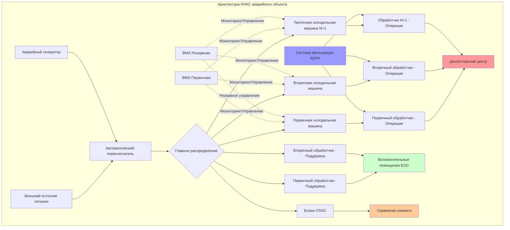

## Обзор HVAC объектов экстренного реагирования

Объекты экстренного реагирования требуют систем HVAC, предназначенных для непрерывной работы в критических ситуациях, когда обычная инфраструктура может быть повреждена. К этим объектам относятся диспетчерские центры 911, центры экстренного управления (EOC), центры слияния информации и управления в чрезвычайных ситуациях. Проектирование HVAC должно приоритизировать надежность, резервирование и операционную непрерывность при всех обстоятельствах, включая отключения питания, экстремальные погодные условия и химические, биологические, радиологические и ядерные (КБРН) события.

Критические требования к проектированию включают:

- **Непрерывная эксплуатация 24/7/365** без запланированных простоев
- **Полностью резервированное оборудование** для исключения единственных точек отказа
- **Совместимость с аварийной мощностью** с автоматическими возможностями переключения
- **Улучшенные системы фильтрации** для защиты от КБРН
- **Точный контроль микроклимата** для чувствительного электронного оборудования
- **Положительное давление** для предотвращения проникновения загрязнителей
- **Независимое зонирование** для критических и вспомогательных помещений

## Требования HVAC диспетчерских центров

В диспетчерских центрах экстренного реагирования размещаются системы компьютерной диспетчеризации (CAD), радиооборудование, телефонные системы и множество дисплеев, генерирующих значительные тепловые нагрузки. Проектирование HVAC должно поддерживать точный контроль температуры и влажности при учете высоких коэффициентов явного тепла.

### Характеристики тепловых нагрузок

Нагрузки охлаждения в диспетчерских центрах обычно составляют 150–250 Вт/м² из-за плотности оборудования. Коэффициент явного тепла обычно превышает 0,90, требуя систем, оптимизированных для явного охлаждения, а не для осушения.

Расчет общей производительности охлаждения:

$$Q_{total} = Q_{sensible} + Q_{latent} = (A \times q_{equipment} + n \times q_{occupant,sensible}) + (n \times q_{occupant,latent})$$

Где:
- $A$ = площадь пола (м²)
- $q_{equipment}$ = плотность теплоотдачи оборудования (Вт/м²)
- $n$ = количество людей
- $q_{occupant,sensible}$ = явное тепло на человека (75 Вт)
- $q_{occupant,latent}$ = скрытое тепло на человека (55 Вт)

### Критерии проектирования диспетчерского центра

| Параметр | Требование | Примечания |
|-----------|-------------|-----------|
| Температура | 21–23°C | Допуск ±1°C |
| Относительная влажность | 40–50% | Без конденсации |
| Воздухообмены | 15–20 ACH | Требования для охлаждения оборудования |
| Резервирование | N+1 минимум | N+2 рекомендуется |
| Резервная мощность | 100% мощность | Полная нагрузка работы |
| Уровень шума | NC 35–40 | Критична низкая шумность |
| UPS оборудования | 15+ минут | Непрерывность управления HVAC |

## Проектирование центра экстренного управления

EOC служат в качестве командного и управляющего центра во время чрезвычайных ситуаций и стихийных бедствий. Эти помещения должны поддерживать операционную способность в течение продолжительных периодов, потенциально с персоналом, укрывающимся на месте в течение дней. Системы HVAC должны поддерживать как главный операционный этаж с обширной электроникой, так и вспомогательные помещения, включая спальни, подготовку пищи и санитарные помещения.

### Конфигурация многозонной системы

EOC требуют независимых зон HVAC для различных функциональных областей:

**Операционный этаж**: Высокая производительность охлаждения (200+ Вт/м²) с точным управлением и 100% резервированием. Несколько меньших агрегатов обеспечивают лучшую надежность, чем одна большая система.

**Вспомогательные помещения**: Стандартное комфортное охлаждение (75–100 Вт/м²) с надлежащей вентиляцией для спальных помещений и комнат отдыха.

**Серверные/ИТ-помещения**: Специальное охлаждение с резервированием N+1, потенциально требующее 300–500 Вт/м² мощности для плотных стоек оборудования.

**Помещения генератора**: Вентиляция, рассчитанная на поступление воздуха для горения плюс отвод тепла от работы двигателя.

## Принципы надежности и резервирования

Объекты экстренного реагирования используют стратегии множественного резервирования для обеспечения безпрерывной работы HVAC.

### Подходы к резервированию оборудования

**Конфигурация N+1**: Базовая мощность (N) плюс один дополнительный агрегат. Для объекта, требующего 30 кВт охлаждения, установите три агрегата по 10 кВт. Потеря любого одного агрегата поддерживает 30 кВт мощности.

**Конфигурация N+2**: Базовая мощность плюс два резервных агрегата. Обеспечивает защиту от одновременных отказов или требований к техническому обслуживанию. Рекомендуется для объектов без альтернативного местоположения.

**Конфигурация 2N**: Полностью дублирующие системы с независимой инфраструктурой, включая холодильные машины, обработчики воздуха, воздуховоды и органы управления. Наивысшая надежность, но со значительной надбавкой к стоимости.

## Интеграция с аварийной мощностью

Системы HVAC должны работать на полной мощности от аварийного генератора. Это требует тщательного анализа нагрузки и расчета размера генератора для учета высоких пусковых токов компрессоров и больших двигателей.

### Расчет мощности генератора

Общая мощность генератора должна включать:

$$P_{generator} = 1.25 \times (P_{HVAC,running} + P_{critical,loads} + P_{starting,margin})$$

Где коэффициент 1,25 обеспечивает 25% резервной мощности, а пусковой запас учитывает пусковой ток двигателя (обычно 6× номинальный ток для двигателей без плавных пускателей).

**Стратегия поэтапного пуска**: Когда несколько компрессоров или обработчиков воздуха должны запуститься, используйте реле времени для последовательного пуска в течение 30–60 секунд, предотвращая одновременный пусковой ток, который может перегрузить генератор.

## Соображения по защите от КБРН

Объекты, обозначенные как защитные помещения во время событий КБРН, требуют специализированных модификаций HVAC.

### Фильтрация и положительное давление

**Поезд фильтрации КБРН**: Прогрессивно улучшающаяся фильтрация, включающая:
- Предварительный фильтр (MERV 8) для удаления основных твердых частиц
- HEPA фильтр (99,97% эффективности при 0,3 мкм) для биологических и радиологических частиц
- Фильтр с активированным углем для адсорбции химических агентов
- Постфильтр для защиты компонентов ниже по потоку

**Положительное давление**: Поддерживайте 5–12 Па положительное давление относительно наружного воздуха для предотвращения проникновения загрязненного воздуха. Рассчитайте требуемый наружный воздух:

$$Q_{OA} = \frac{\Delta P \times A_{leakage}}{\rho \times C_{flow}}$$

Где площадь утечки зависит от герметичности строительной конструкции, а уровень положительного давления определяет требование потока.

**Режим коллективной защиты**: Во время событий КБРН системы переходят на 100% рециркуляцию с фильтрацией КБРН, прекращая поступление наружного воздуха. Этот режим требует предварительного очищения объекта и адекватного удаления $CO_2$ для длительного пребывания.

## Типы объектов и требования HVAC

| Тип объекта | Плотность охлаждения | Резервирование | Защита от КБРН | Продолжительность аварийной мощности |
|-------------|----------------------|-----------------|-----------------|--------------------------------------|
| Диспетчерский центр 911 | 150–250 Вт/м² | N+1 минимум | По желанию | 72 часа минимум |
| Центр экстренного управления | 200–300 Вт/м² | N+2 рекомендуется | Требуется | 7–14 дней |
| Центр слияния информации | 250–350 Вт/м² | N+1 минимум | Требуется | 72 часа минимум |
| Управление экстренного реагирования | 100–150 Вт/м² | N+1 | По желанию | 48 часов минимум |
| Региональный центр координации | 150–200 Вт/м² | N+2 | Требуется | 14+ дней |
| Резервный диспетчерский объект | 150–250 Вт/м² | N+1 | По желанию | 72 часа минимум |

### Протоколы обслуживания и тестирования

Системы HVAC объектов экстренного реагирования требуют строгого предупредительного обслуживания с запланированной ротацией компонентов для проверки функциональности резервного оборудования. Ежемесячное тестирование нагрузки генератора должно включать оборудование HVAC для подтверждения функциональности автоматического переключения и адекватной мощности. Годовое тестирование системы КБРН с аэрозолями-индикаторами проверяет производительность фильтрации и уровни положительного давления.

Системы управления должны включать комплексные сигналы тревоги управлению объектом и удаленный мониторинг для обнаружения любого снижения производительности системы. Прогнозное обслуживание с использованием виброанализа, тепловизионной съемки и анализа масла помогает выявить потенциальные отказы до того, как они повлияют на операции.
