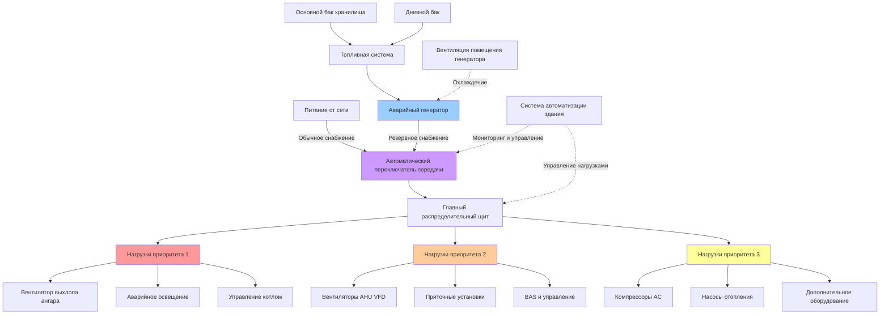

Объекты экстренного реагирования требуют непрерывной работы систем HVAC для поддержания готовности к действиям при отключениях электроэнергии. Системы резервного электропитания должны быть правильно подобраны по мощности, сконфигурированы и обслуживаны для обеспечения функционирования критических систем управления микроклиматом при отказе коммерческого электроснабжения.

## Выбор мощности генератора для нагрузок HVAC

Точный выбор мощности генератора требует тщательного анализа всех нагрузок HVAC, которые должны работать в чрезвычайных условиях. Общая емкость генератора должна учитывать как установившиеся нагрузки, так и пусковые токи двигателей.

Минимальная мощность генератора рассчитывается по формуле:

$$P_{gen} = \frac{\sum P_{running} + P_{largest\_motor} \times (LRA/FLA - 1)}{\text{PF} \times \text{Eff}}$$

где $P_{gen}$ — требуемая мощность генератора (кВ), $P_{running}$ — все одновременно работающие нагрузки, $LRA/FLA$ — отношение пускового тока к номинальному (обычно 5-7 для электродвигателей HVAC), PF — коэффициент мощности (типично 0,8-0,85), и Eff — КПД генератора (0,9-0,95).

При ступенчатом пуске двигателей применяйте коэффициенты одновременности на основе временной задержки между пусками. Задержка в 10 секунд между пусками крупных двигателей обычно позволяет использовать коэффициент одновременности 0,6-0,7 для пусковой нагрузки второго двигателя.

Выбирайте генераторы для непрерывной работы при 70-80% от номинальной мощности, чтобы оставить запас для будущего расширения и оптимальной топливной эффективности. Завышение выше 85% номинальной нагрузки снижает эффективность и увеличивает затраты на техническое обслуживание.

## Интеграция переключателя передачи

Автоматические переключатели передачи (ATS) контролируют питание от сети и инициируют запуск генератора при выходе напряжения или частоты за приемлемые пределы. Для приложений HVAC учитывайте эти критические параметры:

**Требования к времени переключения:**
- Разомкнутое переключение: 100-300 миллисекунд (типично)
- Замкнутое переключение: менее 100 миллисекунд (требуется для критической вентиляции)
- Переключение с задержкой: программируемая задержка 1-30 секунд (снижает пусковой ток)

Интегрируйте ATS с системой управления зданием для координации последовательности остановки и перезапуска оборудования HVAC. Установите задержку 5-10 секунд перед подачей питания на крупные нагрузки HVAC для стабилизации напряжения и частоты генератора.

Для объектов, требующих непрерывной вентиляции (ангары техники с дизельными выхлопами, казармы с круглосуточным проживанием), указывайте переключатели передачи с замкнутым переходом или байпас-изоляцией, которые исключают кратковременное прерывание питания при переключении.

## Последовательности приоритизации нагрузок

Реализуйте ступенчатую загрузку для предотвращения перегрузки генератора при запуске. Типичные уровни приоритета для пожарно-спасательных станций:

**Приоритет 1 (0-10 секунд после стабилизации генератора):**
- Аварийное освещение и указатели выхода
- Системы пожарной сигнализации и связи
- Вентиляторы выхлопа ангаров техники (удаление дизельных паров)
- Управление котлом/печью и воспламенители

**Приоритет 2 (10-30 секунд):**
- Вентиляторы приточных установок (пониженная скорость, если оборудованы VFD)
- Приточные установки для ангаров техники
- Циркуляционные насосы горячей воды
- Система автоматизации здания

**Приоритет 3 (30-60 секунд):**
- Компрессоры кондиционирования воздуха (ступенчатый пуск)
- Насосы и зональные клапаны системы отопления
- Дополнительное вентиляционное оборудование
- Некритическое освещение и розетки

Используйте программируемые логические контроллеры или интегрированные системы автоматизации зданий для выполнения последовательности загрузки. Отслеживайте процент нагрузки генератора и задерживайте последующие этапы, если нагрузка превышает 85% от номинальной мощности.

## Таблица критических нагрузок HVAC

| Тип оборудования | Типичная нагрузка (кВ) | Уровень приоритета | Метод пуска |
|-------------------|------------------------|-------------------|-------------|
| Вентилятор выхлопа ангара техники (каждый) | 1,5-3 | 1 | Прямой пуск |
| Вентилятор приточной установки | 3,7-7,5 | 2 | Мягкий пуск / VFD |
| Приточная установка (9-30 кВ) | 1,1-3 | 2 | Мягкий пуск |
| Крышная установка (18-53 кВ) | 4,5-13,4 | 2-3 | Ступенчатые компрессоры |
| Котел отопления | 6-18,6 | 1-2 | Последовательные горелки |
| Холодильная машина (71-177 кВ) | 11-33,6 | 3 | Запуск с пониженной нагрузкой |
| Циркуляционные насосы (каждый) | 0,75-2,2 | 2 | Мягкий пуск |
| Вентиляторы выхлопа (каждый) | 0,37-1,5 | 2 | Прямой пуск |

## Рассмотрения по хранению топлива и его подаче

Емкость хранилища дизельного топлива определяет максимальную продолжительность отключения, которое объект может выдержать. Рассчитайте минимальный объем хранилища топлива по формуле:

$$V_{fuel} = \frac{P_{avg} \times t_{outage} \times SFC}{27,2 \times \rho_{fuel}}$$

где $V_{fuel}$ — объем топливного бака (л), $P_{avg}$ — средняя нагрузка генератора (кВ), $t_{outage}$ — требуемое время работы (часы), SFC — удельный расход топлива (типично 0,227-0,302 л/кВ·ч), и $\rho_{fuel}$ — коэффициент коррекции плотности топлива.

**Требования к топливной системе:**
- Минимум 48-72 часа работы при 70% нагрузки
- Дневной бак (190-380 л) для незамедлительной готовности
- Основной бак хранилища с автоматической перекачивающей помпой
- Поддержание качества топлива (обработка биоцидом, разделение воды)
- Ежегодное тестирование топлива и услуги очистки

Установите мониторинг уровня топлива с сигнализацией низкого уровня при 25% емкости. Реализуйте контракты на автоматическую доставку топлива для обеспечения пополнения запасов при длительных отключениях.

## Вентиляция помещения генератора

Помещения генераторов требуют значительной вентиляции для удаления воздуха горения, отвода тепла и разбавления любых паров топлива. Рассчитайте требования к вентиляции:

$$Q_{vent} = Q_{combustion} + Q_{cooling}$$

где $Q_{combustion} = P_{gen} \times 17$ м³/ч на кВ (типичное требование к воздуху горения) и $Q_{cooling}$ обеспечивает достаточное количество воздухообменов для поддержания температуры помещения ниже 40°C.

Охлаждающий воздушный поток обычно требует 42,5-56,6 м³/ч на кВ мощности генератора. Используйте жалюзи, рассчитанные на максимальную скорость 2,54 м/с для минимизации перепада давления и шумопередачи.

**Проектирование системы вентиляции:**
- Отдельный воздухозабор для горения (низкий уровень, наружный воздух)
- Выпуск тепла (высокий уровень, электромоторные заслонки)
- Аварийная вентиляция с блокировкой на работу генератора
- Акустические жалюзи для ограничения шумопередачи (NC 45-50 максимум)

## Требования к тестированию и обслуживанию

**Ежемесячный протокол тестирования:**
- Испытание без нагрузки: минимум 30 минут
- Проверка последовательности автоматического запуска
- Проверка уровня жидкостей, напряжения аккумулятора, состояния охлаждающей жидкости
- Осмотр топливной системы на утечки
- Запись часов работы и любых аномалий

**Ежегодное тестирование с нагрузочным банком:**
- Испытание при 100% номинальной нагрузке в течение минимум 2 часов
- Проверка регулирования напряжения в пределах ±5% во всех диапазонах нагрузок
- Подтверждение стабильности частоты в пределах ±0,5 Гц
- Полный цикл переключения (нормальный-аварийный-нормальный)
- Валидация последовательностей приоритизации нагрузок

**Ежеквартальное интеграционное тестирование HVAC:**
- Имитация отказа питания при пиковой нагрузке HVAC
- Проверка передачи и надлежащей работы всех критических нагрузок HVAC
- Подтверждение предотвращения перегрузки генератора последовательностью
- Тестирование функций связи BAS и мониторинга
- Документирование фактических и проектных профилей нагрузок

Ведите подробные журналы обслуживания, отражающие все тесты, добавления топлива, замены масла и ремонты. Многие юрисдикции требуют записей ежемесячного тестирования для соответствия нормам и страховых целей.

## Архитектура системы резервного электропитания

Эта диаграмма иллюстрирует полную архитектуру резервного электропитания, показывая входы питания от сети и генератора в автоматический переключатель передачи, распределение к приоритизированным нагрузкам HVAC, систему подачи топлива и интеграцию с управлением зданием. Цветовое кодирование указывает уровни приоритета, где нагрузки приоритета 1 (красные) получают питание первыми, за ними следуют оборудование приоритета 2 (оранжевое) и приоритета 3 (желтое).
