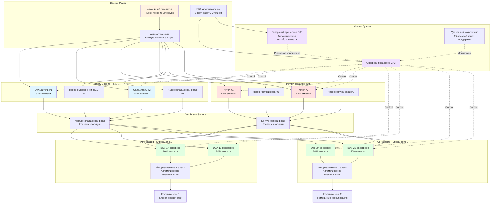

## Требования к HVAC для критически важных операций

Центры управления в чрезвычайных ситуациях (ЦУЧ), диспетчерские станции и критические командные центры требуют систем HVAC, спроектированных для непрерывной работы во время чрезвычайных ситуаций в сообществе, когда стандартная инфраструктура может быть нарушена. Эти объекты должны поддерживать тепловые и экологические условия, обеспечивающие эффективность персонала и работу электронного оборудования, независимо от внешних условий или перебоев в коммунальных услугах.

Основной принцип проектирования отличает объекты критически важных операций от стандартного 24-часового использования: объект не может прекратить работу для обслуживания HVAC и не может допускать отклонения условий окружающей среды, которые снижают операционную способность. Это требование определяет резервирование, выбор компонентов, сложность мониторинга и стратегии обслуживания, принципиально отличающиеся от обычных систем зданий.

## Требования к надежности и время работы системы

### Расчеты доступности

Надежность системы количественно определяет вероятность того, что системы HVAC выполнят свою предназначенную функцию в течение указанного периода. Для объектов критически важных операций доступность A представляет долю времени, в течение которого системы остаются в рабочем состоянии:

$$A = \frac{MTBF}{MTBF + MTTR}$$

Где:
- $MTBF$ = средний интервал между отказами (часы)
- $MTTR$ = среднее время восстановления (часы)

Целевые уровни доступности в зависимости от критичности объекта:

| Тип объекта | Требуемая доступность | Максимальный годовой простой | Классификация уровня |
|--------------|---------------------|------------------------|---------------------|
| Уровень I - базовая емкость | 99,671% | 28,8 часов | ASHRAE уровень 1 |
| Уровень II - компоненты с резервированием | 99,741% | 22,0 часа | ASHRAE уровень 2 |
| Уровень III - одновременно обслуживаемое | 99,982% | 1,6 часа | ASHRAE уровень 3 |
| Уровень IV - отказоустойчивое | 99,995% | 0,4 часа | ASHRAE уровень 4 |

**Типичная цель для критических операций**: минимум уровень III (99,982% доступности) для диспетчерских служб 911 и центров управления в чрезвычайных ситуациях. Командные центры высокой стоимости могут указывать требования уровня IV.

### Анализ надежности компонентов

Надежность отдельных компонентов влияет на общую доступность системы. Частота отказов компонента λ (отказы в час) связана с MTBF:

$$\lambda = \frac{1}{MTBF}$$

Для последовательных систем, где отказ любого компонента вызывает отказ системы, общая надежность системы $R_{system}$ за период времени $t$:

$$R_{system}(t) = e^{-\lambda_1 t} \times e^{-\lambda_2 t} \times ... \times e^{-\lambda_n t} = e^{-(\lambda_1 + \lambda_2 + ... + \lambda_n)t}$$

**Параллельное резервирование** повышает надежность. Для двух идентичных компонентов с надежностью R в конфигурации параллельного подключения:

$$R_{parallel} = 1 - (1-R)^2$$

Пример: два охладителя, каждый с надежностью 95% в конфигурации N+1:
$$R_{parallel} = 1 - (1-0.95)^2 = 1 - 0.0025 = 0.9975 = 99.75\%$$

Это демонстрирует, как резервирование преобразует надежность отдельного компонента в системную доступность, превышающую производительность одного компонента.

## Стратегии резервирования

### Конфигурации архитектуры системы

**Конфигурация N**: один путь, без резервирования. Минимальная требуемая емкость для работы. Любой отказ компонента вызывает отказ системы. Неприемлемо для критических операций.

**Конфигурация N+1**: один резервный компонент. Система продолжает работу на полной емкости при отказе любого одного компонента. Стандартная база для критических объектов.

Реализация проектирования:
- двойные охладители, каждый 50% емкости минимум (предпочтительно 67% емкости)
- двойные воздухообрабатывающие устройства, обслуживающие одну зону с автоматическим переключением
- двойные системы отопления с независимыми источниками топлива
- резервные процессоры управления с автоматической отработкой отказа

**Конфигурация N+2**: два резервных компонента. Система переносит два одновременных отказа. Используется для объектов с наивысшей критичностью или расширенных сценариев обслуживания.

**Конфигурация 2N**: полное дублирование системы. Две независимые системы, каждая способная принять 100% нагрузки объекта. Каждая система включает выделенную инфраструктуру (электроснабжение, водоснабжение, источник топлива). Наивысшая надежность, но наивысшая стоимость.

**Конфигурация 2N+1**: две полные системы плюс один дополнительный компонент. Наивысшее резервирование, сочетающее дублирование на уровне системы и резервирование на уровне компонента. Обычно зарезервировано для объектов национальной безопасности или критичных больниц.

### Одновременная обслуживаемость

Системы уровня III требуют возможности проведения планового обслуживания любого компонента системы без влияния на работу объекта. Это требует возможности изоляции и байпасных схем, выходящих за пределы простого резервирования.

**Стратегии клапанов изоляции**:
- трехклапанная байпасная схема на всех насосах, теплообменниках и встроенном оборудовании
- шаровые клапаны для положительного перекрытия (задвижки недостаточны)
- система маркировки клапана изоляции, определяющая обслуживаемое оборудование и рабочий статус
- помеченная процедура байпаса у каждой группы изоляции

**Изоляция воздуховодов**:
- моторизованные клапаны изоляции на параллельных ветвях воздухообрабатывающих устройств
- ручные клапаны доступа для изоляции обслуживания
- байпасные соединения воздуховодов, позволяющие перенаправлять поток воздуха во время обслуживания фильтра или катушки

**Трубопроводные схемы**:
- реверсивная трубопроводная система для балансировки нагрузки без требования регулирования клапана
- байпасная система трубопровода фильтра, позволяющая очистку без выключения системы
- испытательные и балансовочные порты для наладки и устранения неполадок без проникновения в оборудование

## Выбор оборудования для критически важного использования

### Спецификации компонентов

Оборудование критически важных операций должно превышать коммерческие спецификации по долговечности, обслуживаемости и возможности мониторинга.

**Охладители**:
- промышленные компрессоры, рассчитанные на 100 000+ часов эксплуатации
- двойные контуры хладагента в одном охладителе (допускающие 50% емкости при отказе одного контура)
- комплексное микропроцессорное управление с отслеживанием и диагностикой
- резервные источники питания управления
- горячий газовый байпас или технология цифровой спирали для стабильной работы при низкой нагрузке

**Котлы**:
- конструкция из чугуна или толстостенной стали (минимум 12 калибра топка)
- шотландская морская или огнетрубная конструкция для высокой тепловой массы и стабильности
- резервные элементы управления контролем пламени
- возможность использования нескольких видов топлива (природный газ основной, пропан или нефть как резервное)
- двухтопливные горелки с автоматическим переключением

**Воздухообрабатывающие устройства**:
- конструкция шкафа из толстостенного материала (минимум 14 калибра)
- съемные панели обеспечивают доступ ко всем внутренним компонентам
- увеличенные секции фильтров, обеспечивающие расширенные интервалы замены
- вентиляторы с прямым приводом (исключающие техническое обслуживание ремней)
- резервные двигатели вентилятора или двойная конфигурация вентилятора
- частотные преобразователи с байпасными контакторами, обеспечивающие работу на постоянной скорости при аварийной ситуации

**Насосы**:
- конструкция с бронзовыми деталями или полностью из бронзы, устойчивая к коррозии
- механические уплотнения (не набивные)
- на основании с жесткой муфтой (не гибкая муфта, требующая выравнивания)
- увеличенные двигатели, позволяющие подрезать рабочее колесо для будущей регулировки емкости
- мониторинг давления и температуры на входе и выходе

**Системы управления и датчики**:
- промышленные датчики со спецификацией точности 0,25%
- резервный мониторинг температуры и давления в критических точках
- жесткие блокировки безопасности, независимые от программного управления
- распределенная архитектура управления (не централизованный одноprocessor)
- батарейная память, сохраняющая установки и отслеживание во время перебоев в подаче электроэнергии

### Критерии выбора производителя

Укажите производителей оборудования, соответствующих требованиям поддержки критически важных операций:
- 24-часовая техническая поддержка с максимальным временем ответа 30 минут
- авторизованное заводское обслуживание в пределах 2 часов путешествия от объекта
- обязательство по доступности деталей минимум на 15 лет
- программы обучения для персонала обслуживания объекта
- программа предоставления оборудования во временное пользование для расширенного ремонта

## Доступ к обслуживанию без прерывания работы

### Стратегия профилактического обслуживания

Критические операции требуют выполнения профилактического обслуживания без снижения емкости системы ниже оперативных требований.

**Календарь ротации обслуживания**: распределите обслуживание оборудования резервных компонентов:

| Неделя | Обслуживаемое оборудование | Доступная емкость | Статус |
|------|-------------------|-------------------|---------|
| Неделя 1 | охладитель #1, ВОУ #1 | N+1 → N | Приемлемо |
| Неделя 2 | охладитель #2, ВОУ #2 | N+1 → N | Приемлемо |
| Неделя 3 | котел #1, набор насосов #1 | N+1 → N | Приемлемо |
| Неделя 4 | все системы в рабочем состоянии | N+1 | Нормально |

**Отсрочка в зависимости от погоды**: запланируйте обслуживание в мягкие периоды времени года, минимизирующие нагрузку на оборудование:
- обслуживание охладителя в переходные сезоны (апрель-май, сентябрь-октябрь)
- обслуживание отопительного оборудования в летние месяцы
- избегайте экстремальных периодов погоды, требующих максимальной емкости

**Компоненты горячей замены**: спроектируйте системы, позволяющие замену компонента без выключения системы:
- секции фильтров с нижней изоляцией, позволяющей замену под потоком воздуха
- двигатели насосов с быстроразъемными муфтами
- панели управления с резервными процессорами, заменяемыми во время работы
- модульные компоненты охладителя (компрессоры, конденсаторные пакеты), заменяемые со специальными процедурами

### Проектирование доступа к обслуживанию

**Планировка механического помещения**:
- зазоры, превышающие минимум кода: минимум 1,2 м со всех сторон основного оборудования
- подвесной кран или монорельс для удаления тяжелых компонентов (компрессоры, двигатели, теплообменники)
- выкатные секции оборудования с фланцевыми соединениями и клапанами изоляции
- отдельный доступ служебного лифта, независимый от оперативных помещений объекта

**Доступность компонентов**:
- выкидные крепления двигателей на воздухообрабатывающих устройствах
- откидные или съемные панели для доступа без инструментов к элементам управления
- доступ к фильтрам со стороны коридора (не требующий входа в механическое помещение)
- внешние расходные соединения для заправки хладагентом и диагностики

## Системы мониторинга и сигнализации

### Мониторинг производительности в реальном времени

Критические операции требуют непрерывного мониторинга системы с автоматическим обнаружением неисправностей и срабатыванием сигнализации.

**Контролируемые параметры (минимум)**:

Охладители:
- температура входящей и выходящей охлажденной воды (разрешение 0,3°C)
- расход охлажденной воды (м³/ч)
- давления хладагента: всасывание и нагнетание (кПа)
- ток компрессора (на контур)
- время работы (время работы компрессора)

Котлы:
- температура подачи воды (разрешение 0,3°C)
- температура обратной воды
- температура дымовых газов
- статус работы горелки (зажигание/ожидание)
- давление топлива

Воздухообрабатывающие устройства:
- температура и влажность подачи воздуха
- температура и влажность возвратного воздуха
- температура смешанного воздуха
- дифференциальное давление фильтра (магнеличное или электронное)
- статус и скорость вентилятора с частотным преобразователем
- статическое давление подачи воздуха

Условия объекта:
- температура в помещении (каждая зона)
- влажность в помещении (помещения критичного оборудования)
- температура и влажность наружного воздуха
- температура электрического помещения

**Отслеживание и аналитика**:
- журналирование данных с интервалом 1 минута для всех критических параметров
- минимальное хранение данных за 1 год
- алгоритмы автоматического обнаружения неисправностей, определяющие деградированную производительность до отказа
- сравнительный анализ между резервным оборудованием, обнаруживающий асимметричную производительность

### Конфигурация сигнализации

**Классификация приоритета сигнализации**:

**Критические сигнализации** (требуется немедленный ответ, слышимое уведомление):
- температура в помещении превышает рабочие пределы
- потеря резервирования (отказ одного оборудования в системе N+1)
- отказ снабжения топливом
- полная потеря холодоснабжения или теплоснабжения
- обнаружение пожара или дыма в механических помещениях

**Предупредительные сигнализации** (ответ в течение 4 часов):
- деградация производительности оборудования (снижение емкости, снижение эффективности)
- дрейф датчика или потеря связи
- пороги предсказательного обслуживания (падение давления фильтра, уровень жидкости)

**Оповещения об обслуживании** (ответ в течение 24 часов):
- наступило запланированное обслуживание
- накопление часов эксплуатации, приближающееся к интервалу обслуживания
- замена потребляемых материалов (фильтры, ремни, смазочное масло)

**Способы доставки сигнализации**:
- отображение системы управления зданием (САЗ) на рабочей станции
- звуковая сигнализация в занятом диспетчерском центре
- текстовое сообщение и электронная почта для дежурного персонала обслуживания
- автоматическое уведомление подрядчика обслуживания для критических сигнализаций

### Интеграция удаленного мониторинга

Критические объекты получают пользу от 24-часового мониторинга производителями оборудования или специализированными поставщиками услуг:
- безопасное интернет-соединение с САЗ, обеспечивающее доступ только для чтения внешним пользователям
- портал производителя, отображающий параметры работы оборудования
- прогнозная диагностика, идентифицирующая надвигающиеся отказы на основе отслеживания производительности
- автоматизированное заказывание деталей, инициируемое алгоритмами предсказательного обслуживания
- интеграция с системой компьютеризованного управления обслуживанием объекта (CMMS)

## Анализ режимов отказов и их влияния

### Сценарии отказа отдельного компонента

Систематическая оценка режимов отказа идентифицирует уязвимости и подтверждает стратегии резервирования.

**Отказы отдельного компонента** (не должны вызывать потерю экологического контроля объекта):

Отказ охладителя:
- последствие: потеря 50% холодоснабжения (конфигурация N+1)
- смягчение: оставшийся охладитель обеспечивает полную емкость до условий проектирования
- ответ: планируйте ремонт в следующий период обслуживания (экстренный)

Отказ воздухообрабатывающего устройства:
- последствие: потеря кондиционированного воздуха в обслуживаемых зонах
- смягчение: резервное ВОУ автоматически активируется, клапаны переходят в положение
- ответ: исследуйте причину отказа, восстановите основное устройство в течение 24 часов

Отказ насоса:
- последствие: потеря циркуляции жидкости в обслуживаемой системе
- смягчение: резервный насос автоматически запускается через датчик давления или расхода
- ответ: отремонтируйте вышедший из строя насос, восстановите в режим ожидания

Отказ процессора системы управления:
- последствие: потеря автоматического управления и отслеживания
- смягчение: резервный процессор сохраняет управление, оператор получает уведомление
- ответ: замените неисправный процессор в следующий рабочий день

**Отказы коммунальных услуг** (не должны прерывать работу объекта):

Отключение электроэнергии:
- последствие: полный отключение системы HVAC без резервирования
- смягчение: аварийный генератор включается в течение 10 секунд, автоматический коммутационный аппарат восстанавливает питание
- ответ: проверьте работу генератора, исследуйте продолжительность перебоя в подаче электроэнергии

Прерывание снабжения природным газом:
- последствие: потеря отопления и охлаждения (если оборудование работает на газе)
- смягчение: автоматическое переключение на резервное топливо (пропан или нефть)
- ответ: свяжитесь с коммунальной компанией, контролируйте уровень резервного топлива

Отказ водоснабжения:
- последствие: потеря испарительного охлаждения, увлажнения или конденсирующей воды
- смягчение: хранилище воды на объекте (минимум 24-часовая емкость), системы охлаждения на воздухе как резервирование
- ответ: экстренная доставка воды при расширенном перебое

**Анализ каскадного отказа**:

Определите сценарии, при которых начальный отказ распространяется:
- отказ охладителя при максимальных нагрузках охлаждения → оставшийся охладитель перегружен → отказ компрессора
- отказ уплотнения насоса → утечка гликоля → низкий уровень жидкости системы → кавитация насоса → отказ насоса
- отказ управления → оборудование работает с максимальной емкостью → преждевременный износ → механический отказ

Стратегии смягчения включают:
- запас емкости, предотвращающий условия перегрузки (резервирование N+1 с минимальным размером компонента 67%)
- тревоги низкого уровня и автоматическое отключение перед повреждением
- физическое разделение резервного оборудования, предотвращающее отказы общего характера

## Руководство по классификации уровней ASHRAE

### Обзор системы уровней

Система классификации по уровням ASHRAE (адаптированная из уровней центров обработки данных Uptime Institute) предоставляет стандартизированную рамку для проектирования критичных объектов.

**Уровень I - базовая емкость**: один путь для распределения мощности и охлаждения, без резервных компонентов. Любое прерывание или обслуживание требует выключения объекта. Неподходящий для истинных критических операций, но может применяться к небольшим пожарным станциям в районах с низким объемом вызовов.

**Уровень II - компоненты с избыточной емкостью**: один путь распределения с резервными компонентами N+1. Обслуживание резервных компонентов возможно без выключения, но обслуживание пути распределения требует выключения. Подходит для небольших диспетчерских центров и пригородных пожарных станций.

**Уровень III - одновременно обслуживаемое**: несколько путей распределения, но только один активный, резервирование N+1, обслуживание любого компонента без операционного влияния. Подходит для региональных диспетчерских центров и муниципальных пожарных отделов, обслуживающих население свыше 100 000.

**Уровень IV - отказоустойчивое**: несколько активных путей распределения, резервирование 2N или 2N+1, автоматически переносит любой отказ одного оборудования без операционного влияния. Требуется для государственных центров управления в чрезвычайных ситуациях, крупных региональных диспетчерских объектов и критичных командных центров.

### Спецификации проектирования по уровню

**Пример реализации уровня II**:
```
Охлаждение: два охладителя (каждый 67% емкости)
Отопление: два котла (каждый 67% емкости)
Воздухообработка: два устройства на зону (каждое 50% емкости минимум)
Распределение: один контур охлажденной воды, один контур горячей воды отопления
Управление: один процессор с локальным резервным контроллером для критичного оборудования
Предполагаемая доступность: 99,741%
```

**Пример реализации уровня III**:
```
Охлаждение: три охладителя (каждый 50% емкости) на двойные контуры охлажденной воды
Отопление: три котла (каждый 50% емкости) на двойные контуры горячей воды отопления
Воздухообработка: два устройства на зону (каждое 50% емкости) с перекрестными соединениями
Распределение: двойной воздуховод с клапанами изоляции
Управление: резервные процессоры с автоматической отработкой отказа
Предполагаемая доступность: 99,982%
```

**Пример реализации уровня IV**:
```
Охлаждение: четыре охладителя (два на систему, 2N) на полностью независимых контурах
Отопление: четыре котла (два на систему, 2N) на полностью независимых контурах
Воздухообработка: четыре устройства на зону (два на систему, 2N)
Распределение: полностью разделенные системы A-side и B-side
Управление: полностью резервное с жестким резервным управлением
Предполагаемая доступность: 99,995%
```

### Анализ затрат и выгод

Более высокие уровни значительно увеличивают капитальные и операционные расходы:

| Параметр | Уровень II | Уровень III | Уровень IV |
|-----------|---------|----------|---------|
| Надбавка капитальных затрат | Базовая линия | +35-50% | +90-120% |
| Площадь механического помещения | Базовая линия | +25-40% | +60-80% |
| Годовое обслуживание | Базовая линия | +30-40% | +50-70% |
| Операционная сложность | Умеренная | Высокая | Очень высокая |

**Критерии выбора**: выбор уровня балансирует критичность объекта против ограничений бюджета:
- Уровень II: пожарные станции, небольшие диспетчерские центры (обслуживают <100 000)
- Уровень III: региональные диспетчерские, окружные ЦУЧ, средние больницы (обслуживают 100 000-500 000)
- Уровень IV: государственный ЦУЧ, крупные городские диспетчерские, центры травмы (обслуживают >500 000 или государственный уровень)

## Диаграмма архитектуры системы



## Наладка и испытание

Системы критических операций требуют комплексной наладки, подтверждающей претензии надежности и резервирования.

**Испытания функциональной производительности**:
- испытание полной нагрузки при условиях проектирования
- проверка резервирования: работа при емкости N+1 с одним компонентом в изоляции
- испытание автоматического переключения: имитирование отказов, проверка активации резервирования
- проверка последовательности управления при всех рабочих режимах

**Испытания имитации отказа**:
- умышленные отказы одного компонента, проверяющие отсутствие потери экологического контроля
- сценарии отказа коммунальных услуг: отключение электроэнергии, газа, водоснабжения
- испытание отказа управления: отключение основного процессора, проверка резервирования
- испытание одновременного отказа: проверка производительности системы при пониженной, но адекватной емкости

**Валидация процедуры обслуживания**:
- выполнение полной процедуры изоляции для каждого основного компонента
- проверка возможности байпаса, сохраняющей работу во время изоляции
- документирование положений клапанов и последовательностей переключения
- обучение операторов объекта процедурам изоляции и восстановления

**Доставляемая документация**:
- чертежи поля, отражающие все полевые изменения
- последовательности управления с задокументированными ответами режима отказа
- процедуры обслуживания для сохранения резервирования
- данные отслеживания, устанавливающие базовую производительность для будущей диагностики

Объекты критических операций требуют систем HVAC, спроектированных и обслуживаемых на уровнях, превышающих стандарты обычного строительства. Надлежащая реализация стратегий резервирования, выбора компонентов, мониторинга и доступа к обслуживанию гарантирует, что эти объекты сохраняют операционную способность, когда сообщества зависят от их непрерывной функции во время чрезвычайных ситуаций и повседневной работы.
