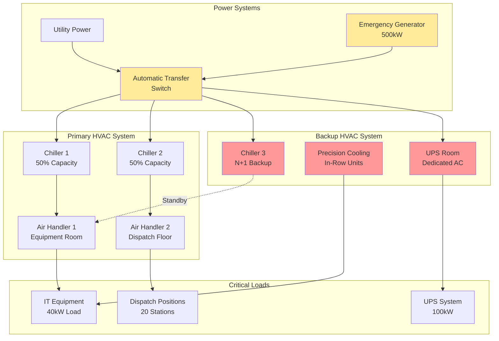

Центры экстренной диспетчеризации представляют собой критически важные объекты, требующие абсолютной надежности систем климатизации. Эти круглосуточные операции размещают сложное коммуникационное оборудование, компьютерные системы и персонал, которые не могут допустить отказа HVAC во время реагирования на чрезвычайные ситуации.

## Требования к охлаждению критически важных объектов

Диспетчерские центры работают непрерывно без запланированных простоев, что делает надежность HVAC первостепенной задачей. Помещения оборудования, содержащие серверы, коммуникационное оборудование и сетевую инфраструктуру, генерируют значительные тепловые нагрузки, требующие точного охлаждения независимо от условий окружающей среды или чрезвычайных ситуаций на объекте.

Общая тепловая нагрузка охлаждения состоит из нескольких компонентов:

$$Q_{total} = Q_{equipment} + Q_{personnel} + Q_{lighting} + Q_{envelope} + Q_{ventilation}$$

Тепловые нагрузки оборудования обычно доминируют в расчете. Для помещений оборудования диспетчерского центра:

$$Q_{equipment} = \sum_{i=1}^{n} (P_i \times 3.412) \times DF$$

где $P_i$ — потребляемая мощность каждого устройства в ваттах, 3.412 преобразует ватты в кДж/ч, а $DF$ — коэффициент одновременности (обычно 0,8–1,0 для диспетчерских центров из-за постоянной работы).

Типичный средний диспетчерский центр с IT нагрузкой 40 кВт требует:

$$Q_{equipment} = 40,000 \times 3.412 \times 0.95 = 136,480 \text{ кДж/ч} \approx 38.8 \text{ кВ охлаждения}$$

## Проектирование избыточных систем HVAC

Диспетчерские центры требуют избыточности N+1 или 2N для обеспечения непрерывной работы при отказе оборудования или техническом обслуживании. Типичные конфигурации избыточности включают:

**Конфигурация N+1:** базовая емкость (N) плюс одна дополнительная единица, обеспечивающая 100% резерву. Для объекта, требующего 70 кВ охлаждения, это означает три агрегата по 35 кВ, где любые два обеспечивают адекватное охлаждение.

**Конфигурация 2N:** полная дублирование всех систем. Две независимые системы HVAC, каждая способная обрабатывать 100% нагрузки. Эта конфигурация обеспечивает максимальную надежность, но удваивает стоимость оборудования и монтажа.

Критические элементы проектирования избыточности включают:

- Независимые контуры охлажденной воды с отдельными насосами и охладителями
- Отдельные электрические питания от разных щитков или источников
- Изолированное распределение воздуховодов для предотвращения отказов в одной точке
- Автоматические органы управления переключением с возможностью ручного управления
- Непрерывный мониторинг с немедленным уведомлением о тревоге

## Управление тепловыми нагрузками оборудования

Современные диспетчерские центры размещают обширную IT инфраструктуру, генерирующую сосредоточенные тепловые нагрузки. Эффективные стратегии управления тепловыми нагрузками включают:

**Конфигурация "горячий коридор/холодный коридор":** стойки серверов расположены для создания чередующихся горячих и холодных коридоров, с температурой холодного коридора, поддерживаемой на уровне 20–22°C, и воздухом, подаваемым на входы оборудования.

**Охлаждающие агрегаты в ряду:** агрегаты прецизионного кондиционирования воздуха, размещенные непосредственно в рядах оборудования, обеспечивающие плотно связанное охлаждение с типичными емкостями 10–30 кВ на единицу. Эти агрегаты обеспечивают превосходный контроль температуры и влажности по сравнению с периферийными агрегатами CRAC.

**Поднятый пол в сравнении с накладным распределением:** системы с поднятым полом распределяют холодный воздух под оборудование с перфорированными плитками у холодных коридоров. Накладные системы подают холодный воздух сверху, позволяя тепловым потерям подняться естественным путем. Выбор зависит от высоты потолка, расстановки оборудования и ограничений модификации.

## Охлаждение помещений ИБП и батарей

Системы Uninterruptible Power Supply (ИБП) и помещения батарей требуют специального контроля окружающей среды. Производительность батарей и срок службы очень чувствительны к температуре, с оптимальными рабочими температурами между 20–25°C.

Тепловая нагрузка охлаждения для систем ИБП включает потери неэффективности:

$$Q_{UPS} = P_{load} \times \left(\frac{1}{\eta} - 1\right) \times 3.412$$

Для 100 кВ ИБП, работающего при эффективности 95%:

$$Q_{UPS} = 100,000 \times \left(\frac{1}{0.95} - 1\right) \times 3.412 = 18,978 \text{ кДж/ч}$$

Помещения батарей должны поддерживать температуру в пределах ±3°C от расчетной точки для предотвращения деградации емкости и условий теплового разгона. Отдельные специализированные агрегаты HVAC с резервной емкостью необходимы, так как отказ батареи во время отключения электроэнергии скомпрометирует весь объект.

## Акустические соображения

Операции диспетчеризации требуют тихой среды для четкой радио- и телефонной связи. Системы HVAC должны достигать рейтингов критериев шума (NC) NC-30 до NC-35 в областях приема вызовов.

Стратегии акустического проектирования включают:

- Проектирование воздуховодов с низкой скоростью (максимум 360–450 м/мин в занятых помещениях)
- Звукоизолированные воздуховоды и плены рядом с позициями диспетчеризации
- Глушители воздуховодов на выходе агрегата обработки воздуха и ответвлениях
- Виброизоляция всего механического оборудования
- Переменные приводы частоты, работающие с пониженными скоростями в нормальных условиях
- Разделение помещения оборудования от областей диспетчеризации звукоизоляционными стенами

Конечная скорость на диффузорах не должна превышать 120–150 м/мин для предотвращения чрезмерного шума.

## Интеграция аварийного генератора

Системы HVAC диспетчерского центра требуют полного резервного копирования генератора с автоматическим переключением передачи. Стратегии снижения нагрузки приоритизируют критическое охлаждение при уменьшении некритичных нагрузок:

**Уровень 1 (Наивысший приоритет):**
- Прецизионное охлаждение помещения IT оборудования
- Охлаждение помещения ИБП и батарей
- Минимальная вентиляция для занятых областей диспетчеризации

**Уровень 2 (Средний приоритет):**
- Полная вентиляция для областей диспетчеризации
- Охлаждение комнат отдыха и вспомогательных площадей
- Системы вытяжки

**Уровень 3 (Наименьший приоритет):**
- Охлаждение административных площадей
- HVAC учебных комнат
- HVAC некритичных вспомогательных помещений

Емкость генератора должна учитывать пусковые токи двигателей, обычно в 6–8 раз больше полной номинальной мощности для обычных двигателей. Плавные пускатели или переменные приводы частоты снижают пусковой спрос на 50–70%.

## Сводка критериев проектирования

| Параметр | Требование | Примечания |
|-----------|-------------|-------|
| Температура помещения оборудования | 20–24°C | ±1°C управление |
| Влажность помещения оборудования | 40–55% ОВ | ±5% управление |
| Температура области диспетчеризации | 21–23°C | Управление отдельными зонами |
| Температура помещения ИБП/батареи | 20–25°C | ±2°C максимальное отклонение |
| Уровень избыточности | N+1 минимум | 2N для высоконадежных объектов |
| Акустический уровень (диспетчеризация) | NC-30 до NC-35 | Критично для связи |
| Время передачи резервного питания | <10 секунд | Автоматический переключатель передачи |
| Требование времени безотказной работы оборудования | 99,99% | Максимум 52 минут простоя/год |
| Скорость вентиляции (занято) | 25–34 CFM/человек (42–58 м³/ч/человек) | Per ASHRAE 62.1 |
| Время работы в режиме экстренного случая | 72 часа минимум | На питании генератора |

## Архитектура системы

Успешное проектирование HVAC диспетчерского центра требует понимания критической природы этих объектов и внедрения надлежащей избыточности, мониторинга и систем резервного копирования. Комбинация избыточности N+1 или 2N, прецизионного контроля окружающей среды, акустического проектирования и комплексной интеграции аварийного питания обеспечивает непрерывную работу в обычных условиях и при чрезвычайных событиях.
