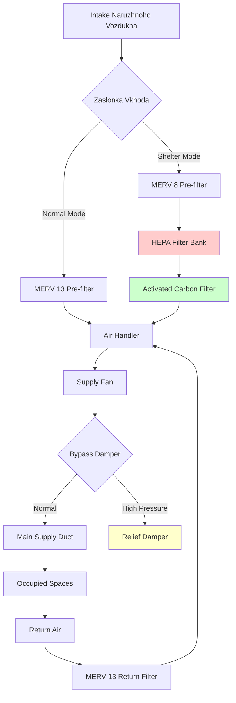

## Обзор проекта

Центры управления чрезвычайными ситуациями (ЦУЧ) служат командными и координационными центрами при бедствиях, чрезвычайных ситуациях и критических происшествиях. В отличие от обычных офисных зданий, ЦУЧ должны обеспечивать полную операционную готовность в течение расширенных периодов активации продолжительностью дни или недели при размещении резко переменных нагрузок по количеству людей, начиная от минимального дежурного персонала и заканчивая полной загруженностью помещений. Система HVAC представляет критически важный компонент безопасности жизнедеятельности, обеспечивающий эффективность работы персонала, надежность оборудования и потенциальную способность укрытия на месте при внешних опасных условиях.

Основной проектный вызов вытекает из двухрежимного операционного профиля: ЦУЧ остаются в режиме теплого резерва с минимальным персоналом большую часть года, затем переходят в интенсивную 24-часовую работу при активации. Этот операционный режим требует систем HVAC, способных быстро реагировать на изменение тепловых и вентиляционных нагрузок при сохранении исключительной надежности в стрессовых условиях, когда отказ напрямую подрывает способность реагирования на чрезвычайные ситуации.

## Требования к периодам расширенной активации

### Проектирование непрерывной работы

Активация ЦУЧ при крупных бедствиях продолжается 7–21 дней с непрерывным 24-часовым персоналом. Системы HVAC должны надежно работать в течение периодов активации без вмешательства в техническое обслуживание или деградации производительности.

**Положения по обеспечению надежности системы**:
- Резервное критически важное оборудование (холодильные агрегаты, котлы, воздухообрабатывающие установки в конфигурации N+1)
- Автоматические управляющие элементы отказа, переключающие на резервное оборудование при отказе основного
- Доступные фильтры и расходные материалы, позволяющие замену во время работы
- Дистанционный мониторинг с оповещениями прогнозного обслуживания
- Запас топлива на 72 часа для установки на месте, если служит растениям отопления/охлаждения

**Проектирование теплоносителя при длительной эксплуатации**: Расширенная работа при повышенных нагрузках требует увеличенных систем отвода и распределения тепла:
- Градирни и конденсаторы рассчитаны на 125% рассчитанной пиковой нагрузки
- Насосы охлажденной и конденсаторной воды с резервными агрегатами
- Воздушное оборудование с увеличенными поверхностями спирали для сохранения пропускной способности
- Предпочтительно несколько меньших агрегатов перед одним большим (четыре агрегата по 29,3 кВт лучше, чем один по 117,2 кВ)

### Возможность быстрого переходного режима

ЦУЧ переходят из режима резерва в полную активацию в течение 2–4 часов. Системы HVAC должны быстро кондиционировать помещения из температур сокращенного режима при управлении внезапными нагрузками по количеству людей и выделением тепла оборудованием.

**Производительность восстановления температуры**: Рассчитайте требуемую мощность отопления/охлаждения для приемлемого времени восстановления:

$$Q_{recovery} = Q_{design} + \frac{m \cdot c_p \cdot \Delta T}{t_{recovery} \cdot 3600}$$

Где:
- $Q_{recovery}$ = общая мощность отопления/охлаждения (кДж/ч)
- $Q_{design}$ = установившаяся проектная нагрузка (кДж/ч)
- $m$ = тепловая масса здания (кг, конструкция + предметы обстановки)
- $c_p$ = удельная теплоемкость (типично 0.84 кДж/кг·°C для смешанной конструкции)
- $\Delta T$ = разница температур от сокращенного режима до занятого (°C)
- $t_{recovery}$ = желаемое время восстановления (часы, типично 1–2 часа)

**Увеличение вентиляции**: Системы наружного воздуха переходят от минимального потока в режиме резерва к проектным расходам при полной загруженности:
- Вентиляторы с переменной скоростью вмещают диапазон 10–100% потока
- Управление спросом на вентиляцию на основе CO₂ реагирует на фактическую загруженность
- Выделенные системы подачи наружного воздуха (DOAS) с рекуперацией энергии (минимум 60–70% эффективности)

## Управление переменной нагрузкой по количеству людей

### Проектирование диапазона загруженности

ЦУЧ испытывают крайние колебания загруженности, требующие гибкой пропускной способности HVAC:

| Режим работы | Уровень загруженности | Соотношение нагрузки охлаждения | Требование вентиляции |
|----------------|----------------|-------------------|------------------------|
| Резервный | 1–3 человека | 0.10–0.15 | Минимальный наружный воздух кодекса |
| Ограниченная активация | 10–20 человек | 0.30–0.40 | 50–60% проектной загруженности |
| Частичная активация | 30–50 человек | 0.60–0.75 | 75–85% проектной загруженности |
| Полная активация | 75–150 человек | 1.00 | 100% проектной загруженности |

**Подход расчета нагрузки**: Размер системы для сценария максимальной активации с возможностью снижения до нагрузок резервного режима.

**Явная нагрузка охлаждения** при полной активации:

$$Q_{sensible} = Q_{envelope} + Q_{occupants} + Q_{lighting} + Q_{equipment} + Q_{ventilation}$$

Где явное тепло от занятых при умеренной активности (сидя, офисная работа):
$$Q_{occupants} = n \cdot 73 \text{ кДж/ч на человека}$$

Нагрузка оборудования связи и IT:
$$Q_{equipment} = P_{installed} \cdot DF \cdot 3.6 \text{ кДж/ч на ватт}$$

Где $DF$ = коэффициент разнообразия (0.6–0.8 для оборудования ЦУЧ, выше, чем обычный офис из-за одновременной работы при активации).

**Нагрузка вентиляции**: Явная и скрытая нагрузки наружного воздуха доминируют при высокой загруженности:

$$Q_{oa,sensible} = 0.034 \cdot CFM_{oa} \cdot (T_{outdoor} - T_{supply})$$

$$Q_{oa,latent} = 0.021 \cdot CFM_{oa} \cdot (W_{outdoor} - W_{supply})$$

Минимальный наружный воздух при полной активации:
$$CFM_{oa} = n_{occupants} \cdot 5 \text{ CFM/person} + A_{floor} \cdot 0.06 \text{ CFM/ft}^2$$

Применяют то, что обеспечивает большую скорость вентиляции на ASHRAE 62.1 для конференц-залов и общественных помещений.

### Стратегия управления зонами

**Многозонные системы VAV**: Вмещают варьирующееся распределение загруженности по функциональным областям ЦУЧ:
- Главная операционная комната: Большое открытое пространство с гибкой плотностью рабочих мест
- Конференц-залы: Высокая плотность загруженности при брифингах, не занято при работе
- Комнаты отдыха и вспомогательные области: Периодическая загруженность при активации
- Административные офисы: Низкая загруженность при активации (персонал развернут на операционный этаж)

**Последовательность управления**:
1. Датчики CO₂ в главных помещениях модулируют заслонки наружного воздуха (уставка 800–1000 ppm)
2. Датчики загруженности в конференц-залах и комнатах отдыха активируют локальное зональное управление
3. Датчики температуры в помещениях модулируют воздушный поток коробки VAV
4. Температура подачи воздуха главного воздухообрабатывающего аппарата переустанавливается на основе требований зоны
5. Возможность переопределения для ручного включения полной пропускной способности при чрезвычайных ситуациях

## Охлаждение оборудования связи

### Характеристики нагрузки теплоты оборудования

Современные ЦУЧ содержат существенное оборудование связи, IT и отображения, генерирующее непрерывные нагрузки теплоты независимо от загруженности:

**Типичная плотность оборудования**:
- Операционный этаж: 86–161 Вт/м² (рабочие станции, дисплеи, консоли связи)
- Комната сервера/связи: 538–1615 Вт/м² (серверы, сетевое оборудование, радиосистемы)
- Стены отображения и AV-системы: 269–431 Вт/м² в областях отображения

**Расчет нагрузки теплоты**: Рассчитайте эквивалент теплоты установленной мощности:

$$Q_{IT} = \sum (P_{equipment} \cdot DF \cdot 3.6)$$

Комнаты критически важного оборудования требуют выделенного охлаждения независимо от систем комфорта занятых.

### Выделенное охлаждение оборудования

**HVAC комнаты сервера/связи**:
- Установки прецизионного кондиционирования воздуха, поддерживающие плотное управление температурой (22±1.1°C) и влажностью (45±5% OВ)
- Минимум N+1 избыточность (три агрегата на требуемую мощность двух агрегатов)
- Распределение воздуха над головой или с приподнятым полом с конфигурацией горячего прохода/холодного прохода
- Отдельно от здания HVAC на аварийное питание и системы UPS
- Работа 24/7 независимо от статуса активации ЦУЧ

**Определение размера пропускной способности**: Охлаждение комнаты оборудования учитывает всю установленную мощность IT плюс коэффициент безопасности:

$$Q_{total} = (P_{IT} \cdot 3.6 \cdot 1.15) + Q_{transmission}$$

Множитель 1.15 учитывает неэффективность UPS и будущие добавления оборудования.

**Охлаждение оборудования операционного этажа**: Интегрируйте выделение тепла оборудованием в общую HVAC комфорта:
- Системы распределения воздуха под полом (UFAD) эффективно охлаждают оборудование рабочих мест
- Диффузоры подачи воздуха на рабочих местах направляют охлаждение на источники тепла
- Глубина приподнятого пола 30–45 см минимум для надлежащего потока воздуха
- Температура подачи пола 17–18°C с подходом кондиционирования задачи/окружающей среды

### Вентиляция комнаты оборудования

**Управление плотностью тепла**: Комнаты оборудования высокой плотности требуют существенной циркуляции воздуха:

$$CFM_{equipment} = \frac{Q_{sensible}}{1.08 \cdot \Delta T}$$

Используя температурный дифференциал подачи-возврата:
- $\Delta T$ = 8–11°C для комнат оборудования общего назначения
- $\Delta T$ = 6–8°C для областей сервера высокой плотности, требующих более значительного потока воздуха

**Резервное распределение воздуха**: Несколько воздухообрабатывающих установок служат комнатам оборудования:
- Установки охлаждения, установленные на потолке или встроенные в ряд, расположенные рядом с источниками тепла
- Циркуляция воздуха продолжается на резервном агрегате при отказе основного
- Резервный агрегат рассчитан на 100% нагрузку (не сниженная пропускная способность при переходе на резерв)

## Гибкость конференц-зала

### Проектирование многофункционального помещения

Конференц-залы ЦУЧ служат двойному назначению: стратегические брифинги при активации (высокая загруженность) и обучение/встречи при резервном режиме (переменная загруженность).

**Критерии проектирования загруженности**:
- Конфигурация брифинга: 1.4–1.9 м² на человека (плотно упакованная театральная рассадка)
- Конфигурация конференции: 2.3–3.3 м² на человека (сидя у столов)
- Проектирование для плотности брифинга с целью обеспечения надлежащей пропускной способности при пиковом использовании

**Гибкость вентиляции**: Конференц-залы требуют отзывчивого управления наружным воздухом:

$$CFM_{oa,min} = n_{max} \cdot 5 \text{ CFM/person} + A_{floor} \cdot 0.06 \text{ CFM/ft}^2$$

Для конференц-зала 186 м² рассчитанного на максимум 100 человек:
$$CFM_{oa} = 100 \cdot 5 + 2000 \cdot 0.06 = 500 + 120 = 620 \text{ CFM (1050 м³/ч)}$$

**Управление спросом на вентиляцию**: Датчики CO₂ модулируют наружный воздух:
- Уставка 800–1000 ppm при занятости
- Минимальная позиция наружного воздуха поддерживает минимум кодекса при пустом помещении
- Переопределение на максимальный наружный воздух за 30 минут перед запланированными брифингами
- Более быстрый отклик, чем загруженность на основе увеличения предотвращает превышение CO₂

### Управление колебанием нагрузки

Конференц-залы испытывают драматические колебания нагрузки между пустым и максимально занятым состояниями:

**Сравнение нагрузки охлаждения**:

| Условие | Занято | Явная нагрузка (кДж/ч) | Скрытая нагрузка (кДж/ч) |
|-----------|-----------|----------------------|-------------------|
| Не занято | 0 | 17730 (освещение, оболочка) | 2368 (инфильтрация) |
| Полная загруженность | 100 | 59520 (+ 41790 от людей) | 26032 (+ 23664 от людей) |
| Соотношение нагрузки | — | 3.4× | 11× |

**Требования к отклику системы**:
- Терминальные коробки VAV с минимальным соотношением снижения 4:1 (25–100% потока)
- Возможность переподогрева предотвращает переохлаждение при низкой загруженности высокого наружного воздуха
- Скрытая пропускная способность адекватна для пиковой влагообразования от загруженности
- Пути возврата воздуха рассчитаны на пиковый воздушный поток (избегают шума скорости при полнопоточной работе)

## Качество воздуха при расширенных операциях

### Соображения непрерывной загруженности

Персонал, работающий 12-часовые смены в течение нескольких дней, требует исключительного качества воздуха в помещении для поддержания бодрости и когнитивной функции:

**Улучшение скорости вентиляции**:
- ASHRAE 62.1 минимум: 5 CFM/person + 0.06 CFM/ft² для офисов
- Улучшенная вентиляция ЦУЧ: рекомендуется 25–34 CFM/person для продолжительного психического мастерства
- Полный наружный воздух при максимальной загруженности существенно превышает минимум кодекса

**Стандарты фильтрации воздуха**:
- Минимум MERV 13 фильтрация для всего наружного и рециркулируемого воздуха
- Удаляет аэрозольные частицы, биоаэрозоли и загрязнители наружного воздуха
- Рекомендуется MERV 14–16 для объектов в городских или промышленных районах
- Фильтры активированного угля при опасениях качества наружного воздуха (лесные пожары, промышленные выбросы)

### Управление загрязнителями

**Стратегии управления источником**:
- Материалы с низким содержанием летучих органических соединений во всем строительстве ЦУЧ и внутреннем оборудовании
- Выделенный выпуск для буфетных областей с кофеварками и микроволновками (28–47 л/мин)
- Выпуск туалета непрерывной работы (минимум 0.5 ACH при резервном режиме ЦУЧ)
- Отдельная вентиляция оборудования IT предотвращает озон и выделение компонентов электроники от входа в занятые области

**Соотношения давления**: Поддерживайте положительное давление в занятых помещениях:
- Воздушный поток подачи превышает возврат + выпуск на 10–15% создавая положительное давление
- Предотвращает инфильтрацию некондиционированного и потенциально загрязненного наружного воздуха
- Давление относительно экстерьера: +12–25 Па
- Соседние помещения при нейтральном или слегка отрицательном давлении относительно главного операционного этажа

### Управление влажностью

**Требования комфорта и оборудования**: Поддерживайте 30–50% ОВ круглый год:
- Ниже 30% ОВ: Статическое электричество повреждает электронику, дискомфорт занятых
- Выше 50% ОВ: Риск конденсации на холодных поверхностях, потенциал роста плесени
- Управление влажностью круглый год требует как увлажнения (зима), так и осушения (лето)

**Подход к осушению**:
- Система подачи выделенного наружного воздуха с охлаждающей спиралью достаточно глубокая для достижения 13–15°C температуры воздуха на выходе
- Адсорбционное осушение для крайних скрытых нагрузок или очень влажного климата
- Отдельная спираль явного охлаждения переподогревает воздух до температуры подачи после осушения

**Системы увлажнения**:
- Увлажнители паровой инжекции для прецизионного управления и санитарной работы
- Пропускная способность увлажнителя на основе дефицита влажности наружного воздуха зимой:

$$kg_{water}/hr = \frac{м³/ч_{oa}}{60} \cdot (W_{setpoint} - W_{outdoor}) \cdot 1.2$$

Где коэффициенты влажности ($W$) выражены в кг воды/кг сухого воздуха.

## Возможности укрытия на месте

### Критерии проектирования

ЦУЧ, спроектированные для укрытия на месте, защищают занятых от внешних аэрозольных опасностей (химические выбросы, радиологические события, биологические угрозы) при сохранении внутренней обитаемости.

**Стратегии защиты**:
1. **Режим фильтрации**: Улучшенная фильтрация удаляет частицы и угрозы NBC из наружного воздуха
2. **Режим рециркуляции**: Минимизируйте поступление наружного воздуха, максимизируйте рециркуляцию
3. **Положительное давление**: Предотвратите инфильтрацию загрязненного наружного воздуха
4. **Герметичная оболочка**: Минимизируйте пути утечки для входа загрязнителя

### Операционные режимы HVAC

**Нормальный режим работы**:
- Стандартные скорости наружного воздуха на основе загруженности и требований кодекса
- Фильтрация MERV 13 на наружном и возвратном воздухе
- Давление здания нейтрально или слегка положительное (+10 Па)

**Режим укрытия на месте**:
- Заслонки наружного воздуха закрываются в минимальную позицию или полностью закрыты
- Рециркуляция увеличивается до максимума (100% если наружный воздух исключен)
- Фильтрация HEPA (99.97% при 0.3 микронах) и фильтры активированного угля включаются на наружном воздухе
- Давление здания увеличивается (+25–50 Па относительно экстерьера)

**Время перехода**: Переход из нормального в режим укрытия в течение 60 секунд:
- Автоматические управляющие элементы закрывают заслонки наружного воздуха по команде
- Байпасные заслонки вокруг фильтров HEPA/угля закрываются, принуждая воздух через защитную фильтрацию
- Скорость вентилятора подачи увеличивается для поддержания давления по мере снижения наружного воздуха

### Фильтрация и защита NBC

**Система фильтрации HEPA**:
- Фильтры HEPA H13 или H14 (99.95–99.995% эффективность при 0.3 микронах)
- Удаляет биологические агенты, радиологические частицы, мелкую пыль
- Параллельные банки фильтров с байпасными заслонками (изолируйте фильтры во время нормальной работы для продления срока службы)
- Манометры Magnehelic контролируют перепад давления на фильтрах, указывающий загрузку

**Фильтрация активированного угля**:
- Слои гранулированного активированного угля (GAC) удаляют газообразные химические загрязнители
- Глубина углерода 5–10 см минимум для надлежащего времени пребывания
- Замена углерода на основе прогнозируемого срока службы для предполагаемых угроз (типично годовая замена)
- Байпас во время нормальной работы (углерод имеет ограниченный срок службы)

**Интеграция системы**:

### Скорость воздухообмена и загруженность занятых

**Длительность обитаемости**: Рассчитайте скорость истощения кислорода и накопления CO₂ при герметичной работе.

**Потребление кислорода**: Каждый занятый потребляет приблизительно 0.3 л/мин кислорода при сидячей активности:

$$t_{O_2} = \frac{V_{space} \cdot (0.2095 - 0.19)}{n \cdot 0.3}$$

Где:
- $V_{space}$ = объем интерьера (м³)
- 0.2095 = доля кислорода в атмосфере
- 0.19 = минимальная безопасная доля кислорода (19%)
- $n$ = количество занятых
- 0.3 = скорость потребления кислорода (л/мин на человека)
- $t_{O_2}$ = время истощения кислорода (минуты)

**Накопление CO₂**: Занятые генерируют 0.17 л/мин CO₂:

$$C_{CO_2}(t) = C_{initial} + \frac{n \cdot 0.17 \cdot t \cdot 10^6}{V_{space}}$$

Где:
- $C_{CO_2}(t)$ = концентрация CO₂ в момент времени $t$ (ppm)
- $C_{initial}$ = начальная концентрация CO₂ (типично 400–800 ppm)
- $t$ = прошедшее время (минуты)

**Минимальная вентиляция при укрытии**: Введите ограниченный наружный воздух через защитную фильтрацию поддерживая CO₂ ниже 5000 ppm (8-часовой предел воздействия OSHA):

$$CFM_{oa,min} = \frac{n \cdot 0.17 \cdot 10^6}{5000 - 400} = n \cdot 37 \text{ CFM на человека}$$

Эта скорость вентиляции поддерживает неограниченную обитаемость но требует свободного от загрязнений наружного воздуха или полной фильтрации опасностей.

### Интеграция аварийного питания

**Классификация критической нагрузки**: Системы HVAC укрытия на месте подключаются к аварийному питанию:
- Вентиляторы подачи и возврата (вся воздухообрабатывающая система)
- Растение охлажденной воды при электрическом охлаждении (холодильные агрегаты, насосы, градирни)
- Компоненты растения отопления (котлы, насосы)
- Системы управления и мониторинга

**Определение размера генератора**: Включите нагрузки HVAC в пропускную способность аварийного генератора:
- Полная электрическая нагрузка HVAC при работе укрытия
- Одновременная работа всех критически важных систем (свет, IT, HVAC, безопасность жизни)
- Минимум 72-часовой запас топлива для хранилища топлива на месте
- Автоматический переключатель передачи переходит на питание генератора в течение 10 секунд

## Итоговая таблица параметров проектирования

| Параметр | Режим резерва | Полная активация | Укрытие на месте |
|-----------|--------------|-----------------|------------------|
| Загруженность | 1–3 человека | 75–150 человек | 100–200 человек |
| Наружный воздух | Минимум кодекса | 25–34 CFM/person | 8–17 CFM/person фильтрованный |
| Фильтрация | MERV 13 | MERV 13 | HEPA + Carbon |
| Температура | 18–27°C сокращ. | 22±1.1°C | 22±1.7°C |
| Влажность | 30–60% ОВ | 40–50% ОВ | 35–55% ОВ |
| Давление | Нейтральное | +10–15 Па | +25–50 Па |
| Воздухообмены | 2–4 ACH | 6–10 ACH | 4–6 ACH (рециркулированный) |
| Избыточность системы | Однопутевая | N+1 критическое оборудование | N+1 все оборудование |

## Архитектурная и операционная интеграция

**Координация архитектуры**:
- Расположение центральной механической комнаты минимизирует длину воздуховодов и время отклика
- Воздухозаборы на крыше расположены вдали от потенциальных источников загрязнения (выхлоп транспорта, хранилище топлива)
- Комнаты оборудования соседствуют с операционным этажом для коротких трубопроводов хладагента и охлажденной воды
- Достаточная высота потолка для распределения воздуха под полом (минимум 3–3.7 м пол-пол)

**Управление и мониторинг**:
- Система управления зданием (BAS) контролирует все параметры HVAC
- Графический интерфейс отображает статус системы в главной операционной комнате
- Тревоги для превышения температуры, отказа оборудования, загрузки фильтра, потери давления
- Возможность дистанционного мониторинга позволяет внешнюю поддержку при активации

**Тестирование и ввод в эксплуатацию**:
- Функциональное тестирование производительности проверяет быстрые переходы режимов
- Тестирование режима укрытия на месте подтверждает производительность давления и фильтрации
- Настольные упражнения включают сценарии отказа HVAC, требующие активации резервной системы
- Годовое тестирование передачи аварийного питания и перезагрузки HVAC

**Техническое обслуживание и логистика**:
- Профилактическое техническое обслуживание в периодах резерва минимизирует отказы активации
- Инвентарь запчастей для критически важных компонентов (фильтры, ремни вентилятора, компоненты управления)
- Контракты обслуживания обеспечивают 4-часовой отклик на чрезвычайные ремонты при активации
- График замены фильтра согласован с сезонным спросом (предлетние фильтры охлаждения, предзимние увлажнители)

Центры управления чрезвычайными ситуациями требуют систем HVAC, спроектированных для надежности, гибкости и защиты за пределами стандартов обычного здания. Инвестиция в избыточность, фильтрацию и сложность управления обеспечивает операционную непрерывность в точных обстоятельствах, когда последствия отказа наиболее серьезны.
