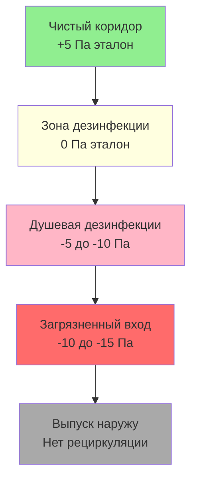
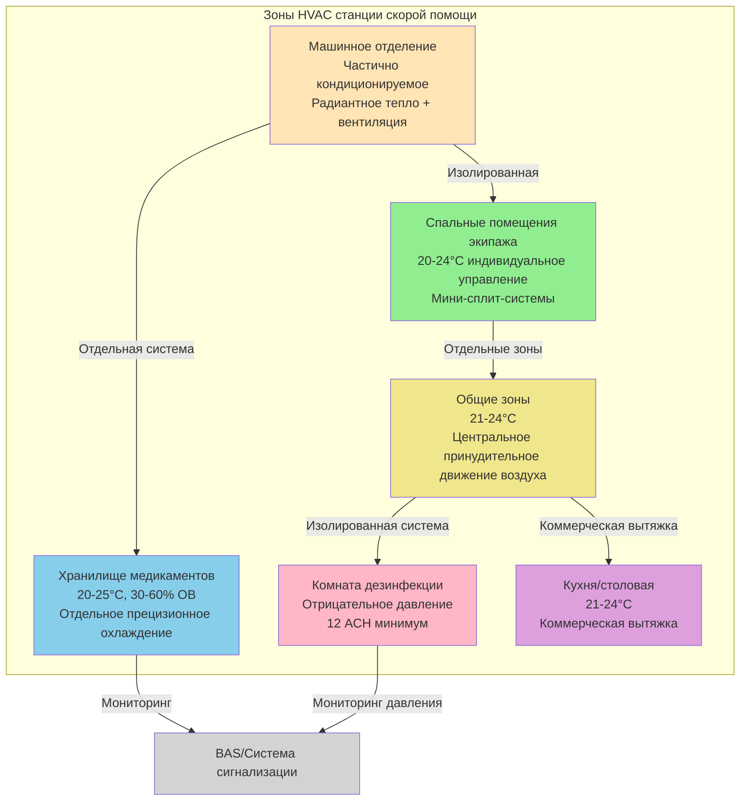

## Требования HVAC для объектов скорой медицинской помощи

Объекты скорой медицинской помощи требуют специализированного проектирования HVAC, отвечающего уникальным эксплуатационным требованиям, отличным от традиционных пожарных депо. Интеграция хранилища медикаментов, требующего точного контроля температуры и влажности, зон дезинфекции с вентиляцией локализации и машинных отделений с захватом выхлопных газов создает сложные многозонные системы. Станции скорой помощи работают непрерывно круглосуточно со штатом на месте, требуя надежного климатического контроля жилых помещений экипажа при поддержании условий хранения медикаментов в узких допусках.

Фундаментальная проблема проектирования заключается в конфликтующих требованиях окружающей среды: машинные отделения работают как частично кондиционируемые пространства с частыми открываниями дверей и загрязнением выхлопными газами, комнаты хранения медикаментов требуют строгого контроля температуры (20-25°C) и пределов влажности (30-60% ОВ), зоны дезинфекции требуют отрицательного давления, а жилые помещения экипажа нуждаются в комфорте жилого типа. Эти зоны должны оставаться термически и атмосферически изолированными при обслуживании интегрированными механическими системами.

## Кондиционирование машинного отделения

### Стратегия теплового контроля

Машинные отделения создают проблемы кондиционирования, аналогичные отделениям для аппаратов пожарной службы, но с модифицированными требованиями, отражающими меньший размер транспортных средств и повышенную частоту открытия дверей. Расчет теплонагрузки должен учитывать инфильтрацию от входных дверей персонала, накладных дверей транспортных средств и тепловую массу автомобилей скорой помощи, которые могут находиться припаркованными на длительный период.

**Проектирование отопления**: Отопление на уровне пола обеспечивает оптимальный комфорт и эксплуатационные преимущества:

$$Q_{bay} = Q_{envelope} + Q_{infiltr} + Q_{vehicle} + Q_{door}$$

Где:
- $Q_{envelope}$ = потери передачи через стены, крышу, двери (кДж/ч)
- $Q_{infiltr}$ = нагрузка инфильтрации утечки воздуха (кДж/ч)
- $Q_{vehicle}$ = требование нагрева тепловой массы транспортного средства (кДж/ч)
- $Q_{door}$ = инфильтрация работы дверей (кДж/ч)

**Расчет инфильтрации дверей** для накладных дверей машинного отделения:

$$Q_{door} = n \times A_{door} \times ACH \times 1.08 \times \Delta T$$

Типичные значения:
- $n$ = количество дверей отделения (1-4 типичное)
- $A_{door}$ = 9-11 м² на дверь (3 м × 3-3,5 м стандартный размер)
- $ACH$ = 3-6 воздухообмен в час для хорошо герметичных дверей
- $\Delta T$ = температура внутри минус температура наружного воздуха по проекту (°C)

**Радиантное напольное отопление** обеспечивает превосходные характеристики в машинных отделениях:
- Гидравлические трубки, встроенные в бетонную плиту с расстоянием 15-20 см
- Температура подачи воды 43-54°C для умеренного климата
- Выход тепла 57-79 кДж/ч·м² при расчетных условиях
- Предотвращает замерзание таяния льда и снега от транспортных средств на полу
- Поддерживает температуру поверхности пола 21-24°C во время присутствия персонала
- Изоляция плиты RSI 1,76 периметра, RSI 0,88 под всей площадью плиты

**Потолочные нагревательные агрегаты** служат дополнительным или альтернативным отоплением:
- Газовые или водяные нагревательные агрегаты при установке на высоте 3,5-4,3 м
- Производительность 22-44 кВт на агрегат
- Горизонтальный выброс в направлении, противоположном накладным дверям
- Быстрый тепловой отклик позволяет снизить температуру во время отсутствия персонала
- Меньшие первоначальные затраты, но более высокие эксплуатационные расходы и менее равномерное отопление

### Охлаждение

Большинство машинных отделений скорой помощи работают как частично кондиционируемые пространства с отоплением только или минимальным охлаждением. Полное кондиционирование воздуха добавляет существенные затраты и энергопотребление с ограниченной пользой из-за частых открытий дверей.

**Стратегии охлаждения по климату**:
- Холодный климат: Только отопление с естественной вентиляцией
- Умеренный климат: Отопление с механической вентиляцией и испарительным охлаждением
- Жаркий климат: Полное кондиционирование воздуха с использованием крышных агрегатов или сплит-систем

**Параметры проектирования кондиционирования воздуха** при наличии:
- Расчетная температура 26-28°C (выше, чем в занятых помещениях)
- Только чувствительное охлаждение (контроль влажности не требуется)
- Расчет производительности включает солнечное усиление через накладные двери
- Оборудование рассчитано на 50-60% закрытие дверей (не для условий постоянного открытия дверей)

Расчет охладительной нагрузки:

$$Q_{cooling} = Q_{envelope} + Q_{solar} + Q_{lights} + Q_{infiltr}$$

Применить коэффициент разнородности 0,5-0,6 для учета периодов открытия дверей, когда механическое охлаждение неэффективно.

## Жилые помещения экипажа и зоны проживания

### Стандарты жилого комфорта

Жилые помещения экипажа требуют непрерывного кондиционирования до стандартов жилого комфорта. Персонал работает 12 или 24-часовые смены с периодами сна, происходящими в течение дня и ночи, требуя постоянного теплового комфорта и превосходных акустических характеристик.

**Критерии проектирования для жилых помещений**:

| Тип помещения | Температура | Влажность | Наружный воздух | Уровень шума |
|---|---|---|---|---|
| Спальные помещения | 20-24°C (индивидуальное управление) | 30-60% ОВ | 7,1 м³/ч на человека | NC-25 до NC-30 |
| Общие зоны | 21-24°C | 30-60% ОВ | 3,5 м³/ч на человека | NC-30 до NC-35 |
| Кухня/столовая | 21-24°C | 30-60% ОВ | 3,5 м³/ч на человека | NC-35 до NC-40 |
| Санузлы/душевые | 22-26°C | Без контроля | 28-40 м³/ч вытяжка | NC-40 |
| Помещение для упражнений | 20-22°C | 30-60% ОВ | 11,3 м³/ч на человека | NC-35 до NC-40 |

**Выбор системы** для жилых помещений экипажа:

**Бесканальные мини-сплит-системы**: Оптимальны для отдельных спален:
- Индивидуальное зональное управление позволяет персализировать настройку температуры
- Тихая работа необходима для дневного сна (уровни звука 19-26 дB(A))
- Работа тепловой насосной системы обеспечивает отопление и охлаждение
- Производительность 2,6-3,5 кВт на спальню достаточна
- Отсутствие воздуховодов снижает стоимость установки при реконструкции
- Возможна отдельная учет для управления энергией

**Центральные системы принудительного воздушного движения**: Приемлемы для общих зон:
- Зонированные воздухоприемные установки с VAV-боксами или зональными заслонками
- Общие зоны отделены от спальных помещений
- Отдельная система приготовления наружного воздуха (DOAS) с рекуперацией энергии
- Центральное осушение в влажных климатах
- Фильтрация MERV 13 минимум для качества воздуха в помещениях

### Акустическое проектирование

Контроль звука критически влияет на качество отдыха экипажа. Нарушения сна от шума HVAC снижают готовность персонала и увеличивают ошибки, связанные с усталостью.

**Меры контроля шума**:
- Канальные глушители на ветвях подачи и возврата, обслуживающих спальные помещения
- Виброизоляция всего механического оборудования (пружинные или неопреновые изоляторы)
- Гибкие соединители воздуховода на воздухоприемных установках и фанкойлах
- Низкоскоростной воздуховод (максимум 2,4-2,4 м/с в спальных помещениях)
- Звуковые ботинки на соединениях регистров для минимизации шума регистра
- Размещение оборудования вдали от спальных помещений (крыша или механические помещения)

**Акустическое разделение**: Спальные помещения требуют изоляции от шума машинного отделения:
- Звукоизоляционные перегородки (STC-50 минимум)
- Герметичные проходы через огнестойкие перегородки
- Отсутствие переходных решеток или отверстий между отделением и жилыми помещениями
- Отдельные HVAC-системы предотвращают передачу звука через воздуховоды

## Требования хранилища медикаментов

### Контроль температуры и влажности

Станции скорой помощи хранят температурочувствительные медикаменты, включая лекарства, капельницы и биологические материалы. Кондиционирование хранилища должно поддерживать постоянную температуру и влажность в диапазонах, установленных производителем, типично 20-25°C и 30-60% относительной влажности согласно рекомендациям USP.

**Расчет охладительной производительности** для комнат хранения медикаментов:

$$Q_{storage} = Q_{trans} + Q_{lights} + Q_{people} + Q_{OA}$$

Где:
- $Q_{trans}$ = приток тепла через стены, потолок, пол (чувствительный)
- $Q_{lights}$ = приток тепла от освещения (3,41 кДж/ч на ватт)
- $Q_{people}$ = приток тепла от людей (0,264 кВт чувствительный на человека, низкая посещаемость)
- $Q_{OA}$ = нагрузка вентиляции наружного воздуха (чувствительная и скрытая)

**Контроль влажности**: Критичен для стабильности медикаментов:
- Осушение в влажных климатах поддерживает 30-60% ОВ
- Увлажнение в холодном, сухом климате предотвращает низкую влажность
- Мониторинг относительной влажности с сигналами тревоги при отклонении от уставки
- 24-часовое регистрация влажности для документации гарантии качества

**Рассмотрение проектирования системы**:
- Отдельная система охлаждения, изолированная от других зон
- Резервная охладительная производительность (двойные системы или резервный агрегат)
- Мониторинг температуры с уведомлением о тревоге
- Резервное питание от батареи для систем мониторинга при отключении электроэнергии
- Строительство изолированного хранилища минимизирует нагрузку и колебания температуры

**Сплит-система или прецизионный блок кондиционирования**:
- Охладительная производительность 3,5-7 кВт типичны для хранилищ площадью 18-37 м²
- Отопительная производительность рассчитана на зимние условия по проекту
- Возможность осушения до 30% ОВ минимум
- Точность управления температурой ±1,1°C от уставки
- Возможность удаленного мониторинга и сигнализации

### Требования вентиляции

Хранилище медикаментов требует минимальной вентиляции в сравнении с занятыми помещениями. ASHRAE 62.1 классифицирует хранилища как "Storage Rooms", требующие 0,12 м³/(ч·м²) или механическая вытяжка может быть исключена при герметичной конструкции помещения.

**Проектирование вентиляции**:
- Вентиляция наружным воздухом 0,06-0,12 м³/(ч·м²) при механической вентиляции
- Переток воздуха из смежных кондиционируемых помещений приемлем
- Отсутствие возврата воздуха в другие зоны здания (изолированная система)
- Фильтрация воздуха MERV 11 минимум для снижения загрязнения твердыми частицами

## Проектирование зоны дезинфекции

### Вентиляция локализации

Объекты дезинфекции требуют специализированной вентиляции, предотвращающей миграцию загрязненного воздуха в чистые зоны. Зона дезинфекции работает под отрицательным давлением относительно смежных помещений, воздух поступает из чистых зон в загрязненные зоны и выходит непосредственно наружу.

**Иерархия давления**:

**Параметры проектирования отрицательного давления**:
- Разница давления -5 до -10 Па относительно смежных чистых помещений
- Минимум 12 воздухообмена в час (ACH) в комнате дезинфекции
- 100% наружный воздух (нет рециркуляции)
- Подачу воздуха 90-95% от вытяжки (разница создает отрицательное давление)

**Расчет количества вытяжного воздуха**:

$$Q_{exhaust} = \frac{V \times ACH}{60}$$

Где:
- $V$ = объем помещения (м³)
- $ACH$ = 12-15 воздухообмена в час минимум
- Результат в м³/ч

**Количество подаваемого воздуха для отрицательного давления**:

$$Q_{supply} = Q_{exhaust} - Q_{undercut}$$

Где $Q_{undercut}$ = расход воздуха через подрез двери или переходную решетку, создающие разницу давления, типично 28-56 м³/ч.

### Особенности HVAC комнаты дезинфекции

**Распределение воздуха**:
- Подача воздуха на уровне потолка с ламинарной нисходящей схемой потока
- Диффузоры подачи ориентированы для избежания возмущения захвата загрязняющих веществ
- Вытяжные решетки низко на стене (30-45 см над полом) для захвата плотных паров
- Отсутствие прямых путей подачи в вытяжку (предотвращает короткое замыкание)

**Контроль температуры**:
- Расчетная температура 24-26°C для комфорта персонала во время душа
- Повторный нагрев катушек в подаче для контроля температуры независимо от расхода
- Контроль влажности вторичный (высокие скорости вентиляции обычно предотвращают чрезмерную влажность)

**Обработка вытяжного воздуха**:
- Прямой выпуск наружу через отдельный воздуховод
- Выпуск выше линии крыши, минимум 3 м от воздухозаборников
- Фильтрация не требуется для типичной дезинфекции скорой помощи (только грубая дезинфекция)
- Вытяжной вентилятор расположен в месте выпуска (отрицательное давление в воздуховоде)

**Возможность аварийного отключения**:
- Ручное управление вне зоны дезинфекции
- Кнопка аварийной остановки активирует вентилятор вытяжки и закрывает заслонки подачи
- Блокировка с системой сигнализации объекта

## Интеграция резервного электроснабжения

### Идентификация критических нагрузок

Объекты скорой помощи требуют резервного электроснабжения для систем безопасности жизни и оперативной продолжительности. Нагрузки HVAC, рассмотренные критичными, включают охлаждение хранилища медикаментов, минимальное отопление для защиты от замерзания и вентиляцию зоны дезинфекции при активном использовании.

**Критические нагрузки HVAC при работе на генераторе**:

| Система | Тип нагрузки | Приоритет | Размер генератора |
|---|---|---|---|
| Хранилище медикаментов | Охлаждение и мониторинг | Критичная | 100% производительности |
| Отопление жилых помещений | Минимальное отопление | Критичная | 50% расчетной производительности |
| Отопление машинного отделения | Защита от замерзания | Критичная | 30% расчетной производительности |
| Вытяжка дезинфекции | Полная работа | Критичная | 100% при активации |
| Охлаждение жилых помещений | Комфорт | Некритичная | Обычно не включена |
| Горячее водоснабжение | Сниженная производительность | Вторичная | 50% спроса |

**Расчет производительности генератора** для нагрузок HVAC:

$$kW_{HVAC} = \sum (kW_{equip} \times PF \times DF)$$

Где:
- $kW_{equip}$ = номинальная мощность оборудования
- $PF$ = коэффициент мощности (0,85-0,90 типичный для двигателей)
- $DF$ = коэффициент спроса, учитывающий неодновременную работу (0,7-0,9)

**Стратегия переключателя передачи**:
- Автоматические выключатели передачи (ATS) для критических нагрузок HVAC
- Время передачи менее 10 секунд для охлаждения хранилища медикаментов
- Ручная передача приемлема для некритических комфортных нагрузок
- Отдельные схемы HVAC для критических и некритических нагрузок

### Подача топлива и время работы

**Размер хранилища топлива генератора** для продленной работы:

$$Литры = \frac{kW_{load} \times hours \times fuel_{rate}}{efficiency}$$

Где:
- $kW_{load}$ = нагрузка электричества HVAC на генератор
- $hours$ = требуемое время работы (48-72 часа типично)
- $fuel_{rate}$ = 0,23-0,30 литра на кВт·ч для дизельных генераторов
- $efficiency$ = 0,85-0,90 эффективность генератора

**Рассмотрение резервирования**:
- Генераторы на природном газе обеспечивают неограниченное время работы при сохранении газоснабжения
- Хранилище дизельного топлива рассчитано на 48-72 часовую работу при 75% нагрузке генератора
- Размещение бака хранилища топлива для доступа грузовика доставки
- Присадки к топливу при холодной погоде и нагреватели баков в северных климатах

## Планировка зон HVAC объекта скорой помощи

## Управление и мониторинг

### Система управления зданием

Объекты скорой помощи получают выгоду от интегрированного управления зданием, обеспечивающего удаленный мониторинг, уведомление о тревогах и управление энергией при сохранении критического управления окружающей средой.

**Точки мониторинга BAS**:
- Температура и влажность хранилища медикаментов с уведомлением о тревоге
- Разница давления и расход воздуха в комнате дезинфекции
- Статус и уровень топлива аварийного генератора
- Температура машинного отделения для защиты от замерзания
- Температуры зон жилых помещений
- Время работы оборудования и статус неисправностей

**Уведомление о тревогах**:
- Отклонение температуры хранилища медикаментов: ±1,7°C от уставки
- Отклонение влажности хранилища медикаментов: ниже 25% или выше 65% ОВ
- Потеря отрицательного давления дезинфекции
- Неисправности оборудования, требующие немедленного внимания
- Статус работы генератора и передачи

**Возможность удаленного доступа**:
- Веб-интерфейс для внесетевого мониторинга
- Уведомления мобильного устройства для критических тревог
- Логирование исторических данных для документации соответствия
- Анализ тенденций для предупреждающего обслуживания

### Управление энергией

Несмотря на круглосуточную работу, объекты скорой помощи достигают экономии энергии через стратегическое проектирование системы и управление:

**Стратегии переноса нагрузки**:
- Административные зоны по графику снижения (15,6°C отопление, 29,4°C охлаждение при отсутствии)
- Снижение температуры машинного отделения в мягкую погоду
- Помещение для обучения HVAC по графику присутствия
- Поддержание температуры горячего водоснабжения снижено в периоды низкого спроса

**Меры эффективности**:
- Высокоэффективное отопительное оборудование (печи AFUE 95%+, эффективность котла 90%+)
- Рекуперация энергии вентиляции (ERV) на системах наружного воздуха (эффективность 60-70%)
- LED-освещение в объекте
- Двигатели премиум-эффективности на всем оборудовании HVAC
- Регулируемые частотные приводы (VFD) на вентиляторах подачи и вытяжки

**Стимулы коммунального предприятия**: Многие коммунальные предприятия предлагают возмещение за:
- Высокоэффективное оборудование HVAC
- Установку системы управления зданием
- Вентиляторы рекуперации энергии
- Модернизацию LED-освещения

## Обслуживание и надежность

### Программа предупреждающего обслуживания

Критические системы HVAC требуют планового обслуживания, предотвращающего отказы, нарушающие работу или компрометирующие целостность медикаментов.

**Квартальное обслуживание**:
- Замена фильтра (фильтры MERV 11-13 в занятых зонах)
- Проверка заряда хладагента на охладительном оборудовании
- Проверка калибровки датчика температуры и влажности
- Проверка натяжения ремня и износа
- Очистка и проверка дренажа конденсата

**Годовое обслуживание**:
- Анализ горения и регулировка горелки на газовом оборудовании
- Испытание систем охлаждения на утечки хладагента
- Функциональное испытание системы управления и калибровка
- Смазка подшипников двигателя
- Обслуживание ремня вытяжного вентилятора и подшипников

**Система хранилища медикаментов**: Расширенный график обслуживания:
- Ежемесячная проверка журнала температуры и влажности
- Квартальная проверка резервного датчика
- Ежегодное полное функциональное испытание системы с зафиксированным временем восстановления уставки
- Ежемесячная проверка оперативности резервной системы охлаждения

### Резервирование и надежность

**Резервирование критической системы**:
- Двойные охладительные агрегаты для хранилища медикаментов (резервирование N+1)
- Резервный вытяжной вентилятор для зоны дезинфекции
- Несколько зон отопления в жилых помещениях (частичный отказ приемлем)
- Производительность генератора включает все критические нагрузки HVAC

**Планирование быстрого реагирования**:
- Контракты обслуживания с временем отклика 4 часа для критических систем
- Запасные части в инвентаре (фильтры, ремни, контакторы, предохранители)
- Список экстренных контактов вывешен в механических помещениях
- Процедуры эксплуатации, задокументированные для персонала обслуживания

## Итоговые критерии проектирования

**Параметры проектирования HVAC станции скорой помощи**:

| Зона | Охлаждение | Отопление | Вентиляция | Давление | Специальные требования |
|---|---|---|---|---|---|
| Машинное отделение | 26-28°C (опционально) | 18-21°C | Естественная или механическая | Нейтральное | Захват выхлопных газов |
| Хранилище медикаментов | 20-25°C ±1,1°C | 20-25°C ±1,1°C | 0,12 м³/(ч·м²) | Нейтральное | 30-60% ОВ, мониторинг, резервирование |
| Спальные помещения экипажа | 20-24°C регулируемо | 20-24°C регулируемо | 7,1 м³/ч на человека | Положительное | NC-25 до NC-30, индивидуальное управление |
| Общие зоны | 22-24°C | 20-23°C | 3,5 м³/ч на человека | Положительное | Фильтрация MERV 13 |
| Дезинфекция | 24-26°C | 24-26°C | 12-15 ACH | -5 до -10 Па | 100% вытяжка, низкий выпуск вытяжки |
| Кухня | 22-24°C | 20-23°C | По типу вытяжного колпака | Нейтральное | Коммерческий вытяжной колпак |

Успешное проектирование HVAC для объекта скорой помощи интегрирует разнообразные требования окружающей среды в надежные, обслуживаемые системы, поддерживающие возможность оказания неотложной медицинской помощи. Правильный выбор системы, резервирование для критических нагрузок и всеобъемлющий мониторинг обеспечивают возможность ухода за пациентами и комфорт экипажа при всех условиях работы.
