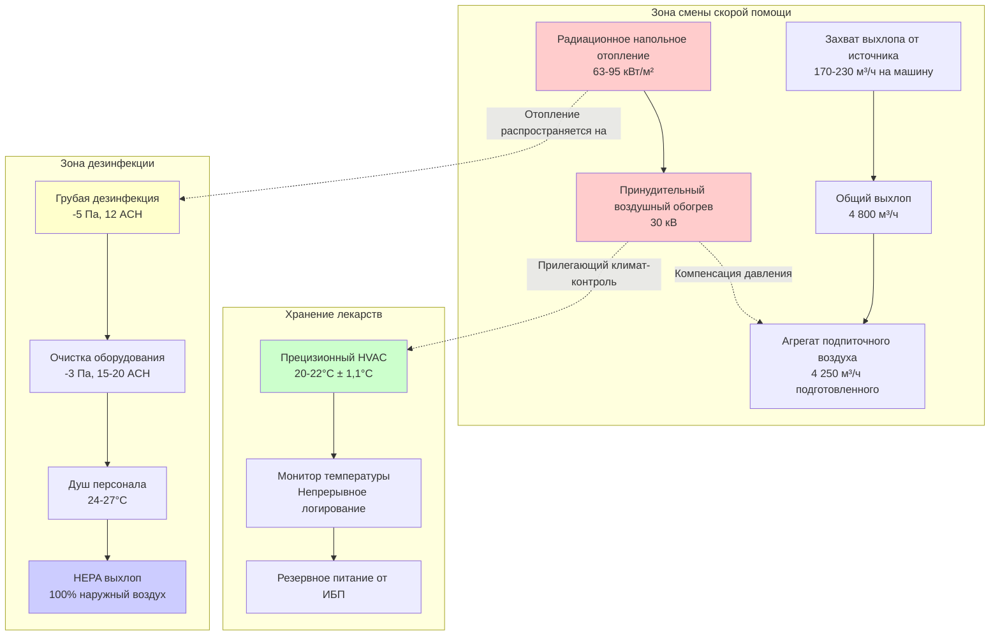

# Проектирование и требования HVAC для смены скорой помощи

Смены скорой помощи требуют специализированного проектирования HVAC, которое учитывает удаление выхлопа автомобиля, хранение температурочувствительных лекарств, потребности операционной деятельности быстрого реагирования и интеграцию с зонами дезинфекции. В отличие от смен пожарных аппаратов, смены скорой помощи должны поддерживать более тесный контроль окружающей среды для фармацевтического хранения, при этом размещая частые циклы отправки и возможные события биологического загрязнения.

## Требования к удалению выхлопа автомобиля

Системы выхлопа смены скорой помощи должны захватывать выбросы дизельных и бензиновых двигателей во время циклов прогрева без создания отрицательного давления, которое мешает соседним климат-контролируемым зонам хранения лекарств.

### Проектирование системы захвата от источника

Прямое подключение захвата выхлопа обеспечивает оптимальную защиту персонала EMS во время периодов прогрева аппарата. Машины скорой помощи обычно работают на холостом ходу 3-5 минут перед отправкой, генерируя значительные выбросы окиси углерода и частиц.

**Компоненты системы:**

- Барабаны гибкого шланга с пружинным нажимом и магнитными разъемами на выхлопной трубе
- Быстроразъемные сопла, рассчитанные на температуру выхлопа 427°C
- Отдельные вентиляторы выхлопа на каждую позицию аппарата (180-240 м³/ч каждый)
- Автоматическое включение, связанное с зажиганием или ручным срабатыванием
- Минимум 3 м от воздухозаборников при скидывании выхлопа

**Расчет потока захвата:**

Для бензиновых двигателей (распространенных в компактных машинах скорой помощи):

$$Q_{exhaust} = \frac{E_{displacement} \times RPM \times VE}{3456}$$

Где:
- $Q_{exhaust}$ = объем выхлопа (м³/ч, преобразуется из CFM)
- $E_{displacement}$ = объем двигателя (кубические сантиметры)
- $RPM$ = скорость на холостом ходу (типично 600-800 об/мин)
- $VE$ = коэффициент объемной эффективности (0,85 при холостом ходе)
- $3456$ = постоянная преобразования

Для типичного двигателя объемом 5,3 л (323 куб. см) машины скорой помощи на холостом ходе 700 об/мин:

$$Q_{exhaust} = \frac{323 \times 700 \times 0.85}{3456} = 56 \text{ CFM (95 м³/ч)}$$

Размер системы захвата при 3× расчетного объема выхлопа для обеспечения полного захвата: $56 \times 3 = 168$ CFM (285 м³/ч) минимум.

**Перепад давления в системе:**

Общий перепад давления в системе определяет выбор вентилятора:

$$\Delta P_{total} = \Delta P_{hose} + \Delta P_{duct} + \Delta P_{discharge}$$

Типичные значения:
- Гибкий шланг: 25-40 Па на 3 м
- Жесткие воздуховоды: 4-6 Па на 30 м
- Выпускной стояк: 10-20 Па

Выберите вентилятор выхлопа для подачи расчетного расхода воздуха при общем перепаде давления в системе плюс коэффициент безопасности 25%.

### Резервная общая вентиляция

Общий выхлоп обеспечивает вторичную защиту при позиционировании транспортного средства и уменьшает рассеянные выбросы от технического обслуживания аппарата.

**Расход вентиляции:**

$$Q_{ventilation} = \frac{V \times ACH}{60}$$

Где:
- $Q_{ventilation}$ = воздушный поток (м³/ч)
- $V$ = объем смены (м³)
- $ACH$ = воздухообмены в час (минимум 4-6, 10-12 при работе аппарата)

Для смены размером 12,2 м × 15,2 м × 4,3 м (объем 800 м³):

$$Q_{ventilation} = 800 \times 6 = 4,800 \text{ м³/ч}$$

Установите низкоуровневый выхлоп (в пределах 30 см от пола), так как выхлоп автомобиля плотнее окружающего воздуха. Свяжите общий выхлоп с положением двери аппарата и обнаружением CO для включения при 9 ppm.

## Температурный контроль для хранения лекарств

Машины скорой помощи перевозят температурочувствительные фармацевтические препараты, требующие строгого контроля окружающей среды. Смены скорой помощи должны поддерживать 15-25°C согласно руководствам USP для хранения лекарств.

### Климат-контролируемые зоны

**Зона 1: Активная смена**
- Поддерживает 16-24°C круглый год
- Точность ±1,7°C для предотвращения деградации лекарств
- Независимо от положения двери аппарата
- Емкость отопления учитывает нагрузки инфильтрации

**Зона 2: Хранение/комната поставок лекарств**
- Прилегает к смене для быстрого пополнения запасов
- Поддерживает 20-22°C ± 1,1°C
- Мониторинг температуры с аварийным сигналом при 18°C и 26°C
- Резервное отопление/охлаждение от резервного питания
- Логирование данных для соответствия нормативным требованиям

### Проектирование системы отопления

Радиационное напольное отопление в сочетании с резервным принудительным воздухом обеспечивает оптимальную стабильность температуры во время операций с дверями.

**Емкость радиационного пола:**

$$q_{radiant} = \frac{k \times (T_{surface} - T_{ambient})}{R_{total}}$$

Где:
- $q_{radiant}$ = тепловой выход (кВт/м²)
- $k$ = теплопроводность конструкции пола
- $T_{surface}$ = температура поверхности пола (29-32°C)
- $T_{ambient}$ = температура воздуха смены (18°C минимум)
- $R_{total}$ = тепловое сопротивление (плита, расстояние между трубами, полы)

Для типичной укладки труб с расстоянием 15 см с температурой воды 54°C:

Выход = 70-82 кВт/м², обеспечивающий базовое тепло во время периодов закрытой двери.

**Дополнительный принудительный воздух:**

Высокоэффективные газовые печи или тепловые насосы, рассчитанные на быстрое восстановление:

$$Q_{recovery} = \frac{V \times 1.2 \times \Delta T}{t_{recovery}}$$

Где:
- $Q_{recovery}$ = требуемая емкость отопления (кВт)
- $V$ = объем смены (м³)
- $1.2$ = постоянная для воздуха при стандартных условиях
- $\Delta T$ = перепад температуры при открытии двери (обычно 4-7°C)
- $t_{recovery}$ = целевое время восстановления (10-15 минут)

Для смены объемом 800 м³, восстанавливающей 6°C за 12 минут:

$$Q_{recovery} = \frac{800 \times 1.2 \times 6}{0.2} = 29 \text{ кВ}$$

Выберите агрегат мощностью 30 кВ для удовлетворения требований восстановления.

## Потребности в вентиляции быстрого реагирования

Циклы отправки EMS требуют систем HVAC, которые не препятствуют отправке машины скорой помощи, при этом поддерживая контроль окружающей среды.

### Функции быстрого реагирования

**Автоматическое отключение системы:**
- Системы захвата выхлопа используют разъемные разъемы, которые отсоединяются при натяжении более 67 Н
- Барабаны шланга автоматически втягиваются при отправке машины скорой помощи
- Двери верхней части срабатывают изменением режима вентиляции через концевые выключатели
- Общий выхлоп продолжается 5 минут после отправки для очистки остаточных выбросов

**Оптимизация цикла двери:**

Высокоскоростные секционные или рулонные двери минимизируют инфильтрацию:
- Скорость открытия: 76-102 см/сек (в сравнении с 15-20 для обычных)
- Время полного цикла: 8-12 секунд для двери 3 м × 3,7 м
- Снижает объем инфильтрации на 60-70% по сравнению с обычными дверями

**Ограничения снижения температуры:**

Требования хранения лекарств исключают глубокие стратегии снижения температуры:
- Режим занятости: 20-22°C
- Режим ожидания: 18-24°C (максимальное снижение)
- Время отклика на режим занятости: < 5 минут

## Управление инфильтрацией воздуха дверей смены

Частые операции с дверями создают значительные нагрузки инфильтрации, которые должны управляться без ущерба для хранения лекарств.

### Количественное определение нагрузки инфильтрации

**Метод смены воздуха:**

$$Q_{infiltration} = \frac{n_{cycles} \times V \times \rho \times c_p \times \Delta T}{t_{hour}}$$

Где:
- $Q_{infiltration}$ = потери тепла от инфильтрации (кВт)
- $n_{cycles}$ = циклы двери в час (проектирование для 2-4 типичных, 12 максимум)
- $V$ = объем смены (м³)
- $\rho$ = плотность воздуха (1,2 кг/м³ при стандартных условиях)
- $c_p$ = удельная теплоемкость воздуха (1,01 кДж/кг·°C)
- $\Delta T$ = разница температур внутри-снаружи

Для смены 800 м³ с 4 циклами двери/час и разницей температур 28°C:

$$Q_{infiltration} = \frac{4 \times 800 \times 1.2 \times 1.01 \times 28}{1} = 10.8 \text{ кВ}$$

Это представляет 60-75% от общей тепловой нагрузки в холодном климате.

### Стратегии снижения инфильтрации

| Стратегия | Эффективность | Экономия энергии | Стоимость внедрения |
|----------|--------------|----------------|---------------------|
| Высокоскоростные двери | Снижение на 60-70% | Экономия на отоплении 35-45% | Высокая (40 000-75 000 руб./дверь) |
| Воздушные завесы тамбура | Снижение на 30-40% | Экономия на отоплении 15-25% | Средняя (15 000-30 000 руб./дверь) |
| Улучшенные уплотнения двери | Снижение на 20-30% | Экономия на отоплении 10-15% | Низкая (2 500-5 000 руб./дверь) |
| Система подпиточного воздуха с контролем спроса | Снижение на 15-25% | Экономия на отоплении 20-30% | Средняя (20 000-40 000 руб./система) |

**Комбинированный подход:**

Многоуровневое смягчение обеспечивает оптимальные результаты:
1. Высокоскоростные изолированные секционные двери с термическим разделением
2. Периметровые уплотнения с автоматическим нижним порогом
3. Нагретая воздушная завеса тамбура (опционально для экстремальных климатов)
4. Система подпиточного воздуха с компенсацией давления

## Отопление для работы в холодном климате

Машины скорой помощи в холодном климате требуют подключения берегового питания для предварительного кондиционирования отсека пациента и нагрева блока двигателя.

### Интеграция оборудования

**Станции берегового питания:**
- Розетки 120В/240В на каждой позиции машины скорой помощи
- Цепи нагревателя блока (1500 Вт типично)
- Цепи нагревателя отсека пациента (1000-1500 Вт)
- Общая электрическая нагрузка: 3-4 кВ на позицию машины скорой помощи

**Преимущества предварительного кондиционирования:**
- Снижает время холостого хода на 70-80% (3-5 минут до < 1 минуты)
- Поддерживает температуру хранения лекарств в машине
- Уменьшает время работы системы захвата выхлопа
- Улучшает надежность холодного запуска

### Параметры проектирования отопления смены

**Спецификации для холодного климата:**

| Параметр | Умеренный климат | Холодный климат | Экстремальный холод |
|----------|-----------------|--------------|--------------|
| Минимальная температура смены | 16°C | 18°C | 20°C |
| Расчетная наружная температура | -12°C | -23°C | -34°C |
| Температура подачи радиационного пола | 46-52°C | 54-60°C | 60-66°C |
| Емкость резервного принудительного воздуха | 50% нагрузки | 75% нагрузки | 100% нагрузки |
| Множитель инфильтрации | 1,0× | 1,25× | 1,5× |

**Защита от замораживания:**

Гидравлические системы требуют пропиленгликоля и тепловой трассировки:
- Концентрация пропиленгликоля: 30-40% (защита до -7°C до -40°C)
- Тепловая трассировка открытых труб в неотапливаемых пространствах
- Аварийный сигнал при низкой температуре 4°C в механических помещениях

## Интеграция зоны дезинфекции

Экипажи EMS требуют объектов дезинфекции, прилегающих к сменам скорой помощи для инцидентов биологического загрязнения и рутинной очистки оборудования.

### Проектирование зоны дезинфекции

**Пространственная взаимосвязь:**

**Каскад давления:**

Поддерживайте градиент отрицательного-положительного давления:
- Смена скорой помощи: -10 Па (относительно снаружи)
- Воздушный шлюз дезинфекции: -5 Па (относительно чистых зон)
- Очистка оборудования: -3 Па (относительно чистых зон)
- Личная дезинфекция: -2 Па (относительно чистых зон)
- Чистый коридор: +2 Па (относительно зон дезинфекции)

### Требования вентиляции

**Комната дезинфекции:**

$$Q_{decon} = \text{макс}(ACH_{min}, Q_{dilution})$$

Где ACH минимум = 12 воздухообменов в час для разбавления загрязнения.

**Выхлопная система:**
- 100% выхлоп без рециркуляции
- HEPA фильтрация на выхлопе (если подозреваются биологические агенты)
- Отдельный вентилятор выхлопа, изолированный от общего выхлопа здания
- Выпуск выше кровельной линии, минимум 7,6 м от воздухозаборников

**Подпиточный воздух:**
- Подготовленный наружный воздух (18-21°C температура подачи)
- Низкоуровневая подача для создания воздушного потока от пола к потолку
- Связано с выхлопом для поддержания отрицательного давления

**Температурный контроль:**

Души дезинфекции требуют температуры воздуха 24-27°C:
- Мгновенный нагреватель воды (0,03 л/мин при 40°C)
- Дополнительный радиационный или электрический нагреватель сопротивления
- Быстрое восстановление после использования душа

### Зона очистки оборудования

**Параметры вентиляции:**

| Требование | Спецификация |
|-------------|---------------|
| Воздухообмены | 15-20 ACH |
| Расход выхлопа | 1,5 м³/(ч·м²) площади пола |
| Температура | 21-24°C |
| Влажность | 40-60% ОВ |
| Фильтрация | MERV 13 минимум |

**Контроль влажности:**

Промывка оборудования создает высокие нагрузки влаги:
- Выхлоп удаляет влажный воздух
- Предотвратить конденсацию на холодных поверхностях (изолировать внешние стены, палуба крыши)
- Дренаж конденсата на уровне пола
- Опциональное осушение, если влажность превышает 65% ОВ

## Сводка параметров проектирования

**Таблица проектирования HVAC смены скорой помощи EMS:**

| Компонент системы | Параметр проектирования | Примечания |
|-----------------|------------------|-------|
| **Выхлопные системы** | | |
| Захват от источника на машину | 170-230 м³/ч | На основе объема двигателя |
| Общая вентиляция (минимум) | 4-6 ACH | Непрерывный фоновый |
| Общая вентиляция (активная) | 10-12 ACH | При работе аппарата |
| Давление вентилятора выхлопа | 75-125 Па | Включает потери в воздуховодах, шланге, выпуске |
| **Системы отопления** | | |
| Температура смены (занята) | 20-22°C | Требование хранения лекарств |
| Температура смены (ожидание) | 18-24°C | Ограниченное снижение |
| Выход радиационного пола | 63-95 кВт/м² | Зависит от климата |
| Резервный принудительный воздух | 29-59 кВ | На 22-27 м³ смены |
| Целевое время восстановления | 10-15 минут | После цикла двери |
| **Контроль инфильтрации** | | |
| Скорость двери (высокоскоростная) | 76-102 см/сек | 8-12 сек полный цикл |
| Выпуск воздушной завесы | 10,2-12,7 м/сек | Нагрев до 32-38°C |
| Расчет циклов двери | 2-4 типичных, 12 макс | В час |
| **Дезинфекция** | | |
| Вентиляция комнаты дезинфекции | 12-15 ACH | 100% выхлоп |
| Очистка оборудования | 15-20 ACH | Высокое удаление влаги |
| Дифференциал давления | -5 до -10 Па | Относительно чистых зон |
| Температура зоны душа | 24-27°C | Комфорт персонала |
| **Хранение лекарств** | | |
| Температура комнаты хранения | 20-22°C ± 1,1°C | Соответствие USP <797> |
| Мониторинг температуры | Непрерывный с сигналом тревоги | При 18°C и 26°C |
| Интервал логирования данных | Минимум 15 минут | Соответствие нормативам |

## Диаграмма интеграции системы

## Соответствие кодексам и стандартам

**Ссылаемые стандарты:**

- **NFPA 1500**: Программа безопасности и здоровья пожарной охраны (пределы воздействия выхлопа применяются к учреждениям EMS)
- **USP <797>**: Фармацевтическое приготовление—стерильные препараты (требования контроля температуры)
- **ASHRAE 62.1**: Вентиляция для приемлемого качества воздуха в помещении (минимальные расходы вентиляции)
- **IMC Глава 5**: Выхлопные системы (захват выхлопа автомобиля и выхлоп дезинфекции)
- **OSHA 29 CFR 1910.1030**: Патогены крови (требования объекта дезинфекции)

**Рассмотрение энергетического кодекса:**

ASHRAE 90.1 допускает исключения для круглосуточных учреждений EMS:
- Непрерывный климат-контроль хранения лекарств освобожден от требований снижения температуры
- Аварийное освещение на отдельных цепях от общего освещения
- Высокоскоростные двери соответствуют стандартам энергоэффективности
- Рекуперация тепла выхлопа не требуется для загрязненных воздушных потоков

## Заключение

Проектирование HVAC смены скорой помощи требует точной интеграции захвата выхлопа автомобиля, климат-контроля фармацевтического качества, способности к быстрому операционному реагированию и координации системы дезинфекции. Система должна поддерживать 20-22°C для хранения лекарств при одновременном управлении нагрузками инфильтрации от частых циклов двери, обеспечивать захват выхлопа от источника без препятствования экстренной отправке и устанавливать каскады давления, которые предотвращают миграцию биологических загрязнений. Радиационное напольное отопление в сочетании с резервным принудительным воздухом обеспечивает оптимальную стабильность температуры, в то время как высокоскоростные двери и система подпиточного воздуха с контролем спроса минимизируют потребление энергии. Интеграция зоны дезинфекции требует тщательного управления дифференциалом давления и HEPA-фильтрованным выхлопом для защиты персонала и прилегающих пространств от инцидентов биологического загрязнения.
