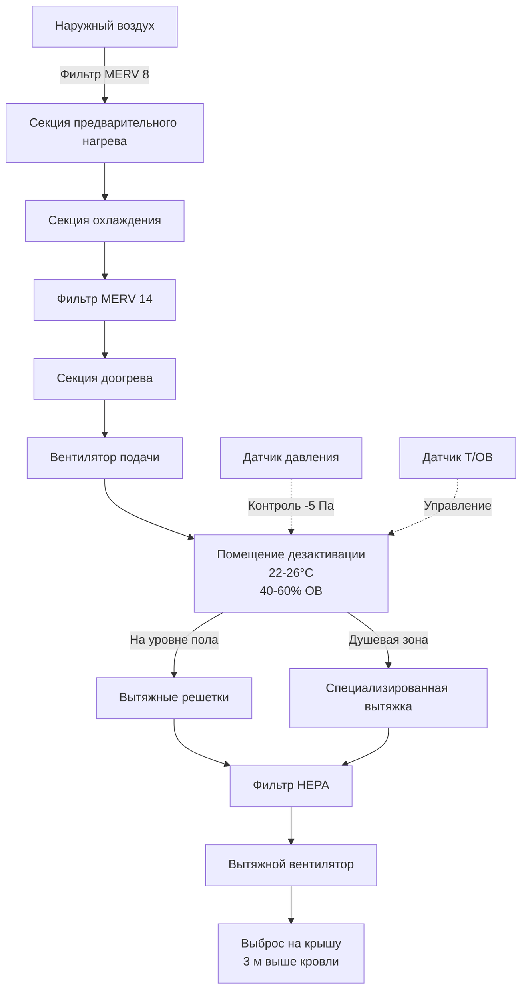

## Общие сведения

Зоны дезактивации в медицинских учреждениях требуют специализированных систем HVAC для защиты персонала и предотвращения перекрестного загрязнения при очистке оборудования и персонала, подвергшихся воздействию опасных материалов, биологических агентов или инфекционных заболеваний. Эти помещения должны поддерживать строгий контроль окружающей среды, обеспечивая безопасные и эффективные возможности дезактивации.

## Отрицательное давление в системе локализации

Зона дезактивации должна работать при отрицательном давлении относительно всех смежных помещений, чтобы предотвратить миграцию загрязняющих веществ.

**Требования к перепаду давления:**

| Смежное помещение | Минимальный перепад давления |
|---------------|------------------------------|
| Коридор | -2,5 до -7,5 Па |
| Чистые зоны | -5 до -10 Па |
| Автомобильный отсек | -2,5 Па |

### Поддержание отрицательного давления

Отрицательное давление достигается путем вытяжки больше воздуха, чем поступает в помещение. Перепад давления должен постоянно контролироваться с помощью визуальных индикаторов и сигналов тревоги, чтобы предупредить персонал в случае нарушения локализации. Датчики дифференциального давления должны срабатывать при достижении 80% минимально требуемого перепада.

Система подачи воздуха должна быть взаимоблокирована с системой вытяжки, чтобы предотвратить создание положительного давления при запуске или отказе оборудования. Вытяжные вентиляторы должны включаться перед вентиляторами подачи, а вентиляторы подачи должны отключаться перед вытяжными вентиляторами при остановке системы.

## Требования по кратности воздухообмена

Зоны дезактивации требуют значительно более высоких частот воздухообмена, чем стандартные занятые помещения, для быстрого разбавления и удаления переносимых по воздуху загрязняющих веществ.

**Минимальные требования по кратности воздухообмена:**

- **Активная дезактивация:** 12-20 кратности в час
- **Режим ожидания:** 6-10 кратности в час
- **Очистка после дезактивации:** 20-30 кратности в час в течение 30 минут

Объемный расход вытяжного воздуха рассчитывается как:

$$Q_{\text{вытяжка}} = \frac{V \times \text{кратность}}{60}$$

где $Q_{\text{вытяжка}}$ — расход вытяжки в CFM (м³/ч), $V$ — объем помещения в кубических футах (м³), а кратность — кратность воздухообмена в час.

Расход приточного воздуха должен быть снижен для поддержания отрицательного давления:

$$Q_{\text{приток}} = Q_{\text{вытяжка}} - Q_{\text{смещение}}$$

где $Q_{\text{смещение}}$ обычно составляет 100-200 CFM (170-340 м³/ч) для стандартного помещения дезактивации для достижения требуемого перепада давления.

## Требования к системам вытяжки и фильтрации

Система вытяжки должна захватывать загрязняющие вещества в месте их образования и обеспечивать надлежащую фильтрацию перед выбросом.

### Проектирование системы вытяжки

**Точки захвата:**
- Потолочные вытяжные решетки над зонами промывки
- Низкоуровневая вытяжка у напольных водостоков
- Специализированная вытяжка для душевых кабин
- Станции промывки оборудования с локальной вытяжкой

Распределение вытяжного воздуха должно следовать схеме **от верхнего к нижнему уровню**, с подачей приточного воздуха у потолка и сосредоточением вытяжки у пола, где оседают более тяжелые загрязнители.

### Требования к фильтрации

| Тип загрязнителя | Уровень фильтрации | Эффективность |
|------------------|------------------|------------|
| Твердые частицы | HEPA | 99,97% при 0,3 мкм |
| Биологические агенты | HEPA + UV-C | 99,97% + бактерицидное действие |
| Химические пары | Активированный уголь | В зависимости от применения |
| Общего назначения | MERV 14-16 | 90-95% в среднем |

Фильтрация HEPA является обязательной для учреждений, работающих с биологическими опасностями или случаями инфекционных заболеваний. Корпуса фильтров должны обеспечивать безопасные процедуры замены фильтров с возможностью изоляции фильтра внутри мешка.

## Особенности проектирования душевых и зон промывки

Душевые для дезактивации требуют скоординированного проектирования систем HVAC и водоснабжения для работы с высокими нагрузками по влажности и колебаниями температуры.

### Согласование дренажа

Напольные водостоки должны быть рассчитаны на общий расход:
- Нескольких душевых головок (9,5-19 л/мин каждая)
- Форсунок для промывки оборудования (38-76 л/мин)
- Общего напольного дренажа

Траншейные водостоки со съемными решетками облегчают очистку и обслуживание. Все водостоки должны иметь глубокие сифоны (минимум 10 см) для предотвращения миграции канализационных газов и поддержания отрицательного давления в помещении.

### Контроль влажности

Высокое выделение влаги во время активных операций дезактивации может перегрузить стандартные системы HVAC. Особенности проектирования включают:

- **Контроль по влажности** для увеличения вытяжки при относительной влажности более 70%
- **Догревающие секции** в приточном воздухе для предотвращения конденсации
- **Влагостойкие воздуховоды** (нержавеющая сталь или покрытый оцинкованный металл)
- **Наклонные участки воздуховодов** для дренажа конденсата

## Контроль температуры и влажности

**Требования к температуре:**
- **Занятое помещение/активное использование:** 22-26°C
- **Незанятое помещение в режиме ожидания:** 18-21°C

**Требования к влажности:**
- **Целевой диапазон:** 40-60% ОВ
- **Максимум:** 70% ОВ при активной дезактивации
- **Минимум:** 30% ОВ

Контроль температуры должен учитывать тепловую нагрузку от использования горячей воды при дезактивации. Емкость доогрева должна быть рассчитана на 100% наружного воздуха при зимних условиях проектирования плюс скрытая охлаждающая нагрузка от образования пара.

## Изоляция от других зон учреждения

Физическая и воздушная изоляция предотвращает распространение загрязнителей в чистые зоны учреждения.

### Архитектурные барьеры

- **Вестибюли или переходные помещения** в точках входа/выхода
- **Самозакрывающиеся двери с уплотнением** рассчитанные на перепад давления
- **Герметичные проходки** для всех инженерных систем в стенах и потолке
- **Непрерывные парозащитные барьеры** в стенах и потолке

### Изоляция воздушных потоков

Помещение дезактивации должно обслуживаться **отдельным приточно-вытяжным блоком**, не связанным с другими системами здания. Воздуховоды, обслуживающие помещение дезактивации, не должны быть соединены с воздуховодами, обслуживающими чистые зоны. Вытяжной воздух должен выбрасываться таким образом, чтобы предотвратить его повторное поступление:

- Минимум 3 м выше кровли
- Минимум 7,5 м от воздухозаборников
- По ветру относительно воздухозаборников здания

## Сводка критериев проектирования помещения дезактивации

| Параметр | Требование | Примечания |
|-----------|-------------|-------|
| Перепад давления | -2,5 до -7,5 Па | Относительно смежных помещений |
| Кратность воздухообмена (активная) | 12-20 кратности в час | Во время дезактивации |
| Кратность воздухообмена (ожидание) | 6-10 кратности в час | Режим незанятого помещения |
| Температура | 22-26°C | Установка для занятого помещения |
| Относительная влажность | 40-60% ОВ | Нормальная работа |
| Фильтрация вытяжки | HEPA (99,97%) | Для биологических опасностей |
| Наружный воздух | 100% | Без рециркуляции |
| Место выброса вытяжки | 3 м выше кровли | 7,5 м от воздухозаборников |
| Зазор двери | 2,5 см минимум | Поддерживает воздушный поток |
| Установка точки срабатывания тревоги | 80% минимального ΔP | Предупреждение о падении давления |

## Последовательность управления

Система HVAC помещения дезактивации должна включать следующие режимы управления:

1. **Режим ожидания:** Сниженная кратность воздухообмена, пониженный температурный режим, поддержание отрицательного давления
2. **Активная дезактивация:** Полная кратность воздухообмена, температура для занятого помещения, максимальная вытяжка
3. **Режим очистки:** Повышенная кратность воздухообмена для быстрого удаления загрязнителей после использования
4. **Аварийный режим:** Максимальная вытяжка, минимальная подача для максимального отрицательного давления

Элементы ручного управления должны располагаться вне помещения дезактивации, чтобы обеспечить экстренную активацию без входа в загрязненное помещение.

## Заключение

Помещения дезактивации в медицинских учреждениях требуют тщательного проектирования HVAC для защиты персонала и предотвращения перекрестного загрязнения. Интеграция систем отрицательного давления, высоких скоростей вентиляции, эффективной фильтрации и надлежащей изоляции создает безопасную среду для критических операций дезактивации, одновременно поддерживая контроль инфекций на уровне учреждения.
