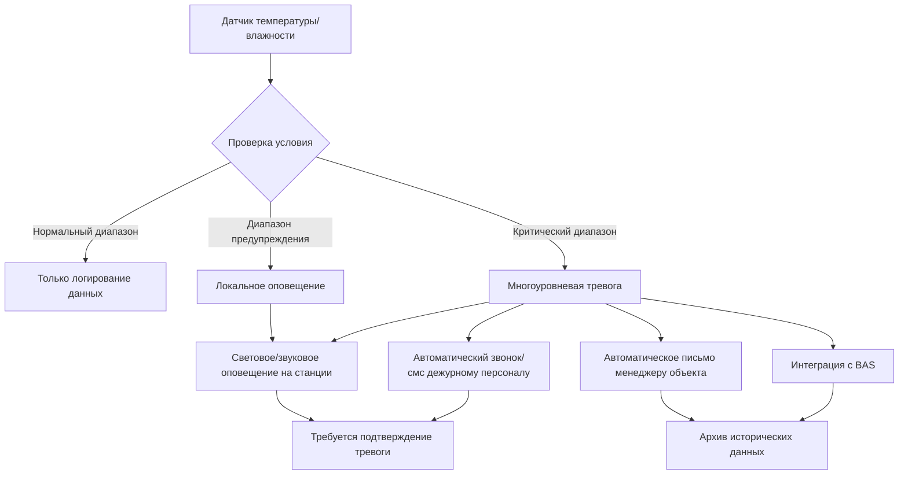

# Система вентиляции и кондиционирования для хранения медицинского оборудования на станциях скорой помощи

Хранение медицинского оборудования на станциях скорой помощи требует точного контроля окружающей среды для поддержания эффективности лекарств, сохранения целостности оборудования и обеспечения готовности расходных материалов к использованию при экстренных вызовах. Проектирование HVAC должно обеспечить стабильные условия температуры и влажности с резервными системами, непрерывным мониторингом и защитой от загрязнений для сохранения критических фармацевтических запасов и медицинских устройств.

Проектная задача центрируется на поддержании условий фармацевтического класса в круглосуточном учреждении экстренной помощи, где доступ к расходным материалам происходит в непредсказуемые моменты, резервные системы охлаждения должны включаться плавно при отказе электроснабжения, а мониторинг окружающей среды должен оповещать персонал о любых отклонениях, которые могут скомпрометировать стабильность лекарств.

## Контроль температуры для стабильности лекарств

Фармацевтические продукты требуют определенных температурных диапазонов для поддержания химической стабильности и терапевтической эффективности. Большинство лекарств, хранящихся на станциях скорой помощи, относятся к двум категориям: хранение при комнатной температуре (контролируемая комнатная температура, 20-25°C) и охлаждаемое хранилище (2-8°C).

### Зоны хранения при комнатной температуре

Основная зона хранения медикаментов поддерживает контролируемую комнатную температуру в соответствии с рекомендациями USP. Эта зона хранит инфузионные растворы, пероральные лекарства, большинство инъекционных препаратов, перевязочные материалы и медицинские устройства.

**Параметры проектирования:**

| Параметр | Спецификация | Обоснование |
|----------|--------------|-------------|
| Диапазон температуры | 20-25°C | Контролируемая комнатная температура USP |
| Стабильность температуры | ±1,1°C максимальное отклонение | Предотвращение превышений, влияющих на лекарства |
| Время восстановления | <15 минут до уставки | После открытия двери или отказов оборудования |
| Точность управления | ±0,6°C на датчике | Требуется прецизионный контроллер |

**Расчет холодильной нагрузки:**

Чувствительная холодильная нагрузка медицинского хранилища включает потери через ограждающие конструкции, внутренние тепловыделения и инфильтрацию:

$$Q_{total} = Q_{envelope} + Q_{lights} + Q_{infiltration} + Q_{people}$$

Где нагрузка ограждающих конструкций включает передачу тепла через стены, потолок и пол:

$$Q_{envelope} = U \cdot A \cdot \Delta T$$

Для типичного хранилища медикаментов площадью 18,6 м² с высотой потолка 3 м и стенами R-13:

$$Q_{envelope} = \frac{1}{2.29} \cdot 46.5 \text{ м}^2 \cdot 7,2 = 147 \text{ кДж/ч}$$

Нагрузка освещения при 10,8 Вт/м²:

$$Q_{lights} = 18.6 \text{ м}^2 \cdot 10.8 \text{ Вт/м}^2 \cdot 3.41 = 0.65 \text{ кДж/ч}$$

Инфильтрация от открытия дверей (ориентировочно 2 воздухообмена в час):

$$Q_{infiltration} = 1.08 \cdot CFM \cdot \Delta T = 1.08 \cdot 32 \text{ (м}^3\text{/ч)} \cdot 7.2 = 250 \text{ кДж/ч}$$

Общая чувствительная нагрузка примерно 0,62 кВ, требующая минимум 0,18 кВ охлаждающей способности. Размер фактического оборудования при коэффициенте безопасности 1,5-2,0 для открытия дверей и будущего расширения: **0,27-0,36 кВ минимум**.

### Выделенная система HVAC

Зоны медицинского хранения требуют выделенных систем температурного контроля, независимых от общей системы вентиляции здания, для обеспечения непрерывной работы и предотвращения перекрестного загрязнения.

**Конфигурация системы:**

- Сплит-система или ductless mini-split, выделенная для зоны хранения
- Резервная охлаждающая способность или автоматический переход на резервное устройство
- Электрическое сопротивление или горячее водоснабжение для точного контроля температуры
- Охлаждение в течение всего года (хранение лекарств не следует графикам понижения уставки)

**Стратегия управления:**

- Прецизионный регулятор температуры (точность ±0,6°C)
- Уличный сброс отключен (поддержание постоянной уставки независимо от наружных условий)
- Контроль влажности через доп. нагрев (охлаждение с доп. нагревом для поддержания нижнего предела 20°C)
- Работа 24/7 без периодов понижения уставки

Система должна обеспечить одновременно нагрев и охлаждение в переходные сезоны, когда осушение требует охлаждения с последующим доп. нагревом для поддержания диапазона 20-25°C.

## Требования к влажности для защиты оборудования

Контроль относительной влажности предотвращает повреждение влагой лекарств, медицинских устройств и упаковочных материалов. Избыточная влажность способствует микробному росту, деградирует гигроскопичные лекарства и вызывает коррозию электронного медицинского оборудования. Низкая влажность создает риск статического электричества и высушивает определенные продукты.

**Критерии проектирования влажности:**

| Условие | Спецификация | Метод контроля |
|---------|--------------|-----------------|
| Диапазон относительной влажности | 30-60% ОВ | Рекомендация USP для фармацевтических препаратов |
| Оптимальная уставка | 40-50% ОВ | Минимизирует как микробный рост, так и статику |
| Максимальное отклонение | ±10% ОВ | Поддерживает стабильность продукта |
| Точность измерения | ±3% ОВ | Требуются откалиброванные датчики |

### Системы осушения

Летние условия обычно требуют активного осушения. Выделенная система охлаждения обеспечивает скрытую нагрузку во время работы, но доп. нагрев предотвращает чрезмерное охлаждение.

**Способность к осушению:**

Расчет скрытой нагрузки от инфильтрации и диффузии влаги через ограждающие конструкции:

$$Q_{latent} = 0.68 \cdot CFM \cdot \Delta W$$

Где $\Delta W$ - разница отношения влажности между наружным и внутренним воздухом.

Для условий проектирования 29,4°C БТ/26,7°C БЧ наружу, 22,2°C БТ/50% ОВ внутри:
- Наружное отношение влажности: 0,0147 кг/кг
- Внутреннее отношение влажности: 0,0081 кг/кг
- $\Delta W$ = 0,0066 кг/кг

Для инфильтрации 32 м³/ч:

$$Q_{latent} = 0.68 \cdot 32 \text{ (м}^3\text{/ч)} \cdot 0.0066 = 0.143 \text{ кДж/ч}$$

Система охлаждения должна обеспечить адекватную скрытую способность (обычно SHR 0,70-0,80), в то время как доп. нагрев предотвращает падение температуры помещения ниже 20°C во время режима осушения.

### Системы увлажнения

Зимние условия в холодном климате могут потребовать увлажнения для поддержания минимума 30% ОВ. Паровое увлажнение обеспечивает наиболее гигиеничный вариант для фармацевтического хранилища.

**Выбор увлажнителя:**

- Электродный или резистивный паровой увлажнитель (генерирует чистый пар)
- Производительность 0,5-1,4 кг/ч для типичного хранилища
- Распределительная трубка в воздуховоде подачи с расстоянием всасывания 3-4,5 м
- Управление датчиком влажности помещения с точностью ±3%

Избегайте испарительных увлажнителей с прокладками и ультразвуковых устройств в медицинском хранилище из-за рисков загрязнения и образования минеральной пыли.

## Резервное охлаждение для критических запасов

Отказы электроснабжения и оборудования могут скомпрометировать стабильность лекарств. Резервные системы охлаждения поддерживают условия окружающей среды при чрезвычайных ситуациях, защищая фармацевтический инвентарь, который на типичных станциях скорой помощи может стоить 2,5 млн - 5 млн рублей.

### Интеграция аварийного питания

Подключите систему HVAC хранилища медикаментов к аварийному генератору с автоматическим переключателем. Емкость генератора должна включать холодильную нагрузку медицинского хранилища как приоритетную нагрузку.

**Назначение приоритета нагрузки:**

1. Системы безопасности жизнедеятельности (аварийное освещение, система пожарной сигнализации)
2. Критическое медицинское оборудование (холодильники, HVAC для хранения лекарств)
3. Необходимые функции скорой помощи (коммуникации, двери гаража)
4. Некритические нагрузки (административное HVAC, общее освещение)

Генератор запускается в течение 10 секунд после отказа питания. Системы HVAC повторно подключаются автоматически после задержки 30-60 секунд для предотвращения перегрузки пускового тока.

### Резервное охлаждающее оборудование

Учреждения без резервного генератора или требующие более высокой надежности устанавливают резервные охлаждающие блоки с автоматическим переходом.

**Конфигурации резервирования:**

- **Двойные блоки, один резервный:** Основной блок работает непрерывно, резервный блок активируется при обнаружении отказа основного (аварийный сигнал высокой температуры или потеря воздушного потока)
- **Операция с ведущим-вспомогательным:** Оба блока разделяют нагрузку, автоматическое переключение при отказе любого
- **Переносной резервный блок:** Мобильный кондиционер воздуха (2,3-3,5 кВ) хранится на месте с быстроразъемной способностью

Мониторьте непрерывно работу основного блока. Аварийный сигнал высокой температуры активирует резервный блок и оповещает персонал объекта в течение 2-5 минут обнаружения отказа.

### Тепловая масса и пассивная защита

Само хранилище обеспечивает тепловую буферизацию при кратких прерываниях питания. Оптимизируйте пассивную защиту:

- Строительство с высокой тепловой массой (бетонные или каменные стены обеспечивают тепловой буфер на 4-8 часов)
- Изоляция минимум R-2,3 для стен, R-3,3 для потолка
- Минимизируйте площадь окон (исключите, если возможно, или укажите изолированное остекление)
- Уплотнения на дверях доступа
- Входной тамбур для зон хранения с высокой проходимостью

Хорошо изолированное хранилище площадью 18,6 м² поддерживает температуру в приемлемом диапазоне в течение 2-4 часов после отказа системы охлаждения, обеспечивая время для активации резервной системы или развертывания переносного охлаждения.

## Системы мониторинга и сигнализации

Непрерывный мониторинг окружающей среды с автоматической сигнализацией защищает фармацевтический инвентарь от превышений температуры и влажности. Система мониторинга обеспечивает логирование данных в реальном времени, немедленное уведомление о тревоге и историческую документацию для нормативного соответствия.

### Мониторинг температуры и влажности

**Спецификации датчиков:**

| Параметр | Тип датчика | Точность | Местоположение |
|----------|-------------|----------|-----------------|
| Температура | ПТС или термистор | ±0,3°C | Геометрический центр комнаты, 1,5 м над полом |
| Влажность | Емкостной датчик ОВ | ±3% ОВ | Совместно с датчиком температуры |
| Калибровка | Годовая сертификация | Прослеживаемо к NIST | Документируйте даты калибровки |

Установите резервные датчики в критических зонах хранения. Первичный датчик управляет системой HVAC; вторичный датчик обеспечивает независимый мониторинг и резервный сигнал тревоги.

### Конфигурация системы сигнализации

Система мониторинга генерирует тревоги для условий вне диапазона, отказов датчиков и потерь связи.

**Уставки сигналов тревоги:**

- **Предупреждение высокой температуры:** 24°C (1,1°C ниже максимально допустимого)
- **Критическая высокая температура:** 25°C (максимально допустимый предел)
- **Предупреждение низкой температуры:** 21°C (1,1°C выше минимально допустимого)
- **Критическая низкая температура:** 20°C (минимально допустимый предел)
- **Высокая влажность:** 55% ОВ (5% ниже максимума)
- **Низкая влажность:** 35% ОВ (5% выше минимума)
- **Отказ датчика:** Немедленная тревога при потере коммуникации или выходе показания за диапазон

**Методы уведомления о тревоге:**

Уведомление о тревоге усиливается в зависимости от серьезности и времени подтверждения:

1. **Немедленно:** Локальная звуковая и световая тревога на станции мониторинга (диспетчерская или стол дежурного)
2. **2 минуты:** Автоматический звонок или текстовое сообщение дежурному персоналу скорой помощи
3. **5 минут:** Вторичное уведомление менеджеру объекта или назначенному резервному лицу
4. **10 минут:** Эскалация администрации, если тревога не подтверждена

### Логирование данных и отчетность

Поддерживайте непрерывные записи температуры и влажности для нормативного соответствия и обеспечения качества.

**Требования к хранению данных:**

- Интервал выборки: 5-15 минут (настраивается)
- Продолжительность хранения: Минимум 2 года (фармацевтическое соответствие)
- Формат данных: Экспортируется в Excel или CSV для анализа
- Графическое отображение: Графики тренда в реальном времени и исторические
- Создание отчетов: Автоматическое создание суточных/еженедельных сводных отчетов

Документируйте все превышения за допустимый диапазон, включая продолжительность, величину и принятые корректирующие меры. Эта документация поддерживает оценку жизнеспособности лекарств в случае превышений.

## Требования к чистоте хранилища

Зоны хранения медицинского оборудования на станциях скорой помощи поддерживают чистые условия для предотвращения загрязнения частицами лекарств, инфузионных расходных материалов и стерильного оборудования. Хотя и не классифицируются как чистые комнаты, эти помещения требуют повышенных стандартов чистоты по сравнению с общими зонами здания.

### Фильтрация воздуха

**Спецификации фильтрации:**

- Минимум фильтрация MERV 11 на воздухе подачи (удаляет >65% частиц размером 1,0-3,0 микрон)
- MERV 13 предпочтительна для учреждений с повышенными требованиями к чистоте
- Предварительные фильтры (MERV 8) продлевают срок служения финального фильтра и снижают затраты на техническое обслуживание
- Мониторинг фильтра: Манометр перепада давления или электронный датчик с тревогой на 150% от начального сопротивления

Замените фильтры по графику (обычно ежеквартально) или по показаниям перепада давления. Поддерживайте чистое хранилище фильтров и используйте надлежащие процедуры обращения при замене для предотвращения введения загрязнений.

### Положительное давление

Поддерживайте небольшое положительное давление относительно соседних помещений для предотвращения проникновения нефильтрованного воздуха и загрязнений из гаража аппаратов или наружных зон.

**Проектирование давления:**

- Перепад давления: +5-12,7 Па относительно коридоров
- Перепад давления: +12,7-25,4 Па относительно гаража аппаратов (при прилегании)
- Достигайте положительного давления через объем воздуха подачи на 5-10% выше выхода/переноса воздуха
- Подкосы дверей или переносные решетки позволяют сброс давления с сохранением положительного перепада

Мониторьте перепад давления магнехеличным манометром, видимым из коридора. Состояние тревоги, если давление падает ниже +2,54 Па, указывает на засорение фильтра или отказ вентилятора подачи.

### Отделочные материалы поверхностей и техническое обслуживание

Выбирайте отделку комнаты, которая поддерживает очистку и минимизирует образование частиц:

- **Напольное покрытие:** Рулонный винил, эпоксидная смола или запечатанный бетон (избегайте ковра и пористых материалов)
- **Стены:** Окрашенный гипсокартон или панели FRP (гладкая, моющаяся поверхность)
- **Потолок:** Окрашенный гипсокартон или потолочная плитка чистого помещения
- **Полки:** Стержневые полки из нержавеющей стали или с эпоксидным покрытием (цельные полки задерживают пыль)

Установите график очистки: ежедневная сухая уборка, еженедельная влажная уборка, ежемесячная дезинфекция поверхностей. Решетки подачи и возврата HVAC требуют ежеквартальной очистки для предотвращения накопления пыли и переэнтальпирования.

## Выход воздуха из холодильника и морозильника

Медицинские холодильники и морозильники генерируют тепло при работе компрессора и отводе тепла конденсатором. Это тепло должно быть отведено из хранилища для предотвращения повышения температуры и поддержания эффективности оборудования.

### Нагрузка отвода тепла

Расчет отвода тепла холодильника/морозильника в помещение:

$$Q_{reject} = Q_{cooling} \cdot \left(\frac{COP + 1}{COP}\right)$$

Для типичного медицинского холодильника:
- Охлаждающая способность: 147 кДж/ч (поддержание внутренней температуры 4,4°C)
- COP: 2,5 (коэффициент энергетической эффективности цикла охлаждения)
- Отвод тепла: $147 \cdot \frac{3.5}{2.5} = 206$ кДж/ч

Учреждения с несколькими холодильными установками накапливают значительную тепловую нагрузку. Четыре медицинских холодильника плюс один небольшой морозильник генерируют примерно 1025-1175 кДж/ч отвода тепла, требуя дополнительно 0,27-0,32 кВ охлаждающей способности в системе HVAC комнаты.

### Вентиляция конденсатора

**Конденсаторы с воздушным охлаждением:**

Медицинские холодильники и морозильники используют конденсаторы с воздушным охлаждением, которые выполняют забор воздуха из помещения через змеевик конденсатора и выпускают нагретый воздух обратно в помещение. Поддерживайте адекватный зазор для воздушного потока:

- Минимум 10 см зазора сзади и по сторонам блока
- Минимум 15 см зазора сверху блока (для моделей с верхним выпуском)
- Отсутствие препятствий, блокирующих забор или выпуск воздуха конденсатора

Очищайте змеевики конденсатора ежеквартально для поддержания эффективности. Накопление пыли увеличивает температуру выпускаемого воздуха и снижает долговечность оборудования.

### Стратегия размещения холодильника

Позиционируйте холодильное оборудование для минимизации воздействия на хранилище лекарств и комфорт сотрудников:

- **Сконцентрируйте холодильники в одной зоне:** Упрощает управление тепловой нагрузкой и позволяет вспомогательное охлаждение при необходимости
- **Избегайте прямого выпуска на полки с лекарствами:** Горячий воздух выпуска может создавать локальные теплые зоны
- **Отделите от термостата комнаты:** Предотвращает циклирование системы HVAC от локальных источников тепла
- **Обеспечьте выделенный выход:** В установках с высокой плотностью холодильников рассмотрите местную решетку выхода (0,047-0,095 м³/с) над массивом холодильников для вывода сконцентрированного тепла прямо наружу. Этот подход удаляет сконцентрированное тепло до его распределения по всему помещению.

Для хранилищ с более чем 1467 кДж/ч холодильного отвода тепла рассмотрите выделенный вытяжной вентилятор (47-95 л/с) над зоной оборудования с соответствующим подпиточным воздухом для поддержания давления в помещении.

### Резервное питание для холодильного оборудования

Медицинские холодильники, хранящие температурочувствительные лекарства, требуют аварийного резервного питания. Типичные аптечные холодильники поддерживают 3-8°C для вакцин, инсулина и биологических препаратов, которые быстро деградируют при воздействии комнатной температуры.

**Подключение к генератору:**

- Подключите критическое охлаждение к аварийным цепям
- Автоматический переход в течение 10 секунд при отказе питания
- Приоритет нагрузки, эквивалентный системам безопасности жизнедеятельности
- Ежемесячное тестирование под нагрузкой

**Пассивная защита:**

- Холодильники поддерживают температуру 4-8 часов без электроснабжения, если двери остаются закрытыми
- Разместите вывеску: "Аварийное питание - не открывайте во время отказа питания"
- Регистраторы температурных данных документируют превышения при продолжительных отключениях
- Пакеты со льдом в чрезвычайных ситуациях или материал с фазовым переходом в холодильнике обеспечивают тепловую массу

## Интеграция систем и управление

Система HVAC для медицинского хранилища интегрируется с системами управления зданием при сохранении независимой способности работы при отказах BAS.

**Архитектура управления:**

- **Автономная способность:** Блоки HVAC работают от локальных контроллеров при потере коммуникации с BAS
- **Мониторинг BAS:** Статус температуры, влажности и тревоги отображается на центральной рабочей станции
- **Ручной переход:** Локальное отключение и доступ к ручному управлению для технического обслуживания
- **Тренды и логирование:** Непрерывное хранение данных в базе данных BAS с возможностью экспорта

**Последовательность операций:**

1. **Нормальная работа:** Блок HVAC поддерживает уставку 22°C с целью 40-50% ОВ
2. **Режим охлаждения:** Компрессор работает для поддержания температуры, катушка доп. нагрева модулирует для предотвращения чрезмерного охлаждения во время осушения
3. **Режим нагрева:** Катушка электрического сопротивления или горячей воды поддерживает минимум 20°C в зимний период
4. **Состояние тревоги:** Высокая/низкая температура активирует резервный блок (если установлен) и генерирует уведомления
5. **Отказ питания:** Автоматический переход на аварийный генератор в течение 10 секунд

Интеграция прецизионного контроля окружающей среды, резервных систем с автоматическим переходом и комплексного мониторинга обеспечивает хранилище медикаментов поддержание фармацевтического класса условий при нормальных операциях и чрезвычайных ситуациях, защищая критический инвентарь станций скорой помощи и обеспечивая эффективность лекарств при экстренных вызовах.

## Заключение

Хранение медицинского оборудования на станциях скорой помощи требует проектирования HVAC, которое сбалансирует требования фармацевтического хранилища с операционными ограничениями круглосуточного учреждения скорой помощи. Контроль температуры в пределах 20-25°C, поддержание влажности 30-60% ОВ, резервные системы охлаждения с автоматическим переходом и непрерывный мониторинг с многоуровневой сигнализацией защищают целостность лекарств и готовность оборудования. Выделенные системы HVAC работают независимо от графиков здания, подключены к аварийному питанию и интегрируются с системами мониторинга для обеспечения стабильности окружающей среды, требуемой для хранения фармацевтических препаратов, при поддержке круглосуточных операций станций скорой помощи.
