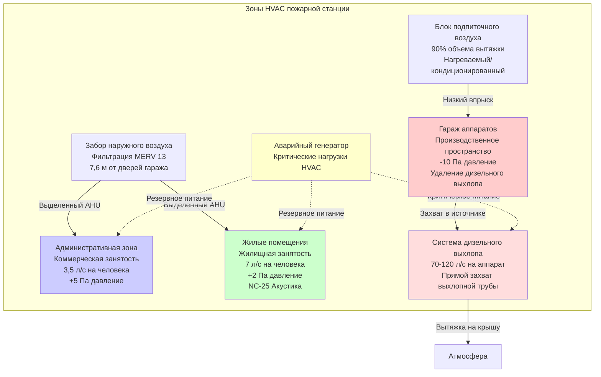

## Требования HVAC для пожарных станций

Пожарные станции требуют сложных систем HVAC, решающих три фундаментальные проблемы: поддержание отдельных климатических зон с различными требованиями, предотвращение загрязнения дизельным выхлопом занятых помещений и обеспечение надежного климат-контроля для персонала, работающего непрерывные 24-часовые смены. Проектирование должно примирить конкурирующие требования больших гаражей аппаратов, требующих быстрого теплового восстановления после открытия дверей, жилых помещений жилищного качества для сменного персонала и административных пространств в соответствии со стандартами коммерческих зданий.

Критическое требование проектирования сосредоточено на изоляции зон. Гаражи аппаратов содержат дизельный выхлоп и испытывают экстремальные нагрузки инфильтрации от частых открытий дверей, требуя отрицательного давления и выделенных систем вытяжки. Жилые помещения требуют жилищного комфорта с индивидуальным контролем зон и акустической изоляцией для спящего персонала. Административные области работают по коммерческому графику, позволяя использовать энергосберегающие стратегии, неуместные для постоянно занятых зон.

Успешное проектирование HVAC пожарной станции интегрирует захват дизельного выхлопа в источнике, контроль давления в зонах, предотвращающий миграцию загрязнений, избыточные системы, обеспечивающие непрерывную работу, и резервное электроснабжение, поддерживающее критические функции во время перебоев в электроснабжении.

## Стратегия разделения зон

### Трехзонный подход проектирования

Пожарные станции требуют полного разделения HVAC между функциональными зонами для предотвращения перекрестного загрязнения и оптимизации работы системы для уникальных требований каждой зоны.

### Контроль давления в зонах

Соотношения давлений между зонами предотвращают миграцию дизельного выхлопа и загрязняющих веществ транспортных средств в занятые помещения. Каскад давления следует этой иерархии:

$$P_{админ} > P_{жилые} > P_{наружн} > P_{гараж}$$

Где перепады давления поддерживают:
- Административная - гараж аппаратов: +10 - +15 Па
- Жилые помещения - гараж аппаратов: +7 - +12 Па
- Жилые помещения - наружный воздух: +2 - +5 Па
- Гараж аппаратов - наружный воздух: -5 - -10 Па

Системы автоматизации зданий непрерывно контролируют дифференциальные давления, используя контрольные точки в каждой зоне. Вентиляторы с переменной скоростью в гараже аппаратов регулируют работу для поддержания отрицательного давления независимо от положения двери или условий ветра.

**Требования разделения воздушных потоков**:
- Отсутствие путей возвратного воздуха из гаража аппаратов в кондиционеры занятых помещений
- Отсутствие переходных решеток или подрезов под дверями между гаражом аппаратов и жилыми/административными зонами
- Выделенные воздухозаборы для каждой зоны разделены минимум на 7,6 м
- Точки выброса вытяжки минимум 3 м от любого воздухозабора

### Критерии проектирования для конкретных зон

| Тип зоны | Наружный воздух | Диапазон температуры | Давление | Фильтрация | Акустический предел | Тип системы |
|-----------|-------------|-------------------|----------|------------|----------------|-------------|
| Гараж аппаратов | 0,15 ACH минимум | 15-21°C отопление | -5 - -10 Па | MERV 11 | NC-40 | Лучистый пол + подпиточный воздух |
| Жилые помещения | 7 л/с на человека | 20-24°C регулируемая | +2 - +5 Па | MERV 13 | NC-25 спальня | Сплит-система или VAV |
| Кухня/столовая | 3,5 л/с на человека | 21-24°C | 0 - +2 Па | MERV 13 | NC-35 | Выделенная вытяжка + приток |
| Административная | 2,4-3,5 л/с на человека | 21-24°C занятая | +5 - +10 Па | MERV 13 | NC-35 | VAV с редукцией |
| Тренировочные зоны | 9 л/с на человека | 18-24°C | 0 - +5 Па | MERV 11 | NC-40 | Высокопроизводительная вентиляция |
| Учебные помещения | 3,5 л/с на человека | 21-24°C | +2 - +5 Па | MERV 13 | NC-35 | VAV с расписанием |

## Интеграция удаления дизельного выхлопа

### Проектирование системы захвата в источнике

Системы прямого подключения для захвата выхлопа устраняют дизельные частицы и воздействие монооксида углерода путем захвата выбросов в выхлопную трубу транспортного средства до их рассеивания в атмосфере гаража. Этот подход значительно более эффективен, чем общая разбавительная вентиляция.

**Компоненты захвата выхлопной трубы**:
- Барабаны с пружинным возвратом, установленные на потолке (3,6-4,9 м) или на уровне пола
- Гибкий выхлопной шланг диаметром 7,6-12,7 см, рассчитанный на температуру до 649°C
- Магнитные быстроразъемные соединения, герметично закрывающие выхлопную трубу транспортного средства
- Механизм автоматического отсоединения, позволяющий быстро отвести аппарат
- Длины шланга 6-9 м, обслуживающие позиции парковки аппаратов

**Расчет производительности системы**:

Общая производительность вытяжки учитывает одновременную работу аппаратов с коэффициентом разнообразия:

$$Q_{выхлоп} = \sum_{i=1}^{n} (CFM_i \times DF_i)$$

Где:
- $CFM_i$ = требование вытяжки на аппарат (70-120 л/с)
- $DF_i$ = коэффициент разнообразия в зависимости от количества аппаратов
- Санитарные/легкие машины: 70 л/с
- Насосные машины/двигатели: 95 л/с
- Лестницы/цистерны: 120 л/с

Для станций с 1-2 аппаратами: DF = 1,0 (100% одновременная работа)
Для станций с 3-4 аппаратами: DF = 0,75
Для станций с 5+ аппаратами: DF = 0,60

**Пример расчета** для 4-гаражной станции (2 насосные машины, 1 лестница, 1 санитарная):

$$Q_{общ} = (2 \times 95 + 1 \times 120 + 1 \times 70) \times 0,75 = 283 \text{ л/с}$$

Добавить коэффициент безопасности 20%: $Q_{проект} = 283 \times 1,2 = 340$ л/с

### Интеграция подпиточного воздуха

Работа системы вытяжки создает отрицательное давление, требующее кондиционированного подпиточного воздуха для поддержания давления в зонах и предотвращения чрезмерной инфильтрации.

**Расчет подпиточного воздуха**:

$$Q_{подпиток} = Q_{выхлоп} \times 0,90$$

Обеспечить 90% замену для поддержания спроектированного отрицательного давления при предотвращении избыточного давления.

**Определение размера блока подпиточного воздуха**:

Тепловая мощность блока подпиточного воздуха:

$$Q_{отопл} = Q_{подпиток} \times 1,08 \times (T_{внутр} - T_{наружн})$$

Например, 340 л/с вытяжки требует 307 л/с подпиточного воздуха при наружной расчетной температуре -12°C и температуре гаража 18°C:

$$Q_{отопл} = 307 \times 1,08 \times (18 - (-12)) = 10 000 \text{ кДж/ч}$$

Выбрать газовый блок подпиточного воздуха минимум 11 000 кДж/ч входной мощностью с модулирующей горелкой.

### Системные блокировки и управление

**Последовательности автоматической активации**:
1. Открытие двери гаража запускает систему вытяжки (задержка 15 секунд)
2. Подтверждение работы вентилятора вытяжки запускает блок подпиточного воздуха
3. Управление температурой блока подпиточного воздуха модулирует отопление
4. Персонал вручную подключает шланги захвата выхлопа к аппарату
5. Закрытие двери гаража инициирует таймер очистки 5 минут
6. Выключение системы после завершения цикла очистки

**Защитные блокировки**:
- Мониторинг CO в гараже аппаратов с сигналом тревоги при 10 ppm (допуск OSHA), уровень действия при 2,6 ppm
- Выключение по высокой температуре на выходе блока подпиточного воздуха (65°C)
- Сигнал отказа вентилятора вытяжки с визуальным/звуковым уведомлением
- Мониторинг дифференциального давления с сигналом тревоги при потере отрицательного давления гаража

## Соображения для зданий, занятых 24/7

### Требования непрерывной работы

Пожарные станции никогда не закрываются, требуя систем HVAC, разработанных для непрерывной работы с стратегиями обслуживания, приспособленными к непрерывной занятости.

**Стратегия избыточности**:
- Двойные источники отопления (комбинация лучистого пола и блочных обогревателей или печей)
- Избыточные вентиляторы вытяжки с автоматическим переключением при обнаружении отказа
- Мощность охлаждения N+1 для критических пространств (коммуникации, IT-оборудование)
- Двухтопливная способность для систем отопления в суровых климатах (газ основной, масло резервное)

**Обслуживание без остановки**:
- Изолирующие клапаны на всем основном оборудовании, позволяющие байпас при обслуживании
- Двойные насосы в гидронных системах (свинец-отстой)
- Несколько кондиционеров, обслуживающих разные зоны (отказ влияет только на одну зону)
- Доступные точки фильтрации и плановых работ без нарушения комфорта жильцов

### Требования комфорта для сменного персонала

Персонал, работающий 24-часовые смены, требует жилищного качества комфорта в жилых помещениях, сравнимого с домашней средой.

**Индивидуальный контроль зон**:
- Отдельные термостаты для каждой спальни (комната с кроватями)
- Диапазон температуры 20-24°C с полномочиями регулировки жильцом
- Сплит-системы без воздуховодов обеспечивают индивидуальный контроль помещения
- Общие зоны (дневная комната, кухня) в объединенной зоне с усредняющим контролем

**Акустическое проектирование**:
- NC-25 максимум в спальнях (сравнимо с жилой спальней)
- Низкоскоростные воздуховоды в спальных помещениях (максимум 3 м/с)
- Звукопоглощающие элементы на приточных и вытяжных воздуховодах рядом со спальнями
- Виброизоляция для всего механического оборудования (пружинные изоляторы минимум 95% эффективность)
- Размещение оборудования на крыше или удаленных механических комнатах

**Качество воздуха**:
- Фильтрация MERV 13 минимум в жилых помещениях (захватывает дизельные частицы)
- Рекуператор энергии, обеспечивающий непрерывный свежий воздух без сквозняков
- Контроль относительной влажности 30-50% в течение года
- Отсутствие рециркуляционного воздуха из гаража аппаратов при любых условиях

## Стратегии энергоэффективности

### Меры по эффективности систем

Непрерывная работа требует оборудования высокой эффективности для контроля эксплуатационных расходов при поддержании комфорта.

**Выбор оборудования**:
- Конденсационные котлы минимум 92% AFUE для гидронных систем отопления
- Высокоэффективные печи минимум 95% AFUE для систем принудительной циркуляции воздуха
- Оборудование охлаждения минимум 16 SEER (воздушное охлаждение) или 1,0 кВт/3,5 кВт охлаждения (водяное охлаждение)
- Двигатели ECM на всех кондиционерах и блоках вентилятора
- Приводы с переменной скоростью на насосах и больших вентиляторах (>3,7 кВт)

**Вентиляция с рекуперацией энергии**:

Расчет эффективности ERV:

$$\eta_{сенсибельн} = \frac{T_{приток} - T_{наружн}}{T_{возврат} - T_{наружн}}$$

Выбрать блоки ERV с минимум 70% сенсибельной эффективностью для жилых помещений и административных зон. Годовая экономия энергии:

$$\text{Экономия} = Q_{вентил} \times 1,08 \times DD \times 24 \times \eta_{сенсибельн} \times \text{Стоимость топлива}$$

Где DD = годовые градусо-дни отопления

### Расписание работы по зонам

Ограниченные возможности редукции из-за непрерывной занятости жилых помещений, но административные и учебные зоны допускают снижение температуры.

**Редукция административной зоны**:
- Занятые часы (07:00-18:00): 22°C отопление, 23°C охлаждение
- Незанятые часы (18:00-07:00): 13°C отопление, 29°C охлаждение
- Выходные редукция: 13°C отопление, 29°C охлаждение

**Расписание учебной комнаты**:
- Запланированные тренировки: 21°C отопление, 24°C охлаждение
- Незапланированные периоды: 15°C отопление, 27°C охлаждение
- Ночная редукция: 13°C отопление, без охлаждения

**Управление гаражом аппаратов**:
- Непрерывное отопление для предотвращения замерзания аппарата (минимум 15-18°C)
- Лучистое отопление пола поддерживает минимальную температуру с низкой стоимостью работы
- Редукция ниже 15°C рискует замерзанием воды в насосах и резервуарах аппарата

### Управление освещением и нагрузками от устройств

**LED-освещение больших пролетов**:
- Гараж аппаратов: 500 люкс на уровне пола, LED-светильники большого пролета
- Датчики присутствия для вспомогательных пространств (ванные, хранилища)
- Автоматическое регулирование по дневному свету в пространствах с окнами (административные, учебные)

**Управление нагрузкой от устройств**:
- Таймеры на водонагревателях, торговых автоматах, несущественном оборудовании
- Сетевые фильтры с контролем присутствия в учебных комнатах и офисах
- Приборы Energy Star на кухне (холодильники, посудомоечные машины)

## Аварийное резервное электроснабжение для HVAC

### Идентификация критических нагрузок

Аварийные генераторы поддерживают безопасность жизни и минимальный комфорт во время перебоев в электроснабжении. Критические нагрузки HVAC получают резервное питание, пока некритические системы отключаются.

**Критические системы HVAC** (аварийный генератор):
- Система удаления дизельного выхлопа (полная мощность)
- Блок подпиточного воздуха гаража аппаратов (только отопление, без охлаждения)
- Отопление жилых помещений (минимум 20°C)
- Вентиляционные вентиляторы жилых помещений (непрерывная работа)
- Вытяжка кухни Type I (если присутствует)
- Управление и система автоматизации зданий
- Насосы топливного масла для оборудования отопления

**Некритические системы HVAC** (отключение во время аварии):
- Охлаждение административной зоны
- HVAC учебной комнаты
- Рекуператоры энергии
- Охлаждение гаража аппаратов
- Насосы лучистого отопления пола (тепловая масса обеспечивает переход)

### Расчет мощности генератора

Определение размера аварийного генератора включает электрические нагрузки HVAC плюс системы безопасности жизни.

**Расчет нагрузки HVAC**:

$$\text{Генератор}_{\text{HVAC}} = \sum \text{FLA двигателя} \times 1,25 + \sum \text{кВ нагревателя} \times 1,0$$

**Пример** для 4-гаражной станции:
- Двигатель вентилятора вытяжки: 3,7 кВт × 1,25 = 4,6 кВт
- Вентилятор блока подпиточного воздуха: 2,2 кВт × 1,25 = 2,75 кВт
- Горелка блока подпиточного воздуха: 16 кВт газ (минимальная электрическая)
- Кондиционер жилых помещений: 1,5 кВт × 1,25 = 1,9 кВт
- Печь жилых помещений: 29 кВт вход (0,6 кВт вентилятор)
- Управление и автоматизация: 1,5 кВт
- **Общая нагрузка HVAC**: 9 кВт

Добавить некритические нагрузки (освещение, коммуникации, двери гаража аппаратов, раздача топлива) обычно 19-30 кВт. Общая мощность генератора 37-56 кВт типично для 4-гаражных станций.

### Автоматическое переключение и снижение нагрузки

**Последовательность переключения**:
1. Обнаружение отказа питания коммунальным автоматическим выключателем (ATS)
2. Запуск аварийного генератора (задержка 10-15 секунд)
3. Генератор достигает номинальной скорости и напряжения
4. ATS переключает критические нагрузки на генератор
5. Некритические нагрузки остаются без питания
6. Система автоматизации зданий реализует режим чрезвычайной ситуации

**Стратегия снижения нагрузки**:
- Немедленное снижение: Административное охлаждение, учебное HVAC, ERVs
- Отложенное снижение (5 минут): Охлаждение гаража аппаратов если работает
- Приоритет восстановления: Система удаления дизельного выхлопа, отопление/вентиляция жилых помещений
- Ручное восстановление: Административные и учебные зоны после подтверждения работы генератора

### Хранение топлива и время работы

**Расчет топлива генератора**:

Время работы на полном баке топлива:

$$\text{Время работы (часы)} = \frac{\text{Объем бака (л)} \times 0,9}{\text{Расход топлива (л/ч)}}$$

Расход топлива дизельного генератора приблизительно:

$$\text{Топливо (л/ч)} = \frac{\text{Нагрузка (кВ)} \times 0,067}{0,85}$$

Для нагрузки 37 кВт при 75% мощности (27,75 кВ):

$$\text{Топливо} = \frac{27,75 \times 0,067}{0,85} = 2,2 \text{ л/ч}$$

С баком 945 л: Время работы = (945 × 0,9) / 2,2 = 387 часов

Спроектировать хранилище топлива на минимум 48-часовое время работы при 75% мощности генератора. Многие юрисдикции требуют 72-96 часовой емкости для критических объектов.

### Рассмотрение холодного климата

**Возможность холодного пуска генератора**:
- Блоковые нагреватели поддерживающие температуру двигателя 32-49°C
- Нагреватели батарей, предотвращающие отказы при холодном пуске
- Автоматические тесты под нагрузкой (еженедельно, минимум 30 минут)
- Присадки для топлива, предотвращающие гелеобразование (биодизельные смеси особенно восприимчивы)

**Защита от замерзания**:
- Теплоэлектрический кабель на топливопроводах от бака к генератору
- Изолированные топливные баки или размещение в помещении
- Гликоль в гидронных системах отопления (20-30% пропиленгликоль)
- Теплоэлектрический кабель на конденсатопроводах и наружных трубопроводах

## Интеграция проектирования и координация

Успешное проектирование HVAC пожарной станции требует ранней координации с архитектурной, конструктивной и электротехнической дисциплинами.

**Архитектурная координация**:
- Высота потолка гаража аппаратов минимум 4,3 м, приспосабливающая сбор выхлопа
- Механические комнаты оборудования расположены вдали от спальных комнат (акустическая изоляция)
- Размещение воздухозабора на наветренной стороне преобладающего ветра, вдали от дверей гаража
- Скрининг оборудования на крыше, согласованный с операциями поднятия лестницы аппарата

**Конструктивная координация**:
- Веса устройств на крыше и нагрузки сейсмического удержания предоставлены во время разработки проектирования
- Трубопроводы лучистого пола встроены перед заливкой бетонной плиты
- Дополнительная конструктивная поддержка для барабанов выхлопа, установленных на потолке
- Прогиб пружины виброизоляции согласован со структурой

**Электротехническая координация**:
- Профиль электрической нагрузки HVAC для основного обслуживания и определения размера аварийного генератора
- Требования силовой энергии для BAS и блокировок системы выхлопа
- Выделенные схемы для блока подпиточного воздуха и вентиляторов вытяжки
- Распределение резервного питания критическим нагрузкам HVAC

**Соответствие коду**:
- NFPA 1500: Безопасность при занятости пожарного ведомства (пределы воздействия дизельного выхлопа)
- ASHRAE 62.1: Скорости вентиляции для смешанного использования зданий
- ASHRAE 90.1: Энергоэффективность с допусками для занятости 24/7
- IMC: Строительство системы выхлопа, требования подпиточного воздуха, воздух для сгорания

---

Проектирование HVAC пожарной станции уравновешивает конкурирующие требования контроля загрязнения, непрерывного кондиционирования комфорта и надежности в эксплуатации. Разделение зон с контролем давления предотвращает миграцию дизельного выхлопа, системы захвата в источнике минимизируют воздействие, избыточное оборудование обеспечивает непрерывную работу, и резервное питание поддерживает критические функции во время перебоев в электроснабжении. Успешные проектирования интегрируют эти элементы на ранней стадии планирования проектирования с тщательной координацией по всем дисциплинам.
