# Проектирование системы HVAC для аппаратных отсеков пожарной станции

Аппаратные отсеки представляют наиболее сложный элемент проектирования HVAC на пожарных станциях, требующий интеграции удаления дизельного выхлопа, защиты транспортных средств теплом, смягчения частой инфильтрации через двери отсеков и строгого разделения жилых помещений. Проект должен решать проблему воздействия канцерогенной дизельной сажи при сохранении энергоэффективности несмотря на экстремальные нагрузки инфильтрации.

## Требования к температуре и вентиляции

Аппаратные отсеки требуют круглогодичного поддержания температуры от 10°C до 18°C для защиты транспортных средств, оборудования и водных систем пожаротушения от замерзания. NFPA 1500 требует управления вентиляцией для минимизации воздействия на пожарных выхлопных газов транспортных средств.

### Критерии проектирования управления температурой

| Параметр | Зима | Лето | Примечания |
|-----------|------|------|-----------|
| Минимальная температура | 10°C | — | Предотвращает замерзание оборудования |
| Максимальная температура | 18°C | 29°C | Комфорт при обслуживании |
| Уставка отопления | 13°C | — | Энергоэффективный базовый уровень |
| Уставка охлаждения | — | 27°C | Предпочитается естественная вентиляция |
| Относительная влажность | 40-60% | 40-60% | Предотвращает конденсацию |

Расчет нагрузки отопления должен учитывать массивную инфильтрацию из-за работы дверей отсеков:

$$Q_{total} = Q_{transmission} + Q_{infiltration} + Q_{ventilation}$$

Где нагрузка передачи через стены, крышу и пол составляет только 30-40% от общего требования отопления, при этом инфильтрация доминирует в профиле нагрузки.

### Требования к вентиляции

**Фоновая вентиляция:** Минимум 4-6 воздухообменов в час поддерживает приемлемое качество воздуха в периоды без работы аппаратов. Эта базовая вентиляция предотвращает накопление выбросов и влаги.

**Вентиляция при работе аппаратов:** Когда транспортные средства работают без подключения к системе захвата источника, увеличьте вентиляцию до 10-15 воздухообменов в час для разбавления концентрации дизельной сажи (DPM) ниже допустимых пределов воздействия.

Рассчитайте необходимую вентиляцию разбавления:

$$Q_{dilution} = \frac{G \times 403}{PEL - C}$$

Где:
- $Q_{dilution}$ = требуемое воздушное потоком (CFM)
- $G$ = скорость образования загрязняющего вещества (л/мин)
- $403$ = постоянная преобразования
- $PEL$ = допустимый предел воздействия (мг/м³)
- $C$ = концентрация в окружающем воздухе (мг/м³)

Для типичных дизельных двигателей на холостом ходу $G \approx 0,5-1,5$ л/мин в зависимости от объема двигателя.

## Интеграция системы удаления выхлопа

Дизельный выхлоп содержит более 40 канцерогенных соединений. Международное агентство по исследованию рака классифицирует дизельный выхлоп как канцероген группы 1. Эффективное удаление выхлопа критически важно для здоровья пожарных.

### Системы захвата у источника

Прямое подключение к выхлопной трубе обеспечивает эффективность захвата 95-99% при надлежащем развертывании. Захват у источника работает только во время работы транспортного средства, минимизируя потребление энергии и исключая избыточное давление в отсеке.

**Компоненты системы:**
- Телескопические или шарнирные стрелы
- Магнитные или механические адаптеры выхлопной трубы, рассчитанные на 650°C
- Гибкий трубопровод из нержавеющей стали (длина 3,7-6,1 м)
- Выделенные вытяжные вентиляторы (150-400 CFM на одно транспортное средство)
- Автоматические блокировки активации, связанные с зажиганием

**Расчет проектирования:**

Выбор размера вентилятора на основе требований к скорости захвата:

$$CFM_{capture} = V_{capture} \times A_{tailpipe} \times 60$$

Где:
- $V_{capture}$ = 30-46 м/мин на выходе выхлопной трубы
- $A_{tailpipe}$ = площадь выхлопной трубы (м²)
- $60$ = коэффициент преобразования (м/мин в м/сек)

Добавьте потери на трение воздуховода и сопротивление фитингов:

$$SP_{total} = SP_{duct} + SP_{fittings} + SP_{discharge}$$

Типичное полное статическое давление: 12-36 Па

### Общее резервное удаление выхлопа

Впускные отверстия выхлопа на уровне пола (в пределах 30 см от пола) захватывают охлажденный дизельный выхлоп, который расслаивается ниже окружающего воздуха. Общее удаление выхлопа обеспечивает резервное копирование во время предварительного разогрева и устраняет выбросы.

Система поддерживает небольшое отрицательное давление (12-24 Па) относительно жилых помещений для предотвращения миграции загрязняющих веществ.

```mermaid
graph TD
    A[Система HVAC аппаратного отсека] --> B[Выхлоп с захватом у источника]
    A --> C[Общее удаление выхлопа]
    A --> D[Лучистое отопление]
    A --> E[Подпиточный воздух]
    A --> F[Контроль инфильтрации через двери отсеков]

    B --> B1[Стрелы на каждой позиции]
    B --> B2[Выделенные вентиляторы 150-400 CFM]
    B --> B3[Блокировка зажигания]

    C --> C1[Впускные отверстия на уровне пола]
    C --> C2[4-6 воздухообменов в час фоновый]
    C --> C3[Управление отрицательным давлением]

    D --> D1[Газовые лучистые трубы]
    D --> D2[Высота монтажа 3,7-4,9 м]
    D --> D3[126-189 кДж/ч/м²]

    E --> E1[Темперированный наружный воздух]
    E --> E2[Подпитка для выхлопа]
    E --> E3[Предотвращает избыточное вакуумирование]

    F --> F1[Двери высокой скорости]
    F --> F2[Периметральные уплотнения]
    F --> F3[Воздушные завесы у входа]

    style A fill:#f9f,stroke:#333,stroke-width:4px
    style B fill:#bbf,stroke:#333,stroke-width:2px
    style C fill:#bbf,stroke:#333,stroke-width:2px
    style D fill:#fbb,stroke:#333,stroke-width:2px
    style E fill:#bfb,stroke:#333,stroke-width:2px
    style F fill:#ffb,stroke:#333,stroke-width:2px
```

## Отопление для защиты транспортных средств и оборудования

Лучистое отопление обеспечивает превосходную производительность в аппаратных отсеках по сравнению с системами принудительной подачи воздуха. Лучистая энергия нагревает поверхности (пол, транспортные средства, оборудование), а не объем воздуха, обеспечивая энергосбережение 30-40% в условиях высокой инфильтрации.

### Системы лучистого отопления трубами

Газовые или электрические лучистые трубы, установленные на высоте 3,7-4,9 м над полом, доставляют инфракрасную энергию непосредственно на поверхности и к людям.

**Параметры проектирования:**

$$q_{radiant} = \frac{кДж_{input} \times \eta_{radiant}}{A_{floor}}$$

Где:
- $q_{radiant}$ = тепловой поток излучения (кДж/ч/м²)
- $кДж_{input}$ = вход горелки (кДж/ч)
- $\eta_{radiant}$ = эффективность излучения (0,50-0,65 типичная)
- $A_{floor}$ = площадь пола (м²)

Целевое значение: 126-189 кДж/ч/м² в зависимости от климатической зоны и оболочки здания.

**Преимущества производительности:**

| Фактор | Лучистое | Принудительная подача воздуха |
|--------|---------|----------------------------|
| Энергоэффективность | Энергосбережение 30-40% | Базовое значение |
| Восстановление при открытии двери | Быстрое (минимальное воздействие) | Медленное (потеря нагретого воздуха) |
| Тепловой комфорт | Превосходный (прямой нагрев) | Плохой (расслоение) |
| Высота потолка | Эффективна до 9,1 м | Расслаивается выше 4,9 м |
| Доступ для обслуживания | Минимальное вмешательство | Препятствия воздуховодов |

**Стратегия управления:**

Управление с наружным сбросом модулирует выход лучистого отопления в зависимости от наружной температуры:

$$T_{supply} = T_{design} - \frac{(T_{outdoor} - T_{design,outdoor}) \times Reset_{ratio}}{100}$$

Типичное отношение сброса: 1,0-1,5 (изменение °C подачи на изменение °C наружной температуры)

Снижение на 7°C в периоды длительного отсутствия (>8 часов) снижает потребление энергии на 20-30%.

### Дополнительное отопление

Периферийные обогреватели (14,6-29,3 ГДж/ч) обеспечивают дополнительное отопление в условиях экстремального холода или продолжительного обслуживания аппаратов. Расположите обогреватели таким образом, чтобы избежать прямого воздействия на персонал или оборудование.

Вентиляторы устранения расслоения (0,37-0,75 кВт на каждые 930 м²) могут дополнять системы лучистого отопления путем циркуляции теплого расслоённого воздуха, но обеспечивают минимальную пользу при надлежащно спроектированных системах лучистого отопления.

## Воздушная инфильтрация через двери отсеков

Двери отсеков представляют 60-70% от общей нагрузки отопления из-за частой работы и большой площади открывания. Каждый цикл двери обменивает 1,5-2 полных объема отсека.

### Расчет нагрузки инфильтрации

$$Q_{infiltration} = 1,08 \times CFM_{inf} \times \Delta T$$

Где:
- $Q_{infiltration}$ = чувствительная нагрузка отопления (кДж/ч)
- $1,08$ = постоянная для стандартного воздуха
- $CFM_{inf}$ = скорость воздушного потока инфильтрации (CFM, м³/ч)
- $\Delta T$ = разница между внутренней и наружной температурой (°C)

Для отсека 18,3 м × 24,4 м × 4,9 м (2175 м³) с 10 циклами двери в день:

$$CFM_{inf} = \frac{V_{bay} \times cycles \times ACH_{per\_cycle}}{60 \text{ мин/ч}}$$

$$CFM_{inf} = \frac{2175 \times 10 \times 1,5 \times 0,5886}{60} = 304,4 \text{ м³/ч}$$

При $\Delta T = 28°C$ (расчет зимой):

$$Q_{infiltration} = 1,08 \times 304,4 \times 28 = 9180 \text{ кДж/ч}$$

Эта массивная нагрузка требует стратегий снижения инфильтрации.

### Стратегии контроля инфильтрации

**Двери высокой скорости:** Скорость открывания 0,9-1,2 м/сек снижает инфильтрацию на 40-60% по сравнению с обычными секционными дверями (0,15-0,3 м/сек). Более быстрая работа минимизирует время открывания и воздухообмен.

**Периметральные уплотнения:** Прокладки из EPDM и нижние уплотнения снижают инфильтрацию в закрытые периоды на 30-40%. Поддерживайте сжатие прокладок и ежегодно заменяйте поврежденные участки.

**Воздушные завесы у входа:** Скорость выброса 610-914 м/мин создает воздушный барьер при открывании дверей. Эффективность снижается с большими размерами открывания (>4,3 м в ширину). Требует подпиточного воздуха, равного расходу воздушной завесы.

**Промежуточные зоны:** Небольшие двери для персонала (0,9 м × 2,1 м) для доступа без аппаратов снижают необходимость открывания полной двери отсека на 60-80% циклов двери.

## Разделение жилых помещений

NFPA 1500 требует положительного разделения между аппаратными отсеками и жилыми помещениями для предотвращения миграции дизельной сажи и сохранения здоровья жильцов. Отсек должен работать при отрицательном давлении относительно жилых помещений.

### Управление давлением

**Проектный перепад давления:** -10-24 Па (аппаратный отсек относительно жилых помещений)

Добиться путем:
1. Воздушный поток выхлопа превышает поток подачи на 94-235 м³/ч
2. Система автоматизации здания (BAS) контролирует перепад давления
3. Модулирующие заслонки регулируют подачу/выхлоп для поддержания уставки

**Проверка:**

$$\Delta P = P_{living} - P_{bay} > 10 \text{ Па}$$

Установите мониторы перепада давления с локальным сигналом тревоги для условий выхода за пределы диапазона.

### Физическое разделение

**Барьеры:**
- 2-часовые стены, рассчитанные на огнестойкость, отделяют аппаратный отсек от жилых помещений
- Самозакрывающиеся противопожарные двери (минимум 1,5-часовой рейтинг)
- Герметичные проходы для всех воздуховодов, трубопроводов, кабельных каналов

**Входы:** Минимум входная зона 1,8 м × 2,4 м с самозакрывающимися дверями с обеих сторон создает воздушный шлюз. Поддерживайте входную зону при промежуточном давлении между отсеком и жилыми помещениями.

**Изоляция воздуховодов:** Без вытяжного воздуха из аппаратного отсека. Подпиточный воздух из системы HVAC жилых помещений не должен рециркулировать через аппаратный отсек. Независимые системы предотвращают перекрестное загрязнение.

## Контроль влажности и влаги

Аппаратные отсеки испытывают высокие нагрузки влаги от влажных аппаратов, возвращающихся из происшествий, операций промывки и инфильтрации в условиях высокой влажности.

### Источники влаги

| Источник | Нагрузка (кг/день) | Пиковая (кг/ч) |
|---------|----------------|-----------------|
| Влажный аппарат (на одно транспортное средство) | 9-18 | 3,6-5,4 |
| Промывка пола | 23-45 | 18-27 |
| Инфильтрация (влажный климат) | 14-36 | 4,5-9 |
| Персонал (10 человек) | 7-11 | 1,4-2,3 |

**Общая расчетная нагрузка:** 90-135 кг/день типичная для станции с 4 отсеками.

### Стратегии контроля влаги

**Осушение:** Выделенное осушающее оборудование (37-56 л/день пропускная способность) поддерживает 40-60% относительной влажности в течение влажных сезонов. Предотвращение конденсации на холодных поверхностях (транспортные средства, инструменты, трапы пола).

Расчет скрытой нагрузки:

$$Q_{latent} = 0,68 \times CFM \times \Delta W$$

Где:
- $Q_{latent}$ = скрытая нагрузка охлаждения (кДж/ч)
- $0,68$ = постоянная для стандартного воздуха
- $CFM$ = вентиляционное воздушное потокам (CFM, м³/ч)
- $\Delta W$ = разница коэффициента влажности (зёрна/фунт)

**Дренаж пола:** Минимум уклон 1,27 см на метр к напольным трапам. Траншейные трапы у порогов дверей отсеков захватывают воду перед распространением по полу отсека.

**Вентиляция:** Увеличьте вентиляцию наружного воздуха в сухие периоды для удаления влаги. Эффективна, когда точка росы наружного воздуха на 5,6°C ниже внутренней точки росы.

**Управление температурой поверхности:** Поддерживайте минимальные температуры поверхности выше точки росы для предотвращения конденсации. Лучистое отопление повышает температуру пола на 5,6-8,3°C выше температуры воздуха, значительно снижая риск конденсации.

## Сводка критериев проектирования

| Параметр | Спецификация | Код/Стандарт |
|-----------|-----------|----------|
| Уставка отопления | 10-18°C | NFPA 1500 |
| Фоновая вентиляция | 4-6 воздухообменов в час | ASHRAE 62.1 |
| Вентиляция при работе аппаратов | 10-15 воздухообменов в час | NFPA 1500 |
| Скорость захвата выхлопа | 30-46 м/мин | ACGIH |
| Входное лучистое отопление | 126-189 кДж/ч/м² | Зависит от климата |
| Давление отсека vs жилых помещений | -10-24 Па | NFPA 1500 |
| Относительная влажность | 40-60% | Защита оборудования |
| Темперирование подпиточного воздуха | Минимум 13°C | Тепловой комфорт |
| Уклон напольного дренажа | 1,27 см минимум на метр | IPC |
| Разделение пожаром | 2-часовой рейтинг | IBC/NFPA 101 |

## Интеграция и управление системой

Координируйте все системы HVAC аппаратного отсека через центральную BAS для предотвращения оперативных конфликтов и оптимизации энергетической производительности.

**Последовательности управления:**

1. **Режим отправления аппарата:** При срабатывании сигнала тревоги отправления аппарата приостановите все системы удаления выхлопа и поддерживайте минимальное отопление. Предотвращает чрезмерное вакуумирование здания.

2. **Работа захвата у источника:** Блокировка зажигания активирует выделенный вентилятор выхлопа при запуске транспортного средства. Модулируйте подпиточный воздух для предотвращения чрезмерного отрицательного давления (>-48 Па).

3. **Работа общего удаления выхлопа:** Ручная или активация датчиком CO (>35 ppm) запускает общее удаление выхлопа до 10-15 воздухообменов в час. Активируйте блок обработки подпиточного воздуха для темперирования замещаемого воздуха до минимума 13°C.

4. **Режим без присутствия:** Снижение отопления на 7°C, системы выхлопа отключены, вентиляция снижена до 2 воздухообменов в час для контроля влажности.

5. **Работа двери:** Активация двери высокой скорости запускает логирование данных для анализа энергии. Без изменений системы HVAC во время кратких циклов двери.

**Энергосбережение:**

- Экономайзер наружного воздуха при мягкой погоде (10-21°C) обеспечивает бесплатное охлаждение
- Снижение уставки лучистого отопления в периоды без присутствия (обычно 00:00-06:00)
- Работа системы удаления выхлопа ограничена фактическим временем работы транспортного средства
- Тренд BAS выявляет чрезмерную работу дверей для оперативных улучшений

## Заключение

Проектирование HVAC аппаратного отсека требует интеграции удаления дизельного выхлопа, энергоэффективного лучистого отопления, смягчения инфильтрации и строгого разделения жилых помещений. Системы захвата выхлопа у источника обеспечивают превосходную защиту от воздействия канцерогенов при минимизации потребления энергии по сравнению с вентиляцией общего разбавления. Лучистое отопление обеспечивает энергосбережение 30-40% в условиях высокой инфильтрации при сохранении диапазона 10-18°C, необходимого для защиты транспортных средств и оборудования. Надлежащее управление давлением и физическое разделение предотвращают миграцию дизельной сажи в жилые помещения, защищая здоровье пожарных в соответствии с требованиями NFPA 1500. Проект должен учитывать инфильтрацию через двери отсеков, представляющую 60-70% от нагрузки отопления, за счет дверей высокой скорости, эффективных уплотнений и стратегического использования дверей для персонала.
