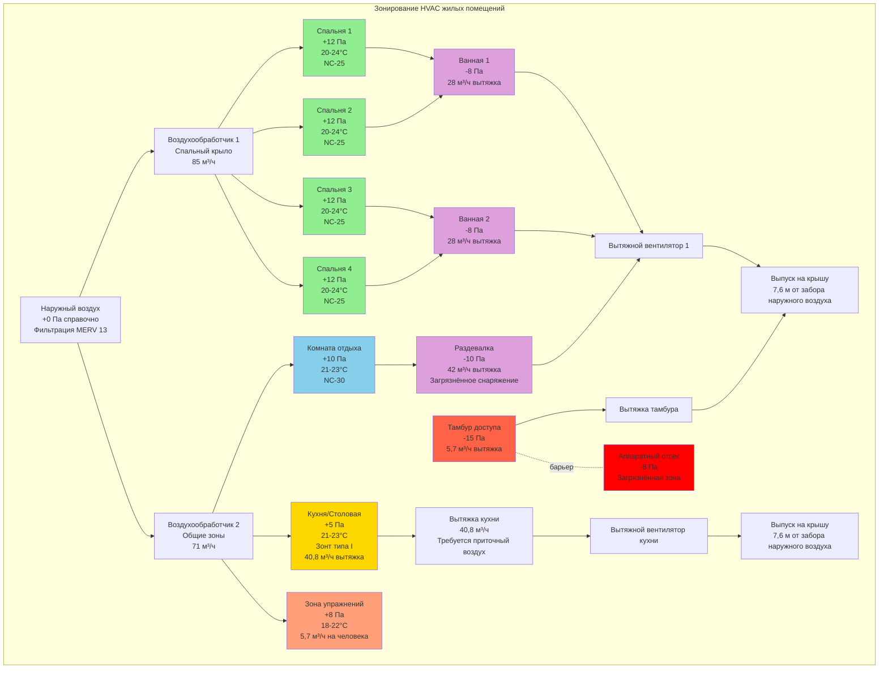

Жилые помещения пожарной станции требуют специализированного проектирования HVAC, учитывающего непрерывную 24-часовую занятость, непредсказуемые графики смен, критическую изоляцию от загрязнения аппаратных отсеков и разнообразное одновременное использование пространства от сна до интенсивной физической активности. В отличие от обычных жилых или коммерческих объектов, эти пространства должны поддерживать исключительное качество воздуха в помещениях, предотвращая попадание дизельного выхлопа, продуктов сгорания и канцерогенных загрязнителей в зоны, где персонал отдыхает и восстанавливается между чрезвычайными вызовами.

## Рассмотрение 24-часовой занятости

Непрерывная занятость принципиально изменяет параметры проектирования систем HVAC. Пожарные станции работают круглосуточно с персоналом, работающим продолжительные смены (как правило, 24 или 48 часов), создавая уникальные требования к тепловому комфорту, вентиляции и надёжности, которые обычные коммерческие проекты не могут решить.

**Требования непрерывной работы:**

Системы HVAC пожарной станции должны обеспечивать непрерывное обслуживание без запланированного технического обслуживания во время занятости — что означает отсутствие запланированного времени простоя. Отказы оборудования недопустимы в экстремальных погодных условиях, когда комфорт персонала непосредственно влияет на готовность к чрезвычайным ситуациям.

Избыточность системы становится обязательной, а не дополнительной. Подходы к проектированию включают:

- Конфигурация оборудования N+1 для всех критических систем (котлы, холодильные машины, воздухообрабатывающие агрегаты)
- Двухкомпрессорное упакованное оборудование, обеспечивающее 50% мощности при отказе одного компрессора
- Несколько меньших воздухообрабатывающих агрегатов, обслуживающих жилые помещения, а не один большой агрегат
- Трубопровод перепуска и задвижки изоляции, позволяющие обслуживать оборудование без остановки системы
- Мощность аварийного генератора, рассчитанная на поддержание минимального отопления (13°C) и вентиляции во время перебоев в подаче электроэнергии

**Непредсказуемые режимы нагрузки:**

В отличие от офисных зданий с предсказуемыми графиками занятости, пожарные станции испытывают случайные колебания нагрузки, вызванные режимами чрезвычайных вызовов. Системы HVAC должны реагировать на:

- Внезапные изменения занятости при отправке экипажей на продолжительные чрезвычайные происшествия
- Немедленные полнозагруженные условия при возвращении экипажа, требующие быстрого восстановления комфорта
- Одновременную разнообразную деятельность: спящий персонал, тренировка в условиях активной физической нагрузки, приготовление пищи
- Требования сна в дневное время для ночного персонала со смены, требующие акустического и теплового контроля в условиях высокой наружной температуры

Проектирование для наихудшего случая одновременной занятости, а не применение коэффициентов разнообразия. Размер систем исходя из предположения, что все спальные комнаты, зоны физической подготовки, кухня и комнаты отдыха работают одновременно при максимальной нагрузке.

**Отсутствие режима снижения:**

Обычные стратегии управления зданием, использующие ночное снижение или выходное снижение, неприменимы к жилым помещениям. Температура должна оставаться в диапазоне комфорта непрерывно:

$$T_{space} = 20\text{°C to }24\text{°C (continuous)}$$

Управление отдельными зонами позволяет оккупантам регулировать в этом диапазоне в зависимости от личных предпочтений и уровня активности, но системы не могут снижать мощность или вентиляцию наружного воздуха на основе графиков времени суток.

## Требования к комфорту спальных зон

Спальные комнаты представляют наиболее критические зоны теплового комфорта на пожарных станциях. Персонал должен получить качественный отдых в непредсказуемые часы — включая дневной сон для ночных смен — при одновременном поддержании немедленной готовности к чрезвычайному реагированию.

**Управление отдельными зонами:**

Каждая спальня требует выделенного температурного контроля, независимого от соседних пространств. Общие термостаты создают конфликты между персоналом с различными предпочтениями в отношении комфорта или работой в противоположные смены.

Рекомендуемые подходы к контролю:

- Отдельные вентиляторно-конвекторные агрегаты с локальными термостатами в каждой спальне
- Терминальные блоки VAV с электрическим или водяным перегревом, обеспечивающие контроль на уровне комнаты
- Бесконтактные мини-сплит-системы тепловых насосов, обеспечивающие отдельный контроль с минимальными воздуховодами
- Прямое цифровое управление (DDC), позволяющее дистанционную регулировку через контроллеры, установленные в комнате

Диапазон контроля температуры должен соответствовать личным предпочтениям:

$$T_{sleep} = 20\text{°C to }24\text{°C}$$

с регулируемыми оккупантом установками в этом диапазоне. Некоторый персонал предпочитает более прохладные условия сна (20-21°C), тогда как другие требуют более теплых условий (23-24°C).

**Акустические критерии:**

Уровни звука в спальных помещениях должны поддерживать дневной сон во время активных станционных операций. Проектирование для максимальных уровней фонового шума:

$$\text{NC} \leq 25\text{ (целевой NC-20)}$$

Достижение этих акустических критериев требует:

- Воздуховодов низкой скорости с максимальной скоростью терминала 2 м/с на диффузорах
- Глушители приточного и обратного воздуха в пределах 4,5 м от спальных комнат
- Виброизоляция для всех воздухообрабатывающих агрегатов, обслуживающих спальные зоны
- Акустически рассчитанные амортизаторы на терминалах зон для предотвращения передачи звука через воздуховоды
- Отдельные пути обратного воздуха вместо общих обратных плен, соединяющих несколько спальных комнат

**Скорости вентиляции:**

ASHRAE 62.1 классифицирует спальные зоны как жилую занятость, требующую:

$$Q_{vent} = 1,4\text{ м}^3\text{/ч на человека} + 0,6\text{ м}^3\text{/ч на м}^2$$

Для типичной спальни площадью 11 м² с одним человеком:

$$Q_{vent} = 1,4(1) + 0,6(11) = 1,4 + 6,6 = 8,0\text{ м}^3\text{/ч минимум}$$

Обеспечение непрерывной вентиляции — не используйте управляемую вентиляцию по требованию (DCV) в спальных помещениях. Персонал должен получать адекватный наружный воздух во время сна независимо от метаболических скоростей производства CO₂.

**Характеристики тепловой нагрузки:**

Нагрузки спальных зон отличаются от типичных жилых спален из-за теплоотдачи оборудования и воздействия на конверт. Расчёт нагрузок охлаждения:

$$Q_{cool} = Q_{envelope} + Q_{occupant} + Q_{equipment} + Q_{ventilation}$$

Где:
- $Q_{envelope}$: Передача и солнечные прибыли через стены, крышу, окна
- $Q_{occupant}$: 73 кДж/ч явного тепла на спящего человека
- $Q_{equipment}$: 59-117 кДж/ч для личной электроники, рабочего освещения
- $Q_{ventilation}$: Явная нагрузка от вентиляции наружного воздуха

Тепловые нагрузки следуют стандартным жилым расчётам с непрерывной занятостью, предотвращающей восстановление нагрузок при ночном снижении.

## Вентиляция кухни и столовой

Кухни пожарных станций работают непрерывно с частыми высокими нагрузками от готовки. Требования коммерческой вытяжки кухни должны координироваться с HVAC жилых помещений для поддержания надлежащего давления в здании и изоляции загрязнения от аппаратных отсеков.

**Требования вытяжного зонта:**

Установка вытяжных зонтов типа I над всеми приборами для готовки, выделяющими парообразные жиры (плиты, жарочные панели, фритюрницы, гриль). Размер вытяжки зонта на основе типа прибора и классификации нагрузки согласно NFPA 96:

| Тип прибора | Лёгкая нагрузка | Средняя нагрузка | Тяжёлая нагрузка |
|-------------|-----------------|------------------|------------------|
| Газовые плиты/духовки | 11 м³/ч на м | 17 м³/ч на м | 23 м³/ч на м |
| Электрические плиты | 8 м³/ч на м | 14 м³/ч на м | 20 м³/ч на м |
| Приборы на твёрдом топливе | — | — | 34 м³/ч на м |

Для типичной пожарной станции с зонтом 2,4 м над газовой плитой и жарочной панелью (средняя нагрузка):

$$Q_{exhaust} = 2,4\text{ м} \times 17\text{ м}^3\text{/ч на м} = 40,8\text{ м}^3\text{/ч}$$

**Интеграция приточного воздуха:**

Вытяжка кухни создаёт отрицательное давление, которое должно быть скомпенсировано выделенным приточным воздухом для предотвращения:

- Втягивания загрязнённого воздуха из аппаратных отсеков через зазоры в конверте здания
- Чрезмерного отрицательного давления, препятствующего удалению дымохода горючих приборов
- Неудобных сквозняков рядом с входами в здание
- Компрометирования положительного давления жилых помещений относительно аппаратных отсеков

Обеспечение приточного воздуха, равного 80-100% объёма вытяжки кухни. Направление приточного воздуха в кухонную зону, а не в соседние пространства:

$$Q_{makeup} = 0,90 \times Q_{exhaust} = 0,90 \times 40,8 = 36,7\text{ м}^3\text{/ч}$$

Темперирование приточного воздуха для предотвращения дискомфорта оккупантов:

$$T_{makeup} = T_{space} - 5,6\text{°C (максимальный дифференциал выпуска)}$$

В условиях зимнего проектирования это требует значительной теплопроизводительности. Для приточного воздуха 36,7 м³/ч из наружной температуры −18°C до температуры выпуска 17°C:

$$Q_{heat} = 0,34 \times \text{м}^3\text{/ч} \times \Delta T = 0,34 \times 36,7 \times (17-(-18)) = 412\text{ кДж/ч}$$

**Требования к столовой:**

Столовые зоны следуют коммерческим ставкам вентиляции по ASHRAE 62.1:

$$Q_{vent} = 2,1\text{ м}^3\text{/ч на человека} + 0,6\text{ м}^3\text{/ч на м}^2$$

Для столовой площадью 37 м² с экипажем из 12 человек:

$$Q_{vent} = 2,1(12) + 0,6(37) = 25,2 + 22,2 = 47,4\text{ м}^3\text{/ч}$$

Проектирование столовой как отдельной зоны HVAC от спальных помещений для размещения:
- Более высоких нагрузок охлаждения от одновременной занятости и метаболического теплоотделения
- Нейтрального давления относительно коридоров (в сравнении с положительным давлением в спальных зонах)
- Расширенных рабочих часов во время приготовления пищи и обеда

## Кондиционирование комнат отдыха и рекреации

Комнаты отдыха и зоны физической подготовки испытывают самый широкий диапазон плотности занятости и уровней активности на пожарных станциях, требуя систем HVAC, которые быстро реагируют на изменяющиеся нагрузки, сохраняя приемлемое качество воздуха в помещениях во время интенсивных физических упражнений.

**Критерии проектирования зоны физической подготовки:**

Помещения для упражнений генерируют значительные явные и скрытые нагрузки, требующие повышенной производительности охлаждения и осушения. Параметры проектирования:

**Вентиляция:** ASHRAE 62.1 классифицирует зоны упражнений как "Помещения для упражнений", требующие:

$$Q_{vent} = 5,7\text{ м}^3\text{/ч на человека}$$

Для зоны физической подготовки на 6 человек:

$$Q_{vent} = 5,7 \times 6 = 34,2\text{ м}^3\text{/ч}$$

**Нагрузки охлаждения:** Персонал во время интенсивных упражнений генерирует:
- Явное теплоотделение: 176-234 кДж/ч на человека
- Скрытое теплоотделение: 59-88 кДж/ч на человека

Полная нагрузка охлаждения для 6 человек:

$$Q_{cool} = 6[(205 + 73,5) + Q_{envelope} + Q_{equipment}] = 1,67\text{ МДж/ч} + \text{нагрузки конверта и оборудования}$$

**Управление температурой:** Поддержание более низких установок во время упражнений:

$$T_{fitness} = 18\text{°C to }22\text{°C}$$

Более низкие температуры компенсируют повышенные метаболические скорости во время физической активности.

**Управление влажностью:** Целевая относительная влажность:

$$\text{RH} = 50\text$$

Выделенные системы наружного воздуха (DOAS) с независимым осушением эффективно контролируют влажность без переохлаждения в умеренную погоду.

**Требования комнаты отдыха:**

Комнаты отдыха (салоны, комнаты с телевизором, зоны отдыха) следуют классификации жилой занятости:

$$Q_{vent} = 1,4\text{ м}^3\text{/ч на человека} + 0,6\text{ м}^3\text{/ч на м}^2$$

Обеспечение отдельного управления зоной от спальных помещений для размещения:
- Переменные уровни занятости и типы деятельности
- Теплоотдача А/В оборудования (146-585 кДж/ч в зависимости от установки)
- Гибкие предпочтения температуры во время социальной деятельности в сравнении с индивидуальным расслаблением

## Вытяжка ванной комнаты и вентиляция

Системы вытяжки ванной комнаты и раздевалки служат двум целям: контролю влажности и удалению загрязнения. Помещения раздевалки пожарной станции требуют повышенной вытяжки для удаления загрязнителей из защитного снаряжения и оборудования, хранящихся между чрезвычайными вызовами.

**Скорости вытяжки:**

Проектирование вытяжки ванной комнаты согласно ASHRAE 62.1 Таблица 6-4:

| Тип приспособления | Скорость вытяжки |
|-------------------|------------------|
| Унитаз (приватный) | 7 м³/ч на приспособление (прерывистая) или 14 м³/ч непрерывно |
| Душ | 14 м³/ч на душевую головку |
| Ванна | 14 м³/ч на ванну |
| Писсуар | 10 м³/ч на приспособление |

Для типичной 3-приспособной ванной комнаты (унитаз, душ, раковина):

$$Q_{exhaust} = 14 + 14 + 0 = 28\text{ м}^3\text{/ч}$$

Раковины для мытья рук не требуют выделенной вытяжки; общей вентиляции помещения достаточно.

**Контроль загрязнения в раздевалке:**

Раздевалки, хранящие защитное снаряжение, требуют непрерывной вытяжки для удаления:
- Остаточных продуктов сгорания, абсорбированных в снаряжение при тушении пожара
- Выделения газов из материалов защитного оборудования
- Влажности от мокрого снаряжения после операций

Обеспечение минимум 0,5 воздухообмена в час (ACH) непрерывно с возможностью 2,0 ACH в периоды высокого загрязнения:

$$Q_{exhaust} = \frac{\text{Объём} \times \text{ACH}}{60} = \frac{(12,2 \times 9,1 \times 3,05) \times 0,5}{60} = 2,8\text{ м}^3\text{/ч непрерывно}$$

**Управление давлением:**

Поддержание ванных комнат и раздевалок при отрицательном давлении относительно всех соседних пространств:

$$\Delta P = -5\text{ Па to }-10\text{ Па}$$

Это предотвращает миграцию влажности и загрязнителей в спальные помещения и комнаты отдыха. Обеспечение решёток для передачи воздуха или отверстий под дверями для обеспечения потока воздуха из соседних пространств к точкам вытяжки ванной комнаты.

## Изоляция от загрязнения аппаратного отсека

Основная проблема здоровья и безопасности при проектировании HVAC пожарной станции — предотвращение попадания дизельного выхлопа, продуктов сгорания и канцерогенных загрязнителей из аппаратных отсеков в жилые помещения, где персонал проводит большую часть своего времени.

**Требования к дифференциалу давления:**

Поддержание жилых помещений при положительном давлении относительно аппаратных отсеков и загрязнённых зон. Минимальный дифференциал давления:

$$\Delta P_{living-apparatus} = +10\text{ Па to }+15\text{ Па}$$

Это обеспечивает, что направление потока воздуха всегда направлено из чистых пространств в загрязнённые области. В сочетании с отрицательным давлением аппаратного отсека -5 Па до -10 Па относительно наружного воздуха, общий градиент давления становится:

$$\Delta P_{total} = 15\text{ Па (жилые)} - (-10\text{ Па (отсек)}) = 25\text{ Па}$$

**Стратегии физического разделения:**

- Установка тамбуров при всех переходах между аппаратными отсеками и жилыми зонами
- Обеспечение вытяжки тамбура, поддерживающей -10 Па до -20 Па относительно обеих соседних зон
- Уплотнение всех воздуховодных проходок через противопожарные разделения с использованием сертифицированного UL противопожарного герметика для воздуховодов
- Исключение решёток передачи воздуха или путей обратного воздуха между аппаратными отсеками и жилыми помещениями
- Использование отдельных воздухообрабатывающих систем — никогда не делитесь оборудованием между загрязнённой и чистой зонами

**Расположение забора наружного воздуха:**

Позиционирование забора наружного воздуха, обслуживающего жилые помещения, для предотвращения загрязнения:

- Минимум 7,6 м горизонтального разделения от дверей аппаратного отсека
- Расположение на преобладающей стороне ветра здания относительно дверей отсека
- Минимум 3 м над уровнем земли для избежания шлейфов выхлопа на уровне земли
- Установка мониторинга CO в потоке наружного воздуха с сигналом тревоги при 8 ppm согласно ASHRAE 62.1

**Непрерывное мониторинг давления:**

Установка датчиков дифференциального давления на критических границах:

- Коридор жилого помещения к тамбуру доступа аппаратного отсека
- Каждый спальный крыло коридора к аппаратному отсеку
- Механическое помещение (если прилегает к аппаратному отсеку) к пространству отсека

Конфигурация системы автоматизации зданий (BAS) для подачи сигнала тревоги при падении дифференциалов давления ниже минимальных пороговых значений, указывающих на потенциальные пути загрязнения.

## Диаграмма зонирования HVAC жилых помещений

## Критерии комфорта по типам жилых пространств

| Тип пространства | Диапазон температуры | Относительная влажность | Скорость вентиляции (ASHRAE 62.1) | Отношение давления | Максимальный уровень звука | Воздухообмены в час |
|------------------|----------------------|-------------------------|-----------------------------------|--------------------|----------------------------|---------------------|
| Спальные помещения | 20-24°C (индивидуальное управление) | 30-60% | 1,4 м³/ч на человека + 0,6 м³/ч на м² | +12 Па к коридору | NC-25 (целевой NC-20) | 4-6 ACH |
| Кухня/столовая | 21-23°C | 30-60% | 2,1 м³/ч на человека + 0,6 м³/ч на м² | Нейтральное к коридору | NC-35 | 15-20 ACH при работе зонта |
| Комната отдыха/салон | 21-23°C | 30-60% | 1,4 м³/ч на человека + 0,6 м³/ч на м² | +10 Па к коридору | NC-30 | 4-6 ACH |
| Зона упражнений | 18-22°C | 50-60% | 5,7 м³/ч на человека | +8 Па к коридору | NC-35 | 8-12 ACH |
| Ванные/душевые | 21-23°C | 50-70% | 14-20 м³/ч на приспособление | -8 Па ко всем пространствам | NC-35 | 8-10 ACH |
| Раздевалки (загрязнённые) | 20-23°C | 40-60% | 0,5 ACH непрерывно, 2,0 ACH усиление | -10 Па ко всем пространствам | NC-35 | 0,5-2,0 ACH |
| Тамбуры доступа | 16-21°C (сезонно) | 30-60% | 100% вытяжка (без подачи) | -15 Па к обеим смежным зонам | NC-40 | 15-25 ACH |
| Коридоры/проходы | 20-23°C | 30-60% | Передача воздуха из смежных пространств | +10 Па к аппаратному отсеку | NC-35 | 4-6 ACH |

**Примечания к критериям таблицы:**

**Диапазоны температуры:** Отражают уровни активности и режимы занятости. Спальные зоны обеспечивают самый широкий диапазон для регулировки личных предпочтений. Зоны упражнений поддерживают более прохладные температуры для компенсации метаболического теплоотделения во время физических упражнений.

**Отношения давления:** Все положительные значения давления относительны к пространствам коридоров. Пространства коридоров поддерживают +10 Па относительно аппаратных отсеков. Отрицательные пространства давления (ванные комнаты, раздевалки, тамбуры) выделяют в наружный воздух, предотвращая распространение загрязнения.

**Уровни звука:** Спальные помещения требуют наименьших акустических критериев для поддержки дневного сна во время активных станционных операций. Общие зоны переносят более высокий фоновый звук, соответствующий социальной и физической деятельности.

**Скорости вентиляции:** Прямое применение минимальных требований ASHRAE 62.1. Объекты непрерывной занятости не используют управляемую вентиляцию по требованию в спальных или общих зонах. Скорости кухни исключают вытяжку зонта типа I, которая рассчитывается отдельно согласно NFPA 96.

## Выбор системы и рекомендации по проектированию

**Предпочтительные конфигурации систем для жилых помещений:**

- **Отдельные воздухообрабатывающие системы:** Выделение независимых воздухообработчиков для жилых помещений без подключения к аппаратному отсеку или административным системам HVAC
- **Несколько меньших установок:** Четыре воздухообработчика по 42,5 м³/ч обеспечивают лучшую избыточность, чем один воздухообработчик на 170 м³/ч
- **Управление отдельными зонами:** VAV с перегревом, вентиляторно-конвекторные агрегаты или бесконтактные мини-сплит-системы для спальных помещений
- **Выделенные системы наружного воздуха (DOAS):** Развязка вентиляции от тепловых нагрузок, позволяющая независимое управление влажностью
- **Энергетический рекуперационный контур:** Обеспечивает энергосбережение, сохраняя полное разделение между потоками выхлопа и наружного воздуха (предпочтительнее относительно ротационного колеса или пластинчатых теплообменников для изоляции загрязнения)

**Мощность оборудования и избыточность:**

Размер оборудования отопления и охлаждения для непрерывной работы без резервной копии только при наличии избыточности N+1 на уровне центральной установки или если несколько упакованных установок обслуживают объект. Один воздухообработчик, обслуживающий все жилые помещения, требует двух компрессоров, обеспечивающих минимум 50% производительность охлаждения при отказе одного компрессора.

Мощность аварийного генератора должна включать нагрузки HVAC, достаточные для поддержания минимальной пригодности для проживания: отопление до 13°C, непрерывная вентиляция и вытяжка ванной комнаты во время продолжительных перебоев в подаче электроэнергии.

Жилые помещения пожарной станции представляют одно из самых требовательных приложений HVAC, требующее интеграции стандартов жилого комфорта, надёжности коммерческой системы и стратегий промышленного контроля загрязнения в объекты, работающие 24 часа в сутки, 365 дней в году.

---

**Связанные темы:**
- [HVAC аппаратного отсека](../../../../../specialty-applications-testing/specialty-hvac-applications/fire-emt-stations/apparatus-bays/_index.md)
- [Системы удаления дизельного выхлопа](../../../../../specialty-applications-testing/specialty-hvac-applications/fire-emt-stations/diesel-exhaust-removal/_index.md)
- [Проектирование HVAC для 24-часовой занятости](../../../../../specialty-applications-testing/specialty-hvac-applications/fire-emt-stations/living-quarters/24-hour-occupancy/_index.md)
